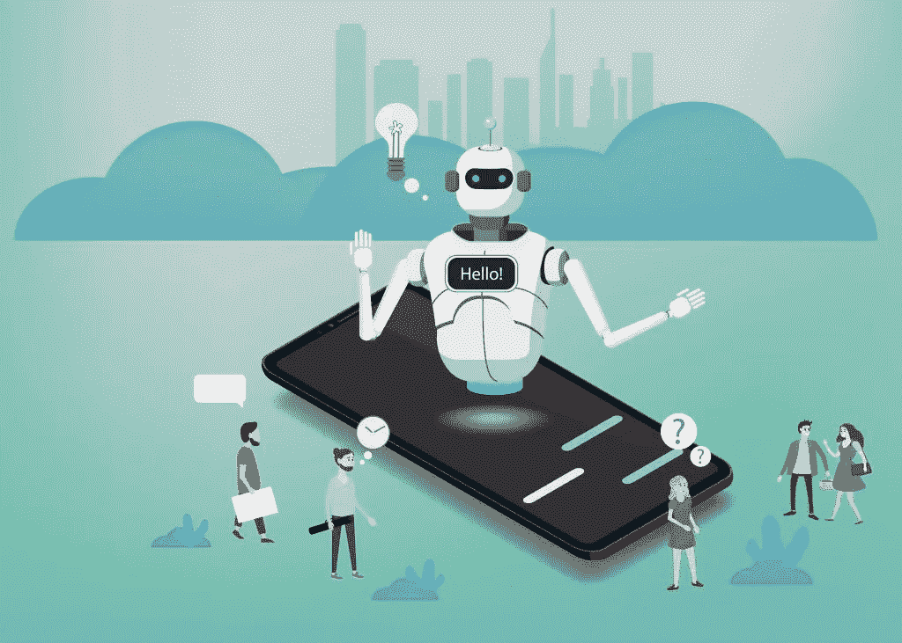
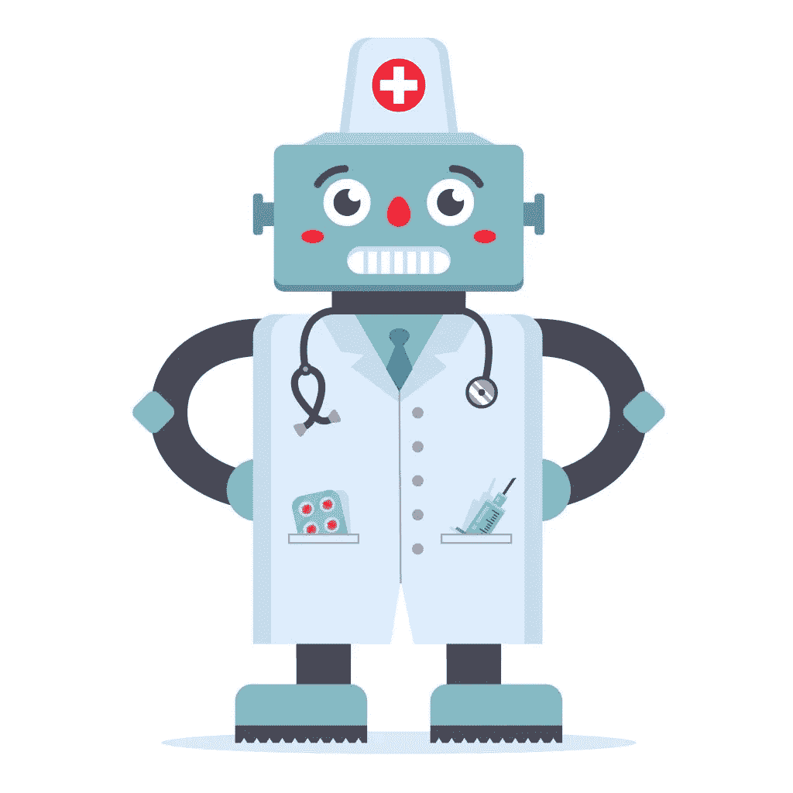
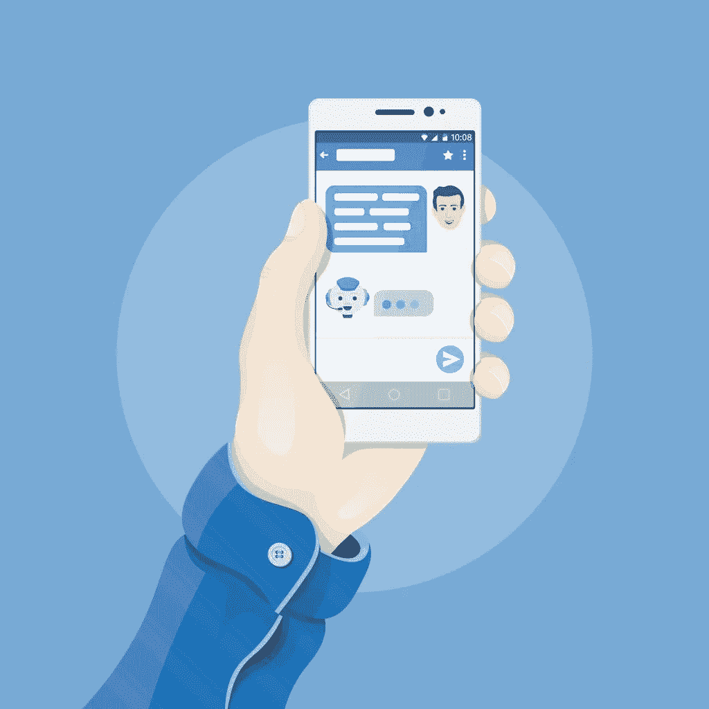

# 医生对聊天机器人和健康机器人的看法

> 原文：<https://towardsdatascience.com/physicians-perspective-on-chatbots-and-healthbots-875bfbb12776?source=collection_archive---------24----------------------->

## 医生对医学中聊天机器人的正面和负面看法。

emojoez/Depositphotos.com 提供

聊天机器人的发展是人工智能和机器学习最重要的成就之一。虽然一些研究人员已经从理论上阐述了聊天机器人或健康机器人的潜在好处，但医疗保健领域最近发生的事情表明，他们正在如何将这些理论变成现实。

## 简介—聊天机器人市场

健康机器人市场正在经历投资者的涌入，这都要归功于它能给医生和病人带来的好处。[全球医疗聊天机器人市场](https://mms.businesswire.com/media/20191118005341/en/757176/5/Global_Chatbot_Market_2018-2022.jpg)预计在 2024 年达到 4.1222 亿美元的规模。这一预测的市场规模具有 24%的 CAGR，表明健康聊天机器人的高性能和越来越多的公众采用。

在撰写本文时，我们已经讨论了[不同健康机器人](https://medicalfuturist.com/top-12-health-chatbots/)在连接患者和医疗保健提供者方面的作用，从而使健康机器人成为现实成就。

健康机器人的推出开创了以患者为导向的医疗保健服务的新水平，患者与医疗保健提供商的联系比以往任何时候都更紧密。

围绕聊天机器人的安全性和医生评估的聊天机器人可能带来的危险存在争议。这些观点来自于这些虚拟助手或聊天机器人在医疗保健领域的实际应用，他们在医疗领域拥有多年的经验。这些观点(积极的和消极的)发表在一项基于网络的横断面调查中，该调查是关于医生对医疗保健中聊天机器人的看法。[1]

## 积极的观点

就像医疗保健中人工智能和机器学习的其他领域一样，聊天机器人可以帮助医生、护士、患者及其家人提高服务水平。这是通过在紧急情况下提供帮助、管理药物、开发患者组织途径等等来实现的。这些活动对医疗保健提供者来说是一种负担。聊天机器人在医学领域的当前应用和积极前景包括:

ValeriHadeev/Depositphotos.com 提供

## a.安排医生预约

聊天机器人可以在缓解医院排队等候拥挤方面发挥不可估量的作用。使用聊天机器人可以让病人预约医生，而不必去医院。

有报道称聊天机器人可以作为医生就诊的替代解决方案。这是因为聊天机器人可能更适合满足患者的需求，因为它们对种族、年龄、生物性别或肤色没有偏见。他们可以夜以继日地工作而不感到疲倦。这使得它们对那些即使在医生或医院不在附近也可能有一些医疗问题的患者很有用。他们用不同语言交流的能力在满足患者需求方面也至关重要。

在互动方面，患者向计算机透露的医疗细节比人类参与者多。他们更真诚地与聊天机器人互动，因为机器在交易中不会评判或公正。

一些患者认为，通过与聊天机器人互动，他们可以让[摆脱可能与他们的医疗状况相关的污名](https://www.frontiersin.org/articles/10.3389/frobt.2017.00051/full)。像 [OneRemission](https://keenethics.com/project-one-remission) 这样的聊天机器人在帮助癌症患者与他们的肿瘤医生持续互动方面已经派上了用场。

## b.定位健康诊所

聊天机器人的第一个案例是为了帮助客户找到满足他们需求的服务而开发的。大多数诊所现在都在网站上安装了聊天机器人，帮助访客预约医生，并获得诊所的方向。聊天机器人可以增加医生网站的潜在客户，并为这些访问者提供顶级的健康信息。

## c.提供药物信息

获取医疗信息不再局限于医院的四面墙。患者现在可以通过与聊天机器人互动来获得关于他们医疗状况的足够信息。这些机器人可以与病人互动，获得有关他们疾病的必要信息，缩小到特定的疾病状况，并在你的智能设备上提供最佳建议。你可以通过聊天机器人在线检查你的症状，比如 [Buoy Health](https://www.buoyhealth.com/) 和 [Babylon Health](https://www.babylonhealth.com/) 。像 [Safedrugbot](https://www.safeinbreastfeeding.com/safedrugbot-chatbot-medical-assistant/) 这样的机器人可以为可能需要母乳喂养期间药物使用适当数据的卫生专业人员和医生提供类似助理的支持。

## 消极的观点

即使聊天机器人取得了成功，如果未来的应用必须是可能的，也有一些灰色区域需要修正。医生确定的这些区域包括但不限于以下方面:

Viacheslav Besputin/deposit photos . com 提供

## a.不能有效地满足所有患者的需求

人工智能(不仅仅是聊天机器人)无法满足所有患者的需求，因此需要医疗保健人员来补充他们的活动。创造聊天机器人的唯一目的是给病人一个合适的选择，而不是把医生排除在外。聊天机器人被编程为只响应特定的算法，除此之外的任何东西都可能产生很少或没有结果。

## b.无法表现人类的情感

这一直是辩论的基础，即聊天机器人和其他基于人工智能的过程是否可以在医疗保健服务中取代人类。计算机无法显示人类的情感，这也是为什么比起与医生交流，病人更愿意透露更多关于他们病史和症状的信息的原因之一。

## c.无法提供详细的诊断和治疗

虽然聊天机器人确实可以与患者互动，并将他们的症状缩小到特定的疾病状况，但这些诊断的有效性水平还不得而知。一些医疗条件可能需要授权的实验室结果才能开始治疗。医疗诊断需要由人工护理人员进行监督，而不应该仅仅依赖于从以前的数据中做出推断的算法。

## d.自我诊断和自我治疗的风险增加

医疗保健在对抗自我诊断和自我治疗方面取得了长足的进步。聊天机器人越来越多地被采用，似乎正把我们带回到战争开始的地方。有了健康机器人，患者现在可以购买药物或诊断自己的病情，而无需与合格人员进行身体咨询以获得授权。

## **见解**

事情是这样的。根据[几项研究和试验，有精神健康问题的人对聊天机器人反应良好。](https://www.ncbi.nlm.nih.gov/pubmed/28588005)【3】

这个概念就是人们不喜欢被评判。

当与精神病学家或心理学家交谈时,“被评判”的想法仍然存在，即使他们的目的是在情感上不做评判。研究表明，人们在与聊天机器人或机器人交谈时不会退缩。用户很容易泄露他们最黑暗和最深的秘密，而不用担心他们的秘密会离开那个对话。

你能想象有心理健康问题的病人总是和聊天机器人在一起的情景吗？

医生们知道他们的病人永远不会孤单，会感到轻松一些。聊天机器人可以被编程为识别特定的关键字，以提醒医生或当局患者或患者周围的其他人即将面临的危险。

现在，你可能已经听说了像脸书和 Instagram 这样的社交媒体平台创造了检测自杀和其他精神健康问题(如抑郁症)的算法。通过这种方式，聊天机器人可以使用从与患者的大量对话中获得的文本数据来提供类似的见解。当然，获取如此多的数据需要时间，但首先，运动需要启动。

聊天机器人允许医生通过持续的检查来跟踪病人的进展。

一个例子可能是患有物质滥用障碍的患者。聊天机器人可以询问他们那天是否使用了 T1，可以判断病人的情绪，并询问病人他或她的环境以暗示外部影响。

有了这些信息，医生可以绘制出患者每日和一段时间内的精神健康进展情况。跟踪患者的进展将有助于向医生提供重要信息，如 SSRIs 的功效或它们何时开始工作。医生将能够实时了解处方的药物剂量是否适当。精神药物通常需要几周时间才能生效，选择正确的剂量是另一项措施，必须根据每个患者的具体情况进行滴定。

聊天机器人是一个有用的工具，我们需要利用它们的真正力量尽可能地帮助病人。

尤里·塔兰/Depositphotos.com 提供

# 结论

聊天机器人将继续存在，并准备好为我们的医疗保健服务水平带来全面提升。虽然他们诊断疾病和为患者推荐治疗方案的能力可能受到挑战，但他们通过连接医生和患者并提供急救护理，成为医学研究的宝贵工具。

聊天机器人在今天的许多领域都是适用和有用的，尤其是医疗保健。我非常欣赏它们为医生减轻的工作量。这样就有更多的时间和病人在一起，而花在管理工作上的时间就少了。

**参考文献**

[1] Palanica A，Flaschner P，Thommandram A，Li M，Fossat Y .医生对医疗保健中聊天机器人的看法:基于网络的横断面调查。*医学网络研究中心*。2019;21(4).doi:10.2196/12887

[2]菲茨帕特里克·KK，达西·A，维耶希尔·m .使用全自动对话代理(Woebot)对有抑郁和焦虑症状的年轻人进行认知行为治疗:一项随机对照试验。*JMIR Ment Heal*2017；4: e19。

[3] Tombs M. *与机器人分享秘密*。AACE，[http://www . editlib . org/p/147797/http://curve . Coventry . AC . uk/open](http://www.editlib.org/p/147797/http://curve.coventry.ac.uk/open)(2014 年，2020 年 2 月 22 日访问)。

请留下您对聊天机器人的看法，或者如果您对聊天机器人在医学上的应用有任何疑问，请联系我。

*本文原帖*[*www . aim blog . io*](http://www.aimblog.io/2020/02/21/physicians-perspective-on-chatbots-and-healthbots/)*。如果你想了解更多关于人工智能、医学和新兴技术的知识，可以看看我的其他帖子。*