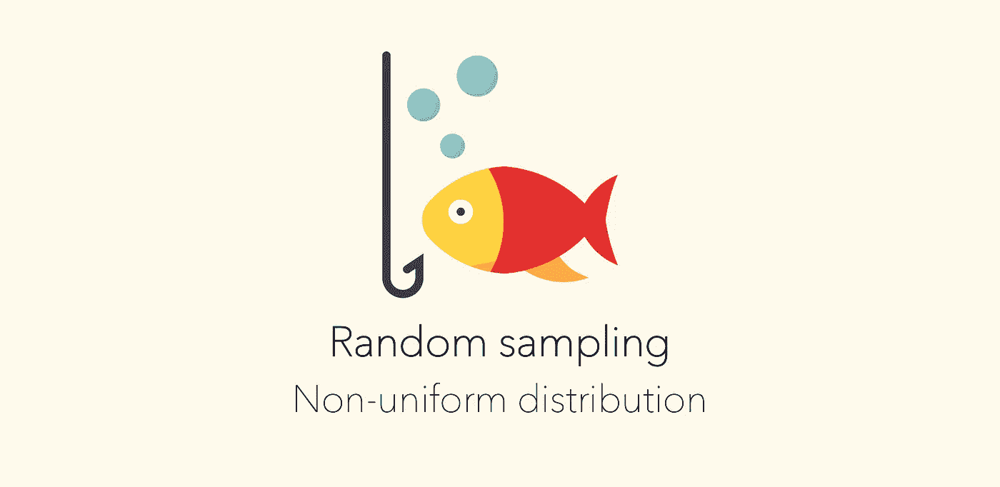
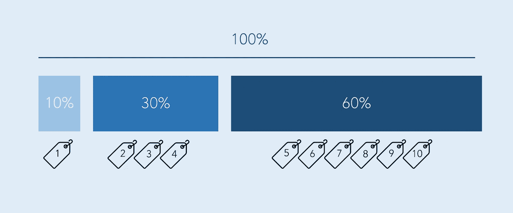

# 🎲从非均匀分布中选取随机样本

> 原文：<https://towardsdatascience.com/picking-a-random-sample-from-a-non-uniform-distribution-b1fa56973e45?source=collection_archive---------37----------------------->

## 随机抽样教程:

## 如何在 python，java，javascript 解决的非均匀分布中挑选随机样本？

我打赌你一定遇到过这样的情况，你必须从一组物品中随机挑选一件？这有一个非常简单的解决方案，因为所有物品都有相同的概率被选中。

但是，如果每件物品被选中的概率不同，换句话说，这种分布是不均匀的。这怎么解决？这不是一个很难解决的问题，但是您可能不会发现自己在日常编程工作中经常遇到这个问题。

让我们来看一个例子，并使用 java、python 和 javascript 来解决它。



由“ [mynamepong](https://www.flaticon.com/authors/mynamepong) 制作的 [flaticon](https://www.flaticon.com/) 的图标

# 🐟我们去钓鱼吧

当你去钓鱼的时候——什么鱼上钩是随机的。做些笔记，你可能会看到某些种类的鱼比其他种类的鱼出现的次数更多——这意味着得到某些种类的鱼的概率比其他种类的鱼高。

今天我们将一起去我们想象中的地方钓鱼，在那里你会发现三种鱼:鳕鱼、大比目鱼和鲭鱼。根据我最近的 50 次捕获，我捕获了 15 条鳕鱼、5 条大比目鱼和 30 条鲭鱼。根据观察，钓到鲭鱼的可能性是 60%，钓到鳕鱼的可能性是 30%，钓到大比目鱼的可能性只有 10%。

```
halibut: 10% (5)
cod: 30% (15)
mackerel: 60% (30)
```

# 🎣钓鱼模拟器

让我们做一个“钓鱼模拟器”来模拟我们的钓鱼之旅。

如果我们有同样的概率得到任何一种鱼，我们可以运行一个随机生成器，给出一个介于 1-3 之间的数字，告诉我们得到的是哪种鱼。Tada！不幸的是——世界并不是这样运转的。那么，我们如何使用非均匀概率分布来模拟鳕鱼、大比目鱼和鲭鱼的捕鱼体验呢？

解决方法是“聚合概率”。如果你想中彩票，你就给自己买尽可能多的彩票。因为当他们叫到一个号码时，你更有可能是赢家。我们会用同样的方式在非均匀分布中选择一个随机数！



因此，如果我们有 10 张票，鳕鱼将得到 1 张票，大比目鱼将得到 3 张票，鲭鱼将得到 6 张票。

```
halibut: 10% (5) - 10 tickets --> ticket #1
cod: 30% (15) - 30 tickets --> ticket #2 - #4
mackerel: 60% (30) - 60 tickets --> ticket #5 - #10
```

现在，为了试试运气，我们可以运行一个随机生成器，给出一个 1 到 10 之间的数字，告诉我们得到了什么鱼🎉由于鲭鱼有更多的门票(如有更高的可能性被抓获)，它将有更多的机会被选中。

# 👩‍💻所以让我们来看看一些代码

你可能有同样的问题想要解决，所以我用不同的语言写了一些不同的解决方案。这只是解决问题的一种方式，每种语言可能都有许多不同的简洁的解决方案。如果你有更好的解决方法，请在评论中与我们分享🙌

## Java 语言(一种计算机语言，尤用于创建网站)

在 Java 中，你可以用一个`TreeMap`让你很容易地抓到一条随机的鱼。将所有的鱼加在一起，并给出总的概率(例如给出“门票”)。`TreeMap`有一个内置的`higherEntry`,它将挑选聚合概率严格大于给定随机数的项目。

这里，大比目鱼的价格高达 0.1 英镑，鳕鱼的价格从 0.1 英镑到 0.4 英镑，鲭鱼的价格从 0.4 英镑到 1 英镑。

```
TreeMap<Double, Fish> fishes = new TreeMap<>();
movies.put(0.1, new Movie("Halibut")); //0.1
movies.put(0.4, new Movie("Cod")); //0.1 + 0.3 --> 0.4
movies.put(1.0, new Movie("Mackerel")); //0.4 + 0.6 --> 1Fish catched = fishes.higherEntry(Math.random()).getValue();
```

## Java Script 语言

在 javascript 中，我们首先通过聚合概率使用`map`函数给鱼分配它们的票。然后我们使用`find`来寻找最接近随机聚集概率的鱼。

```
const fishes = [
  {type: "halibut", prob: 0.1},
  {type: "cod", prob: 0.3},
  {type: "mackerel", prob: 0.6}
];const random = Math.random();
let aggregated_probability = 0;const randomFish = fishes.map((fish) => {
  aggregated_probability += fish.prob;
  return { type: fish.type, prob: aggregated_probability };
}).find((fish) => fish.prob >= random);// outputs random fish
```

在`fishes`上使用地图时，它会给我们一个新的数组，如下所示:

```
[{type: "halibut", prob: 0.1}, {type: "cod", prob: 0.4}, {type: "mackerel", prob: 1.0}]
```

find 将在它们的抽奖范围内寻找具有随机抽奖的鱼。例如，如果`Math.random()`的结果是`0.678`，那么鲭鱼就被捕获了。如果`Math.random()`结果为`0.0923`，则一条比目鱼被捕获。

## 计算机编程语言

对于 python，NumPy 已经用“随机选择”为我们解决了这个问题。你输入你的元素`fishes`，你要“画”/鱼的次数`1`，概率分布`[0.1, 0.3, 0.6]`:

```
import numpy as npfish = ['halibut', 'cod', 'mackerel']
np.random.choice(fish, 1, p=[0.1, 0.3, 0.6])# outputs random selected fish [<fish>]
```

快乐编码🙌