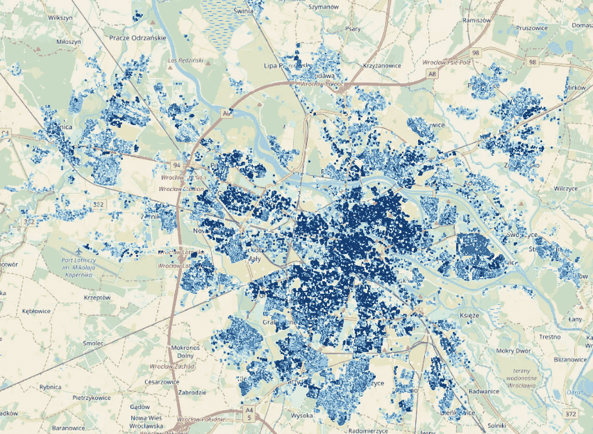
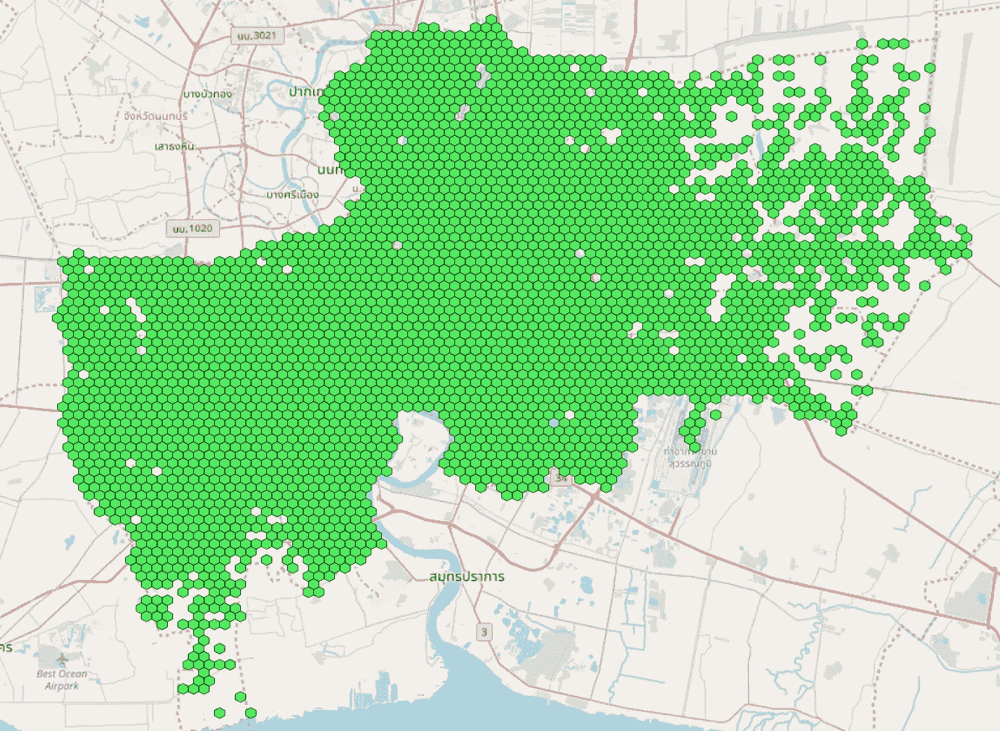

# 为地理空间数据丰富选择合适的工具(第 1 部分)

> 原文：<https://towardsdatascience.com/picking-the-right-tool-for-geospatial-data-enrichment-part-1-59a5842c55ca?source=collection_archive---------68----------------------->



作者图片

## 随着人类产生的数据呈指数级增长，我们看到越来越多的数据带有地理背景。本文比较了处理和丰富地理空间数据的现有工具和技术。

这篇文章分为两部分。第一部分是对手头问题的介绍。
[**第 2 部分**](https://medium.com/@bartgras/picking-the-right-tool-for-geospatial-data-enrichment-part-2-6417e97db394) 重点介绍将要使用的工具，并解释这些工具如何用于解决我们的地理空间数据处理/丰富任务。

从一开始就应该提到的是，我们并不是在寻找像 ArcGIS 这样成熟的地理空间分析平台。相反，对我们来说重要的是:

*   能够导入/加载各种类型的地理文件。
*   解决多边形中的点等问题，例如将用户的地理位置映射到城市的区域。
*   计算各种形状之间的距离，例如从一个位置到最近的购物中心的距离。
*   能够大规模实施。
*   易于与现代数据科学管道集成的工具。

一般来说，我们的任务是面向数据处理/丰富，而不是复杂的分析。

*注意:我将跳过任何光栅(如卫星图像)数据相关分析的比较，仅关注矢量数据。*

**我们应该关注什么标准？**

*   您要处理/丰富的数据量。
*   您运行流程的频率。
*   设置所需工具或一般基础设施的难易程度。
*   您现有的基础架构是什么。
*   您的地理数据转换有多复杂。
*   您选择的工具支持哪种空间操作。
*   加载、处理和存储结果有多容易。
*   在您的基础架构中设置和运行作业的相关成本是多少？

现在，为了对以上所有观点给出详尽的解释，我可能会写一本书，所以让我们把重点放在与简单案例最相关的子集上。

**我们要看哪些工具？**

*   Geopandas /带 Dask 的 Geopandas
*   PostGIS—PostgreSQL 数据库的空间插件
*   谷歌大查询的地理空间功能

这个列表还远未完成，因为每个主要的参与者都像微软、亚马逊、IBM、ArcGIS 等。拥有地理空间产品。我选择的工具要么是完全开源的，要么(比如 BigQuery)具有特殊的超能力，我稍后会谈到。此外，我们也将跳过类似 Spark 的工具(如 GeoSpark ),因为它们值得单独的文章。

在我们开始之前，如果你是 GIS 世界的新手，你应该阅读下面的部分。
如果没有，可以放心跳过，继续阅读 [*第二部*](https://medium.com/@bartgras/picking-the-right-tool-for-geospatial-data-enrichment-part-2-6417e97db394) *。*

## **有史以来最简短的地理信息系统简介**

让我们熟悉一些重要的概念，这将有助于我们更好地理解我们面临的任务。请注意，这里做了一些简化，以保持本节简短。

**1。空间对象类型**

首先，您可能想知道地理空间数据是如何存储在数据库中的。这很简单，GIS 感知工具支持额外的列类型，如点、线串、多边形。这些名字是不言自明的(边注:多边形内部可以有“洞”)。

例如，想象一下地图上的一个点。在数据库中，它可以存储在一个单独的列中，并且“看起来像”:

```
POINT ( 10 20 )
```

您还可以存储(在单个数据库单元中)多点、多线、多多边形等对象集合，或者使用更通用的类型，如几何和多重几何。并非所有工具都支持所有类型。



这些六边形中的每一个都是数据库/数据集中的一个独立单元(图片由作者提供)

**2。空间参考系统**

尽量保持简短，我会说你需要知道有许多平面投影，或者换句话说，你可以将 3D 数据(地球是不均匀的椭球体)叠加到一个平面上。请记住，它们通常不会覆盖整个地球。

你已经知道一个叫做 WGS84(世界大地测量系统)的空间参考系统(它正在被使用，例如 GPS ),并且使用度作为单位。

实际上，你需要意识到:

*   您将使用的地理空间文件(例如，包含美国各州形状的文件)可能使用不同的空间参考系统，并且必须转换到相同的系统中，然后才能将其与您的数据合并。
*   每个空间参考系统都有一个名为 SRID(空间参考标识符)的 ID。例如，WGS84 使用 SRID 4326。您将在工具中使用此 ID 来让“工具引擎”知道您的数据当前使用的投影。
*   对于大多数简单的情况，将所有内容转换为 SRID 4326 应该足够了。

**3。几何和地理格式**

*   地理表示球体上的数据和平面上的几何数据。
*   您的数据可能是这些格式中的一种，有时您需要在它们之间进行转换，因为您无法测量几何和地理类型数据之间的距离。
*   有些工具只支持其中一种类型的操作(例如，BigQuery 只支持地理)
*   如果您的数据属于几何类型，您需要将其转换为地理类型，以便能够获得有意义的结果，例如，以米(而不是度)为单位的对象之间的距离。
*   几何运算速度更快，但如果您的测量必须非常精确(或运算距离更长)，请使用地理。
*   幸运的是，转换很容易，当然如果你的工具支持的话。
*   一般来说，在发现性能问题之前，尽量坚持地理位置。

**4。常见数据格式**

GIS 数据可以以多种格式存储，因此让我们提及最常用的格式(对于我们的数据丰富/转换案例):

*   当从互联网上获取数据时，你会经常发现。shp (Shapefile)。它还可以存储非 gis 数据(即每个地理形状的属性)。*提示:在网上寻找数据时，在你的查询中添加“shp 文件”。*
*   熟知文本(WKT)是一种可用于在不同类型的数据库/数据帧之间安全传输数据的格式。简单地说，它是序列化为文本格式的地理数据。*请记住，SRID 不在 WKT 记录中。*
*   GeoJSON 是标准化格式的 JSON，可以在单个文件中存储 gis 和非 gis 数据。

```
# GeoJSON representation of a point with properties{
  "type": "Feature",
  "geometry": {
    "type": "Point",
    "coordinates": [2.2945, 48.8584]
  },
  "properties": {
    "name": "Eiffel Tower"
  }
}
```

**5。空间数据索引**

如果没有空间索引，您的查询可能会慢 100 倍！一定要记住创建它们，尤其是当你要把它和其他表/数据框架合并的时候。
如果使用 PostGIS，您需要手动创建它们。在 Geopandas 中，您可以通过在数据帧上调用 df.sindex 来预先生成它们，在某些情况下，Geopandas 会自动生成它们。
在 BigQuery 中不需要担心索引问题。

同样，这一介绍只是触及了表面(我希望 GIS 专家原谅我的所有简化)，但应该足以让您入门。

继续阅读— [第二部分](https://medium.com/@bartgras/picking-the-right-tool-for-geospatial-data-enrichment-part-2-6417e97db394)。