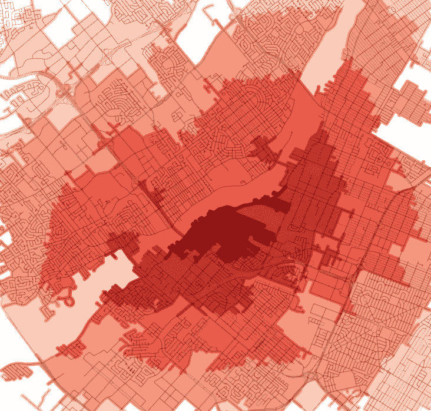

# 为地理空间数据丰富选择合适的工具(第 2 部分)

> 原文：<https://towardsdatascience.com/picking-the-right-tool-for-geospatial-data-enrichment-part-2-6417e97db394?source=collection_archive---------41----------------------->



作者图片

## 本文是系列文章的第二部分。它重点介绍了这些工具，*解释了它们如何被用来解决我们的地理空间数据处理/丰富*。

*如果没看过介绍，可以在* [*part 1*](/picking-the-right-tool-for-geospatial-data-enrichment-part-1-59a5842c55ca) *中找到。*

提醒一下，本系列第 1 部分中选择的工具是:Geopandas、PostGIS 和 BigQuery。我们来说说它们的利弊。

**地质公园**

*   熊猫的地理空间扩展使用 Shapely (Python 库来操作和分析几何对象)。
*   支持最重要的空间功能，足以解决非常复杂的问题。
*   如果你熟悉熊猫，相对容易掌握。
*   比波斯特吉斯慢。
*   与 Pandas 类似，在单核上运行，但与 Dask(dask.org)一起可以并行化。
*   内置绘图功能(直接在 jupyter 笔记本中),对于非常简单的数据可视化/验证案例来说已经足够。
*   支持最常见的输入/输出格式。

**PostGIS**

*   PostGIS 用空间函数扩展了标准(PostgreSQL) SQL 语言。
*   熟悉一些概念需要时间，但是编写实际的查询非常简单。
*   可以解决几乎任何类似地理空间的问题，甚至支持像最近邻的功能。
*   许多数据加载和转换功能。
*   快速，但查询执行仅限于一个内核。
*   像任何 RDB 一样，可以处理比内存查询更大的数据，但在处理真正的“大数据”时，这可能还不够。
*   有许多相关的开源工具，可以帮助你，例如可视化你的数据(QGIS 是我的最爱)。
*   伟大的文档和在线社区。
*   当与 PostgreSQL 过程语言(PL/pgSQL)连接在一起时，提供了一个非常强大的管道来处理查询，而不会“离开”数据库。

**BigQuery 的地理空间功能**

*   在谷歌云中处理查询，如果你懂 SQL，你会有宾至如归的感觉。
*   谷歌云生态系统的一部分，可以使用各种 API 轻松加载、转换和导出数据。
*   可以在几秒钟内处理数十亿字节的数据。
*   支持的输入格式:包含 WKT 格式的地理空间列和 JSON 格式的 GeoJSON 列的 CSV(换行符分隔)。
*   内置绘图工具，大数据就绪。
*   按数据存储和查询运行时间收费，这可以大大降低您的成本，即使您正在处理数 TB 的数据。
*   在单个查询中支持 BigQuery 数据和 Cloud SQL(也可以使用 PostgreSQL 作为引擎)数据之间的连接。
*   GIS 后的功能较少，但所有必要的操作和分析相关的功能已经存在。
*   没有像 PL/pgSQL 这样的过程语言，但是(一般的 BigQuery)可以在某种程度上使用(SQL) WITH function 来模拟它。

# **TLDR？**

## **选择 Geopandas if:**

*   你对熊猫很熟悉，而 SQL 不是你的强项。
*   想要快速浏览/预处理地理空间数据，并且不打算进行复杂的转换。
*   您的地理空间数据框架不会包含数百万条记录(Geopandas 可以处理“大数据”,但您将等待结果；Dask 可以在某种程度上缓解该问题)。
*   您的用例相当简单，并且您希望尽快投入使用。

**选择波斯特吉斯如果:**

*   Geopandas 还不够。要么是因为你的问题对 Geopandas 来说太难了，要么是它让你等了太久才得到结果。
*   您最终可能会操作更多(大于内存)的记录。
*   你需要一套完整的地理空间功能。
*   您有更多的时间来熟悉比 Geopandas 更复杂的工具。

**如果** …您必须处理大数据，请选择 BigQuery！🙂

好了，我们终于准备好做一些真正的工作了。想象一下下面的问题:
你的公司有一个**应用**，每天**生成大量用户与之交互的位置**(经度和纬度)。给了你三个不同的案子。

给定用户坐标:
1。分配到全市的区
2。查找到最近的购物中心、公交车站和医院的距离(单位:米)(直线距离)。生成汇总统计数据，例如每个地区的应用交互次数


我们的数据处理/浓缩任务

## 地理数据的大小

请注意，在**任务 1** 中，形状(城市区域)的数量可能不会超过数据库中的 100 条记录。
**第二个任务**是第一个任务的派生物，其中计算的输出具有与城市地区数量一样多的记录。
至于**第三项任务**，你可能需要对照用户的位置检查超过 100，000 个兴趣点(POI ),但实际的 POI 不会经常改变，可以每周更新一次。

所有这些实际上都是好消息，因为这意味着地理空间数据预处理可以直接在笔记本电脑上使用 Geopandas 或 PostGIS 进行。

## 地理数据加载和预处理

在与我们的用户位置合并之前，需要什么样的预处理步骤？当然，这很大程度上取决于你的情况，但让我们谈谈最常见的。

首先，你需要**获取**实际的地理数据(例如代表城市区域的 shapefile 或 GeoJSON ),然后**将文件**导入到你的工具中(假设它在你的笔记本电脑上)。使用 Geopandas 是一行程序:


注意，在上面的例子中，我使用了 bbox(边界框)参数来“丢弃”定义区域之外的所有数据。函数 read_file()可以做更多的事情，例如直接从互联网上加载 ZIP 格式的文件(详情见[https://geopandas.org/io.html](https://geopandas.org/io.html))。

下一步是**清理数据**和**改变 SRID** 如果需要。

```
# Changing SRID (projection) **in Geopandas**
# (where "df" is you geodataframe)
df.to_crs("EPSG:4326")# Changing SRID **in PostGIS** *UPDATE my_table
SET geometry=ST_Transform(geometry, 4326)*
```

然后，一个好的实践(特别是如果数据是从互联网上下载的)是**检查形状是否有效**(例如，线不与自身相交的多边形)。

```
# Checking if shapes are valid **in Geopandas**
# (where "geometry" is your geometry column)
df.geometry.is_valid.all()# If it's invalid, you can try following fix:
df.geometry.buffer(0.00001)# Checking if shapes are valid **in PostGIS** # Returns number of valid and invalid geometries
*SELECT count(1), ST_IsValid(geometry)
FROM my_table
GROUP BY ST_IsValid(geometry)*
```

有时缓冲功能不会修复它，或者您不能使用它，因为您的多边形/多重多边形内部是中空的(使用缓冲功能会删除它们)。在这种情况下，您需要采取额外的步骤，例如导出到 PostGIS 并尝试修复:

```
# Geopandas supports saving geometry directly to PostGIS but from my experience this is safer solution:
**# 1\. Create additional column with geometry converted to WKT**
df['geom_wkt'] = df.geometry.apply(lambda x: x.wkt)**# 2\. Save dataframe to table "my_table" but export geometry in WKT format instead of actual "geometry" column**
connection_str='postgres://<username>:<password>@localhost:<port>/<db_name>'
df.drop('geometry', axis=1).to_sql(
    'my_table', con=connection_str, if_exists='replace',
    dtype={'geometry': Geometry})**# 3\. (Inside PostreSQL database) fix the geometry** # Function ST_GeomFromEWKT translates WKT back to geometry
# Function ST_MakeValid fixes geometry
*INSERT INTO my_table_fixed
SELECT ST_MakeValid(ST_GeomFromEWKT(geom_wkt)), <other columns>
FROM my_table***# 4\. Load it back into Geopandas dataframe**
sql = 'SELECT * FROM my_table_fixed'
new_df = pd.read_postgis(sql=sql, con=connection_str)
```

除了学习如何修复几何图形，现在您知道在这两个系统之间移动数据有多快多容易了。因此，在任何情况下，如果您在 Geopandas 中遗漏了某个函数，您都可以在 PostGIS 中这样做。

最后是问答过程，你可以用**可视化数据**来检查是否一切正常。在 Geopandas 中，您可以简单地使用。绘图() :


如果这还不够，您可能需要将数据保存回 SHP 或 GeoJSON，并使用 QGIS 等外部应用程序加载它们。

## 合并数据

在 Geopandas 中，我们需要将用户数据框架转换为地理数据框架:

```
import geopandas as gpd**# Load users data into Pandas dataframe**
users_df = <function that loads the data>**# Convert to geodataframe**
users_gdf = gpd.GeoDataFrame(users_df, 
    geometry=gpd.points_from_xy(
        users_df.longitude, users_df.latitude))
```

现在，数据已经准备好与您的用户位置合并。
对于我们的**任务 1** 来说，简单来说就是:

```
**# Perform spatial join**
gpd.sjoin(users_gdf, geo_dataframe, how="inner", op='intersects')
```

PostGIS 中的类似操作(**任务 1** ):

```
*INSERT INTO merged_table
SELECT * FROM geo_table g, users_table u
ST_Intersects(
    ST_SetSRID(ST_MakePoint(u.longitude, u.latitude), 4326),
    g.geometry
)*# In this line :# *ST_SetSRID(ST_MakePoint(u.longitude, u.latitude), 4326)*
# we are converting our users coordinates to POINT and setting SRID
```

**任务 2** 同样简单:

```
*INSERT INTO count_interactions_by_districts_table
SELECT COUNT(1) user_count, geo_table.district_name
FROM geo_table g, users_table u
ST_Intersects(
    ST_SetSRID(ST_MakePoint(u.longitude, u.latitude), 4326),
    g.geometry
)
GROUP BY geo_table.district_name*
```

任务 3 更具挑战性:

```
*WITH poi_with_point as (
    SELECT *, ST_SetSRID(
        ST_MakePoint(
            u.longitude, u.latitude), 4326)::geography AS geog
    FROM poi
    WHERE p.poi_type='shopping mall'
)* ***SELECT p.id, p.longitude, p.latitude, 
       min(ST_Distance(p.geog, u.geog)) shopping_mall_min_distance 
FROM users u, poi_with_point p 
WHERE ST_DWithin(p.geog, u.geog, 8000)
GROUP by p.id, p.longitude, p.latitude***
```

其中:

*   带有的顶部**查询部分正在生成名为 poi_with_point 的“临时视图”。它通过添加名为“geog”的点列来扩展原始表 poi(包含我们所有的 POI 位置)。它还会过滤掉所有不是商场的兴趣点。**
*   ST_DWithin 可以显著加快查询的执行速度。它通过增加每个用户与每个购物中心之间的最大距离(任意)8 公里来防止检查每个用户的位置:


## 用户数据库的大小

当我们的用户数据库的大小是千兆字节时，事情就变得有趣了。

使用 **GeoPandas** (默认情况下在单线程上)将会花费很长时间，如果数据集超出了您的工作内存，您需要批量处理它。如果您碰巧有 Dask 集群运行在多个 workers 上，那么您可能会考虑使用它，但它可能仍然不是最佳解决方案。

*旁注:我已经在我的另一篇文章“丰富你的熊猫数据框架的最简单的方法”中解释了批处理和在集群上运行，这两种解决方案都只需要几行代码。*

*提示:对于 Dask 集群中的批处理，使用 map_partitions 函数，并在每个分区中分别:加载您的地理空间数据，并对“映射”的用户数据块执行空间连接操作。*

**PostGIS** 将能够处理数据，但执行时间可能不是最优的。如果您的 PostGIS 服务器不是生产环境的一部分，并且您不介意等待，那么您应该使用它。如果没有，我们最后的选择是…大查询

## 用 BigQuery 做大

首先我们将做几个假设:
1。您已经注册了谷歌云账户并激活了谷歌云存储(GCS)
2。您的用户数据已经加载到 BigQuery 表
3 中。您已经在笔记本电脑上安装了 Google“tool belt ”,命令“gsutil”和“bq”在您的终端
4 中可用。您拥有在 BigQuery
5 中创建数据集和表的权限。您已经设置了(在终端中，使用 Google“tool belt”)您的默认项目
*提示:将 GCS 和所有 BigQuery 数据集保存在同一区域，否则您可能无法加载它或执行 JOIN 操作。*

正如我们已经知道的，BigQuery 可以导入 GeoJSON 或 WKT 格式的地理数据。我们已经学习了如何将它转换为 WKT，所以让我们将它保存为 CSV 格式并传输到 BigQuery。首先，我们将它保存为 CSV 格式:

```
# Assuming your geography is already in WKT
df.to_csv('output_file.csv')
```

从笔记本电脑直接加载到 BigQuery 是可能的，但有一些限制，所以我们将首先把它发送到 GCS:

```
# (In your terminal)
gsutil cp output_file.csv gs://your_bucket_name_in_gcs
```

创建数据集，即存储数据并从 GCS 填充数据的表:

```
# (In your terminal**)
# Create dataset**
bq --location=US mk --dataset your_dataset**# Create table**
bq mk --table your_dataset.geo_table \
id:INTEGER,geom_wkt:STRING,*<other columns>***# Load CSV into BigQuery table**
bq load \
--source_format=CSV \
your_dataset.geo_table \
gs://your_bucket_name_in_gcs/output_file.csv \
id:INTEGER,geom_wkt:STRING,*<other columns>*
```

BigQuery 语法与 PostGIS 几乎相同:

```
***# Task 1 in BigQuery*** *INSERT INTO merged_table
SELECT * FROM* your_users_dataset*.users_table u, 
    your_dataset.*geo*_table g
WHERE ST_Intersects(* ST_GEOGPOINT*(u.longitude, u.latitude),
    g.geometry
)*
```

**任务 2** 在 BigQuery 和 PostGIS 中几乎相同，所以我将跳过这个片段。

至于我们的第三个任务，请注意得到的行数非常少。不超过区的数量。在这种情况下(或类似情况下，您知道数据将适合您的计算机的工作内存)，您可以使用 BigQuery Python 客户端并将结果直接下载到 Pandas dataframe:

```
from google.cloud import bigquery
client = bigquery.Client()sql = """
*SELECT COUNT(1) as user_count, g.district FROM 
**your_users_dataset**.users_table u, 
    your_dataset.**geo**_table g* *WHERE* *ST_Intersects(* ST_GEOGPOINT*(u.longitude, u.latitude),
    g.geometry
)* *GROUP BY g.district* """df = client.query(sql).to_dataframe()
```

本系列的目标是展示如何使用外部地理空间信息处理或丰富您的数据。我想向您展示如何混合和搭配可用的工具，轻松地在它们之间传输数据，以及哪一个对快速完成您的工作最有用。