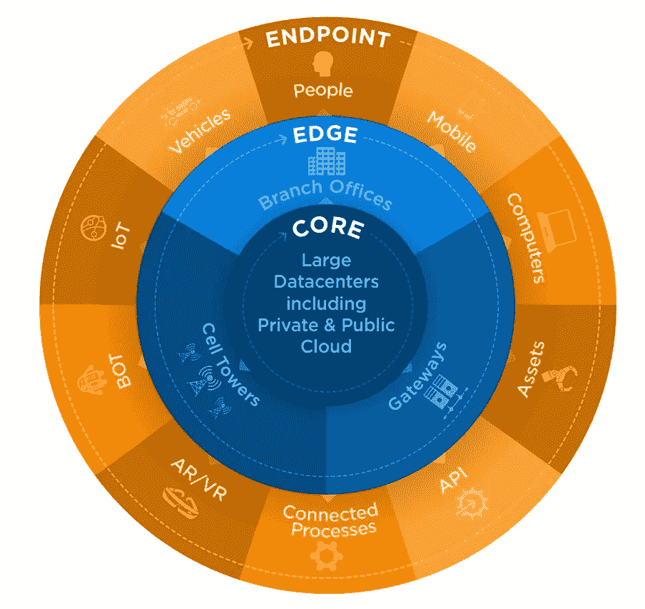

# AWS 数据分析:数量

> 原文：<https://towardsdatascience.com/picture-goes-here-53436f02f3e9?source=collection_archive---------62----------------------->

图片来自[皮克斯拜](https://pixabay.com/?utm_source=link-attribution&utm_medium=referral&utm_campaign=image&utm_content=3021820)

> 查看我以前的文章《AWS 数据分析简介》

 [## AWS 数据分析:简介

### 本文是我将介绍使用 AWS 进行数据科学和分析的系列文章的一部分。到最后…

towardsdatascience.com](/data-analytics-with-aws-introduction-975143d11ce4) 

# 大数据中有大

有人会说，数据无论大小都是数据，所以人们称之为**大数据肯定有充分的理由！好吧，去喝杯茶/咖啡放松一下，因为我们将看到一些令人头疼的数字。**

[https://www.bondcap.com/report/itr19/#view/151](https://www.bondcap.com/report/itr19/#view/151)

我们今天所知的数字世界正在产生海量数据，**人类已知数据的 90%是在过去三年中产生的。这些数据被称为**全球数据圈**，并且正在迅速扩大。有机构预测将从 2018 年的 **33 Zettabytes** (ZB)增长到 2025 年的 **175 ZB** 。**

> **一个 Zettabyte 是多少:1 zettabyte = 1 [万亿](https://en.wikipedia.org/wiki/1,000,000,000,000)千兆[千兆](https://en.wikipedia.org/wiki/Gigabytes)**

## **这一切怎么可能？我们是如何产生这些数据的？**

**下图显示了数据传播模式。外圈是网络边缘的端点，如人们的设备、移动设备、物联网、行业传感器……边缘圈代表本地数据收集器和存储，如企业服务器和小型数据中心。这种模式的核心是大型数据中心和云。**

**我想就公共云(即 AWS、Azure、GCP 等云提供商)说几句话，以强调它的重要性。数据存储越来越多地向核心转移，到 2024 年，预测表明存储在云中的数据将是存储在终端中的数据的两倍(现在是 50-50 倍)。因此，个人和企业需要熟悉最终将存储所有数据的云。**

****

**[https://www . Seagate . com/www-content/our-story/trends/files/IDC-Seagate-data age-white paper . pdf](https://www.seagate.com/www-content/our-story/trends/files/idc-seagate-dataage-whitepaper.pdf)**

**这个产生数据的怪物必须用适当的工具来满足和照顾，否则它会生气并破坏一切！这就是我们接下来要探索的。**

> **数据驱动的世界将永远在线、永远跟踪、永远监控、永远倾听、永远观察，因为它将永远在学习，IDC。**

****数据量**可能是当今数据最重要的特征之一，因为数据量塑造了我们今天所知的许多 IT 和云解决方案。我们在 90 年代处理的信息系统问题与我们在过去十年中面临的数据量激增的问题完全不同。**

**机器学习系统的存储、数据查询、分析、大规模并行计算和数据消耗(仅举几例)都应该以不同的方式建模。**

**既然我们已经了解了大数据系统与其前身有着天壤之别，那么让我们来探索类似大数据系统的数据分析解决方案的主干，并与 AWS 解决方案进行对比。**

# **数据湖**

**数据可以分为不同的类别:非结构化、结构化和半结构化。生成的大部分数据是非结构化的，约占 80%，而结构化和半结构化数据各占 10%(这一主题将在另一篇文章中深入讨论)。**

**企业必须拥有一个能够接收、管理和分析大规模数据的数据管理平台。这就是为什么数据湖的诞生是为了解决企业在组织不断增长的数据量时所面临的一些问题。**

## **那么什么是数据湖呢？**

**这是 AWS 的定义。**

> **数据湖是一个**集中式存储库**，允许您存储任意规模的**结构化**、**半结构化**和**非结构化**数据。**

**数据湖(DL)是一个集中存放所有数据的地方，可以是任何形状、任何规模，并允许您轻松地处理这些数据。这是一个架构概念，通过一套工具来帮助管理您的数据生态系统。**

**一个合适的 DL 应该具有以下特征:**

*   **真相的单一来源:进入你的数字图书馆的数据结构必须有某种组织**
*   **存储**任何类型的**数据:存储在 DL 中的数据必须用于为企业带来价值，必须培训用户将 DL 的使用集成到他们的工作流程中，并且必须定期更新数据**
*   **数据**持久性**:即使发生灾难(例如数据中心被洪水淹没)，DL 也应该能够存储和保存数据。SLA(服务水平协议)应该接近 100%,否则为什么要在您不确定要保存数据的 DL 上工作**
*   ****轻松分析**您的数据:集中您的数据的目的是通过应用数据分析和机器学习来检索业务洞察力。**

**为了在确保上述特征的规模上操作，实现这一点的技术挑战是相当重要的。想象一下，有数百万个 CSV 文件，您想对这些数据进行聚合？嗯，这不是一个简单的任务，你可能要等几个小时，甚至几天，才能得到结果。这就是像集成在 DL 中的**分布式系统**这样的技术可以提供帮助的地方。**

**因此，让我们探索一些有助于实现这一目标的基础技术。**

## **分布式架构**

**分布式体系结构管理一个资源池，并将负载分布在每个资源上，以便更快地大规模执行。**

****

**通过并行执行任务来分配负载，图片由作者提供**

**为了说明分布的威力，在上图中，我们使用了一组工作人员并行执行一项任务(将数据存储在数据库中)。因此，我们没有让一个工人来完成任务并等待，而是同时使用了 8 个工人，我们几乎在瞬间就得到结果。这种架构的好处是，如果我们需要增加更多的工人来承担更多的负载，这就像添加一个乐高积木一样简单。**

**分布式架构的工作方式是一样的，有一个主节点发出执行某个计划的命令，从节点并行执行这项工作，分担负载。每个节点管理一小部分负载，在执行结束时，收集和汇总结果。**

**我们可以将这些系统比作蜂箱(蜂箱是 Hadoop 生态系统工具的名称并非巧合)，由女王和一群并行工作的工人管理。**

**一个非常著名的分布式系统是 2006 年发布的开源项目 Hadoop。最初由 Google (Google 文件系统项目)开发，然后开源，它便于使用计算机网络来处理大量数据。简而言之，当你在 HDFS(**H**adoop**D**distributed**F**file**S**system)中存储一个文件(或其他形式的数据)时，系统会将它分成小块，并通过复制将它分布在集群的所有节点上，这允许跨节点分布计算。**

# **AWS 上的数据湖**

**AWS 建立了一个生态系统，使企业能够创建和管理数据湖和数据仓库。让我们探索一下 AWS 生态系统的选项。**

## **亚马逊 S3**

**第一批 AWS 服务之一是名为“简单存储服务”或 S3 的存储服务。这是一个可以存储任何规模的半结构化和非结构化数据的地方。S3 将数据作为**对象**存储在**桶**中。**

**把 S3 想象成 Dropbox 或者 google drive，但是有非常高的可用性和额外的工具(REST API，元数据目录..).**

****

**照片由[里克·梅森](https://unsplash.com/@egnaro?utm_source=unsplash&utm_medium=referral&utm_content=creditCopyText)在 [Unsplash](https://unsplash.com/?utm_source=unsplash&utm_medium=referral&utm_content=creditCopyText) 上拍摄**

**S3 就像一个乐高盒子，你可以在房子的不同房间里有多个盒子，里面装着不同形状(数据格式)和不同颜色的乐高玩具(元数据)。当你想用所有这些组装一个乐高房子时，你必须抓住正确的盒子，寻找正确的积木。**

**S3 的不同之处在于，你可以准确地知道每块乐高积木在哪里(通过它的键和元数据)，这样你就可以立即组装你的乐高房子。此外，S3 永远不会失去你的乐高，因为 AWS 可以坚持。**

**一个**对象**由一个文件和任何与该文件相关联的元数据(例如，允许我们组织和查找对象的标签)组成。它可以是 CSV、pdf、视频、音频或二进制文件，基本上是你能想到的任何格式的数字数据。S3 中的每个对象都有一个**键**，它是访问对象的 URL。**

****桶**是保存对象的容器，基本上就像操作系统中的文件夹。创建存储桶时，我们可以指定许多选项:**

*   **将托管存储桶的地理区域**
*   **谁(个人或服务)可以访问、创建和删除对象**
*   **管理对象生命周期和版本**

****S3 的主要优势:****

*   **将存储与计算和数据处理相分离:这意味着数据的存储和消费是在不同的位置完成的。为什么会有意思呢？它使数据能够由不同的工具处理，如果计算服务器遭到黑客攻击，它们将无法直接访问数据，存储和计算可以独立扩展(成本和速度优化)。**
*   **集中式数据架构:促进数据治理并降低成本。**
*   **与其他 AWS 服务的集成:计算、业务分析和机器学习应用程序可以轻松访问 S3 数据，无需第三方连接器。**
*   **标准化应用程序编程接口(API):可以通过不同编程语言的 REST APIs 通过代码访问和使用数据。**

****S3 的主要劣势****

*   **根据使用情况，该服务可能会很贵(尤其是大数据传输)**
*   **它必须与其他 AWS 服务一起使用来查询、可视化和处理数据。所以作为一个独立的解决方案，它是不够的。**

> **那么，有了所有的功能和优势，S3 是一个数据湖吗？**

**S3 是数字图书馆的核心组成部分，但它本身并不是数字图书馆。记住我们在本文前面说过的，一个合适的 DL 是一组支持数据接收、存储和转换的工具。S3 必须与其他 AWS 服务相结合，以形成一个 DL，如用于接收数据的 Kinesis、用于转换数据的 Glue 或 EMR 以及用于查询数据的 Athena。**

# **数据仓库**

**数据仓库是一种非常流行的数据存储方法。它由一个中央存储库组成，该存储库包含已经清理、转换和聚合的结构化数据，可用于业务分析和报告。**

**它主要关注来自不同来源的结构化数据，然后在存储到 DW 之前经过 ETL 管道(提取转换加载)。数据的结构是严格的，这意味着在接收之前必须定义一个模式。**

****为什么它不同于数据湖？**数据仓库仅存储用于业务分析的结构化数据。它通常用作存储所有原始数据的数据湖的补充解决方案。**

**大多数商业智能工具，如 Tableau、Qlik view、Power BI……都是由后端的数据仓库提供支持的。**

# **数据集市**

**存储在 DW 中的数据可能非常大，大到有时我们需要等待几个小时才能得到一个查询的结果。**

**想象一下，一家银行在全球范围内存储跨国数据数年，而业务分析师仅频繁使用某个国家去年的数据。让这些分析师能够访问和分析全球数据的某些部分是有意义的。这就是数据集市(DM)发挥作用的地方，它们是主 DW 中的表的子集，支持对特定主题进行快速而经济的查询。**

****

**作者照片， [Smashicons](https://www.flaticon.com/authors/smashicons) 、 [Phatplus](https://www.flaticon.com/authors/phatplus) 设计的图标来自 [Flaticon](https://www.flaticon.com/)**

**现在我们已经了解了什么是 DL 和 DW，让我们来看看 AWS 必须提供什么来实现这样的系统。**

# **AWS 上的数据仓库**

**AWS 已经开发了自己的 DW 解决方案，作为一个完全托管的、Pb 级的数据仓库服务，在云中被称为 **Amazon Redshift** 。这意味着建立一个数据仓库从未如此简单，不需要管理和维护服务器，AWS 做了一切。它有起有落，但是能够在几分钟内建立一个完全可操作的 DW 显然是一个优势。**

**AWS 生态系统提供了很大的灵活性，可以将 Redshift 与 S3、Lambda 函数和计算实例等其他服务集成在一起。基于这些服务，可以快速构建和定制完整的商业智能解决方案。**

## **赞成的意见**

*   **易于设置、部署和管理**
*   **安全的**
*   **快速扩展以满足您的需求**

## **骗局**

*   **根据企业的规模，费用可能会很高**
*   **亚马逊声称它比其他数据仓库解决方案快 3 倍，但没有明确的基准可以找到。性能更多地取决于您如何配置集群**
*   **与其他数据仓库解决方案(如 Google 的 Bigquery)相比，建立和优化数据仓库的学习曲线相当陡峭。它并不像人们想象的那样管理完善。**

**AWS 提供了一个优秀的生态系统，可以快速开始数据分析。他们不断创新和添加新工具，显然是云计算领域的领导者。随着数据实践变得越来越大众化，如果没有公共云提供商，企业很难寄希望于这一趋势，因为公共云提供商可以轻松部署现成的解决方案。问题在于包括 AWS 在内的云提供商，它们拥有锁定客户的封闭系统，一旦做出选择，就很难切换到其他系统。但毫无疑问，云提供商加快了数据领域的创新速度。**

**现在，我们已经讨论了 AWS 中的数据量和存储解决方案，在下一篇文章中，我们将讨论如何消费所有这些数据来做出有意义的决策，这一特征被称为数据的**速度**，或数据处理。**

**所以，敬请期待下一篇文章。**

# **参考**

*   **[https://www . Seagate . com/www-content/our-story/trends/files/IDC-Seagate-data age-white paper . pdf](https://www.seagate.com/www-content/our-story/trends/files/idc-seagate-dataage-whitepaper.pdf)**
*   **【https://www.bondcap.com/report/itr19/#view/151 **
*   **[https://www . data mation . com/big-data/structured-vs-unstructured-data . html](https://www.datamation.com/big-data/structured-vs-unstructured-data.html)**
*   **[https://www.aws.training/](https://www.aws.training/)**