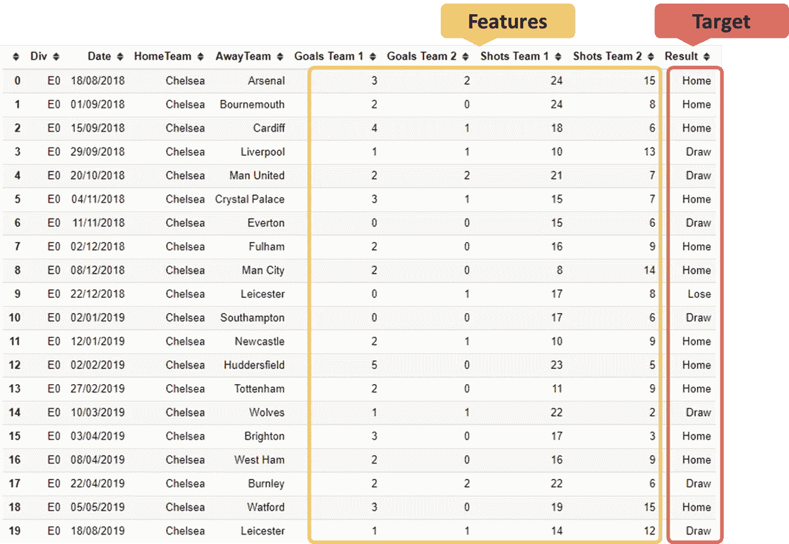
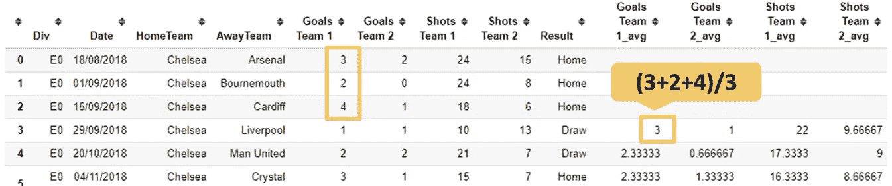
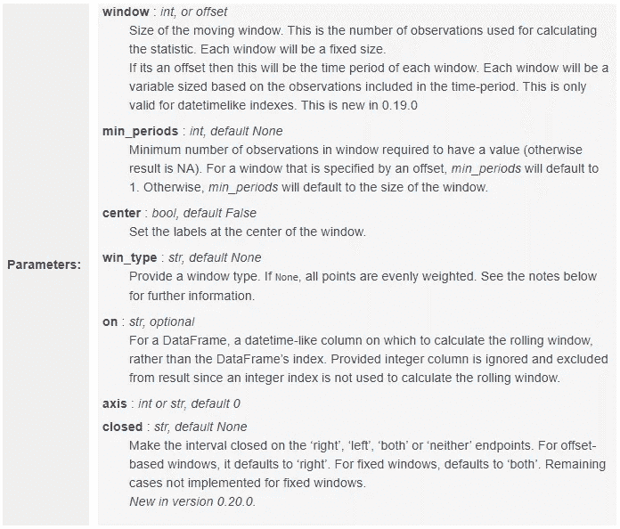
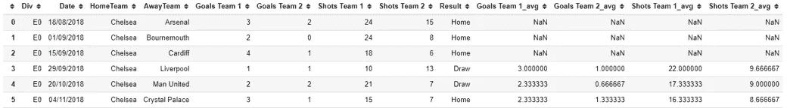
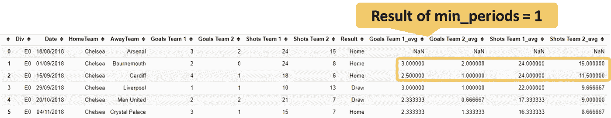

# 想象我在 4 分钟内和熊猫一起打滚

> 原文：<https://towardsdatascience.com/picture-me-rollin-with-pandas-in-4-minutes-7f35d57eb00f?source=collection_archive---------15----------------------->

## 对 Pandas DataFrame.rolling()的简短介绍，它提供了一种执行滚动窗口计算的简单方法。


几个星期以来，我一直在研究一个用于机器学习的足球数据集。我的特色之一是比赛日统计，比如射门、角球和控球。当然，我不能得到相应比赛的数据来预测它，因为它只能在赛后得到。所以我想用前三个比赛日的平均值来预测下一个比赛日。我的第一个想法是编写一个循环来聚合数据，但后来我发现了更好的东西:pandas.DataFrame.rolling.

## **问题**

我在介绍中已经说过，我正在研究一个足球预测模型。想象以下数据帧:



我有匹配统计数据，这是我的特征，也是我想用算法分类的目标。但是我不能使用这种形式的比赛统计，因为我在比赛前没有这种信息。因此，我想使用最近 3 个游戏日的平均值作为一个特征。

## **一个可能的解决方案**

我的第一个意图是用以下逻辑编写一个循环:对于行 *x* ，我们对行 *x-3* 到 *x-1* 求和，并将结果除以 3:


正如你所看到的，这个循环花了 **2.64 秒完成了 31 行**。由于我的数据集包含大约 9000 个游戏，这个解决方案对我来说太耗时了。不管怎样，我至少得到了想要的结果:



## **更好的解决方案**

我做了一些调查，发现了熊猫。DataFrame.rolling 这应该是我要求的完美解决方案。它提供了滚动窗口计算的选项。**滚动窗口背后的基本概念是定义一个特定大小的窗口，在其中执行特定的计算**。它常用于时间序列分析。在 [Pandas 文档](https://pandas.pydata.org/pandas-docs/stable/reference/api/pandas.DataFrame.rolling.html)中，您会发现以下参数:



为了重现第一次循环的结果，我们只需要定义窗口的大小。我们还需要添加 shift (1 ),以便以 1:

```
df_chelsea['Goals Team 1_avg'] = df_chelsea['Goals Team 1'].shift(1).rolling(3).mean()df_chelsea['Goals Team 2_avg'] = df_chelsea['Goals Team 2'].shift(1).rolling(3).mean()df_chelsea['Shots Team 1_avg'] = df_chelsea['Shots Team 1'].shift(1).rolling(3).mean()df_chelsea['Shots Team 2_avg'] = df_chelsea['Shots Team 2'].shift(1).rolling(3).mean()
```

结果与上一节完全相同:



执行**只用了 19 毫秒**，比之前的循环少了很多。如果我们定义了 min_periods 参数，我们还可以填充一些“NaN ”:

```
df_chelsea['Goals Team 1_avg'] = df_chelsea['Goals Team 1'].shift(1).rolling(3,min_periods=1).mean()df_chelsea['Goals Team 2_avg'] = df_chelsea['Goals Team 2'].shift(1).rolling(3,min_periods=1).mean()df_chelsea['Shots Team 1_avg'] = df_chelsea['Shots Team 1'].shift(1).rolling(3,min_periods=1).mean()df_chelsea['Shots Team 2_avg'] = df_chelsea['Shots Team 2'].shift(1).rolling(3,min_periods=1).mean()
```



## 结论

如果您觉得用 Python 分析数据花费的时间太长，通常有一种更有效的方法。这里的情况也是如此。Pandas 提供了一个内置函数来执行滚动窗口计算，而不是一个简单的循环，这要舒服得多，并提供了许多附加功能。它也比循环耗时少，执行时间只占循环的 0.7%。

[如果您喜欢中级和高级数据科学，并且还没有注册，请随时使用我的推荐链接加入社区。](https://medium.com/@droste.benedikt/membership)