# 图片文本:文本的交互式视觉效果

> 原文：<https://towardsdatascience.com/picturetext-interactive-visuals-of-text-591e6375c1d6?source=collection_archive---------34----------------------->

## 厌倦了单词云？

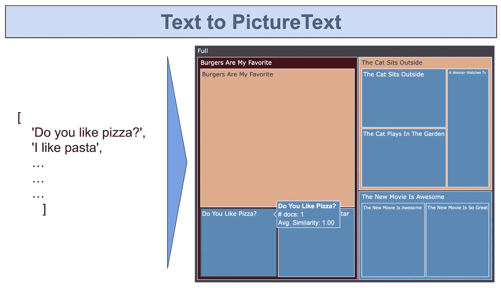

PictureText 用最少的代码将简短文档的列表转换成交互式树形图

可用的和与我们相关的书面文本的数量是惊人的，并且像这些天的大多数事情一样，呈指数增长。然而，我们用来阅读的工具基本上保持不变。

> 当研究一个话题、阅读新闻或试图获得一个事件的最新消息时，我们倾向于遵循一个 T 形过程。

我们想从大量的文献中了解:

*   他们对最感兴趣的是什么？一般是怎么回事？
*   什么是**的主旋律**？
*   在粗略的描述之后，我们倾向于迅速**深入**我们感兴趣的东西。
*   理想情况下，记录我们读到的内容，我们努力保持在正确的轨道上。
*   **拉起，潜** **再**进入一个狭窄的话题。
*   重复…

**相当于信息收集的狩猎采集者**。

解决这个问题将是我们消费信息的一个巨大进步，而我在这篇文章结束时肯定无法解决这个问题。然而，我的目标是提出一种向前迈出一小步的方法。

# 对此我们能做些什么

我在这里提出的是一个实用工具，它可以帮助我们快速浏览大量的文本。我称之为 PictureText(傻名字但是 WIP)。

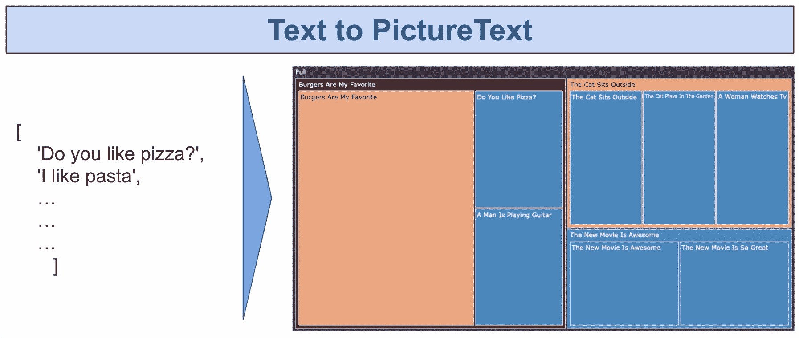

PictureText 用最少的代码将简短文档的列表转换成交互式树形图

给定一组短文档(比如新闻标题)，它可以将它们分成语义上属于一起的**层次组**。交互式树形图允许读者通过更深入地研究层次结构来更详细地探索每个组，并在需要时动态地抽出**。**

该方法旨在对大量非特定领域短文本进行分组。例如:新闻标题、自然语言问题和社交媒体帖子都是不错的选择。

这在很大程度上是混合使用三种工具的结果，我将在后面详细讨论。这主要归功于:SBERT 、 [plotly](https://plotly.com/) 和 [fastcluster](http://danifold.net/fastcluster.html) 团队，因为我只是简单地将这些碎片拼接在一起。

查看 [colab notebook](https://colab.research.google.com/drive/1mTrwk9hYl7bXYUr7e5hbCzv7Bim9ML8Y?usp=sharing) 和 [GitHub](https://github.com/md-experiments/picture_text) 获得文章中看到的结果和示例。

# 一种动机…各种各样的…

我记得几十年前，当我第一次去健身房的时候，教练会告诉我如何举起东西，这几乎是所有的理论。他们大多从他们的老师和个人经历中知道这些答案。显然，其中一些是错误的，并会产生意想不到的后果。

顺便说一句，那时，我经常去健身房，因为我认为那是让女孩更感兴趣的方法。现在，我知道写好代码是实现这一目标的方法，所以我不再去健身房了。

无论如何，至少，那时你会有一个关于做什么和如何做的有限的讨论，并且可以转移到实际的练习。现在，有博客和不同的度量标准和理论等等。它真的永远不会结束。这是…伟大的:进步和所有这一切，我喜欢它，不要误解我。(不想激怒数字大神不然他们会把我放在无尽卷轴的最底层！)

好吧，回到书呆子的话题。重点是:太多的文本，我们想要更少的文本，但保留质量和理解。例如，到现在为止，Medium 已经知道我想读什么，并鼓励我去读。但仅此而已吗？是大部分吗？还是只是冰山一角？无从得知。我最想知道的是什么？难道*我*甚至知道吗？(数字神显然知道，但我也想知道)

# 简单的例子

首先，我将“借用”一下 [SBERT](https://sbert.net/index.html) 文档[中的集群示例。考虑这些句子](https://github.com/UKPLab/sentence-transformers#clustering)

```
[
‘The cat sits outside’,
‘A man is playing guitar’,
‘I love pasta’,
‘The new movie is awesome’,
‘The cat plays in the garden’,
‘A woman watches TV’,
‘The new movie is so great’,
‘Do you like pizza?’,
‘Burgers are my favorite’,
‘I like chips’,
‘I will have french fries with my burger’
]
```

他们代表了我们讨论的问题的一个最小的例子。我们可以看到肯定有一个“食物”话题，一个“电影”话题和一些“其他”话题。我还用一些我最喜欢的快餐的例子稍微扩展了例子。

使用 ML 和 NLP，有许多方法可以对它们进行分组。例如，通过无监督学习，我们可以根据某种表示将它们分配到相似的组中(这里使用 [SBERT](https://sbert.net/index.html) )。如下图所示，每个方框的大小反映了每个组的大小。每一组都用属于它的一个句子来表示(后面会详细介绍)


在上述示例中使用最近邻聚类的树形图结果

这样的分组已经需要一些假设，而且**可能会出很大的差错**。例如，颜色编码旨在表明摘要标题与每个组的匹配程度，蓝色表示良好，红色表示不太好(更多细节请见下文)，您可以看到，对于较大的组，很难获得良好的匹配，摘要也很难提供良好的代表性。

我们没有看到的是，提到的比萨饼和意大利面也是“汉堡”组的一部分。另外，**“女人看电视”被错误地分配到右边的“猫”主题，但是我们看不到那个**。在现实世界中，我们每一组都有成千上万个例子，所以要弄清楚一些提到的“猫”和看电视的女人有什么关系就更加困难了。

# 层次凝聚聚类

大多数常见的聚类方法都将到此为止。然而，如果我们能够深入到一个兴趣组，并看到一些更细粒度的细分，将会有所帮助。这就是 HAC 可以提供帮助的方式。它使我们能够**迭代地将每个观察结果与其最接近的组**分组，参见下图通过 HAC 获得的相同示例。

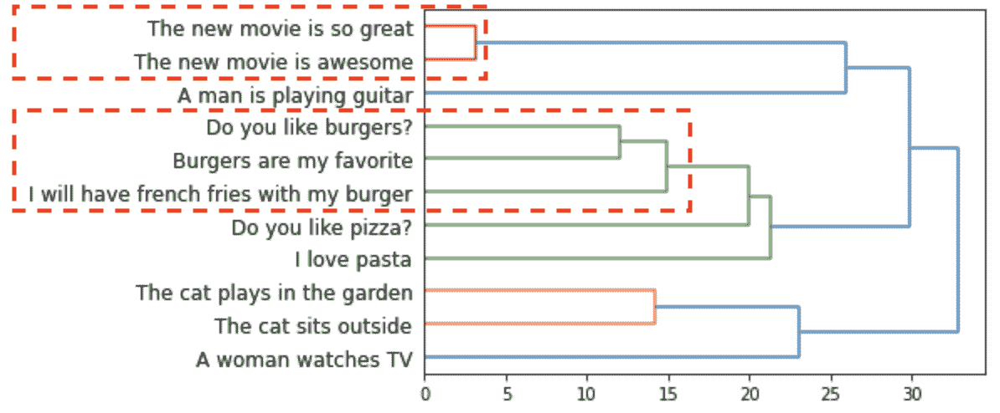

例句的 HAC 树状图

这非常有用，因为我们现在不仅知道句子是如何组合在一起的，还知道“汉堡”的句子和“电影”的句子在某种程度上更接近。“汉堡”首先与它们联系在一起，然后与比萨饼和意大利面食关系最密切。我们越向右移动，事物之间的距离就越远，也就是说，根据 HAC(你知道，常识),顶部提到的两部电影之间的联系比不同汉堡之间的联系更明显——电影之间的联系基本上是等同的，而后者谈论食物，但却是非常不同的陈述。

请注意，我们不再有任何特定的群集，在每一步，我们只是通过将两个最接近的组或单独的文本片段相互连接，将整体组的数量减少一个。没有**1 级、2 级等**的明确概念。

我们可能会尝试总结一些章节，但不清楚具体使用哪一个来这样做。

# 输入图片文本

考虑一下使用 PictureText 会是什么样子。

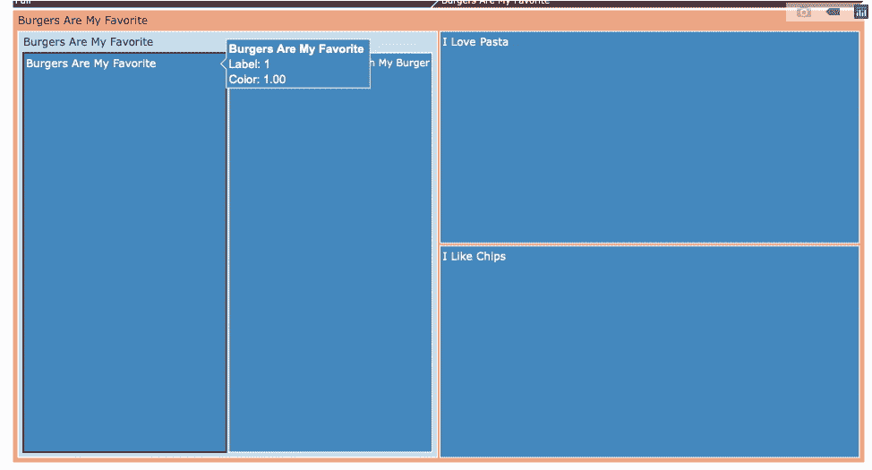

它使用之前的树状图(也称为树状图),并且**将一个层分配给数据**的一些固定数量的分割。例如，如果我们希望我们的数据在每一层中分成三个一组，我们将从从右到左沿着树状图开始，直到我们找到第一个好的三分之一(如果三分之一很小，例如，只包含一个句子，我们可能会继续分成 4 个或 5 个，直到我们有三个适当大小的分)。接下来，我们简单地在我们找到的每个组中重复这个步骤，直到我们希望这个分裂继续下去，或者直到我们用完所有的句子(实际上，我发现大约 6 次分裂耗尽了我的注意力范围，并且得到了结构良好的小组。请注意，由于这里的幂律增长，在 6 次拆分后，我们将有大约 700 个 3⁶集群，这是…相当多的一张图片。

每组由上图中的一个方框和一个标题表示。在内，我们将有下一组 3-5 个分割。

*   注意颜色编码。范围在深红和深蓝之间，其中**强度代表群体内部一致的质量。**非常红表示不好，平淡无奇的颜色表示一般，非常蓝表示非常好。
*   每个组的**大小与每个级别的成员数量成正比。未来的一个选择可能是添加提供您自己的重量的功能。**

正如你可能想象的那样，这个组合远非完美的**。因为我们没有以任何明确的方式告诉算法如何对标题进行分组，所以我们只是使用文本表示提供给我们的语言和语义知识来进行分组。有用的是看**什么时候我们对分组很有信心，什么时候不是**。在无监督的情况下，我们可以使用聚类成员的相似性。如果平均来说所有成员都非常类似于摘要，则摘要也是该群体的良好代表，反之亦然。**

# 方法概述

这部分比较专业，如果你想看一些例子，你可以跳到下一部分。

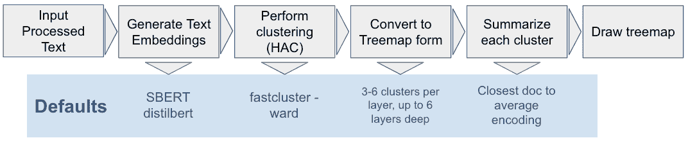

图片文本管道

1.  执行任何必要的预处理，以获得文档字符串列表
2.  使用选择的方法嵌入/编码所有文档，默认情况下我使用 [SBERT](https://sbert.net/index.html)
3.  使用 HAC 获得每个点到其余数据的分层分配的“链接”表。这里我使用 [fastcluster](http://danifold.net/fastcluster.html) ，默认为病房联动。
4.  通过为每个层选择一个粗略设置的分割数，迭代地创建“层”
5.  为每一层生成摘要。在默认设置中，我使用最接近集群平均值的点。使用聚类的平均值来表示其质心用于许多少数镜头、无监督的设置，特别是在( [Snell 等人，2017](https://arxiv.org/abs/1703.05175) )中
6.  使用 [plotly 的](https://plotly.com/)树形图进行交互式可视化

代码库使用一些合理的默认设置。“自带”电池选项允许您使用自己的方法来表示文本(即文本嵌入)，以及总结文本的方式，并调整您看到的层和每层的聚类数。github repo 中的更多示例。

# 一些结果

希望在这个阶段这一切仍然有意义。我们现在将做同样的事情，但是使用一些真实的数据。幸运的是， [tensorflow datasets](https://www.tensorflow.org/datasets) 为我们提供了大量的数据集，让我们快速入门。

可视化的方法在对大量非特定领域的短文本进行分组时效果很好。例如:新闻标题、自然语言问题和社交媒体帖子都是不错的选择。

我将在这里分别使用来自数据集的示例:

*   CNN-DailyMail 数据集——可视化每篇文章的摘要
*   小队数据集——可视化问题

查看 [colab notebook](https://colab.research.google.com/drive/1mTrwk9hYl7bXYUr7e5hbCzv7Bim9ML8Y?usp=sharing) 和 [github](https://github.com/md-experiments/picture_text) 的结果和例子，你可以跟着做

## 新闻

[CNN-DailyMail](https://github.com/abisee/cnn-dailymail) 是一个经过充分研究的摘要数据集，由新闻文章和“亮点”文本组成，作为摘要基准，通常由 1-3 句话组成。这是我们想要做的一个很好的候选。

我从数据中提取了前 10k 个“亮点”，只选择了它们的第一句话，然后在上面运行 PictureText。

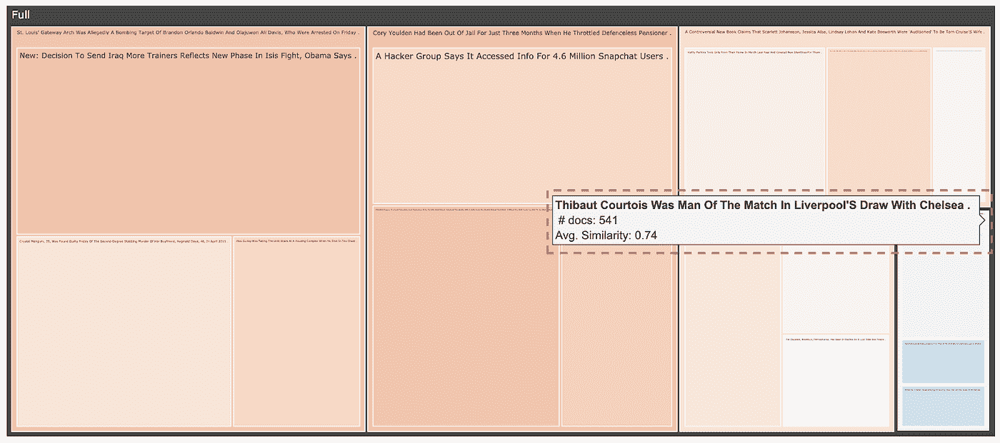

顶级分割显示大多数部分为浅琥珀色，这意味着低于平均组内相似性。右下角的小文档似乎更有希望，有大约 500 个(约 5%)关于“体育”主题的文档。

放大到“体育”主题，我们看到更多关于足球(真实的足球)和网球等的比赛结果。

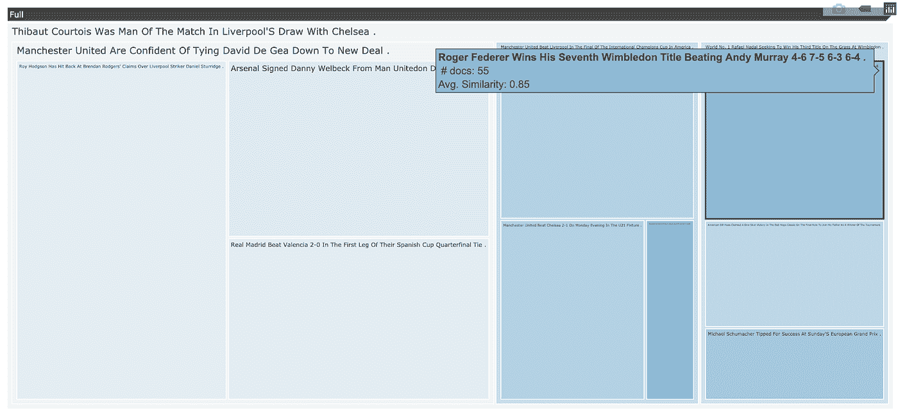

一般来说，颜色编码蓝色应该工作得很好。

很难从最大的主题中提取意义，因为它们目前用一句话概括了一大块 1-2k 的文章。然而，挑中间的一个，里面的内容有一些相似之处。黑客和骗局的主题似乎出现了:

*   *黑客组织称获取了 snapchat 用户的信息*
*   *公司使用诡计获得额外的税收减免*
*   *脸书聊天工具可以让你插入朋友的面孔*
*   *等*

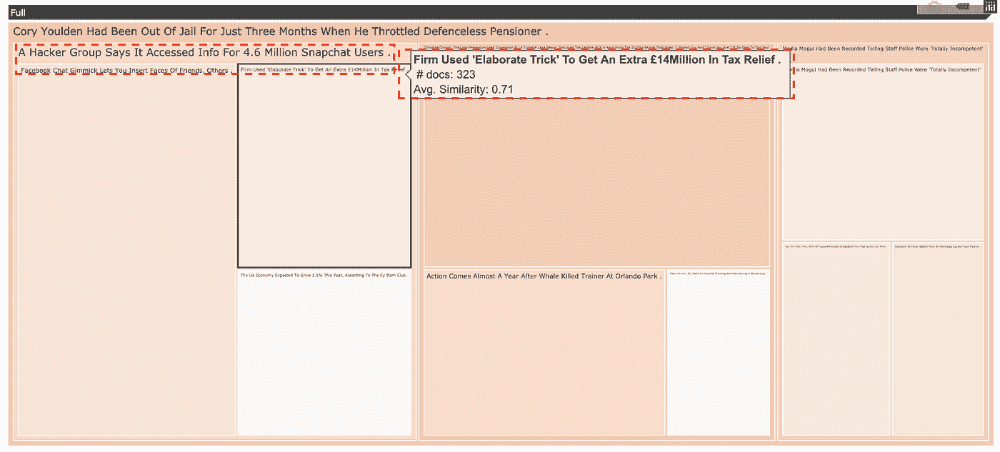

也有很多情况下，事情没有什么意义。同一张图片的中间部分混合了奥兰多公园袭击事件、英国烘焙大赛等新闻。

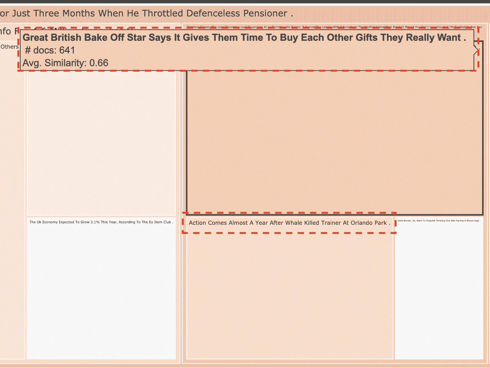

一般来说，处理这类问题的方法是更深入地研究一个组，直到出现一个更“蓝色”的标题集合，这一个更有意义。

## 问题回答

[小队数据集](https://rajpurkar.github.io/SQuAD-explorer/)是评价问答模型质量的标准之一。然而，很难很好地理解我们作为一个整体在处理什么样的问题，什么行得通，什么行不通。我们可以对个别问题进行抽样，或者做一些单词分布等。但是没有什么能简单地给出一个好的概述。

类似的结果可以从问题中看出。在顶层，根据前三个桶中包含的问题来判断，这种划分没有什么意义。

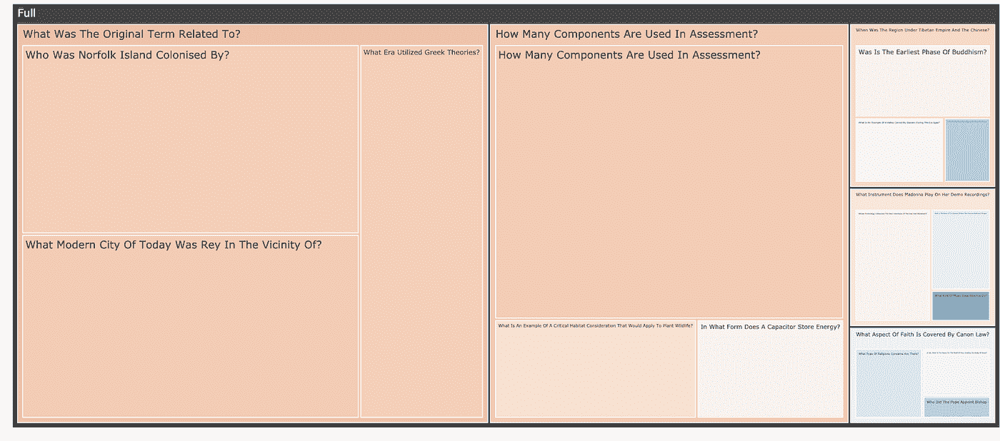

然而，深入其中一个“哪个时代利用了希腊理论”，我们看到了许多关于历史时期的问题。更深入地挖掘，似乎也有一些更狭窄的主题。例如，你可以关注斯拉夫/俄罗斯的时间线和事件。然而，在另一条线索中，我们从历史话题跳到关于电视历史的问题，比如“第五季是什么时候播出的？”…所以要小心…

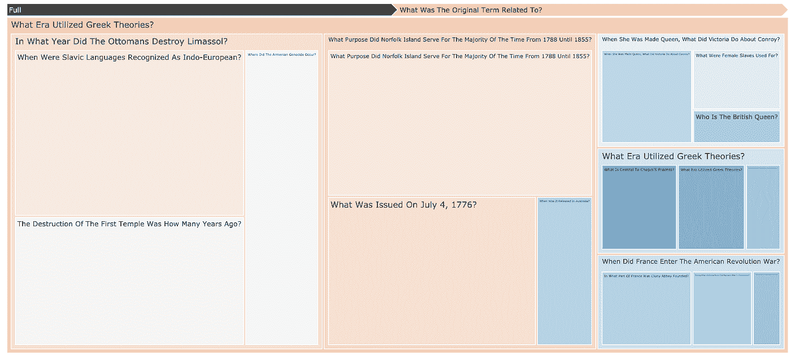

# (自我)批评

总体来说，我真的很喜欢这个结果，这个工具用几行代码就完成了很多工作。我希望它能对可视化、数据探索甚至一些关于数据内容的讨论有用。然而，它显然有其局限性，这里有一些使用时要记住的事情。

## 领域特异性

一般的基于 BERT 的模型倾向于在来自互联网的数据上进行训练，因此它们并不适合特定领域的使用。我做的一个实验是用 [CORD 数据集](https://www.kaggle.com/allen-institute-for-ai/CORD-19-research-challenge)，一个新冠肺炎研究论文的数据集。起初，结果似乎非常好，因为许多集群的相似性平均超过 80%，这表明集群内的一致性非常好。

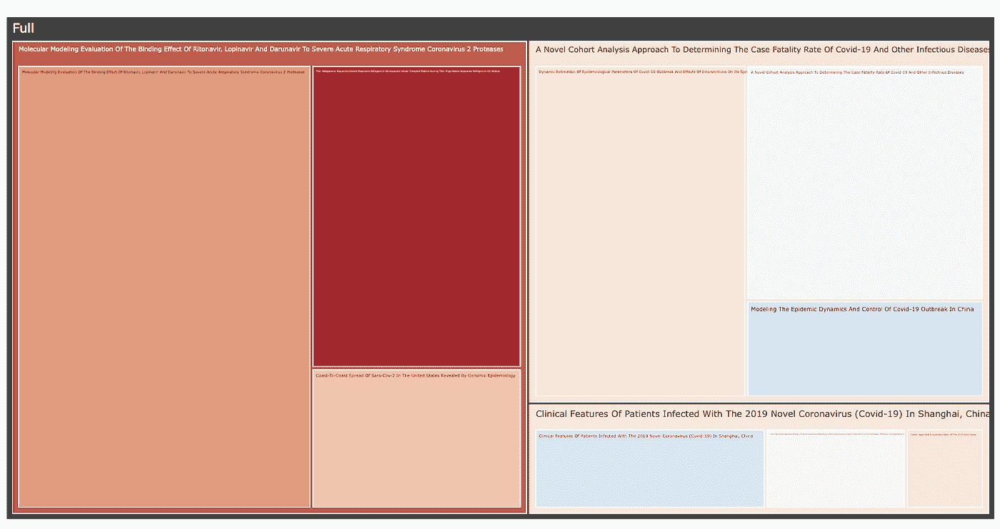

使用来自[脐带数据集](https://www.kaggle.com/allen-institute-for-ai/CORD-19-research-challenge)的清理过的 [bioarhiv 标题](https://www.kaggle.com/xhlulu/cord-19-eda-parse-json-and-generate-clean-csv)的 PictureText。总的来说，很多标题使用了很强的技术术语，这使得使用起来非常不可靠。例如，领域特定的[嵌入是可用的](https://github.com/allenai/paper-embedding-public-apis)，它可能被用来获得更好的结果。

然而，从实际结果来看，这些文章似乎没有什么共同点。脐带数据集显然集中在医学领域，即使在这一领域，它也非常局限于病毒学。我推测该算法发现了许多未知的标记，这可能会导致误导性的结果。

## 技术的

数据科学部分会一如既往地出错。我已经包含了非常基本的默认方法，并认为这些方法可以根据需要替换为更复杂的方法

*   **短文本。**设计工作使用的工具是句子级的(SBERT)，而且，BERT 模型很快淡化了更长系列的意义。我预计，随着文本变长，这个工具的有用性会很快下降。它主要用于单句文本，如:自然问题、新闻标题、推文等。
*   **总结。**默认采用小组总结简单但有局限性。那里有各种各样的方法，一般打着多文档摘要的旗号。让我非常高兴的是，我在解决方案中有一个明确的位置来使用它们，所以可以在那里做很多实验。特别令人感兴趣的是还可以提供对概要质量的评估的方法，因为这些方法很好地符合按质量对瓷砖进行颜色编码的解决方案。我对 [SUPERT](https://arxiv.org/abs/2005.03724v1) 感到非常兴奋——它也利用了 SBERT 并提供了自己的摘要质量指标，然而，它似乎在计算时间方面有一些开销。

## 用法/UX 批评

*   这可能会非常糟糕。在每一步，该工具都显示了从全部文档中抽取的一小组示例。在大多数情况下，我们只会看到层次结构中的 3 段文本。顶部的集群是我们首先看到的，并产生第一印象。同时，尽管这些是质量最差的。最高级别的总结肯定是对其内容的歪曲，因此深入挖掘是一个先决条件。
*   **可引起头痛。在使用它一段时间后，动态地上下移动层次结构确实有点令人着迷。然而，我很快就会忘记类似的物体在哪里。明确地说，例如，当阅读一个“体育”话题时，很可能会发现一小群政治话题，反之亦然。事实上，一个主题的良好一致性仅仅始于 80-90%的内在相似性**

# 未来的工作

为了解决上述问题，以下是一些可能的方向:

*   确定**有意义的衡量标准**,看起来什么样的“好”适合层的选择。我一直在寻找一种方法来捕获每层的合理数量的簇，即最好是 3–6 个。从视觉角度来看，这可能行得通，但对质量可能是有害的。[其他常见的方法](https://nlp.stanford.edu/IR-book/html/htmledition/hierarchical-agglomerative-clustering-1.html)要么使用我们上面看到的树状图的高度，要么寻找一个与 HAC 相当的[肘状](https://en.m.wikipedia.org/wiki/Elbow_method_(clustering)#:~:text=In%20cluster%20analysis%2C%20the%20elbow,number%20of%20clusters%20to%20use.)。
*   速度——我只想说:在(免费的)谷歌 colab GPU 上，10k 个句子需要 30 秒，100k 个句子就打破了 colab 的 RAM。这不是处理 twitter 的方法，但对于一天的新闻标题来说会很好。
*   评估**不同聚类方法**的影响。[班布里克等人(2020)](https://arxiv.org/pdf/2006.01117.pdf) 使用完全连接，而不是我在这里使用的沃德连接。在我考虑的大多数情况下，后者似乎更好，然而，我的目标是提出比“眼球”分析更正式的东西
*   能够**设置树形图大小**——以反映用户的偏好，而不仅仅是文章的数量
*   **文本大小**对于较长的文本来说很糟糕，plotly 没有文本换行设置，并且一直在缩小文本，所以它很快变得不可读。互动有助于解决一些问题，但还可以做得更多

# 结论

我开发了一个简单的工具来产生文本的层次聚类，在分组的每个级别上生成简单的摘要，并利用树形图工具来可视化结果。我认为这是一个强大的方法，无论是对数据科学家，还是对任何想要快速探索大量文本集合而不需要太多定制的人。开放工具，如通过 [SBERT](https://sbert.net/index.html) 的上下文文本表示，通过 [fastcluster](http://danifold.net/fastcluster.html) 的层次聚类，以及 [plotly](https://plotly.com/) 驱动的交互工具。

查看 [colab notebook](https://colab.research.google.com/drive/1mTrwk9hYl7bXYUr7e5hbCzv7Bim9ML8Y?usp=sharing) 和 [GitHub](https://github.com/md-experiments/picture_text) 中的结果和例子。

任何这类工具都有许多限制。特别是，开始时生成的一些聚类可能会完全混淆。

然而，我希望它对许多人有用，因为它是由我的一个长期任务驱动的——阅读时点击东西……

特别感谢 **Rich Knuszka** 的宝贵反馈。

希望这是有用的或…好奇的(好的或坏的好奇)。感谢您的阅读。如果你想打招呼，请通过 LinkedIn 联系