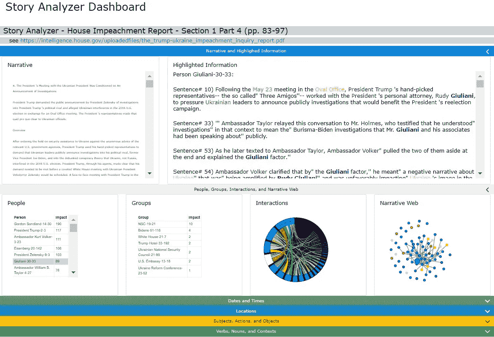
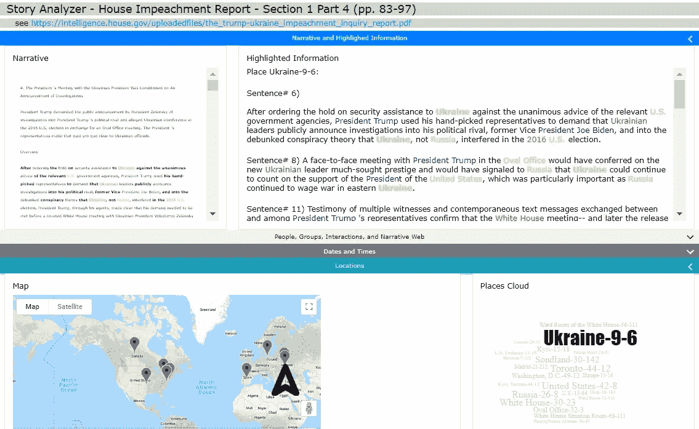
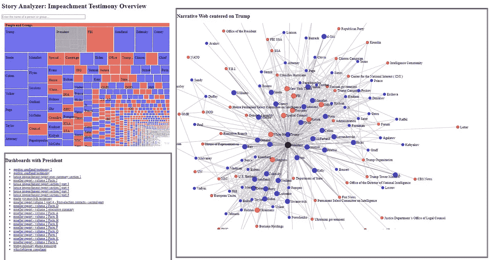
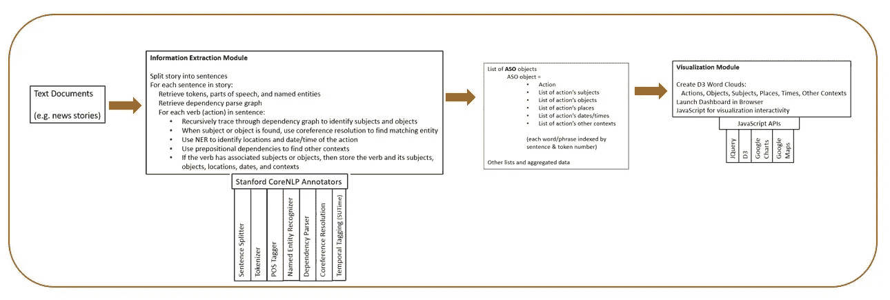

# 通过 NLP 和数据可视化描绘特朗普的弹劾

> 原文：<https://towardsdatascience.com/picturing-trumps-impeachment-via-nlp-and-data-visualization-288598a2e5cc?source=collection_archive---------46----------------------->

一个故事分析器仪表板，显示故事的主要人物及其互动

## 欢迎来到 [**Story Analyzer** ，](http://storyanalyzer.org/)这是一个将自然语言处理与数据可视化相结合的应用程序，它展示了这样一句格言:“一张图胜过千言万语。”

我是一名大学教授，也是一名程序员。我教计算机信息系统，主要是数据库、编程和商业智能。在过去五年的研究中，我一直在开发一个软件应用程序，我称之为**故事分析器**，它使用自然语言处理(NLP)和数据可视化来展示“一图胜千言”这句格言。自去年夏天以来，我已经将 Story Analyzer 应用于几份公开的政府文件，这些文件讲述了与特朗普总统被弹劾有关的事件。通过这一努力，并在学生研究助理的帮助下，我为穆勒报告、众议院弹劾报告、霍洛维茨报告、几位弹劾证人的开场陈述以及政府提供的其他公开可用的弹劾相关叙述和文字记录生成了几十个仪表板。在这篇文章中，我想分享和解释这些仪表板，它们可以在[http://storyanalyzer.org/](http://storyanalyzer.org/)找到。

我刚接触媒体和数据科学，我很高兴有机会宣传 Story Analyzer 和这些仪表板。我在詹姆斯·麦迪逊大学教书，那里的使命包括公民参与，我希望我的努力能效仿这一理想。我邀请你来看看我的网站，玩玩仪表盘。

术语“故事”是指涉及人、团体、组织或其他实体(主体)执行可以影响其他人、组织或实体(对象)的行为的叙事。这些事件发生在特定的地点和特定的时间，并且它们可能包括其他感兴趣的上下文特征。术语“故事分析”与识别故事的这些关键元素(主题、对象、动作、时间、地点和其他上下文)有关，此外还代表故事中发生的每个事件的这些元素之间的关系。Story Analyzer 有助于直观、交互式地回答以下问题:谁对谁做了什么，在何时何地发生的，以及当时还发生了什么？

事情发生在哪里？

使用 Story Analyzer 仪表板非常简单。将鼠标悬停在元素上，或者单击。通过这种方式，你可以浏览整个故事，关注一个人或一群人，一个地点或时间，互动和关键词。由 NLP 过程和复杂图形构成的丰富信息内容有助于用户理解冗长而复杂的叙述。

“了解全局”的概览仪表板

下图简要描述了这款 app 涉及的算法和流程。我的软件位于斯坦福大学 CoreNLP 的肩膀上，还有来自 Google 和 D3 的可视化库。下图显示了 Story Analyzer 的总体架构。你可以从[网站](http://storyanalyzer.org/)上看到关于我的软件的更多细节。

故事分析器系统架构

我希望你喜欢玩我的仪表板。我也希望他们提供有见地的信息，帮助你理解这个非常复杂的故事，这个故事可能会在华盛顿特区继续发展