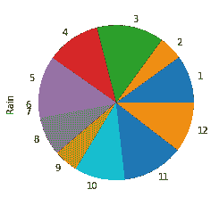
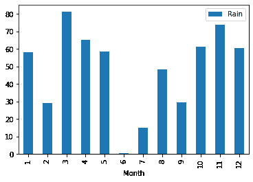
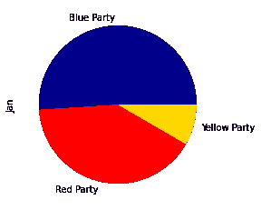
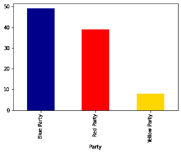
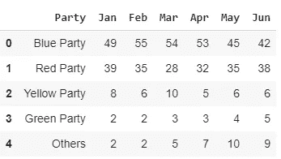
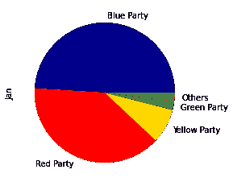
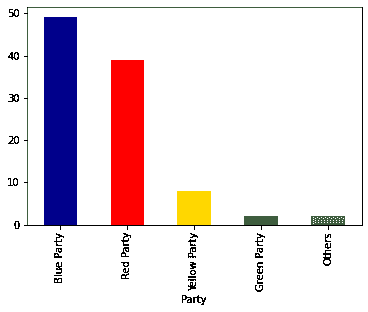
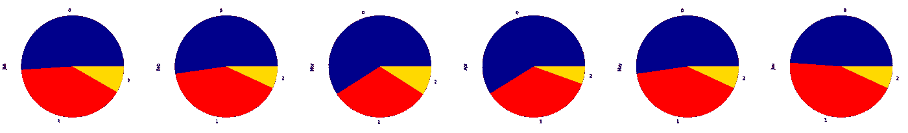
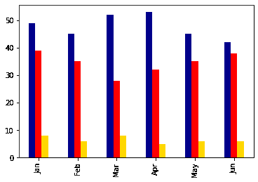
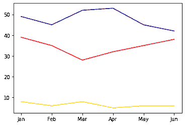

# 饼图被认为是有害的

> 原文：<https://towardsdatascience.com/pie-charts-considered-harmful-36268a4e42e6?source=collection_archive---------39----------------------->

## 数据可视化

## 有没有更好的数据呈现方式？

照片由[晨酿](https://unsplash.com/@morningbrew?utm_source=medium&utm_medium=referral)上的 [Unsplash](https://unsplash.com?utm_source=medium&utm_medium=referral) 所有其他插图由作者提供

好的图表能让读者更容易理解数据。饼状图经常不能通过这个最简单的测试。

事实上，耶鲁大学的统计学家、艺术家和名誉教授爱德华·塔夫特曾说过，比饼图更糟糕的设计只有几个，并认为在大多数情况下简单的表格更好。

让我们看一个例子。下面的饼图代表了一年中每个月的降雨量。

12 个月的降雨量

哪个月雨量最多？三月，对吗？然后是 11 月，还是 12 月？四月和五月哪个时间段更长？琼出了什么事？到底下了多少厘米的雨？

我是否因为歪曲了可怜的旧饼状图而有罪？它可以画得更好。例如，它可以有标签来显示每个月的实际降雨量。

但是这样不是更好吗:

12 个月的降雨量

一个简单的柱形图:底部是月份，y 轴是厘米数。诚然，它并不丰富多彩，但是您可以很容易地看到每个月的数值以及一年中每个部分的相对降雨量。

饼状图的问题在于，我们更容易注意到条形长度的差异，而不是看到圆形各部分的差异。解释条形图中的数据比解释饼图要简单得多。

不过，有一件事饼状图相当擅长。如果您有少量相当不同的值，饼图可以很好地显示差异。

这是三个政党在过去 6 个月里的一组完全虚构的民调数字。

这是一张代表一月份数据的饼状图。这是一个不错的代表，你可以清楚地看到他们之间的差异，但没有显示实际数字的标签，你只能猜测投票给每个政党的选民比例。

下面是绘制相同数据的柱形图。它同样清晰，但有一个优点，即条形是并排的，因此您可以更容易地看到它们之间的差异。它还有一个优点是有一个清晰的比例，这样你就可以估计出打算为每个政党投票的实际人数。

现在让我们把事情复杂化一点。在下面的表格中，我们有另外两个类别，一个代表第四个政党，另一个代表其他较小政党的选民。

这是新数据的饼图。还是不错的。很难区分最后两组选民，但他们之间没有太大的区别，所以这没什么大不了的。

那么，让我们来看看等效条形图。

我认为这是一场平局。他们之间没什么可选择的。

但是，如果我们想要表示整个表— 6 个月的数据，该怎么办呢？

我们将返回到第三方数据，使事情变得简单一点。这是一组代表六个月数据的饼图。你能看到趋势吗？

如果你集中精力，你可以看到这些变化，但这些变化在柱状图中更容易看到，如下图所示。你可以清楚地看到，黄党的选票份额变化不大，而蓝党在 3 月和 4 月获得了选票，但在 5 月和 6 月又失去了选票。红色政党的投票模式正好相反，表明选民们在两党之间交换了他们的忠诚。

另一种简单且易于解释的表示是折线图。在下图中，您可以看到与条形图相同的趋势。

我是不是对饼状图太苛刻了？我举的例子是不是对它有偏见？也许吧。我并不是建议我们禁止饼图，因为我们已经看到它们在一些受限的情况下是有用的。但是值得考虑替代方案:条形图和折线图通常是更好的替代方案。

**参考**

1.  *《定量信息的视觉展示》，*爱德华·塔夫特，图形出版社，2001 年