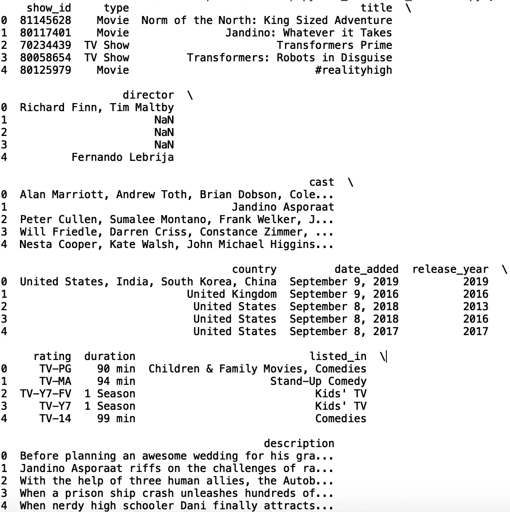
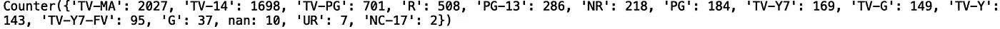
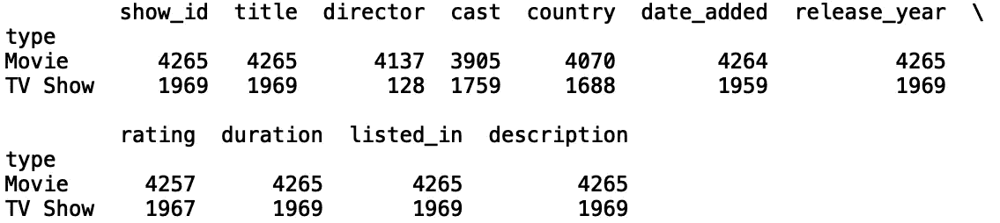
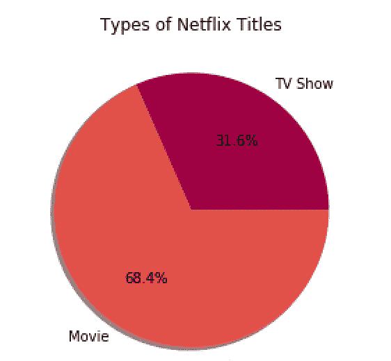
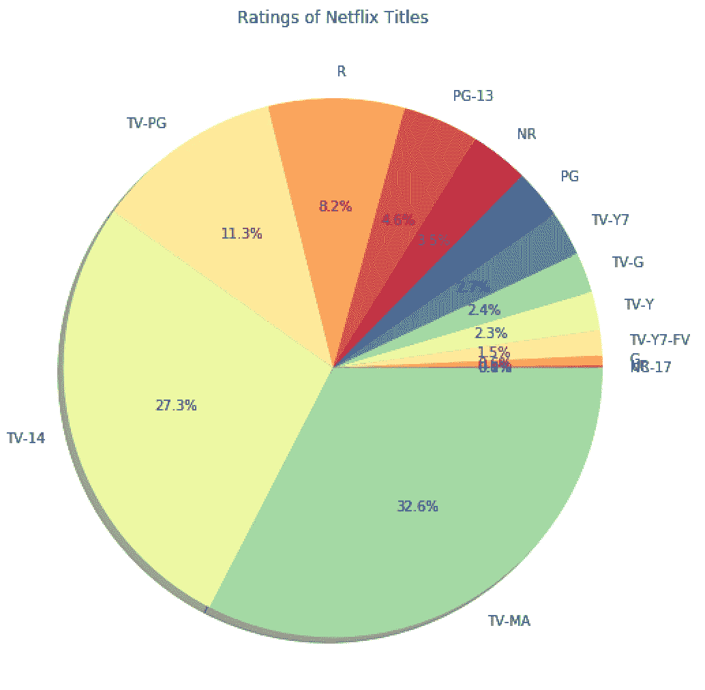
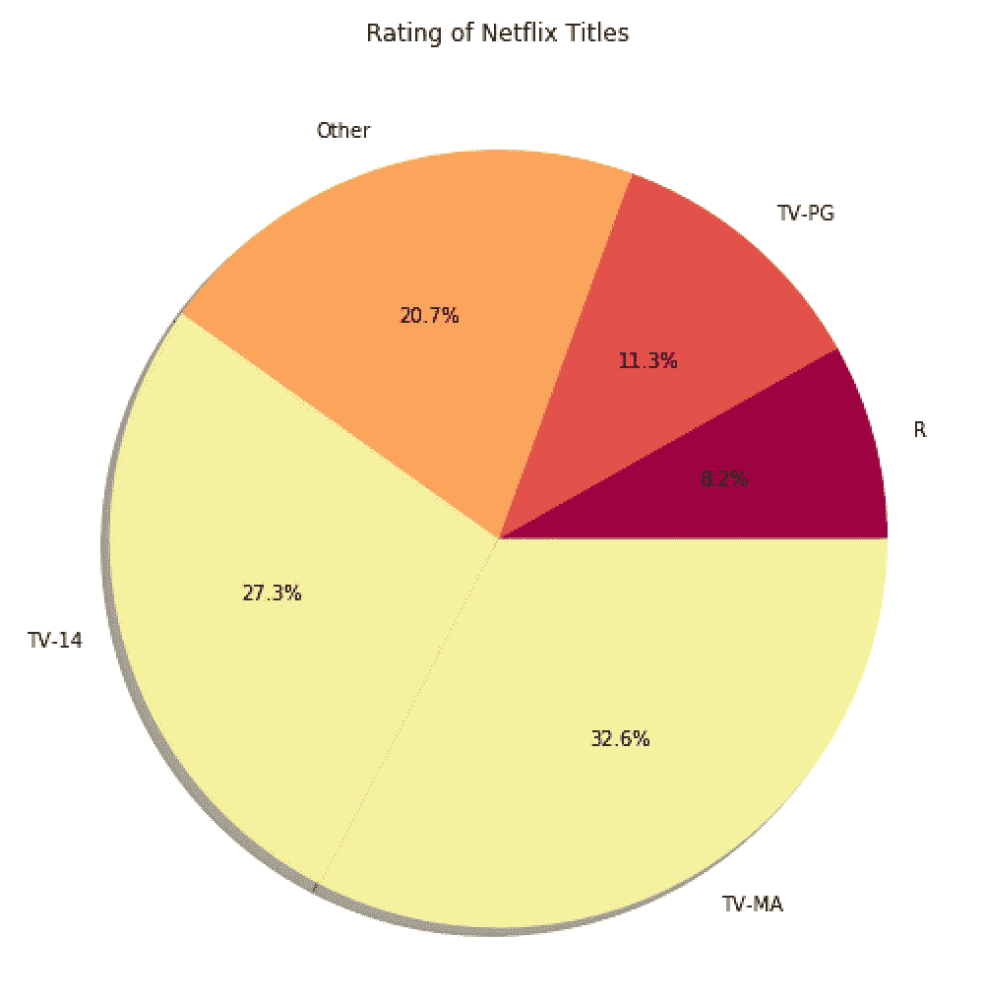
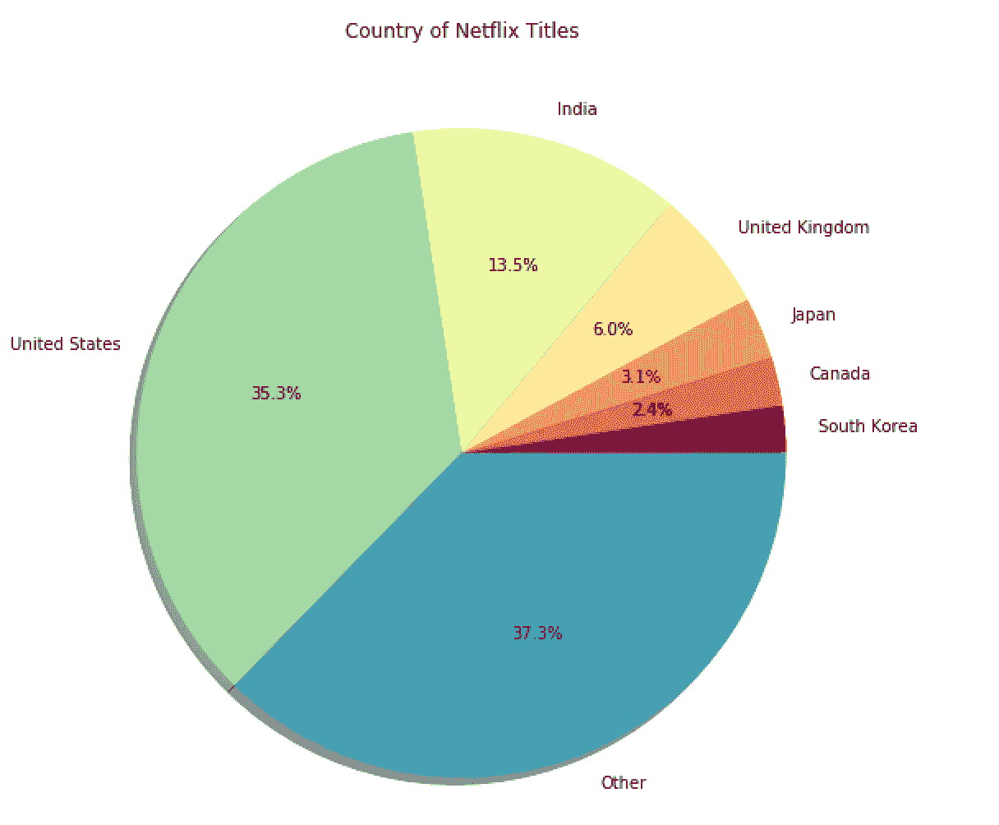

# Python 中的饼图

> 原文：<https://towardsdatascience.com/pie-charts-in-python-302de204966c?source=collection_archive---------13----------------------->

## 用 Python 创建饼图


[来源](https://www.pexels.com/photo/lights-blue-wire-lighbulbs-91413/)

饼图是一种数据可视化类型，用于说明数据中的数字比例。python 库“matplotlib”为创建漂亮的可视化效果提供了许多有用的工具，包括饼状图。在这篇文章中，我们将讨论如何使用“matplotlib”在 python 中创建饼状图。

我们开始吧！

出于我们的目的，我们将使用*网飞电影和电视节目*数据集，可以在[这里](https://www.kaggle.com/shivamb/netflix-shows)找到。

首先，让我们将数据读入熊猫数据框；

```
import pandas as pd 
df = pd.read_csv("netflix_titles.csv")
```

接下来，让我们使用。head()'方法:

```
print(df.head())
```



正如我们所看到的，数据包含具有各种分类值的列。饼图通常显示数据集中不同类别的相对比例。对于我们的饼图可视化，“评级”、“国家”和“类型”列是我们可以分组和可视化的带有分类值的数据的很好的例子。

为了了解这些列的分类值的分布情况，我们可以使用 collections 模块中的“Counter”方法。让我们将“计数器”方法应用于“类型”列:

```
from collections import Counter
print(Counter(df['type']))
```


让我们看看“评级”栏:

```
print(Counter(df['rating']))
```



现在，让我们按照每个“类型”类别的值的数量对数据进行分组:

```
title_type = df.groupby('type').agg('count')
print(title_type)
```



接下来，让我们从“matplotlib”导入几个模块:

```
import matplotlib.ticker as ticker
import matplotlib.cm as cm
import matplotlib as mpl
from matplotlib.gridspec import GridSpec
import matplotlib.pyplot as plt
```

现在，让我们对聚合类型的指数和计数进行排序:

```
type_labels = title_type.show_id.sort_values().index 
type_counts = title_type.show_id.sort_values()
```

然后，我们指定图形细节:

```
plt.figure(1, figsize=(20,10)) 
the_grid = GridSpec(2, 2)
```

并指定颜色映射信息:

```
cmap = plt.get_cmap('Spectral')
colors = [cmap(i) for i in np.linspace(0, 1, 8)]
```

最后，让我们绘制饼图:

```
plt.subplot(the_grid[0, 1], aspect=1, title='Types of Netflix Titles')
type_show_ids = plt.pie(type_counts, labels=type_labels, autopct='%1.1f%%', shadow=True, colors=colors)
plt.show()
```



我们看到这个数据集中的大多数网飞电影都是电影。我们还可以为评级生成一个饼图。让我们按评级汇总:

```
title_rating = df.groupby('rating').agg('count')
rating_labels = title_rating.show_id.sort_values().index 
rating_counts = title_rating.show_id.sort_values()
```

绘制我们的图表:

```
plt.figure(1, figsize=(40,20))
the_grid = GridSpec(2, 2)
cmap = plt.get_cmap('Spectral')
colors = [cmap(i) for i in np.linspace(0, 1, 8)]plt.subplot(the_grid[0, 1], aspect=1, title='Ratings of Netflix Titles')
type_show_ids = plt.pie(rating_counts, labels=rating_labels, autopct='%1.1f%%', shadow=True, colors=colors)
plt.show()
```



我们看到“TV-14”和“TV-MA”是数据中最常见的收视率。饼图的一个缺点是，一列中出现的类别越多，它们的用处就越小。例如，在我们的评级饼图中，“G”、“NC-17”和“ur”评级重叠，这在视觉上看起来并不令人愉快。你可以想象，随着类别数量的增加，情况会变得更糟。为了解决这个问题，让我们定义一个函数来计算第 75 个百分位数，并将较少的计数组合在“其他”类别中:

```
def group_lower_ranking_values(column):
    rating_counts = df.groupby(column).agg('count')
    pct_value = rating_counts[lambda x: x.columns[0]].quantile(.75)
    values_below_pct_value = rating_counts[lambda x: x.columns[0]].loc[lambda s: s < pct_value].index.values
    def fix_values(row):
        if row[column] in values_below_pct_value:
            row[column] = 'Other'
        return row 
    rating_grouped = df.apply(fix_values, axis=1).groupby(column).agg('count')
    return rating_grouped
```

我们现在可以使用这个函数来聚集我们的数据:

```
rating_grouped = group_lower_ranking_values('rating')
rating_labels = rating_grouped.show_id.sort_values().index 
rating_counts = rating_grouped.show_id.sort_values()
```

并绘制出结果:

```
plt.subplot(the_grid[0, 1], aspect=1, title='Rating of Netflix Titles')
type_show_ids = plt.pie(rating_counts, labels=rating_labels, autopct='%1.1f%%', shadow=True, colors=colors)
plt.show()
```



我们看到这看起来比以前的情节好多了。让我们为 country 列做同样的事情。这里，我们将考虑第 99 百分位:

```
def group_lower_ranking_values(column):
    ...
    pct_value = rating_counts[lambda x: x.columns[0]].**quantile(.99)**
    ...
    return rating_groupedcountry_grouped = group_lower_ranking_values('country')
country_labels = country_grouped.show_id.sort_values().index 
country_counts = country_grouped.show_id.sort_values()plt.subplot(the_grid[0, 1], aspect=1, title='Country of Netflix Titles')
type_show_ids = plt.pie(country_counts, labels=country_labels, autopct='%1.1f%%', shadow=True, colors=colors)
plt.show()
```



我就讲到这里，但是您可以自己随意摆弄代码。

## 结论

总之，在这篇文章中，我们讨论了如何用 python 创建饼状图。我们表明，代表相应的标题类型，评级和网飞标题国家类别的比例。我们还展示了如何通过计算排名最高的类别并将排名较低的值分组到一个“其他”组中，来解决可视化具有太多类别类型的列的问题。我希望你觉得这篇文章有趣/有用。这篇文章的代码可以在 GitHub 上找到。感谢您的阅读！