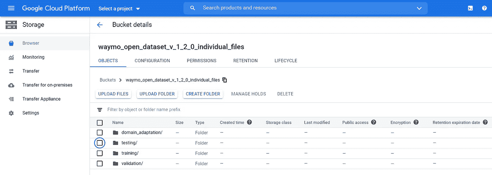
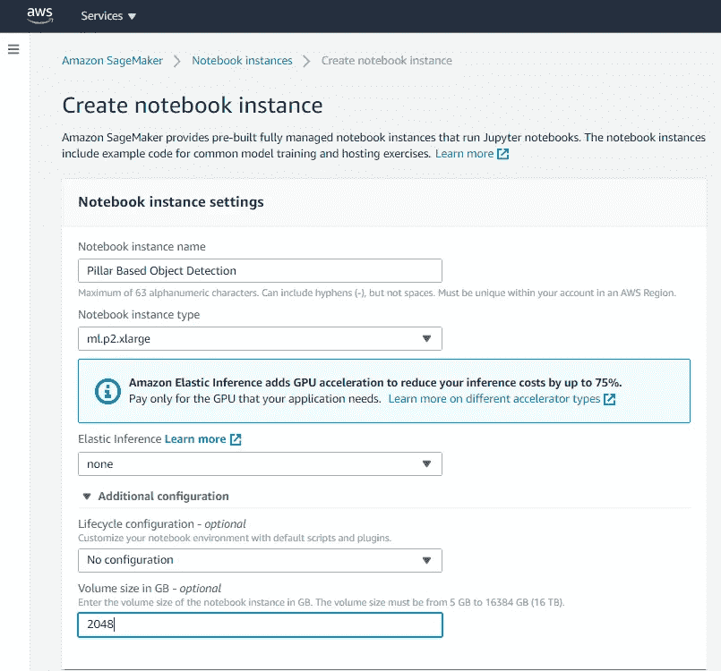
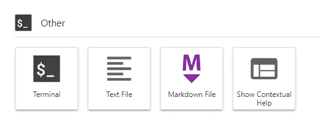

# 基于 Pillar 的三维点云物体检测在 Waymo 开放数据集上的实现

> 原文：<https://towardsdatascience.com/pillar-based-3-d-point-cloud-object-detection-implementation-on-waymo-open-dataset-423e9a449ecb?source=collection_archive---------54----------------------->

## 在 Amazon Sage Maker 上实现基于支柱的对象检测深度神经网络的教程。这可以推广到任何云实例，甚至是本地环境。

# 介绍

这篇文章是关于在 AWS 上实现和运行 3D 点云物体检测深度神经网络的。激光雷达(3D 点云)物体检测已经成为自动驾驶领域中的重要研究领域。由于自动驾驶汽车使用激光雷达来检测道路上的物体，因此在道路上检测这些物体并预测它们的运动以做出明智的驾驶决策非常重要。

有许多用于道路上物体检测和跟踪的开放数据集可供您学习。我在下面列出了几个受欢迎的:

*   Waymo 开放数据集([https://waymo.com/open/](https://waymo.com/open/))
*   基蒂数据集(【http://www.cvlibs.net/datasets/kitti/】T2
*   Lyft 级数据集(【https://self-driving.lyft.com/level5/】T4)

一旦你知道要处理什么样的数据集，接下来就是对这些数据表现良好的神经网络。考虑到这种数据可以用于例如对象检测、分割、对象跟踪等的不同应用。有不同的网络。请参考[这篇](https://medium.com/@a_tyagi/3d-point-clouds-bounding-box-detection-and-tracking-pointnet-pointnet-lasernet-point-pillars-9439af14dfba)文章，阅读更多关于 3D 点云数据及其应用的信息，以及哪些网络最适合每种应用。为了这篇文章的目的，我们把重点放在物体检测和最近发表的基于柱子的方法[1]来解决这个问题。

# 先决条件:

*   克隆 GitHub repo:[https://github.com/tyagi-iiitv/pillar-od](https://github.com/tyagi-iiitv/pillar-od)。
*   访问 Waymo 数据集([https://waymo.com/open/download/](https://waymo.com/open/download/))。访问他们的谷歌云存储大约需要 2 天时间，看起来像下面的图片。我们将使用它，这样我们就可以用终端直接在云上下载数据。



谷歌云上的 Waymo 数据集回购

# 实施步骤

## 启动云实例

因为我使用的是 Amazon SageMaker，所以我们用大约 2TB 的空间和一个 GPU 启动了一个笔记本实例。



在 Amazon SageMaker 上创建一个笔记本实例。

然后我们启动我们的云实例并打开 JupyterLab，接着在我们的实例上打开一个新的终端。



为您的云实例打开一个终端。

## 获取数据

使用以下命令从 google cloud bucket 获取数据(记住要将 gcloud 添加到路径中):

```
curl [https://sdk.cloud.google.com](https://sdk.cloud.google.com) | bash
exec -l $SHELL
gcloud init
```

如果`gcloud`仍然无法识别，使用`cat /home/ec2-user/.bashrc`查看`.bashrc`文件的内容，并验证 gcloud 的链接，可能在该文件的最后两行。使用下面的命令将它们手动添加到您的路径中。这应该可以让 gcloud 命令在您的终端上工作。

```
source /home/ec2-user/google-cloud-sdk/path.bash.inc
source /home/ec2-user/google-cloud-sdk/completion.bash.inc
gcloud init
```

现在，最后，获取训练和验证数据，并将其分别存储在`train_data`和`validation_data`目录中。将数据从 google cloud bucket 复制到您的实例的命令是`gsutil -m cp -r gs://waymo_open_dataset_v_xxx /path/to/my/data`找到 waymo 存储库的确切名称，打开 waymo 开放数据集的 google 云存储目录，并复制存储库的名称。如果你下载了一个`.tar`文件，用命令`tar -xvf training_xxxx.tar`提取它。这将为场景中的各个片段提供数据文件。

## 设置代码

*   克隆 GitHub repo `git clone https://github.com/tyagi-iiitv/pillar-od.git`
*   创建一个虚拟工作环境`conda create -p ./env anaconda python=3.7`这将安装一个初始的、完整的 Anaconda 环境和必要的包。
*   激活 conda 环境`source activate ./env`
*   安装附加库`conda install absl-py tensorflow-gpu tensorflow-datasets`
*   安装 Waymo 开放数据集包装库

```
rm -rf waymo-od > /dev/null
git clone https://github.com/waymo-research/waymo-open-dataset.git waymo-od
cd waymo-od && git branch -a
git checkout remotes/origin/master
pip install --upgrade pip
pip install waymo-open-dataset-tf-2-1-0==1.2.0
```

*   为模型准备数据集。更改文件`pillar-od/data/generate_waymo_dataset.sh`中的源和目标目录。现在运行文件从下载的数据中读取帧。这将需要一段时间，取决于您下载的数据大小。

```
cd pillar-od/data
chmod +x generate_waymo_dataset.sh
./generate_waymo_dataset.sh
```

## 模特培训

在我们运行`pillar-od`目录中的 train.py 文件之前，请确保在`config.py`文件中更改数据集和其他配置参数的路径。完成后，让我们安装几个库来开始培训。

```
pip install lingvo tensorflow-addons
```

最后，模型准备好为汽车(类= 1)/行人(类=2)进行训练:

```
python train.py --class_id=1 --nms_iou_threshold=0.7 --pillar_map_size=256python train.py --class_id=2 --nms_iou_threshold=0.7 --pillar_map_size=512
```

## 模型评估

模型评估的过程相同，使用以下命令:

```
python eval.py --class_id=1 --nms_iou_threshold=0.7 --pillar_map_size=256 --ckpt_path=/path/to/checkpoints --data_path=/path/to/data --model_dir=/path/to/resultspython eval.py --class_id=2 --nms_iou_threshold=0.2 --pillar_map_size=512 --ckpt_path=/path/to/checkpoints --data_path=/path/to/data --model_dir=/path/to/results
```

# 参考

[1]基于立柱的自动驾驶目标检测，王等。艾尔。ECCV 2020