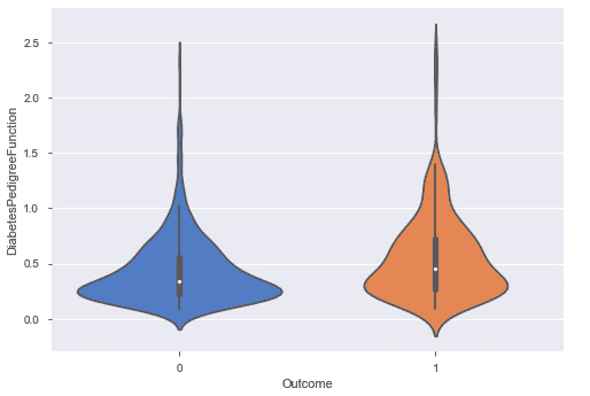
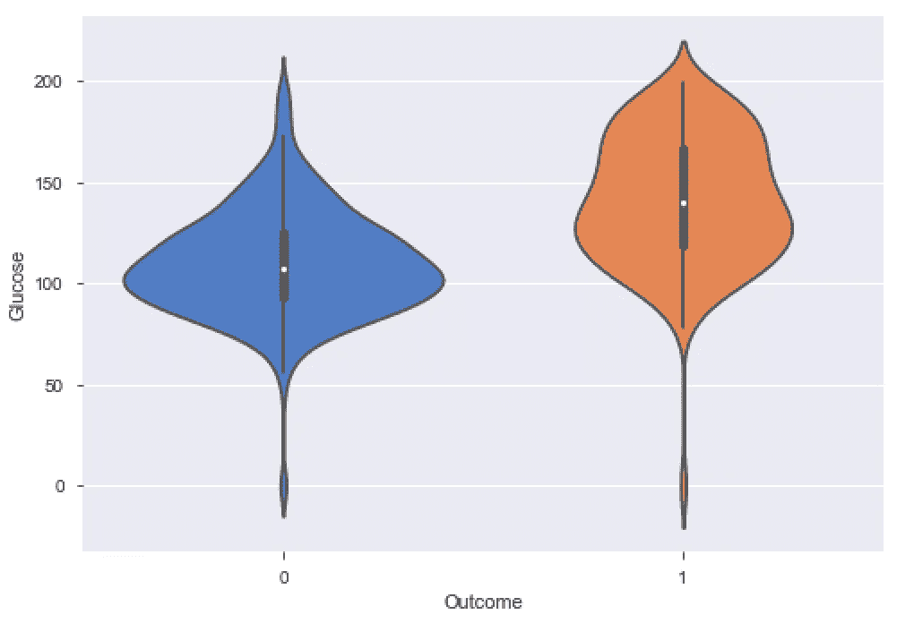

# PIMA 印度糖尿病预测

> 原文：<https://towardsdatascience.com/pima-indian-diabetes-prediction-7573698bd5fe?source=collection_archive---------3----------------------->


[图片鸣谢:www.diabetes.co.uk](http://www.diabetes.co.uk)

## 预测糖尿病的发病

糖尿病是一种慢性疾病，身体对胰岛素产生耐药性，胰岛素是一种将食物转化为葡萄糖的激素。糖尿病影响全世界许多人，通常分为 1 型和二型糖尿病。两者各有特点。本文旨在 PIMA Indian 糖尿病数据集上分析并创建一个模型，以预测在给定独立因素的情况下，某一特定观察值是否有发展为糖尿病的风险。本文包含创建合适模型的方法，包括 EDA 和模型。

# **数据集**

数据集可以在 Kaggle 网站上找到。该数据集最初来自美国国家糖尿病、消化和肾脏疾病研究所，可用于根据某些诊断因素预测患者是否患有糖尿病。首先，我使用 Python 3.3 来实现这个模型。执行一些基本分析以获得数据集的整体概念是很重要的。

```
#Importing basic packages
import pandas as pd
import numpy as np
import matplotlib.pyplot as plt
import seaborn as sns
from pandas_profiling import ProfileReport#Importing the Dataset
diabetes = pd.read_csv(“diabetes.csv”)
dataset = diabetes#EDA using Pandas Profiling
file = ProfileReport(dataset)
file.to_file(output_file=’output.html’)
```

Pandas profiling 是获得关于数据集和其中变量的全面和深入信息的有效方法。然而，如果数据集非常大，就要小心了，因为*大熊猫特征分析*非常耗时。因为数据集只有 768 个观察值和 9 列，所以我们使用这个函数。输出作为一个 *HTML* 报告保存在工作目录中。


数据集概述

我们可以看到数据集的基本信息，如大小、缺失值等。在右上角，我们看到 8 个数字列和 1 个布尔列(这是我们的因变量)。在下面的面板中，每一列都给出了 0 的(%)，这将是我们以后的有用信息。我们没有任何分类变量作为自变量。

# 探索性数据分析

观察了数据集的基本特征后，我们现在继续观察研究中涉及的变量的特征。又一次，*熊猫侧写*来拯救我们了。同一个 HTML 报告给出了变量的信息。


自变量:年龄

我们来看看*年龄*。通过快速查看右上方的直方图，我们可以观察到许多特征。变量不遵循正态分布，因为它向右倾斜(或正倾斜)。平均年龄是 33 岁，而平均年龄是 29 岁。这进一步证实了我们的分析(在正态分布的情况下，平均值应该近似等于中位数)。最重要的是，没有一个值看起来是异常的，也就是说，最小年龄 21 岁和最大年龄 81 岁对于该研究是可能的。让我们看看其他变量。


自变量:血压

对血压做同样的处理，我们可以看到变量可以近似为正态分布。然而，我们无法从视觉上确认。因此，我们进行了夏皮罗-维尔克正态性检验。零假设( *Ho)* 是数据正态。

```
from scipy.stats import shapirostat, p = shapiro(dataset['BloodPressure'])
print('Statistics=%.3f, p=%.3f' % (stat, p))Statistics=0.819, p=0.000
```

*p 值小于 0.001，*意味着在 5%的显著性水平(LOS)，我们拒绝了我们的零假设(Ho)。因此，变量不遵循正态分布。

其次，如果我们观察血压的最小值，它被给定为 0(这是不可能的)。因此，给出了不正确的信息。我们现在有两个选择。一种是放弃这样的观察值(这会导致 4.6%的数据丢失)，或者我们可以用中值(估算)代替这样的值。我更喜欢估算，因为我们有一个小数据集(只有 768 个观察)。因此，每个信息都很重要。

我们可以简单地用中值替换零值，或者我们可以根据结果对变量进行分类，然后分别替换这两个值。后者似乎更有效率。我们画一个小提琴图来看看这个行为。

```
#Classifying the Blood Pressure based on class
ax = sns.violinplot(x=”Outcome”, y=”BloodPressure”, data=dataset, palette=”muted”, split=True)
```


我们得到了上面的图表。如果我们仔细观察，我们可以看到 *1(糖尿病患者)*在*小提琴*内的箱形图比 *0(非糖尿病患者)的箱形图稍微偏离水平轴。这意味着糖尿病患者似乎比非糖尿病患者血压更高。*小提琴的底部尾部*表示我们需要替换的零值。我们将用 *1* 的中值替换 *1* 的零，对于 *0 也是如此。**

```
#Replacing the zero-values for Blood Pressure
df1 = dataset.loc[dataset['Outcome'] == 1]
df2 = dataset.loc[dataset['Outcome'] == 0]df1 = df1.replace({'BloodPressure':0}, np.median(df1['BloodPressure']))
df2 = df2.replace({'BloodPressure':0}, np.median(df2['BloodPressure']))dataframe = [df1, df2]
dataset = pd.concat(dataframe)
```

贴上后*血压*栏不会有任何零值。让我们转到下一个变量。


自变量:身体质量指数

由于平均值和中值大致相等，变量似乎紧密遵循正态分布。但是，它面临着和以前一样的问题，即零值的存在。让我们为这个变量画一个小提琴图。


我们可以观察到 *1* 服从正态分布，而 *0* 不服从正态分布。此外，糖尿病患者的身体质量指数高于非糖尿病患者的身体质量指数(可以使用箱线图观察)。在身体质量指数，我们对血压零值的处理方法与我们对血压零值的处理方法相同。在这种情况下，我们也可以用平均值来代替，但是，我将坚持使用中位数。在更改列名之后，我们运行相同的代码。继续下一个变量。


自变量:糖尿病

糖尿病谱系函数是一个正偏变量，没有零值。我们用同样的小提琴剧情来观察特点。



可以形成相同的假设。糖尿病患者似乎比非糖尿病患者有更高的谱系功能。继续第五个独立变量。


自变量:葡萄糖

分析*葡萄糖，*我们观察到变量不遵循正态分布。在这种情况下，我们也会遇到零值。有 5 个这样的值需要治疗。我们像以前一样执行相同的处理，用中位数代替(按类)。



观察小提琴图，我们看到糖尿病患者和非糖尿病患者的箱线图之间有巨大的垂直距离。这表明葡萄糖可能是建模中非常重要的变量。处理完零值后，我们转到下一个变量。


自变量:胰岛素

如数据集可用的数据字典中所述，*胰岛素*是 2 小时血清胰岛素(μU/ml)。变量是正偏的。然而，在这种情况下，零值的出现率很高，占数据的 48.7%。这个数据必须进行估算。我们先治疗这些。


在处理了零值之后，我们在这个图上推导出。我们仍然可以将 0 视为*糖尿病患者胰岛素的中位数。*然而对于*非糖尿病人来说，*胰岛素稍高。可以粗略假设，糖尿病患者的胰岛素低于非糖尿病患者。继续怀孕。


独立变量:怀孕

变量正偏，零值为 14.5%。我们不需要将零值视为异常现象。然而，鉴于 85.5%的数值为非零，我们可以推断这项研究只针对女性。使用小提琴图观察行为，我们观察到糖尿病妇女比非糖尿病妇女有更多的怀孕。


自变量:皮肤厚度

转到我们的最后一个自变量，我们观察到与前面大多数变量相同的模式。数据正偏，有 29.6%的零值。治疗之后，我们用小提琴的情节来观察一段粗糙的关系。


糖尿病患者的皮肤厚度大于非糖尿病患者。

我们的因变量*‘Outcome’*取布尔值 0 和 1。0 表示非糖尿病，1 表示糖尿病。为了检查出现的情况，我们使用一个简单的条形图


结果中 0 和 1 的频率

可以清楚地看到数据中的不平衡，其中 *0(非糖尿病)*是模态类别。我们将在稍后的过程中处理这种不平衡。

# 检查多重共线性

下面的相关矩阵用皮尔逊相关系数来说明变量之间的关系。从图中可以观察到*怀孕*和*年龄之间的显著相关性。*为了进一步证实，我们计算相关系数。


```
from scipy.stats import pearsonrcorr, _ = pearsonr(dataset[‘Age’], dataset[‘Pregnancies’])
print(‘Pearsons correlation: %.3f’ % corr)
Pearsons correlation: 0.544
```

相关系数(r)为 0.544。根据经验法则，如果 *r 高于 0.70* ，预计会出现多重共线性。因此，没有观察到多重共线性的显著情况。

# 处理异常值和非正态性

离群值是数据集中存在的极值。如果对数据集应用了基于距离的算法(逻辑回归、SVM 等),则有必要处理异常值。离群值不会影响基于树的算法。由于我们将使用距离和基于树的算法，我们将缩放我们的数据来处理异常值。我们使用*标准定标器*进行处理。标准缩放器通过减去平均值并除以标准差来变换特征。这样，特征也接近均值为 0 的标准正态分布。

```
#Splitting the data into dependent and independent variables
Y = dataset.Outcome
x = dataset.drop(‘Outcome’, axis = 1)
columns = x.columnsfrom sklearn.preprocessing import StandardScaler
scaler = StandardScaler()
X = scaler.fit_transform(x)data_x = pd.DataFrame(X, columns = columns)
```

我们已经调整了 X 值。

# **将数据集分割成训练和测试数据**

现在，我们将处理过的数据集分成训练数据和测试数据。测试数据大小为整个数据的 15%(这意味着 115 次观察)，模型将在 653 次观察的基础上进行训练。

```
#Splitting the data into training and test
from sklearn.model_selection import train_test_split
x_train, x_test, y_train, y_test = train_test_split(data_x, Y, test_size = 0.15, random_state = 45)
```


显示 Y 系列中 0 和 1 的频率的图

在 *y_train* 值中可以观察到巨大的不平衡。为了解决这个问题，我们使用 SMOTE 技术。

合成少数过采样技术(SMOTE)用于通过使用当前数据创建样本来消除训练数据中的不平衡。它不会创建副本。请记住，它总是在培训日期完成，而不是在原始数据上完成，因为测试数据应该只包含真实值，而不是合成样本。

```
from imblearn.over_sampling import SMOTEsmt = SMOTE()x_train, y_train = smt.fit_sample(x_train, y_train)np.bincount(y_train)
Out[74]: array([430, 430])
```

我们现在有一个平衡的训练数据。

我们的数据现在已经准备好符合一个模型

# 模型拟合:逻辑回归

我们对训练数据拟合的第一个模型是逻辑回归。

```
from sklearn.linear_model import LogisticRegression
logreg = LogisticRegression()
logreg.fit(x_train, y_train)y_pred = logreg.predict(x_test)
print('Accuracy of logistic regression classifier on test set: {:.2f}'.format(logreg.score(x_test, y_test)))Out[76]: Accuracy of logistic regression classifier on test set: **0.73**
```

我们在测试数据上得到了 73%的准确度分数。

```
print(f1_score(y_test, y_pred, average=”macro”))
print(precision_score(y_test, y_pred, average=”macro”))
print(recall_score(y_test, y_pred, average=”macro”))
0.723703419131771
0.7220530003045994
0.7263975155279503
```

我们的模型精度为 **0.722。**这表明，当患者实际上具有患糖尿病的高风险时，我们的模型在 72%的情况下将患者分类为高风险类别。

召回率/敏感度是 **0.726，**这意味着 72%的情况下实际上具有高风险的人被我们的模型正确分类。

# 模型拟合:支持向量机(核:rbf)

我们对训练数据拟合的第一个模型是支持向量机(SVM)。SVM 使用许多内核对数据进行分类。我们使用*RBF/高斯*核来拟合第一个模型。

```
from sklearn.svm import SVCclassifier_rbf = SVC(kernel = ‘rbf’)
classifier_rbf.fit(x_train, y_train)y_pred = classifier_rbf.predict(x_test)print('Accuracy of SVC (RBF) classifier on test set: {:.2f}'.format(classifier_rbf.score(x_test, y_test)))
Out[76]: Accuracy of SVC (RBF) classifier on test set: **0.75**print(f1_score(y_test, y_pred, average="macro"))
print(precision_score(y_test, y_pred, average="macro"))
print(recall_score(y_test, y_pred, average="macro"))
0.7431080565101182
0.7410256410256411
0.7481366459627329
```

我们使用 rbf 核的 SVM 提高了精度。模型准确率达到 **75%，**与逻辑回归相比，精度和召回值都有所提高。

# 模型拟合:随机森林

我们使用随机森林分类器，用 300 棵树(在调整模型后获得)来拟合数据上的模型。

```
from sklearn.ensemble import RandomForestClassifiermodel = RandomForestClassifier(n_estimators=300, bootstrap = True, max_features = ‘sqrt’)model.fit(x_train, y_train)y_pred = model.predict(x_test)
print('Accuracy of Random Forest on test set: {:.2f}'.format(model.score(x_test, y_test)))Out[95]: Accuracy of Random Forest on test set: 0.88print(f1_score(y_test, y_pred, average="macro"))
print(precision_score(y_test, y_pred, average="macro"))
print(recall_score(y_test, y_pred, average="macro"))
0.8729264475743349
0.8762626262626263
0.8701863354037267
```

随机森林的准确率最高，达到了 88%。这意味着，我们的模型预测正确分类的次数为 88%。

*精度*得分为 0.876，这意味着我们的模型正确地将高风险的观察结果分类为泰晤士报的高风险类别 **87.6%** 。*召回*站在 **0.870** 。

我们的 F1 分数也是 0.872。F1 分数是精确度和召回率的调和平均值。它对这两个指标赋予相同的权重。然而，对于我们的分析，该模型具有低假阴性病例相对更重要(因为将高风险患者分类到低风险类别中是危险的)。所以我们单独看精度和召回率。


上图显示了特征的相对重要性及其对模型的贡献。因为它是一个包含较少列的小数据集，所以我没有使用 PCA 等特征选择技术。

# 结论

因此，由于高准确度、精确度和召回分数，我们选择随机森林分类器作为正确的模型。随机森林分类器表现出改进的性能的一个原因是因为离群值的存在。如前所述，由于随机森林不是基于距离的算法，它不会受到离群值的太大影响，而基于距离的算法，如逻辑回归和支持向量，表现出较低的性能。

基于特征重要性:

1.  葡萄糖是决定糖尿病发病的最重要因素，其次是身体质量指数和年龄。
2.  其他因素如糖尿病谱系功能、怀孕、血压、皮肤厚度和胰岛素也有助于预测。

正如我们所看到的，从特征重要性得出的结果是有意义的，因为在高风险患者中实际监控的第一件事是血糖水平。身体质量指数升高也可能表明有患 II 型糖尿病的风险。通常情况下，特别是在 II 型糖尿病的情况下，随着年龄的增长(考虑到其他因素)，患糖尿病的风险很高。

我们现在到了项目的尾声。我没有深入研究我所使用的技术。然而，有一些非常好的文章帮助我做到了这一点。

一如既往，我欢迎建设性的批评、反馈和讨论。可以通过 Gmail 联系到我:icy.algorithms@gmail.com

# 参考

数据集和数据信息:[https://www.kaggle.com/uciml/pima-indians-diabetes-database](https://www.kaggle.com/uciml/pima-indians-diabetes-database)

熊猫剖析:[https://towards data science . com/speed-up-your-explorative-data-analysis-with-pandas-Profiling-88b 33 DC 53625](/speed-up-your-exploratory-data-analysis-with-pandas-profiling-88b33dc53625)

小提琴剧情:[https://seaborn . pydata . org/generated/seaborn . violin plot . html](https://seaborn.pydata.org/generated/seaborn.violinplot.html)

夏皮罗-维尔克正态性检验:[https://machine learning mastery . com/a-gentle-introduction-to-Normality-tests-in-python/](https://machinelearningmastery.com/a-gentle-introduction-to-normality-tests-in-python/)

缩放/异常值处理:[https://sci kit-learn . org/stable/modules/generated/sk learn . preprocessing . standard scaler . html](https://scikit-learn.org/stable/modules/generated/sklearn.preprocessing.StandardScaler.html)

异常值处理:[https://towards data science . com/ways-to-detect-and-remove-the-outliers-404d 16608 DBA](/ways-to-detect-and-remove-the-outliers-404d16608dba)

SMOTE:[https://machine learning mastery . com/SMOTE-over sampling-for-unbalanced-class ification/](https://machinelearningmastery.com/smote-oversampling-for-imbalanced-classification/)

精度和召回:[https://towards data science . com/beyond-accuracy-precision-and-Recall-3da 06 bea 9 f6c](/beyond-accuracy-precision-and-recall-3da06bea9f6c)