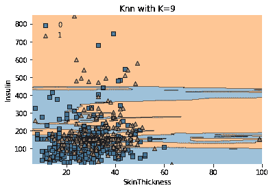
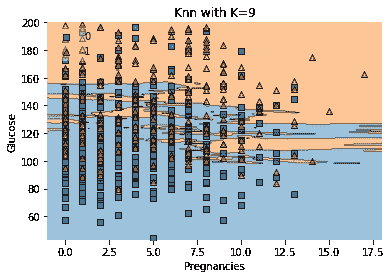

# 皮马印第安人糖尿病-预测和 KNN 可视化

> 原文：<https://towardsdatascience.com/pima-indians-diabetes-prediction-knn-visualization-5527c154afff?source=collection_archive---------14----------------------->

## 使用 KNN 算法的预测具有 74%的接收器操作特征准确度


迈肯齐·约翰逊在 [Unsplash](https://unsplash.com?utm_source=medium&utm_medium=referral) 上拍摄的照片

在印度，糖尿病是一个主要问题。从 1971 年到 2000 年，糖尿病的发病率上升了十倍，从 1.2%上升到 12.1%。据估计，印度有 6130 万 20-79 岁的糖尿病患者(2011 年的预期)。预计到 2030 年，这一数字将上升至 1.012 亿。据报道，印度有 7720 万糖尿病前期患者。2012 年，印度有近 100 万人死于糖尿病。居住在钦奈城市贫民窟的每 4 个人中就有 1 人患有糖尿病，约为 7 %,是全国平均水平的 3 倍。印度三分之一的死亡涉及 60 岁以下的非传染性疾病患者。印度人患糖尿病的平均时间比西方人早 10 年。生活方式的改变导致体力下降，脂肪、糖和活动量增加，卡路里和胰岛素皮质醇水平升高，肥胖和脆弱。2011 年，印度每年因糖尿病花费约 380 亿美元。

参考:[http://www . ArogyaWorld . org/WP-content/uploads/2010/10/ArogyaWorld _ India diabetes _ FactSheets _ CGI 2013 _ web . pdf](http://www.arogyaworld.org/wp-content/uploads/2010/10/ArogyaWorld_IndiaDiabetes_FactSheets_CGI2013_web.pdf)

由 **Hardik** 编码

链接 **Colab** 笔记本:[https://Colab . research . Google . com/drive/1n 4 fngk 0 dwt k 0 qalowcywjbtklxjgs-S？usp =共享](https://colab.research.google.com/drive/1n4FNgK0DwtK0QALoWcyWjBtkCLxjGs-S?usp=sharing)

## 数据集:

**皮马印第安人糖尿病数据库**(根据诊断方法预测糖尿病的发病)

## 数据集源:

https://www.kaggle.com/uciml/pima-indians-diabetes-database UCI 机器学习库:

## 语境

这个数据集来自美国国家糖尿病、消化和肾脏疾病研究所。该数据集的目的是根据数据集中的某些诊断方法来诊断患者是否患有糖尿病。从较大的数据库中选择这些实例受到一些限制。所有患者都是至少 21 岁的皮马印度后裔妇女。

## 内容

数据集包括医学预测值的几个变量和一个目标变量`Outcome`。预测变量包括患者的怀孕次数、身体质量指数水平、胰岛素水平、年龄等。

## 承认

史密斯、J.W .、埃弗哈特、J.E .、迪克森、W.C .、诺尔勒、W.C .、约翰尼斯、R.S. (1988)。[利用 ADAP 学习算法预测糖尿病的发病](http://rexa.info/paper/04587c10a7c92baa01948f71f2513d5928fe8e81)。*《计算机应用与医疗研讨会论文集*(第 261-265 页)。IEEE 计算机学会出版社。

## 灵感

你能建立一个机器学习模型来准确预测数据集中的患者是否患有糖尿病吗？

# 1 导入和加载数据集

**进口**

```
import numpy as np
import pandas as pd# Visualization imports
import matplotlib.pyplot as plt
import seaborn as sns# plotly import for Colab
def configure_plotly_browser_state():
  import IPython
  display(IPython.core.display.HTML('''
        <script src="/static/components/requirejs/require.js"></script>
        <script>
          requirejs.config({
            paths: {
              base: '/static/base',
              plotly: '[https://cdn.plot.ly/plotly-latest.min.js?noext'](https://cdn.plot.ly/plotly-latest.min.js?noext'),
            },
          });
        </script>
        '''))

# plotly import
import plotly.express as pxfrom plotly import __version__
import cufflinks as cf
from plotly.offline import download_plotlyjs,init_notebook_mode,plot,iplot
init_notebook_mode(connected=True)
cf.go_offline()import IPythonIPython.get_ipython().events.register('pre_run_cell', configure_plotly_browser_state)
```

**数据集**

```
# Loading Dataset
df = pd.read_csv('/content/drive/My Drive/dataset/knn/datasets_228_482_diabetes.csv')
df.head()
```


# 2 数据清理

以下各列中' 0 '值没有意义。因此使他们成为 NaN。

```
df[['Glucose','BloodPressure','SkinThickness','Insulin','BMI']] = df[['Glucose','BloodPressure','SkinThickness','Insulin','BMI']].replace(0,np.NaN)df.isnull().sum()
```


```
import missingno as msno
p = msno.bar(df)
```


## 使用 k-NN 通过输入填充空值

```
!pip install impyuteimport sys
from impyute.imputation.cs import fast_knn
sys.setrecursionlimit(100000) #Increase the recursion limit of the OS
# start the KNN training
imputed_training=fast_knn(df[['Glucose','BloodPressure','SkinThickness','Insulin','BMI']].values, k=30)df_t1 = pd.DataFrame(imputed_training,columns=['Glucose','BloodPressure','SkinThickness','Insulin','BMI'])
df[['Glucose','BloodPressure','SkinThickness','Insulin','BMI']] = df_t1[['Glucose','BloodPressure','SkinThickness','Insulin','BMI']]df.isnull().sum()
```


# 3 数据描述和可视化

```
df.info()
```


```
df.describe()
```


```
sns.heatmap(df.corr(),annot=True)
```


```
p = df[df['Outcome']==1].hist(figsize = (20,20))
plt.title('Diabetes Patient')
```


KNN 可视化所有功能用`Outcome`

X = `df[[‘Pregnancies’, ‘Glucose’, ‘BloodPressure’, ‘SkinThickness’, ‘Insulin’,’BMI’, ‘DiabetesPedigreeFunction’, ‘Age’]]`

y = `df[‘Outcome’]`

注:`*0 — Non Diabetic Patient and 1 — Diabetic Patient*`

```
from sklearn.decomposition import PCA
from mlxtend.plotting import plot_decision_regions
from sklearn.svm import SVCclf = SVC(C=100,gamma=0.0001)
pca = PCA(n_components = 2)
X_train2 = pca.fit_transform(X)
clf.fit(X_train2, df['Outcome'].astype(int).values)
plot_decision_regions(X_train2, df['Outcome'].astype(int).values, clf=clf, legend=2)
```


KNN 的特点是互相可视化:

```
from sklearn import datasets, neighbors
from mlxtend.plotting import plot_decision_regionsdef ok(X,Y):
  x = df[[X,Y]].values
  y = df['Outcome'].astype(int).values
  clf = neighbors.KNeighborsClassifier(n_neighbors=9)
  clf.fit(x, y)
  # Plotting decision region
  plot_decision_regions(x, y, clf=clf, legend=2)
  # Adding axes annotations
  plt.xlabel(X)
  plt.ylabel(Y)
  plt.title('Knn with K='+ str(9))
  plt.show()tt = ['Pregnancies', 'Glucose', 'BloodPressure', 'SkinThickness', 'Insulin','BMI', 'DiabetesPedigreeFunction', 'Age']
ll = len(tt)for i in range(0,ll):
  for j in range(i+1,ll):
    ok(tt[i],tt[j])
```

注意:`*0 — Non Diabetic and 1 — Diabetic*`



# 4 数据预处理

数据 **Z** 重新调整为 **μ = 0** 和 **ρ = 1** ，应用此表:


```
from sklearn.preprocessing import StandardScaler
scaler = StandardScaler()scaler.fit(df.drop('Outcome', axis = 1))scaler_features = scaler.transform(df.drop('Outcome', axis = 1))df_feat = pd.DataFrame(scaler_features, columns = df.columns[:-1])# appending the outcome feature
df_feat['Outcome'] = df['Outcome'].astype(int)df = df_feat.copy()
df.head()
```


```
# to reverse scaler transformation#s = scaler.inverse_transform(df_feat)
#df_feat = pd.DataFrame(s, columns = df.columns[:-1])
```

# 5 KNN

裂开

```
X = df.drop('Outcome', axis = 1)
y = df['Outcome']from sklearn.model_selection import train_test_splitX_train, X_test, y_train, y_test = train_test_split(  X, y, test_size=0.3, random_state=0)
```

通过获得从 1 到 100 范围内的每个 K 的接收器操作特性精度来检查最佳 K 值

```
import sklearntt = {}
il = []
ac=[]
for  i in range(1,100):
  from sklearn.neighbors import KNeighborsClassifierknn = KNeighborsClassifier(n_neighbors=i)knn.fit(X_train,y_train)y_pred = knn.predict(X_test)from sklearn.metrics import accuracy_score
  il.append(i)
  ac.append( sklearn.metrics.roc_auc_score(y_test,y_pred) )tt.update({'K':il})
  tt.update({'ROC_ACC':ac})vv = pd.DataFrame(tt)
vv.sort_values('ROC_ACC',ascending=False,inplace=True,ignore_index=True)
vv.head(10)
```


对应 K 值的前 10 个最佳 ROC 准确度

选择“k = 9”

```
from sklearn.neighbors import KNeighborsClassifierknn = KNeighborsClassifier(n_neighbors=9)knn.fit(X_train,y_train)y_pred = knn.predict(X_test)from sklearn.metrics import classification_report
print(classification_report(y_test,y_pred))
```


```
from sklearn.metrics import confusion_matrix
print(confusion_matrix(y_test,y_pred))
sns.heatmap(confusion_matrix(y_test,y_pred),annot=True)
```


```
from sklearn.metrics import roc_curve
plt.figure(dpi=100)
fpr, tpr, thresholds = roc_curve(y_test, y_pred)
plt.plot(fpr,tpr,label = "%.2f" %sklearn.metrics.roc_auc_score(y_test,y_pred))
plt.legend(loc = 'lower right')plt.xlim([0.0, 1.0])
plt.ylim([0.0, 1.0])
plt.title('ROC curve for Diabetes classifier')
plt.xlabel('False positive rate (1-Specificity)')
plt.ylabel('True positive rate (Sensitivity)')plt.grid(True)
```


```
import sklearn
sklearn.metrics.roc_auc_score(y_test,y_pred)
```

`0.7399724565329662`

```
data = {'test':y_test.values.ravel(),'pred':y_pred.ravel(),'number':np.arange(0,len(y_test))}pt = pd.DataFrame(data)pt.iplot(
            kind='scatter',
            x='number',
            y=['test','pred'], 
            color=['white','yellow'],
            theme='solar',
            mode='lines+markers'
          )
```

