# 解释了管道、列转换器和功能联合

> 原文：<https://towardsdatascience.com/pipeline-columntransformer-and-featureunion-explained-f5491f815f?source=collection_archive---------2----------------------->

## 他们做什么，何时使用

这三个强大的工具，对于任何想掌握使用 [*sklearn*](https://scikit-learn.org/stable/) 的人来说，都是必须知道的。因此，在建立机器学习模型时，学会如何有效地使用这些方法至关重要。

在我们开始之前，让我们首先在两个术语上达成一致:

*   **Transformer:** [*一个 transformer* 是指用](https://scikit-learn.org/stable/data_transforms.html) `[fit](https://scikit-learn.org/stable/data_transforms.html)()` [和](https://scikit-learn.org/stable/data_transforms.html) `[transform](https://scikit-learn.org/stable/data_transforms.html)()` [方法清理、缩小、扩展或生成特征](https://scikit-learn.org/stable/data_transforms.html)的对象。简而言之，转换器可以帮助您将数据转换为机器学习模型所需的格式。`OneHotEncoder`和`MinMaxScaler`就是变形金刚的例子。
*   **估计器:** *一个* *估计器*是指一个机器学习模型*。*是用`fit()`和`predict()`方法的对象。在这篇文章中，我们将交替使用评估者和模型。这里有一些估计量的例子。

马丁·桑切斯在 [Unsplash](https://unsplash.com?utm_source=medium&utm_medium=referral) 上拍摄的照片

# 0.设置

如果你想在你的电脑上跟着代码走，确保你已经安装了 pandas，seaborn 和 sklearn。我已经在 Jupyter Notebook 中使用并测试了 Python 3.7.1 中的脚本。

让我们导入所需的包和餐馆小费的数据集。关于这个数据集的细节，包括数据字典，可以在这里找到[(这个源实际上是针对 R 的，但它似乎指的是同一个底层数据集)。](https://vincentarelbundock.github.io/Rdatasets/doc/reshape2/tips.html)

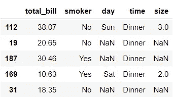

使用少量的记录可以很容易地监控每一步的输入和输出。因此，我们将只使用数据集中的 5 条记录作为样本。

# 1.管道

假设我们想要使用*吸烟者*、*日*和*时间*列来预测*总账单。*我们将删除 *size* 列，并首先对数据进行分区:

通常，原始数据不处于我们可以直接将其输入机器学习模型的状态。因此，将数据转换为模型可接受且有用的状态成为建模的必要前提。让我们做以下转换作为准备:

1.  用' missing '估算缺失值
2.  一次性编码它们

有一种方法可以完成这两个步骤:

您可能已经注意到，当映射回测试数据集的列名时，我们使用了来自训练数据集的列名。这是因为我更喜欢使用数据中的列名，这些数据是转换器被训练的数据。然而，如果我们使用测试数据集，它会给出相同的结果。

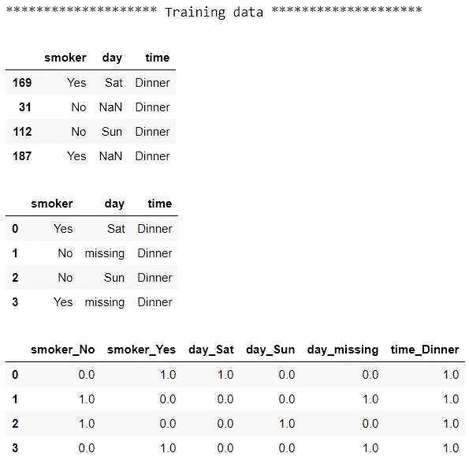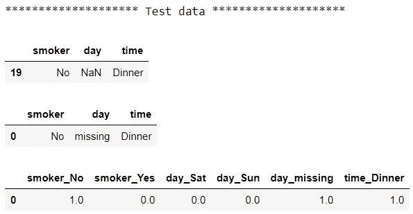

对于每个数据集，我们首先看到原始数据，然后是插补后的输出，最后是编码后的输出。这种方法可以完成工作。然而，我们手动地将上一步的输出作为输入提供给下一步，并且有多个中间输出。我们还必须对测试数据重复每一步。随着步骤数量的增加，维护起来会变得更加繁琐，也更容易出错。我们可以用`Pipeline`编写更精简的代码:

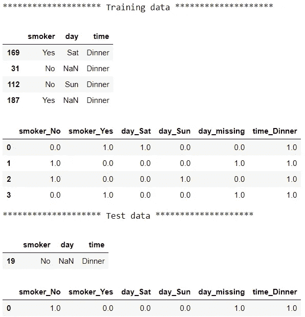

使用`Pipeline`时，每一步都将其输出作为输入传递给下一步。因此，我们不必手动跟踪数据的不同版本。这种方法为我们提供了完全相同的最终输出，但代码更加优雅。

查看了转换后的数据后，是时候在我们的示例中添加一个模型了。让我们调整代码，为第一种方法添加一个简单的模型:

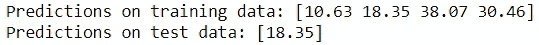

我们将对管道方法做同样的事情:

你可能已经注意到，一旦我们训练了一条管道，做预测是多么简单。调用一行代码:`pipe.predict(X)`对原始数据进行转换，然后返回一个预测。也很容易看出步骤的顺序。让我们直观地总结一下这两种方法:

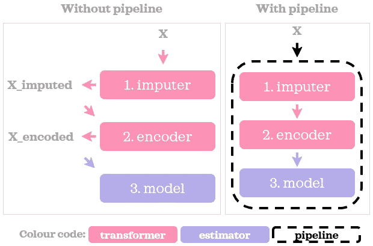

作者图片

使用`Pipeline`不仅可以组织和简化你的代码，还有很多其他的好处，下面是其中的一些:

1.  **微调管道的能力:**在构建模型时，您是否曾经不得不后退一步，尝试不同的方法来预处理数据并再次运行模型，以查看预处理步骤中的调整是否提高了模型的适用性？优化模型时，cogs 不仅存在于模型超参数中，还存在于预处理步骤的实现中。考虑到这一点，当我们有一个统一变压器和估计器的单一管道对象时，我们能够微调整个管道的超参数，包括变压器和具有`GridSearchCV`或`RandomizedSearchCV`的估计器。
2.  **更容易部署:**在训练模型时用于准备数据的所有转换步骤也应该应用于生产环境中进行预测时的数据。当我们训练一个`Pipeline`时，我们训练一个包含数据转换器和模型的单一对象。一旦经过训练，这个`Pipeline`对象可以用于更平滑的部署。

# 2.列变压器()

在前面的例子中，我们以同样的方式估算和编码所有的列。然而，我们经常需要对不同的列组应用不同的变压器组。例如，我们希望将`OneHotEncoder`仅应用于分类列，而不是数字列。这就是`ColumnTransformer`的用武之地。这一次，我们将对数据集进行分区，保留所有列，这样我们既有数字特征又有分类特征。

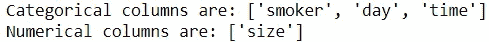

我们已经根据数据类型将特性分成了两组。可以根据数据的适当情况进行列分组。例如，如果不同的预处理管道更适合分类列，那么分类列可以进一步分成多个组。

上一节的代码现在不再有效，因为我们有多种数据类型。让我们来看一个例子，在这个例子中，我们使用`ColumnTransformer`和`Pipeline`在存在多种数据类型的情况下进行与之前相同的转换。

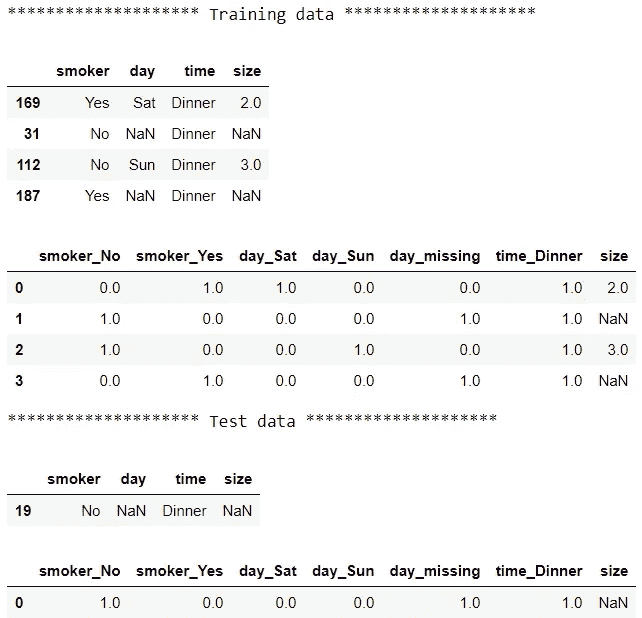

分类列的输出与上一节的输出相同。唯一不同的是这个版本多了一列:*大小*。我们已经将`cat_pipe`(之前在第 1 节中称为`pipe`)传递给`ColumnTransformer`来转换分类列，并指定`remainder='passthrough'`保持剩余的列不变。

如果也转换数字列不是很好吗？特别是，让我们用中值*大小*估算缺失值，并在 0 和 1 之间缩放:

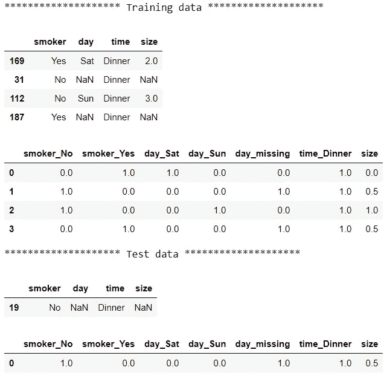

现在所有的列都是估算的，范围在 0 和 1 之间。使用`ColumnTransformer`和`Pipeline`，我们将数据分成两组，对每组应用不同的管道和不同的变压器组，然后将结果粘贴在一起:

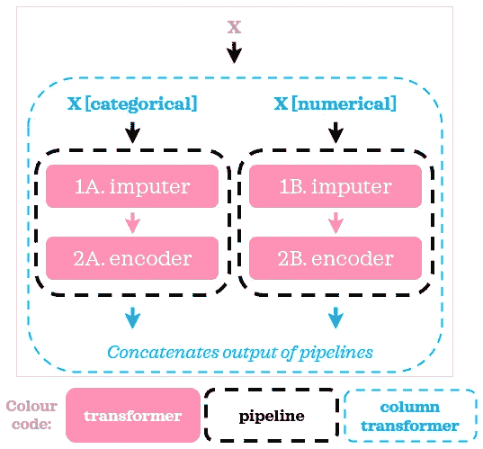

作者图片

尽管在我们的示例中，数字管道和分类管道中有相同数量的步骤，但是管道中可以有任意数量的步骤，因为它们彼此独立。现在，让我们在示例中添加一个模型:

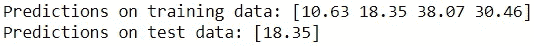

为了将`ColumnTransformer`中指定的预处理步骤与模型放在一起，我们在外部使用了一个`Pipeline`。这是它的视觉表现:

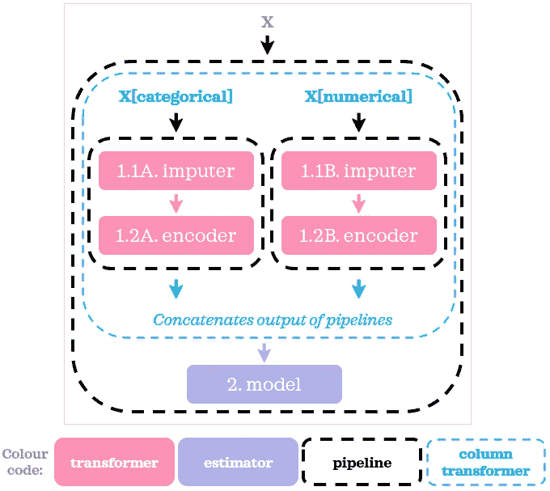

作者图片

当我们需要对不同的列子集进行不同的操作时,`ColumnTransformer`很好地补充了`Pipeline`。

# 3.功能联盟

*本节中省略了代码后的输出，因为它们与第 2 节中的输出相同。列变压器。*

`FeatureUnion`是另一个有用的工具。它能够做`ColumnTransformer`刚刚做的事情，但是方式更长:

我们可以认为`FeatureUnion`创建了数据的副本，并行转换这些副本，然后将结果粘贴在一起。这里的术语“复制”与其说是一个技术参考，不如说是一个帮助概念化的类比。

在每个管道的开始，我们添加了一个额外的步骤，在那里我们使用一个定制的转换器选择相关的列:在第 14 行和第 19 行的`ColumnSelector`。下面是我们如何直观地总结上面的脚本:

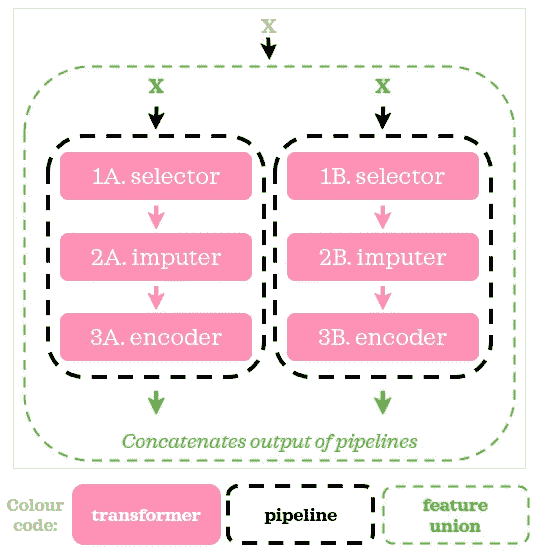

作者图片

现在，是时候向脚本添加一个模型了:

它看起来和我们用`ColumnTransformer`做的非常相似。

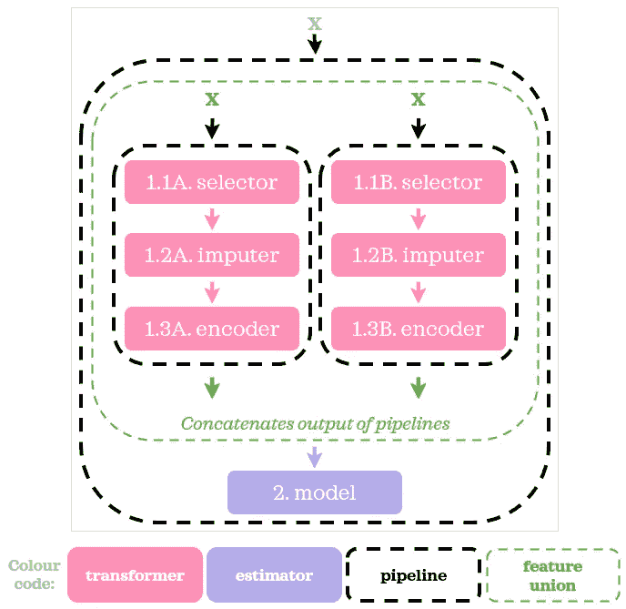

作者图片

如本例所示，使用`FeatureUnion` 比使用`ColumnTransformer`更加冗长。因此，在我看来，在类似的情况下最好使用`ColumnTransformer`。不过，`FeatureUnion` 绝对有它的位置。如果你曾经需要以不同的方式转换相同的输入数据，并把它们作为特征使用，`FeatureUnion`就是其中之一。例如，如果您正在处理一个文本数据，并且既想对数据进行 tf-idf 矢量化，又想提取文本长度，`FeatureUnion`是一个完美的工具。这里有一篇专门的文章: [*FeatureUnion，ColumnTransformer & Pipeline，用于预处理文本数据*](/featureunion-columntransformer-pipeline-for-preprocessing-text-data-9dcb233dbcb6)

# 4.摘要

你可能已经注意到了，`Pipeline`是超级巨星。`ColumnTransformer`和`FeatureUnion`是与`Pipeline`一起使用的附加工具。`ColumnTransformer`更适合我们并行分而治之，而`FeatureUnion`允许我们对相同的输入数据并行应用多个转换器。下面是一个简单的总结:

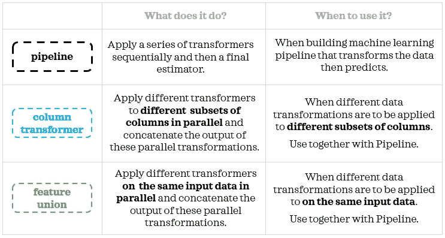

作者图片

*您想要访问更多这样的内容吗？媒体会员可以无限制地访问媒体上的任何文章。如果您使用* [*我的推荐链接*](https://zluvsand.medium.com/membership)*成为会员，您的一部分会费将直接用于支持我。*

照片由[杰瑞米·托马斯](https://unsplash.com/@jeremythomasphoto?utm_source=medium&utm_medium=referral)在 [Unsplash](https://unsplash.com?utm_source=medium&utm_medium=referral) 上拍摄

谢谢你看我的帖子。希望这篇文章能帮助你更多地了解这些有用的工具。我希望你能在你的数据科学项目中使用它们。如果你感兴趣，这里有我的一些帖子的链接:

◼ [FeatureUnion，ColumnTransformer &用于预处理文本数据的管道](/featureunion-columntransformer-pipeline-for-preprocessing-text-data-9dcb233dbcb6)
◼ [用 Scikit 创建自定义变形器的两种方法——学习](/two-ways-to-create-custom-transformers-with-scikit-learn-b9089acacd37)
◼[python 中的探索性文本分析](/exploratory-text-analysis-in-python-8cf42b758d9e)
◼[python 中的预处理文本](/preprocessing-text-in-python-923828c4114f)
◼[python 中的情感分类](/sentiment-classification-in-python-da31833da01b)
◼ [给熊猫用户的 5 个提示](/5-tips-for-pandas-users-e73681d16d17)
️◼ [熊猫中数据聚合的 5 个提示](/writing-5-common-sql-queries-in-pandas-90b52f17ad76)

再见🏃💨