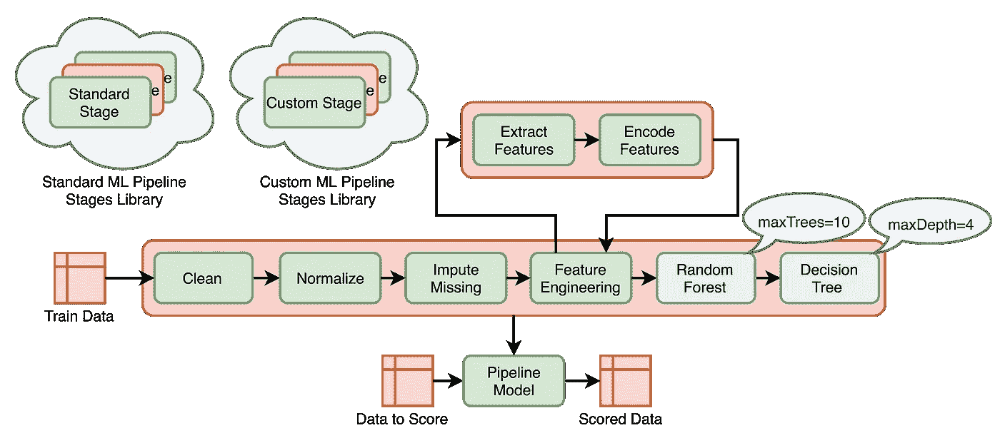
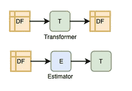
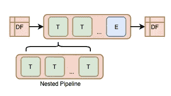

# 利用 Spark ML 进行面向管道的数据分析

> 原文：<https://towardsdatascience.com/pipeline-oriented-data-analytics-with-spark-ml-c664befe1c2d?source=collection_archive---------20----------------------->

作为一名机器学习顾问和敏捷顾问，我对提高大数据分析项目效率的不同方式很好奇。有许多方法可以优化它们，其中包括团队组成、流程、最佳实践、工具等。我想分享我使用机器学习管道的经验，以及它们如何改善机器学习工作流。

我们在各种框架中发现了机器学习管道，如 scikit-learn、Spark 或亚马逊 SageMaker。它们通常用于机器学习工作流程的后期阶段，包括特征编码、训练、预测和参数调整。我想展示如何将这种方法推广到早期阶段，例如特征工程、数据预处理、数据摄取和数据探索。

## 动机

我们见证了数据分析是如何经历巨大变化的。过去，通常是几个博士一起合作，向利益相关者提交一份包含商业见解的报告。今天，数据分析是多个角色的共同努力，例如分析翻译、数据科学家、机器学习工程师、数据工程师、软件工程师，他们更关心模型物流、敏捷、快速上市。从数据洞察到数据产品的整个过程需要适当的协调。当 it 效率低下时，将数据洞察力引入生产可能会有问题。让我们考虑一个有点夸张的例子。

想象一下这样一种情况，数据科学家将他们的新见解(比如 R 或 scikit-learn 脚本)交给数据工程师，让他们投入生产。数据科学家的编码标准不同于数据工程师在生产中使用的编码标准。虽然数据科学家专注于快速原型和可视化，但数据工程师更关注可伸缩性和可维护性。通常，为了让 data insights 投入生产，数据工程师必须使用生产工具(例如 Spark 或 TensorFlow)完全重写它们。当数据科学家审查由数据工程师产生的生产就绪代码时，他们经常发现，结果与他们预期的不同。发生这种情况有多种原因:同一方法在不同工具中的不同实现、沟通不畅或错误。通常，数据科学家必须带头解决这些问题，这可能导致代码再次失去生产准备。在数据科学家和数据工程师之间可能需要几次迭代的交接，直到代码最终可以投入生产并按预期工作。在迭代模型开发期间，同样的故事可能会重复:当模型不断变化，新版本必须经常投入生产时。

如果工作流的所有参与者都使用标准构件来描述他们的数据操作，那么移交过程将会更加顺利。这些构建模块必须能够投入生产，并且足够直观，可以用于实验。然后，机器学习工作流的所有参与者都可以使用它们来简化移交。

## 例子

我们将使用 Kaggle 的[纽约出租车旅行时长挑战作为一个玩具示例来展示面向管道的方法。该挑战的目标是基于各种输入来预测出租车行程持续时间，如接送地理坐标、接送时间、乘客数量和其他一些信息。我们将使用](https://www.kaggle.com/c/nyc-taxi-trip-duration/data) [Spark](https://spark.apache.org/) 来实现机器学习工作流(项目代码可在[这里](https://github.com/bbiletskyy/pipeline-oriented-analytics/))。Spark 具有内置的机器学习管道支持，它是生产就绪的，并且具有足够直观的 Python API 来进行实验。

地理位置在预测出租车行程持续时间中起着重要的作用。使用地理位置时，有时将其离散化并使用像元是有意义的。地理数据处理经常使用非本地库(比如我们的例子中的 [s2sphere](https://s2sphere.readthedocs.io/en/latest/#) )，这使得相关的数据操作不如本地库有效。因此，通常预先计算一些地理位置相关特征值的查找表，以便能够在以后更快地使用它们。行程距离就是这样的特征之一。

让我们看看如何使用 Spark ML 管道来生成距离矩阵，该矩阵将用于快速查找两个单元之间的距离。为了构建这样一个矩阵，我们需要加载、预处理训练数据，并计算用于下车和上车地理位置的单元令牌。测试数据经过类似的处理。然后，在训练和测试数据集被联合之后，为唯一的拾取和放下单元标记对计算球面距离。

要使用 s2sphere 库和 PySpark 计算球面距离，我们需要定义两个用户定义的函数:`cell_token_udf`将地理坐标映射到单元令牌，以及`sphere_distance_udf`计算一对单元令牌之间的球面距离。

在我们可以使用`cell_token_udf`生成单元令牌之前，我们需要首先从`train.csv`加载训练数据，选择需要的列，重命名其中的一些列并规范化类型。

然后，对测试数据`test.csv`重复相同的数据操作序列。

合并数据集后，选择唯一的像元标记对，使用前面介绍的`sphere_distance_udf`来计算球体距离。结果会保存到拼花文件中。

距离矩阵生成的完整示例可在[这里](https://github.com/bbiletskyy/pipeline-oriented-analytics/blob/master/src/pipeline_oriented_analytics/script/generate_distance_matrix_old.py)获得。

上面的代码有一些缺点。它不太容易维护:部分领域逻辑缺乏清晰的边界，并且分散在代码中。这个解决方案也不是非常可重用:想想它的一部分如何在不同的上下文中再次使用。此外，这段代码不容易测试，因为将它分解成可测试的单元不是很清楚。

面向管道的方法可以用来改善这些问题。

## 面向管道的方法

像面向对象范例中的对象或函数范例中的函数一样，面向管道方法的基本元素是管道阶段。这种方法基于两个基本原则，这两个原则定义了管道阶段以及如何组合它们:

流水线阶段

链接和嵌套

1.  数据操作用两种流水线阶段来描述: ***变换器*** 将*数据帧*映射到*数据帧，以及* ***估计器*** 将*数据帧*映射到*变换器*。
2.  管道阶段可以链接成管道，管道也是管道阶段。

让我们看看如何使用这个想法来改进前面提出的距离矩阵生成解决方案。

在前面的实现中有一个重复的逻辑，我们首先预处理训练数据集，然后用测试数据集重复它。我们可以将复制的逻辑实现为一个独立的管道，然后将其作为主管道中的一个阶段进行重用。

让我们定义一个函数，它基于输入参数(单元格大小指示器、要选择和重命名的列名以及要规范化的列类型)构建出行数据预处理管道。

现在，我们可以将上面定义的预处理管道嵌套在主管道中。

完整的例子在这里[有。](https://github.com/bbiletskyy/pipeline-oriented-analytics/blob/master/src/pipeline_oriented_analytics/script/generate_distance_matrix.py)

这个实现产生的结果与前一个相同，但是它更紧凑。它由以下可重复使用的组件组成:

*   `Pipe`是变形金刚的链条，也是变形金刚。它是`pyspark.ml.PipelineModel`的简化实现，后者是一个只包含转换器(没有估算器)的管道。与`PipelineModel`不同的是，`Pipe`由于安全原因不能被持久化(这将在下面更详细地讨论)。
*   `SelectColumns`–是一个转换器(`pyspark.ml.Transformer`)，它根据给定的列名列表选择列。
*   `RenameColumns`–是一个转换器，它将给定的列字典中的旧列重命名为新名称。
*   `NormalizeColumnTypes`–是一个转换器，根据给定的列名字典将列类型转换为列类型。
*   `CellToken`–是一个转换器，它根据地理坐标、给定的像元大小级别(级别越高，生成的像元越小)、纬度和经度列名称以及包含结果的新列的名称来计算的像元标记。
*   `Union`–是一个将两个数据帧结合在一起的转换器。
*   `DropDuplicates`–是一个移除重复行的转换器。
*   `SphereDistance`–是一个 transformer，它添加了一个新列，该列具有基于 s2sphere 库为一对单元标记计算的球体距离，给出了拾取和放下单元标记的名称。
*   `SaveToParquet`–是一个将数据帧保存到拼花文件的转换器。
*   `CsvDataFrame`–是与`csv`文件相关联的`pyspark.sql.DataFrame`的实现。

后一种解决方案中的大部分工作都是由变压器完成的。下面列出了其中一个示例(完整的示例可在[这里](https://github.com/bbiletskyy/pipeline-oriented-analytics/blob/master/src/pipeline_oriented_analytics/transformer/rename_columns.py)找到)。

范围狭窄的组件更容易测试。变压器测试示例如下所示(完整代码可在此处[获得](https://github.com/bbiletskyy/pipeline-oriented-analytics/blob/master/tests/pipeline_oriented_analytics/transformer/rename_columns_test.py))。

如您所见，提议的面向管道的解决方案由以下组件组成:

*   范围狭窄的 —每个组件只负责一件事
*   *模块化* —组件是松散耦合的
*   *可测试的* —范围狭窄的组件易于测试
*   *可维护的* —构建模块的变化对管道的其余部分有可预测的影响
*   *可重用* —组件可以在不同的环境中轻松使用
*   *实验就绪* —组件具有直观的 API，在实验过程中易于在 Jupyter 笔记本中使用
*   *生产就绪* —组件是可扩展的，可以在生产环境中执行

## 限制

面向管道的实现也有局限性。我们来讨论其中的一些。

**坚持**。管道阶段以及管道本身在 Spark ML 中是持久的。例如，持久性允许在训练后保存拟合的管道及其所有参数，并在以后加载它们以服务于预测。持久性尤其是通过使用 Spark 的 Params API 实现的。Spark 支持许多可持久的参数类型，可以在可持久的管道阶段使用。我们在上面的转换器中使用了不支持的参数类型，比如字典(在`RenameColumns`中)或者数据帧(在`Union`中)，这使得它们不可持久。我们引入了`Pipe`,专门用来构建非持久化的变形器，并限制持久化的能力。为了使定制转换器持久化，还需要做一些额外的工作(持久化定制转换器的一个例子在这里的[和这里](https://github.com/bbiletskyy/pipeline-oriented-analytics/blob/master/src/pipeline_oriented_analytics/transformer/drop_columns.py)的[中可用)。但是，对于很多变形金刚来说，坚持是永远不需要的。](https://github.com/bbiletskyy/pipeline-oriented-analytics/blob/master/src/pipeline_oriented_analytics/script/predict.py)

**验证**。上述实现中缺少的一个重要方面是管道阶段的模式验证。它可以极大地帮助早期识别管道缺陷，这在处理一系列耗时耗资源的大数据转换时会很有帮助。Spark native Scala [API](https://spark.apache.org/docs/2.3.0/api/java/org/apache/spark/ml/PipelineStage.html#transformSchema-org.apache.spark.sql.types.StructType-) 提供了验证功能，但是我找不到通过 Python API 使用它们的简单方法。

**副作用**。在建议的实现中存在具有副作用的变压器，`SaveToParquet`是其中之一。根据定义，转换器将数据帧映射到数据帧，这就很自然地将它们视为数据帧上的纯函数。然而，Spark 中的数据帧操作无论如何都是使用 SparkContext 执行的，这本身就自动暗示了副作用。

**测试**。正如我们所看到的，窄范围的转换器很容易被单元测试覆盖。但是在基础设施方面，这样的测试更类似于集成测试，因为它们使用 SparkContext 来运行转换。SparkContext 的初始化需要时间，与常规的单元测试相比，这使得此类测试明显变慢。为了使测试运行得更快，SparkContext 可以在测试之间共享，从测试的角度来看，这并不总是一个好主意，因为测试应该独立地运行。

**通用**。在创建自定义转换器时，面向管道的方法意味着一些额外的开销。这种方法不太适用于新业务领域中的小型单次工作项目。这种方法在共享的业务领域环境中变得有效，在这种环境中，不同的团队重用特定于领域的数据操作。面向管道的范例更有利于大型的长期运行的项目，其中多个角色在模型改进上迭代地工作，在这种情况下，模型经常被投入生产，并且上市时间是一个重要的因素。

## 结论

正如我们所见，面向管道的方法适用于机器学习工作流程的所有阶段。使用一组统一的构件使得工作流阶段之间的移交更加有效。记住它们的局限性，机器学习管道可以用来声明性地描述复杂的特定领域的数据操作。

我将在下一篇[文章](https://medium.com/@borys.biletskyy/pipeline-oriented-data-analytics-with-spark-ml-part-2-3088d7a3c1b5)中继续探索面向管道的方法，我将很高兴知道你如何应对**动机**部分中描述的挑战。

## 参考

[1] [Spark ML 管道文件](https://spark.apache.org/docs/latest/ml-pipeline.html)

[2] Holder Karau，[为定制车型扩展 Spark ML](https://www.youtube.com/watch?v=n8lIqL8w1fg)(2017)