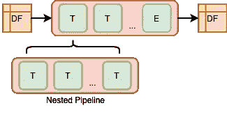

# 使用 Spark ML 进行面向管道的数据分析。第二部分

> 原文：<https://towardsdatascience.com/pipeline-oriented-data-analytics-with-spark-ml-part-2-3088d7a3c1b5?source=collection_archive---------26----------------------->


我们继续探索基于 Spark ML 的面向管道的方法，这在之前的[部分](https://medium.com/@borys.biletskyy/pipeline-oriented-data-analytics-with-spark-ml-c664befe1c2d)中有简要介绍。作为一个玩具示例，我们继续使用 Kaggle [挑战](https://www.kaggle.com/c/nyc-taxi-trip-duration/)，其目标是根据接送时间、接送地理坐标、乘客数量和其他一些输入来预测出租车行程持续时间。我们的目标是在 toy ( [github](https://github.com/bbiletskyy/pipeline-oriented-analytics) )项目上展示 ML 管道如何通过使用数量有限的生产就绪构建模块来提高机器学习工作流的效率，这些模块足够灵活，可以由不同的工作流参与者在不同的工作流阶段应用。

在我们继续之前，让我们回忆一下什么是面向管道的方法。

## 面向管道的数据分析

像 OOP 中的对象或 FP 中的函数一样，管道阶段是面向管道范例的核心元素。这种范式基于两个基本原则，一个是介绍构建模块，另一个是定义构建模块的方式，这些原则是:



1.  数据操作用两种流水线阶段来描述: ***变换器*** 将数据映射到数据，以及 ***估计器*** 将数据映射到*变换器*；
2.  管道阶段可以链接成管道，管道也是管道阶段。

正如我们将看到的，这种简单的方法可以非常有表现力地描述模型生命周期各个阶段的数据操作。

## **用 ML 流水线进行数据预处理**。

在简介[部分](https://medium.com/@borys.biletskyy/pipeline-oriented-data-analytics-with-spark-ml-c664befe1c2d)中，我们展示了当我们必须构建距离矩阵时，如何在数据预处理阶段使用 ML 管道。这个距离矩阵应该用于快速行程距离查找，以避免昂贵的调用非本地的 Spark 外部的 [s2sphere](https://s2sphere.readthedocs.io/en/latest/) 库。

现在让我们看看如何在数据预处理期间使用 ML 管道从距离矩阵中查找行程距离(完整的示例可在此处[获得](https://github.com/bbiletskyy/pipeline-oriented-analytics/blob/master/src/pipeline_oriented_analytics/script/pre_process.py))。

这里，首先，我们选择、重命名和归一化输入数据框的列，该数据框是从 csv 文件加载的。然后，我们添加具有 14 级拾取和放下单元标记的列(级别越高，单元的面积越小)。之后，生成的像元令牌用于将输入数据框与距离矩阵连接起来，距离矩阵存储在拼花文件中。最后，我们删除一些列，并将结果保存到 parquet 文件中。

如您所见，我们在之前的[部分](/pipeline-oriented-data-analytics-with-spark-ml-c664befe1c2d)的矩阵生成示例中所熟悉的相同变压器被反复使用。通过重复使用变压器，我们的管道变得更加安全，因为我们使用经过测试、记录在案且可投入生产的组件。

## 面向管道方法的一些应用

在我们的例子中，我们展示了 ML 管道的各种应用。其中一些在之前的[部分](/pipeline-oriented-data-analytics-with-spark-ml-c664befe1c2d)已经讨论过了。让我们简要地突出它们。

**数据帧扩展。**面向管道的方法基于一些参与者(数据帧、管道和管道阶段)，我们不想通过添加更多参与者来使该模型变得复杂。因此一些重要的操作被实现为`pyspark.sql.DatFrame`的扩展。其中:`CsvDataFrame` —从 csv 文件中加载数据，`ParquetDataFrame` —从 parquet 文件中加载数据，`TempViewDataFrame` —使用临时视图(下面将详细介绍)。

**日志记录、监控和其他副作用**。具有副作用的 ML 管道在之前的[部分](/pipeline-oriented-data-analytics-with-spark-ml-c664befe1c2d)中已经讨论过，以及一些关于其使用的问题。然而，当包装在身份转换器中时，各种副作用会非常有用。其中包括:持久性、日志记录、监控、数据验证、重新分区、检查点、缓存等。在正常情况下，它们中的每一个都会中断管道流，但是，作为管道阶段，它们自然可以用在 ML 管道中。在我们的例子中，我们使用`SaveToParquet`转换器来保存数据帧。

**超越线性**。根据定义，ML 流水线是线性的，流水线阶段只接受一个输入数据帧，并且只产生一个结果数据帧或变换器。在我们的例子中，通过使用数据帧作为构造函数参数，我们能够在一个单独的转换器中组合几个数据帧(一些问题在之前的[部分](/pipeline-oriented-data-analytics-with-spark-ml-c664befe1c2d)中已经讨论过)。我们之前用的`Union`和`Join`变压器就是那种变压器。

**使用 ML 管道进行数据探索**。我们看到了如何在数据预处理过程中使用面向管道的方法。尽管如此，没有什么能阻止我们在 Jupyter 笔记本的数据探索中使用相同的想法(这里有一些例子)。经过大量的聚合计算后，spark 数据帧可以转换为 pandas 数据帧，以便进一步可视化和分析。数据概要分析就是这样一种用例，尤其是在对新数据源重复执行大量标准数据质量检查时。我们可以想象变压器将数据帧映射到标准数据质量报告。它可能看起来像这样:

```
MissingValuesReport().transform(ParquetDataFrame(path, spark)) \
    .toPandas().set_index(index_col).plot()
```

现在，让我们考虑一些面向管道方法的新用例，我们还没有遇到过。

## 条件 ML 管道

有时我们不得不中断管道的自然、逻辑流程，因为我们需要在一个 *if-then-else* 子句中检查某些条件。例如，机器学习有两个主要阶段:训练和预测。通常，相关的数据操作非常相似，但不完全相同。因此，将训练和预测管道放在一起以保持它们同步并避免代码重复是很方便的。

让我们考虑由三个步骤组成的特征提取流程:1)特征提取；2)标签提取(应该仅在训练期间发生，因为标签在预测期间不可用)；3)清理并保存。

在这种情况下，ML 管道有助于减少代码重复。让我们首先考虑一种简单的方法，其中我们定义了对应于上述三个步骤的三个管道。稍后，当组装火车或预测主要特征工程管线的版本时，这些管线被用作管线阶段。如果标签列不可用，则在预测过程中装配特征工程管线时会省略标签提取管线。

由于管道嵌套，我们设法减少了代码重复。然而，与此同时，特征工程流程的自然逻辑被分成三部分，这使得流水线定义不太容易理解。此外，一旦训练流和预测流被分离，我们需要额外注意在每次改变它们中的任何一个时保持它们的同步。

我们能在不中断管道流的情况下达到同样的结果吗？下面的例子展示了如何在面向管道的方法中实现一个 *if-then-else* 子句，并将其用于特性工程(完整的[例子](https://github.com/bbiletskyy/pipeline-oriented-analytics/blob/master/src/pipeline_oriented_analytics/script/extract_features.py))。

这里的`[IF](https://github.com/bbiletskyy/pipeline-oriented-analytics/blob/master/src/pipeline_oriented_analytics/pipe/IF.py)`是一种特殊类型的流水线，在这里根据条件执行转换。条件被定义为谓词，`[IF](https://github.com/bbiletskyy/pipeline-oriented-analytics/blob/master/src/pipeline_oriented_analytics/pipe/IF.py)` 接受它作为构造函数的参数。它可以是任何类型的`Callable[[DataFrame], bool]`谓词，在我们的例子中,`in_train_phase`谓词检查流程是否处于训练阶段。与前一种情况类似，这是通过检查输入数据框列中是否存在标签列`duration_sec`来实现的:

```
def in_training_phase(df: DataFrame) -> bool:
    return 'duration_sec' in df.columns
```

基于`IF`管道的实现看起来可读性更好，也更容易维护。完整的管道流是可见的，这使得管道定义更容易理解。训练流和预测流放在一起，这有助于保持它们的同步。

## 作为管道变量的数据帧

在某些情况下，我们需要将一个数据框与其先前的版本连接起来，只需进行几次变换。通常，这是通过引入临时变量来存储数据帧快照来实现的。但随之而来的是打破原有管道自然流动的代价。

上面特性工程管道中的`RequestCount`变压器就是这样一个例子。这个转换器的目的是添加一个列，其中包含某个时间段内某个单元中的出租车请求数。让我们首先考虑一个简单的实现，其中对应的`_transform`方法如下所示。

在这里，我们创建了几个临时的时间相关列，这些列稍后将与单元标记列一起用于分组和连接。然后，使用聚合进行分组，以计算请求数。最后，在连接中间结果之后，删除临时列。

如果转换器添加新列而不更改现有列中的数据，则链接转换器很容易。在使用聚合进行分组的情况下，情况并非如此，因为此类操作会显著改变原始数据框的结构。

下面的例子展示了实现`RequestCount`转换器的另一种面向管道的方法。它利用 Spark 的临时视图来存储数据帧快照，而不是使用数据帧变量(完整的[示例](https://github.com/bbiletskyy/pipeline-oriented-analytics/blob/master/src/pipeline_oriented_analytics/transformer/feature/request_count.py))。

`SaveToTempView`副作用关联转换器将数据帧保存为 Spark 会话的临时视图。一种特殊类型的数据帧`TempViewDataFrame`用于从临时视图中访问数据。临时视图被另一个副作用关联变压器`DropTempView`丢弃。

面向管道的实现更易于维护，因为它是基于经过测试、有文档记录和生产就绪的构建块。

## **ML 管道中的循环**

我没有机会将这个想法付诸实践，但是循环加上条件语句和管道变量为我们提供了一个非常强大的计算模型。这个模型应该有足够的表达能力来描述机器学习算法中的数据转换。机器学习方法常用作黑箱；抽象出了它们的实现细节。使用 ML 管道描述模型训练过程的数据操作将是很好的；这将使我们能够更容易地建立定制的机器学习方法，并为我们提供一个统一的形式，可以在机器学习工作流程的所有阶段使用。

## **结论**

我们在 ML 工作流程的不同阶段看到了面向管道方法的各种应用。这种方法通过提供一种组织、测试和维护相关数据操作的策略，可以使 ML 工作流开发更加有效。这对于共享公共业务领域的项目尤其有益，在这些领域中重用定制的特定于领域的管道阶段的机会更高。

## 参考

[1] [Spark ML 管道文件](https://spark.apache.org/docs/latest/ml-pipeline.html)

[2] Holder Karau，[为定制车型扩展 Spark ML](https://www.youtube.com/watch?v=n8lIqL8w1fg)(2017)