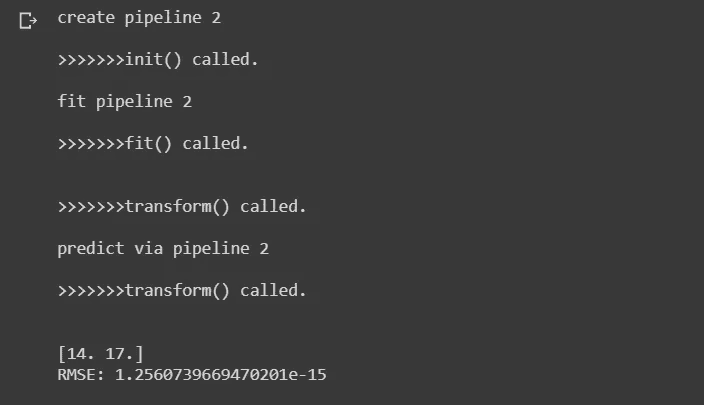
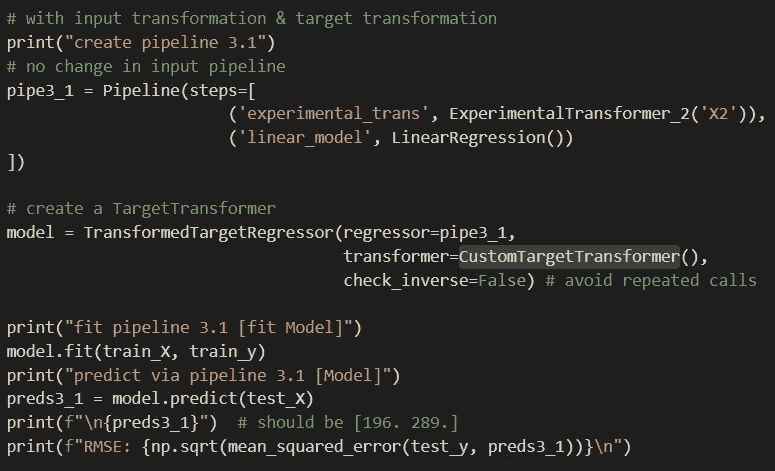

# scikit-learn 中的管道和定制变压器:分步指南(带 Python 代码)

> 原文：<https://towardsdatascience.com/pipelines-custom-transformers-in-scikit-learn-the-step-by-step-guide-with-python-code-4a7d9b068156?source=collection_archive---------0----------------------->

## 了解 scikit 的基本知识和工作方式——从头开始学习管道，这样您就可以构建自己的管道。

本文将涵盖:

1.  为什么另一个关于管道的教程？
2.  从头开始创建一个自定义转换器，以包含在管道中。
3.  修改和参数化变压器。
4.  通过*TransformedTargetRegressor*定制目标转换。
5.  将所有东西链接在一个管道中。
6.  链接到[从 GitHub 下载](https://github.com/HCGrit/MachineLearning-iamJustAStudent/tree/master/PipelineFoundation)完整代码。

> 对于那些喜欢这种格式的人来说，最后有一个代码的[视频演示](https://youtu.be/mOYJCR0IDk8)。我个人喜欢书面教程，但过去也有人要求视频版本，所以就有了。

图片来自 [Pixabay](https://pixabay.com/?utm_source=link-attribution&amp;utm_medium=referral&amp;utm_campaign=image&amp;utm_content=681175) 的[罗布森·马查多](https://pixabay.com/users/Robzor-840419/?utm_source=link-attribution&amp;utm_medium=referral&amp;utm_campaign=image&amp;utm_content=681175)

# **为什么还要有关于管道的教程？**

既然你在这里，很有可能你已经知道管道通过预处理数据使你的生活变得简单。我也听说了，并试图在我的代码中实现一个。

> 对我能找到的关于这个主题的几个很棒的教程的大声呼喊！我建议你在这篇文章之前或之后浏览一下:

一、[*https://towards data science . com/custom-transformers-and-ml-data-pipelines-with-python-20 ea 2 a 7 ADB 65*](/custom-transformers-and-ml-data-pipelines-with-python-20ea2a7adb65)
二、[*https://machine learning mastery . com/how-to-transform-target-variables-for-regression-with-scikit-learn*](https://machinelearningmastery.com/how-to-transform-target-variables-for-regression-with-scikit-learn/)
三、[*http://Zac Stewart . com/2014/08/05/pipelines-of-feature unions-of-pipelines . html*](http://zacstewart.com/2014/08/05/pipelines-of-featureunions-of-pipelines.html)

在跟随教程和使用标准的输入、缩放、功率变换等时，一切都很好。但是后来我想编写应用于数据的特定逻辑，并且不太确定什么在哪里被调用？

我试图寻找一个清晰的解释，说明构造函数 fit()，transform()函数何时被调用，但是找不到一个简单的例子。因此，我决定一步一步地完成代码，并向任何想从头开始理解它的人展示我的理解。

那我们开始吧！

# 从头开始创建自定义转换器，以包含在管道中

创建数据框架

为了更好地理解示例，我们将创建一个数据集来帮助我们更好地探索代码。

上面的代码创建了遵循等式`y = X1 + 2 * sqrt(X2)`的数据。这确保了简单的线性回归模型不能完美地拟合它。

让我们看看有哪些预测结果抛给了我们:

原始数据的线性回归预测

完美的预测是 14 和 17。预测并不差，但是我们是否可以对输入要素进行一些计算以使预测更好？

输入特征操作后的预测

输入操作使其符合完美的线性趋势(现在是`y=X1+X2`)，从而得到完美的预测。现在，这只是一个例子，但是假设对于一个数据集，你的分析说这样的输入转换是好的，你如何通过管道以一种安全的方式做到这一点。

让我们看一个使用管道拟合的基本 LinearRegression()模型。

带有管道的 LinearRegression()

不出所料，我们得到了与第一次尝试相同的预测。此时的语法非常简单—

1.  我们使用内部有`steps`数组的`Pipeline`类声明了一个`pipe1`变量。该步骤的名称(在本例中为`linear_model`)可以是您选择的任何独特的名称。其后是一个实际的变压器或估计器(在这种情况下，我们的`LinearRegression()`模型)。
2.  像任何其他模型一样，它是根据训练数据拟合的，但是使用了`pipe1`变量。
3.  使用`pipe1`对测试集进行预测，就像您在任何其他模型中所做的那样。

为了执行输入计算/转换，我们将设计一个定制的转换器。

定制输入变压器

我们创建一个类，并将其命名为`ExperimentalTransformer`。我们设计的所有变形金刚都将继承`BaseEstimator`和`TransformerMixin`类，因为它们免费提供给我们已有的方法。你可以在我上面提供的文章链接中读到更多关于它们的内容。

这里有 3 种方法可以处理:

1.  `__init__`:这是构造器。初始化管道时调用。
2.  `fit()`:拟合管道时调用。
3.  `transform()`:在管道上使用 fit 或 transform 时调用。

目前，让我们将 print()消息放在 __init__ & fit()中，并将我们的计算写在 transform()中。正如您在上面看到的，我们在那里返回修改后的值。当调用 fit()或 transform()时，所有的输入特征将被传递到`X`。

让我们把它放到一个管道中，看看这些函数被调用的顺序。

管道中的实验变压器

你可以在上面的代码注释中看到，也可以使用更短的 [make_pipeline()](https://scikit-learn.org/stable/modules/generated/sklearn.pipeline.make_pipeline.html) 语法来创建管道。

现在输出:

实验变压器输出

需要注意的 3 件重要事情:

a.__init__ 在我们初始化`pipe2`变量时被调用。

b.**当我们对训练数据拟合管道时，我们的实验转换器的** fit()和 transform()都被调用。这是有意义的，因为这就是模型拟合的工作方式。在尝试预测 train_y 时，您需要变换输入要素。

c.当我们调用 predict(test_X)时，会像预期的那样调用 transform()-在进行预测之前，输入测试要素也需要平方根并加倍。

结果——完美的预测！

# 修改和参数化变压器

B ut..

我们在实验转换器的 transform()函数中假设列名是 X2。我们不要这样做，而是通过构造函数 __init__()传递列名。

这是我们的`ExperimentalTransformer_2`:

向构造函数传递参数

注意保持函数参数和类变量中的参数名完全相同(`feature_name`或任何你选择的名字)。当我们试图转换目标特征(y)时，改变它会导致问题。由于某种原因，它导致了对 __init__ 的双重调用。

我还添加了一个带有默认值的 additional_param，只是为了混淆一下。在我们的例子中，它并不真的需要，而是作为一个可选的参数。

现在创建新管道:

用新管道调用

输出符合预期:

新输出，与以前相同

# 通过 TransformedTargetRegressor 自定义目标转换

W 什么情况下需要做一些前后处理？

考虑一个稍微修改过的数据集:

数据集中的 y 平方

一切照旧，但现在`y`已经摆平。为了将它拟合到一个简单的线性模型中，我们需要在拟合我们的模型之前对`y`求平方根，然后对模型做出的任何预测求平方。

我们可以使用 scikit-learn 的`TransformedTargetRegressor`来指示我们的管道对目标变量执行一些计算和反计算。让我们首先编写这两个函数:

变换和逆变换函数

一个平方根`y`，另一个平方回来。

通过管道调用:

TransformedTargetRegressor 调用

TransformedTargetRegressor 类接受将我们的管道连接到这些新函数的`regressor`、`func`和`inverse_func`参数。

请注意我们现在如何安装`model`，而不是管道。

不过，输出显示了一些有趣且出乎意料的东西:

TargetRegressor 的第一个输出

结果很好，但是您能看到当 fit()被调用时，我们的 target_transform()和 inverse_target_transform()方法是如何被多次调用的吗？这将成为大型项目和复杂管道的开销。处理这个问题所需的更改只是将 TransformedTargetRegressor 的`check_inverse`参数设置为 False。我们将在下一步中这样做，同时寻找另一种处理目标转换的方法——在 TransformedTargetRegressor 中使用`transformer` param，而不是 func 和 inverse_func。

我们可以传递一个内置的转换器或我们自定义的转换器，而不是我们设计的两个函数。定制的转换器看起来与我们之前为我们的管道设计的几乎相同，但是在它里面有一个额外的`inverse_transform`功能。实现如下:

自定义目标变压器

就这样，现在就在我们的 TransformedTargetRegressor 调用中使用它:

用变压器参数调用

输出现在看起来是固定的:

没有重复调用的输出

这里要做的最后一件事。我们将利用[缓存](https://scikit-learn.org/stable/modules/compose.html?highlight=transformedtargetregressor#pipeline-chaining-estimators)来保存计算，并查看如何从外部获取或设置我们的管道参数(如果您想在此基础上应用 GridSearch，稍后将需要这一点)。

get_params()

请注意，如何通过使用名称后跟双下划线`__`来访问管道每个组件的每个参数。

我们将把它们联系在一起，甚至尝试从外部设置一个参数——我们已经传递给构造函数的列名`X2`。

把这一切联系在一起

> 完整代码:[https://github . com/HC grit/machine learning-iamJustAStudent/tree/master/pipeline foundation](https://github.com/HCGrit/MachineLearning-iamJustAStudent/tree/master/PipelineFoundation)
> 
> 代码演练:【https://youtu.be/mOYJCR0IDk8 

代码走查

# 接下来呢？

如果不使用 **FeatureUnion** 或 **ColumnTransformer** ，任何实际的流水线实现都很难完成。我在上面提供的第一个参考链接会带你浏览 FeatureUnions。我发现对 ColumnTransformers 和 FeatureUnions 非常有帮助的参考资料有:

一.[*https://sci kit-learn . org/stable/modules/compose . html # feature union-composite-feature-spaces*](https://scikit-learn.org/stable/modules/compose.html#featureunion-composite-feature-spaces)
二[*https://scikit-learn . org/stable/modules/generated/sk learn . compose . column transformer . html # sk learn . compose . column transformer*](https://scikit-learn.org/stable/modules/generated/sklearn.compose.ColumnTransformer.html#sklearn.compose.ColumnTransformer)

此外，您最终将在您的模型上使用 GridSearch。在这里用管道解释一下:[*https://scikit-learn . org/stable/auto _ examples/compose/plot _ feature _ union . html？高亮显示=管道*](https://scikit-learn.org/stable/auto_examples/compose/plot_feature_union.html?highlight=pipeline)

既然您已经很好地掌握了管道创建的基础，使用这些概念应该很容易。

对分享想法、提问或简单讨论想法感兴趣？在 [LinkedIn](https://www.linkedin.com/in/himanshu-chandra-33512811/) 、 [YouTube](https://www.youtube.com/channel/UChNybQwpqrX9SOc1D4K_x5Q) 、 [GitHub](https://github.com/HCGrit/MachineLearning-iamJustAStudent) 上或通过我的网站与我联系:[我只是一个学生](http://iamjustastudent.com/about)。

回头见&学习愉快！

 [## Himanshu Chandra -业务主管-ML

www.linkedin.com](https://www.linkedin.com/in/himanshu-chandra-33512811/)