# 解释机器学习时要避免的陷阱——PDP/ICE 案例

> 原文：<https://towardsdatascience.com/pitfalls-to-avoid-while-interpreting-machine-learning-pdp-ice-case-c63eeb596590?source=collection_archive---------26----------------------->


莱奥·麦克拉伦(@leiomclaren) 在 [Unsplash](https://unsplash.com?utm_source=medium&utm_medium=referral) 上的照片

## 摘要

今天你可以找到很多关于可解释人工智能的文章，其中一些可以在这里找到[](https://towardsdatascience.com/tagged/xai)****。最标准的可解释人工智能指南无疑是克里斯托夫·莫尔纳尔的这本书。**当我看到最近的论文 [**解读机器学习模型时要避免的陷阱**](https://arxiv.org/abs/2007.04131) **，**时，我决定写一些关于它的博客。这是本文中提出的一个方面。**

**本文的重点是在解释部分依赖图(PDPs 个体条件期望图(ICE)时我们需要避免的陷阱。这些是事后技术，用于观察模型如何通过保持所有外部变量不变来做出决策，除了一个(在 PDP 的情况下还有两个)被视为感兴趣的**特征**。这个变量可以取所有可能的值，我们观察它对模型决策的边际影响。要有正确的理解请参考 [**本**](https://christophm.github.io/interpretable-ml-book/pdp.html) 。**

## **定义**

**使用加性模型时，要素依赖性是一个问题，因为多重共线性会导致普通最小二乘法失败，或者使数据科学家难以解释模型的系数。但基于树的模型就不是这样了，无论它是决策树还是袋装集成(例如随机森林)还是提升树(像梯度提升机器)。在使用这种模型时，我们从来不关心严格检查外生变量之间的特征依赖性。为什么我们要？树基于单变量要素分割工作，最终多重共线性不会像 Logit 那样造成混乱。**

**然而，PDP/ICE 的工作假设感兴趣的特征和互补的特征集应该是独立的。他们为什么要独立？PDP/ICE 技术基于数据点的扰动。感兴趣特征的扰动由以下因素产生:**

*   **从特征等距网格替换。**
*   **数值的随机抽样。**
*   **使用分位数替换。(我们的图将基于百分位数)**

**在所有这三种情况下，当扰动时，从属特征会导致联合分布，该分布将具有在现实世界中不可行的外推数据点。在这种情况下解释一个特性的边际贡献会导致错误的解释。我们将很快在我们的例子中观察到这种现象。**

## **数据和问题陈述**

**我们从来自**[**ka ggle**](https://www.kaggle.com/)**的 [**自行车共享数据集**](https://www.kaggle.com/c/bike-sharing-demand/data) 开始分析。**记录自行车共享信息的地点在华盛顿特区，在**北半球**(这对我们的分析很重要)。根据时间、季节、天气信息，我们需要预测预订数量(自行车租赁)。相应的 [**笔记本**](https://www.kaggle.com/satyads/pitfalls-to-avoid-while-using-pdp-or-ice-plots) 为本文。****

**我们从导入库开始**

```
import numpy as np
import pandas as pd
import calendar
import seaborn as sns
from sklearn.ensemble import RandomForestRegressor
from sklearn.model_selection import train_test_split
from yellowbrick.target import FeatureCorrelation
from yellowbrick.regressor import ResidualsPlot
from pdpbox import pdp, info_plots
import statsmodels.formula.api as smf
import matplotlib.pyplot as plt
plt.rcParams['figure.dpi'] = 100
```

**我们加载数据集，提取基于时间的特征，并检查它。**

```
df = pd.read_csv('train.csv')
df['datetime'] = pd.to_datetime(df['datetime'])#Convert to Pandas Datetime Type
df['year'] = df['datetime'].dt.year#Extract the Year as a Feature
df['month'] = df['datetime'].dt.month#Extract the Month as a Feature
df['hour'] = df['datetime'].dt.hour#Extract the Hour as a Feature
df.head() #Print the top 5 rows of the dataframe
```

**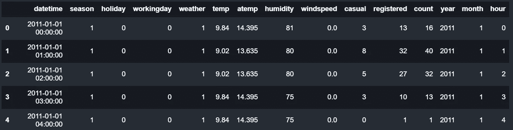**

**数据样本(来源:作者)**

## **特征相关性(连续变量)**

**我们计算连续变量的皮尔逊相关。我们观察到温度(“temp”)和“感觉”温度(“atemp”)高度相关。这为我们提供了评估 PDP 图的案例。**

```
#Pearson Correlation for Continiuos Variables
continious_variables = df[['temp', 'atemp', 'humidity', 'windspeed','count']]
corr = continious_variables.corr()
corr = sns.heatmap(corr, 
        xticklabels=corr.columns,
        yticklabels=corr.columns,
           annot=True, fmt="f",cmap="Blues")
```

**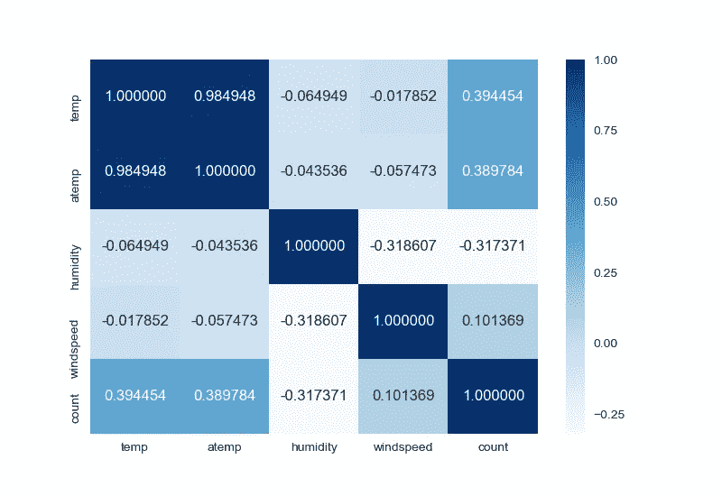**

**皮尔森相关性(来源:作者)**

## **特征相关性(分类变量到连续变量)**

**我们观察到租赁预订的连续特征—温度因素(“temp”)和两个分类因素—季节(“season”)和月份(“month”)之间的相关性。计算两个相关性的方差分析表，即带有“季节”的“温度”和带有“月份”的“温度”。我们观察到在两种情况下 F 统计量的 P 值都为零。这表明在“月”和“季”的类别中，温度(“temp”)的组均值在统计上是不同的。这表明这些特征与**线性相关**。这是非常直观的，因为不同月份/季节的平均温度肯定会有所不同。**

```
#Fit an OLS with temperature as the continious target variable 
#and season as the explanatory categorical variable.
model = smf.ols(formula='temp ~ C(season)', data=df)  
res = model.fit()
print('ANOVA - temp~season')
summary = res.summary() #OLS Summary
print(summary.tables[0]) #Print the Anova Table only#Fit an OLS with temperature as the continious target variable 
#and month as the explanatory categorical variable.
model = smf.ols(formula='temp ~ C(month)', data=df)
res = model.fit()
print('ANOVA - temp~month')
summary = res.summary() #OLS SUmmary
print(summary.tables[0]) #Print the Anova Table only
```

**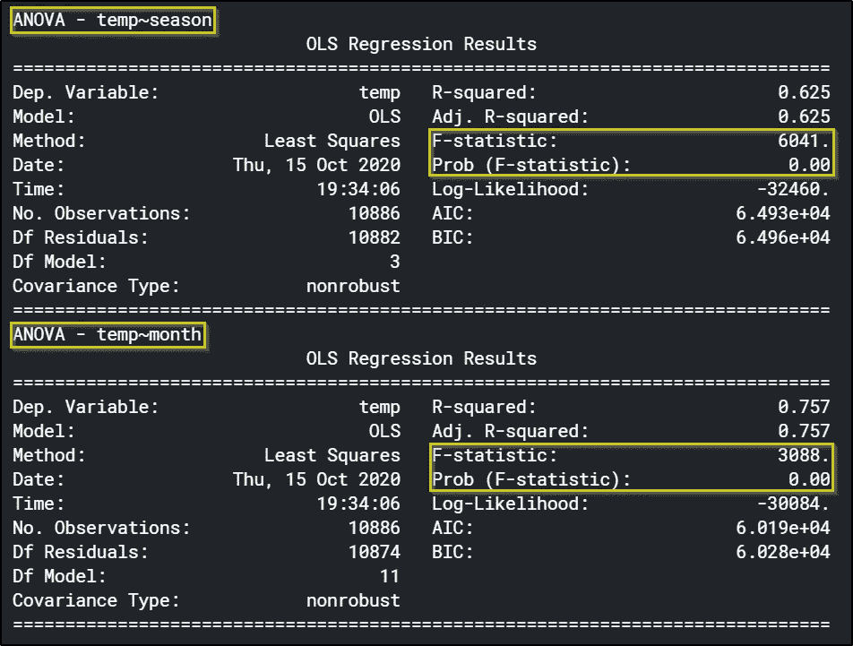**

**方差分析表(来源:作者)**

## **部分相关图(无相关变量)**

**我们首先拟合一个随机森林回归变量，确保我们不采用任何连续或分类的因变量。我们确保我们有一个很好的契合。残差图(如下所示)表明残差是均匀随机分布的，其平均值约为**零**。更不用说训练和测试的**良好的 R 平方**值。这两个因素都表明很适合。为了解释模型的预测决策，一个拟合良好的模型是绝对必要的。**

**除了 PDP 图(下面粗线所示)，我们还有两个**集群**版本的 ICE 图。两条细细的**蓝色**线代表各种冰图(分别对应‘temp’高于平均值和低于平均值的边际效应)。PDP 从平均值 **~77** (出租销售)开始。随着温度(“temp”)的升高，租赁销售额持续增加，直到“temp”值达到 **~30。**此后，销量下降，最终平均在 **~217** 左右。相应的代码和情节如下。**

```
#Drop the correlated variable 'atemp' and then fit
X,y = df[['year','hour','temp','humidity','windspeed','holiday','workingday']],df['count']
X_train, X_test, y_train, y_test = train_test_split(X, y, test_size=0.25, random_state=42)model = RandomForestRegressor(n_estimators=200) #Fit a Random Forest with 2oo Trees
visualizer = ResidualsPlot(model, qqplot=True) #Instantiate a Residual Plot Classvisualizer.fit(X_train, y_train)  # Fit the training data to the visualizer
visualizer.score(X_test, y_test)  # Evaluate the model on the test data
visualizer.show()
```

**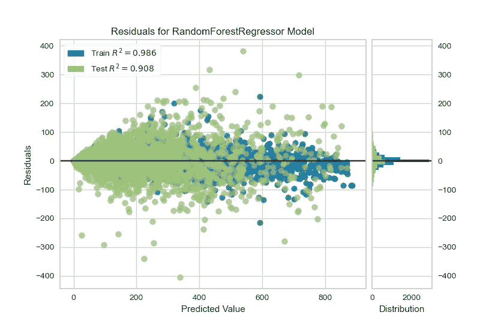**

**拟合优度(没有因变量的回归)(来源:作者)**

```
pdp_temp = pdp.pdp_isolate(
    model=model, dataset=X_train, model_features=X_train.columns, feature='temp'
)
fig, axes = pdp.pdp_plot(pdp_temp, 'temp',center=False, cluster=True,n_cluster_centers=2,\
                         plot_lines=True, x_quantile=True, show_percentile=True, plot_pts_dist=True )
```

**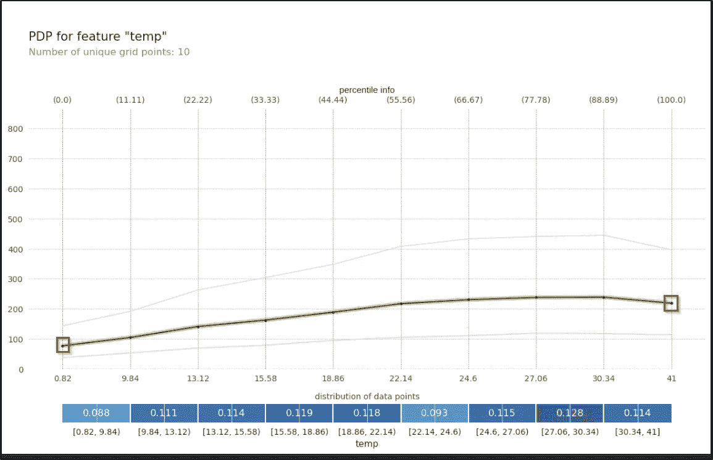**

**部分相关图(有**无**因变量)。左边的红色方块在大约 77 处，右边的在大约 217 处，标志着 PDP 的结束(来源:作者)**

## **部分相关图(有相关变量)**

**在这种情况下，我们考虑两个高度相关的连续变量—“temp”和“atemp”都作为回归变量。PDP 看起来更平了，不是吗？PDP 起始值为 **~146** (租赁的平均销售额)。这与上面那个从 **~77** 开始的形成对比。该图这次在大约值 **~211** 处结束。**为什么两个情节不一样？****

```
#Include the correlated variable 'atemp' and then fit
X,y = df[['year','hour','temp','atemp','humidity','windspeed','holiday','workingday']],df['count']
X_train, X_test, y_train, y_test = train_test_split(X, y, test_size=0.25, random_state=42)model = RandomForestRegressor(n_estimators=200)
visualizer = ResidualsPlot(model, qqplot=True)visualizer.fit(X_train, y_train)  # Fit the training data to the visualizer
visualizer.score(X_test, y_test)  # Evaluate the model on the test data
visualizer.show()
```

****

**拟合优度(因变量回归)(来源:作者)**

**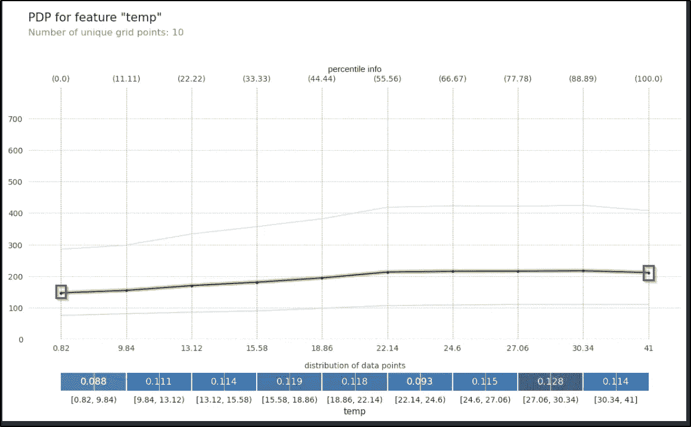**

**部分相关图(有因变量)。左边的红色方块在 146 左右，右边的在 211 左右，标志着 PDP 的结束(来源:作者)**

## **要避免的陷阱**

**PDP 与扰动一起工作，即对于每个数据点，我们外推感兴趣的特征的值(这里以百分位数替换)。相关变量导致虚假数据点。例如，在下表中，我们看到七月份的外推值**为 0.82** ，以及“atemp”值**为 32.5** (在表格中以红色框突出显示)。这样的数据点是不可行的(华盛顿特区 7 月的气温永远不可能是 0.82)。因此，每个变量的影响变得平滑，我们看到虚假的 PDP(在我们的情况下是一个更平坦的曲线)。**对此的解决方案-** 是在拟合之前移除一个相关变量(“temp”或“atemp”)(在这种情况下使用皮尔逊相关)。**

```
X_train['month'] = df[df.index.isin(X_train.index)]['month']
X_train['month'] = X_train['month'].apply(lambda x: calendar.month_abbr[x]) #Get the month
#Get all the possible values the feature temp(based on the quantile grids) is allowed to take w.r.t 
#to all the data points and values of other features reamining constant.
X_train['extrapolated_temp'] = [pdp_temp.feature_grids.tolist()]*len(X_train)
X_train = X_train.explode('extrapolated_temp')
X_train.head()
```

**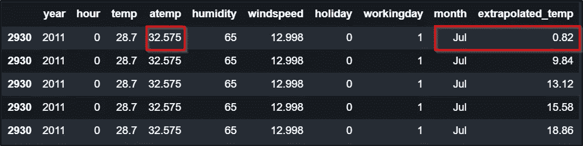**

**七月份温度的外推值为 0.82(来源:作者)**

## **部分相关图—分类情况(无相关变量)**

**现在，我们去掉‘temp’(以及‘atemp’)，取而代之的是‘season’作为回归变量。因为季节是一个分类变量，所以我们取它的一次性编码版本。我们评估拟合优度并获得 PDP。PDP 揭示的是，随着“季节”的变化，春季或冬季的平均租赁销售量分别为 118.8 和 201.476。夏季和秋季销量最高(平均分别为 217 辆和 230.4 辆)。**

```
#Removing the variable 'temp' and instead using the variable 'season'
X,y = df[['year','hour','season','humidity','windspeed','holiday','workingday']],df['count']
X = pd.get_dummies(X,columns=['season']) #One hot encode
X = X.rename(columns = {'season_1':'spring','season_2':'summer',
                       'season_3':'fall','season_4':'winter'}) #Proper Renaming of Dummies
X_train, X_test, y_train, y_test = train_test_split(X, y, test_size=0.25, random_state=42)
X_train.head()
```

**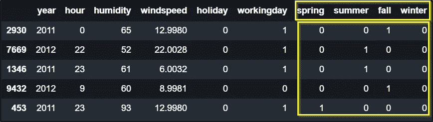**

**一个热编码变量“季节”(来源:作者)**

```
model = RandomForestRegressor(n_estimators=200)
visualizer = ResidualsPlot(model, qqplot=True)visualizer.fit(X_train, y_train)  # Fit the training data to the visualizer
visualizer.score(X_test, y_test)  # Evaluate the model on the test data
visualizer.show()
```

**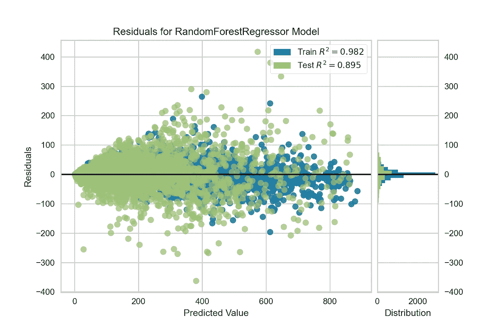**

**拟合优度——分类案例(无因变量的**回归)(来源:作者)****

```
pdp_season = pdp.pdp_isolate(
    model=model, dataset=X_train, model_features=X_train.columns, 
    feature=['spring', 'summer', 'fall', 'winter']
)
fig, axes = pdp.pdp_plot(pdp_season,'season', center=False, cluster=True,n_cluster_centers=2,\
                         plot_lines=True, x_quantile=True, show_percentile=True)
```

**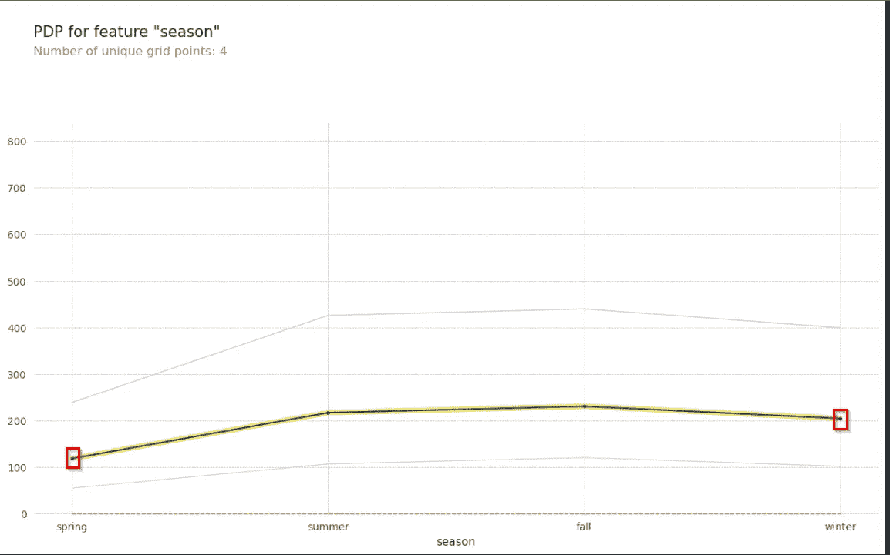**

**部分相关图(有因变量)。春季、夏季、秋季和冬季的 PDP 值分别为 118.5、217.1、230.5 和 204.7。(来源:作者)**

## **部分相关图—分类情况(有相关变量)**

**从我们的 ANOVA 表中，我们知道“季节”和“温度”是相互依赖的，所以现在除了“季节”，我们还包括“温度”。我们评估拟合优度，并最终评估 PDP。我们看到非常相似的结果，与没有相关变量的情况相比，这种情况下的 PDP 又平坦了很多。**

```
#Included the dependent variable 'temp'
X,y = df[['year','hour','temp','season','humidity','windspeed','holiday','workingday']],df['count']
X = pd.get_dummies(X,columns=['season'])
X = X.rename(columns = {'season_0':'spring','season_1':'summer',
                       'season_2':'fall','season_3':'winter'})
X_train, X_test, y_train, y_test = train_test_split(X, y, test_size=0.25, random_state=42)#Fit the model
model = RandomForestRegressor(n_estimators=200)
visualizer = ResidualsPlot(model, qqplot=True)visualizer.fit(X_train, y_train)  # Fit the training data to the visualizer
visualizer.score(X_test, y_test)  # Evaluate the model on the test data
visualizer.show()
```

**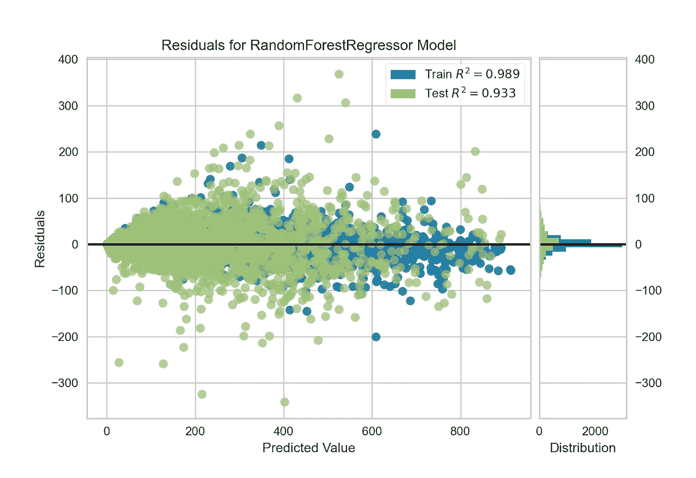**

**拟合优度—分类案例(因变量回归)(来源:作者)**

```
pdp_season = pdp.pdp_isolate(
    model=model, dataset=X_train, model_features=X_train.columns, 
    feature=['spring', 'summer', 'fall', 'winter']
)
fig, axes = pdp.pdp_plot(pdp_season,'season', center=False, cluster=True,n_cluster_centers=2,\
                         plot_lines=True, x_quantile=True, show_percentile=True)
```

**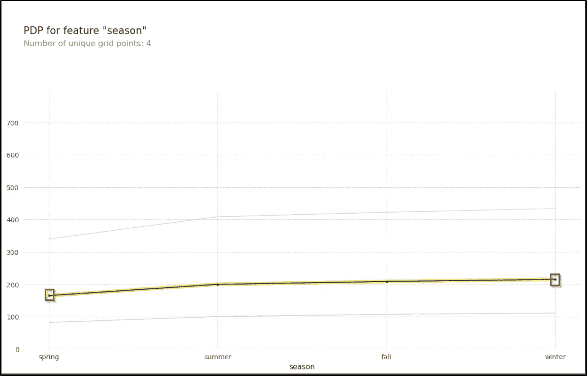**

**部分相关图(有因变量)。春季、夏季、秋季和冬季的 PDP 值分别为 165.6、199.6、208.6 和 215.2。(来源:作者)**

## **要避免的陷阱**

**因为“季节”和“温度”是相互依赖的，所以当两者都被用作回归变量时，我们看到这两个特征的效果变得平滑。这就是第二个 PDP 平坦很多的原因。更深入地说，我们观察“季节”的推断值。例如，第一行显示“七月”对应的外推季节是“春天”(在表中以红色突出显示)。这是一个不可行的数据点，因此会产生虚假的结果，因为两个因变量的边际效应相互抵消，并且图是平坦的。**解决方案-** 我们必须检查连续分类依赖性，并从我们的回归变量列表中删除其中一个(使用 **ANOVA** )。**

```
X_train['month'] = df[df.index.isin(X_train.index)]['month'] #Get the Month
X_train['month'] = X_train['month'].apply(lambda x: calendar.month_abbr[x])#Get the Month
#Get all the possible values the feature season is allowed to take w.r.t to all 
#the data points and values of other features reamining constant.
X_train['extrapolated_season'] = [pdp_season.feature_grids.tolist()]*len(X_train)
X_train = X_train.explode('extrapolated_season')
X_train.head()
```

**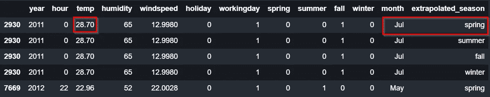**

**一个推断的七月“春天”的季节(来源:作者)**

## **结论**

**特性依赖不仅仅是关于相关性。我们可以使用**卡方**测试，以及**非线性**特性依赖测试(例如基于**内核方法**的测试)来进一步检查分类到分类的关系。上述相同的扣除也适用于 **ICE** 地块。**

**在本文中，我们展示了 PDP 和 ICE 图是如何因为依赖关系而被误解的。**

# **参考**

1.  **Christoph Molnar、Gunnar knig、Julia Herbinger、Timo Freiesleben、Susanne Dandl、Christian A. Scholbeck、Giuseppe Casalicchio、Moritz Grosse-Wentrup、Bernd Bischl-[https://arxiv.org/abs/2007.04131](https://arxiv.org/abs/2007.04131)**
2.  **[https://christophm.github.io/interpretable-ml-book/](https://christophm.github.io/interpretable-ml-book/)**
3.  **[https://compstat-lmu . github . io/IML _ methods _ limits/PDP-correlated . html](https://compstat-lmu.github.io/iml_methods_limitations/pdp-correlated.html)**

## **使用的库/数据**

1.  **[https://www.kaggle.com/c/bike-sharing-demand/data](https://www.kaggle.com/c/bike-sharing-demand/data)**
2.  **[https://www.scikit-yb.org/en/latest/](https://www.scikit-yb.org/en/latest/)**
3.  **[https://www . stats models . org/stable/generated/stats models . formula . API . ols . html # stats models . formula . API . ols](https://www.statsmodels.org/stable/generated/statsmodels.formula.api.ols.html#statsmodels.formula.api.ols)**
4.  **[https://sci kit-learn . org/stable/modules/generated/sk learn . ensemble . randomforestclassifier . html](https://scikit-learn.org/stable/modules/generated/sklearn.ensemble.RandomForestClassifier.html)**
5.  **[https://pdpbox.readthedocs.io/en/latest/](https://pdpbox.readthedocs.io/en/latest/)**