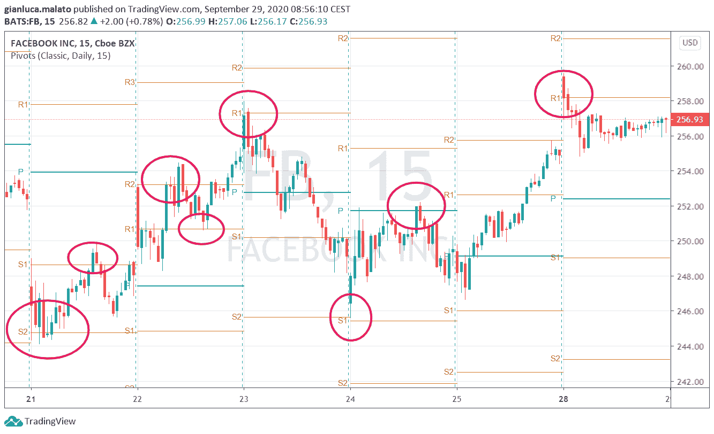
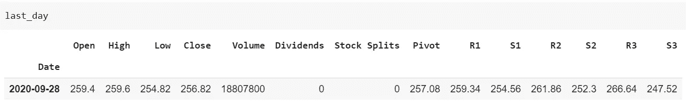

# Python 中用于日交易的支点计算

> 原文：<https://towardsdatascience.com/pivot-points-calculation-in-python-for-day-trading-659c1e92d323?source=collection_archive---------9----------------------->

## 让我们看看如何用 Python 计算日交易的中枢点



脸书股票价格在 15 分钟时间框架内与经典支点。图片由作者提供，使用 Tradingview 制作

日内交易和摆动交易有很大的不同。这更加困难，需要一些特殊的工具来盈利。支点是日内交易者可以使用的一些工具。

在这篇文章中，我解释了它们是如何工作的。

# 什么是支点？

支点是日内交易中经常使用的价格水平(但它们甚至可以用在摇摆交易中)。它们被认为是每日市场交易中价格的“天然”支撑和阻力，所以它们对日内交易者非常有用，因为当市场接近它们时，市场经常以一种不平凡的方式表现。

枢轴点有几种类型，但经典枢轴点通常是从最后一天的最高价、最低价和收盘价开始定义的。将一些数学计算应用到前一个交易日的价格，交易者可以计算出当前交易日的中枢水平，并使用它们。在本文中，我将重点关注经典支点。

# 它们是如何使用的？

经典枢轴点通常定义主枢轴级别。主要观点是，如果价格高于中枢水平，市场看涨。如果价格低于主要支点水平，市场是熊市。

主要的枢轴点之后通常是一些支撑位和阻力位，它们是日内市场的自然关键点。

下图显示了 15 分钟时间框架内的脸书股票价格。水平线是支点支撑(S1，S2，S3)和阻力(R1，R2，R3)，而绿色水平线是支点水平(P)。


正如你所看到的，市场似乎经常拒绝这些价位，就像它们是真正的支撑和阻力一样。甚至枢轴级别本身也是如此。所以，很容易理解这种水平在日内交易中的重要性。

日内交易者可以在价格接近中枢水平时寻找交易机会，等待回调或突破，并将最近的中枢水平作为目标。

# 如何计算它们

传统的支点级别是根据以下公式计算的，这些公式取自 Tradingview 知识库([https://www . trading view . com/support/solutions/43000521824-pivot-points-standard/](https://www.tradingview.com/support/solutions/43000521824-pivot-points-standard/))，应用于前一天的最高价、最低价和收盘价:

*   PP =(高+低+收盘)/ 3
*   R1 = 2 * PP -低
*   S1 = 2 * PP -高
*   R2 = PP +(高-低)
*   S2 = PP -(高-低)
*   R3 = PP + 2 *(高-低)
*   S3 = PP - 2 *(高-低)

PP 是主要支点级别。S1、S2 和 S3 是支撑位。R1、R2 和 R3 是阻力位。

# Python 中的计算

让我们看看如何在 Python 中计算这些级别。对于这个例子，我将关注脸书股票数据。整个笔记本可以在这里找到:[https://github . com/gianlucamalato/machine learning/blob/master/Calculation _ of _ daily _ pivot _ levels . ipynb](https://github.com/gianlucamalato/machinelearning/blob/master/Calculation_of_daily_pivot_levels.ipynb)

首先，我们必须使用 *yfinance* 库获取股票数据。

```
!pip install yfinance
```

然后，我们可以导入我们需要的库。

```
import numpy as np
import pandas as pd
import yfinance
```

我们现在可以将脸书的数据导入熊猫的数据框架。

```
ticker = yfinance.Ticker("FB")
df = ticker.history(interval="1d")
```

这个数据框架的最后一个记录是最后一个交易日。我们将使用它的价格水平来计算我们今天可以使用的中枢水平。

```
last_day = df.tail(1).copy()
```

现在，根据枢纽公式，我们可以计算水平。

```
last_day['Pivot'] = (last_day['High'] + last_day['Low'] + last_day['Close'])/3last_day['R1'] = 2*last_day['Pivot'] - last_day['Low']last_day['S1'] = 2*last_day['Pivot'] - last_day['High']last_day['R2'] = last_day['Pivot'] + (last_day['High'] - last_day['Low'])last_day['S2'] = last_day['Pivot'] - (last_day['High'] - last_day['Low'])last_day['R3'] = last_day['Pivot'] + 2*(last_day['High'] - last_day['Low'])last_day['S3'] = last_day['Pivot'] - 2*(last_day['High'] - last_day['Low'])
```

结果是:



# 结论

枢轴点在日内交易中非常常用，并且在 Python 中很容易计算。这只需要一个单一的市场日数据，所以他们不需要太多的历史记录。日内交易者应该根据这些水平(或其他类型的中枢水平，如斐波那契线，Woodie 线，Camarilla 线)和策略类型(如突破或回调)制定交易策略。