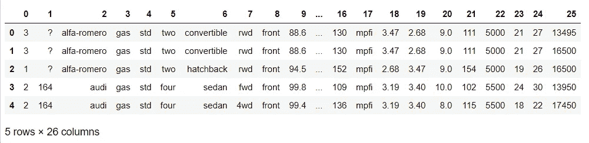
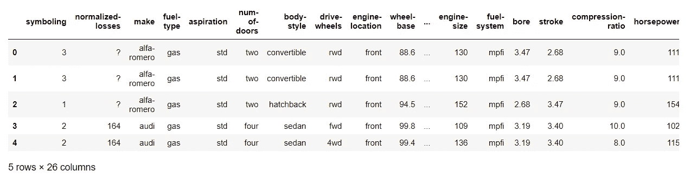
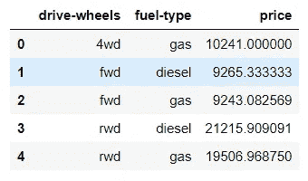
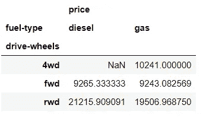
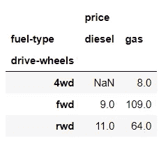
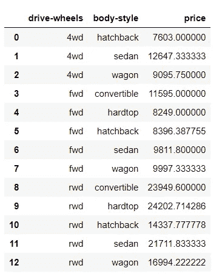
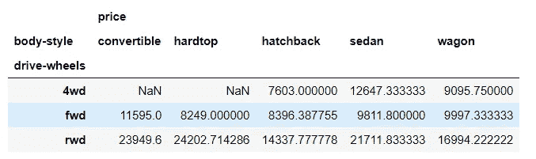
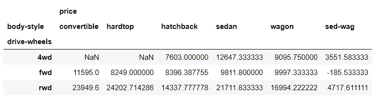
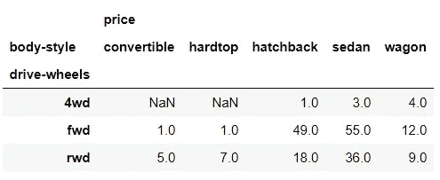
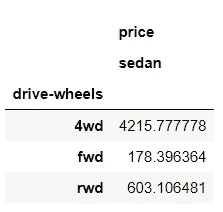

# 使用熊猫的数据透视表和操作

> 原文：<https://towardsdatascience.com/pivot-tables-and-operations-using-pandas-471646b99cb5?source=collection_archive---------49----------------------->


图片来自 [Unsplash](https://medium.com/u/2053395ac335?source=post_page-----471646b99cb5--------------------------------)

## 数据透视表对于分析来说是不够的，对数据透视表的操作才是关键

我们将学习如何有效地创建数据透视表并执行所需的分析。我们将用一个著名的汽车数据集来做这件事，这个数据集来自加州大学欧文分校。您可以通过以下链接找到数据集。建议您也阅读一些关于数据集的内容。我使用这个数据集作为我参加的数据分析在线课程的一部分。

[https://archive . ics . UCI . edu/ml/machine-learning-databases/autos/imports-85 . data](https://archive.ics.uci.edu/ml/machine-learning-databases/autos/imports-85.data)

因此，让我们先获取库，加载我们的数据，并浏览一下数据。

```
import pandas as pd
import numpy as nppath = "Downloads/imports-85.data"
df = pd.read_csv(path, header=None)
```

如果我们现在看数据，你什么都不能理解。不过，还是让我们来看一看吧。

```
df.head()
```



初始数据集

数据看起来像这样。首先，让我们给数据一些好的标题。

```
headers = ["symboling","normalized-losses","make","fuel-type","aspiration", "num-of-doors","body-style",
         "drive-wheels","engine-location","wheel-base", "length","width","height","curb-weight","engine-type",
         "num-of-cylinders", "engine-size","fuel-system","bore","stroke","compression-ratio","horsepower",
         "peak-rpm","city-mpg","highway-mpg","price"]df.columns = headers
```

所以现在数据看起来像这样。



带标题的数据

# 数据清理

您需要执行一些数据清理步骤。但是，我不会详细谈论它们。因为我们正在讨论数据透视表，所以我假设您可能有一些关于数据清理的基础知识。为此，请使用下面的代码。

```
df.replace("?", np.nan, inplace = True)df["normalized-losses"].replace(np.nan, df["normalized-losses"].astype("float").mean(axis=0), inplace=True)
df["bore"].replace(np.nan, df['bore'].astype('float').mean(axis=0), inplace=True)
df["stroke"].replace(np.nan, df['stroke'].astype('float').mean(), inplace=True)
df["horsepower"].replace(np.nan, df['horsepower'].astype('float').mean(), inplace=True)
df["peak-rpm"].replace(np.nan, df['peak-rpm'].astype('float').mean(), inplace=True)
df[["price"]] = df[["price"]].astype("float")
```

我就简单介绍一下我刚才做的事情。如果您使用`df.dtypes`检查每一列的数据类型，您会发现有些列的数据类型不正确，这是您在使用数据透视表时根本不想要的。例如,“价格”列的数据类型为“对象”,这是没有意义的。此外，数据有空值，问号(？)更确切地说。

为了解决这个问题，我们用 NAN 替换了它。然后，一些数字列的 NAN 值被该列的平均值所取代。

现在，既然我们有了干净的数据，让我们创建我们的第一个数据透视表。首先，我们必须从数据帧中选择我们想要的数据。

# 分组依据和透视表

```
df_selction = df[['fuel-type', 'drive-wheels', 'price']]
```

现在，我们将按照“燃料类型”和“驱动轮”这两列对数据进行分组。我们将使用汽车价格的平均值。

```
df_selection_gb = df_selction.groupby(['drive-wheels', 'fuel-type'], as_index=False).mean()df_selection_gb
```



分类资料

这可能有点难以阅读或执行任何分析。因此，我们把它转换成一个数据透视表，让我们看看我们得到了什么。

```
df_first_pivot = df_selection_gb.pivot(index='drive-wheels', columns='fuel-type')df_first_pivot
```



数据透视表

现在，您可能会注意到数据透视表中的一些 NAN 值。但这没关系，因为我们没有任何四轮驱动和柴油驱动汽车的数据。

## 可能的分析

有了上面的数据透视表，你可以回答这样的问题—

*   柴油动力车前轮驱动的均价是多少？
*   哪种车型最贵？

所以你可以得到答案，因为后轮驱动的柴油动力汽车是最贵的。假设我们想回答这样的问题-

*   四轮驱动的燃气汽车总数？

那么你可以用计数函数来代替均值—

```
df_selection_gb_2 = df_selction.groupby(['drive-wheels', 'fuel-type'], as_index=False).count()df_count_pivot = df_selection_gb_2.pivot(index='drive-wheels', columns='fuel-type')df_count_pivot
```



现在，让我们继续创建另一个组并尝试分析它。

```
df_selection_2 = df[['drive-wheels','body-style','price']]grouped_df = df_selection_2.groupby(['drive-wheels','body-style'],as_index=False).mean()grouped_df
```



正如您可以非常清楚地看到的，这种分组数据比第一种数据更难阅读和理解。因此，让我们在数据透视表中转换它，然后再试一次。

```
grouped_pt = grouped_df.pivot(index='drive-wheels',columns='body-style')grouped_pt
```



现在，这个更容易分析了。如果您想要在这些数据透视表上执行操作，您可以像普通的数据帧一样执行，但是在列命名上稍有不同。

# 透视操作

让我们看看数据透视表的列。

```
grouped_pt.columns
```


如你所见，它是多索引的。假设我们想得到轿车和旅行车车身风格的汽车的平均价格的差异。

```
grouped_pt[('price','sed-wag')] = (grouped_pt[('price', 'sedan')]-grouped_pt[('price', 'wagon')])grouped_pt
```



同样，如果您想要比较一段时间内的值，例如上个月和本月。你可以继续做同样的事情。您可能想要计算销售额的增长或者增长率。由于我们的数据集中没有日期列，我将向您展示一些您可能会发现的更多可能的见解。

例如，我们希望根据驱动轮列得到一辆轿车的平均价格。

为此，您可能需要删除我们刚刚创建的“sed-wag”列。

```
del(grouped_pt[('price','sed-wag')])
```

现在让我们用汽车的数量创建另一个枢纽。

```
df_selection_3 = df[['drive-wheels','body-style','price']]grouped_df_2 = df_selection_3.groupby(['drive-wheels','body-style'],as_index=False).count()grouped_count_pt = grouped_df_2.pivot(index='drive-wheels',columns='body-style')grouped_count_pt
```



让我们计算一下，以数据图表的形式看看我们的结果。

```
rate_4wd_sedan = (grouped_pt[('price', 'sedan')]) / (grouped_count_pt[('price', 'sedan')])rate_4wd_sedan.to_frame()
```



所以，你可以看到，根据驱动轮一栏，我们得到了轿车的平均价格。你可能会多玩一会儿，获得许多像这样有用的见解。

如果您有任何疑问，请随时联系我们，我们随时欢迎您提出建议。我希望这篇文章是有用的。