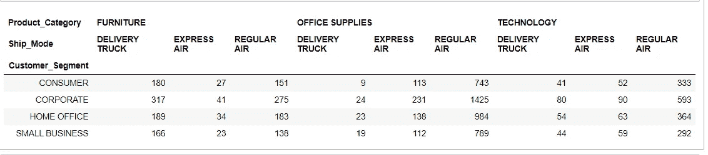

# 数据透视表 Python 中的数据聚合工具

> 原文：<https://towardsdatascience.com/pivot-tables-cross-tabulation-data-aggregation-tools-in-python-dd6791dbe3cd?source=collection_archive---------19----------------------->

## 在 Python 中有效使用 pivot_table()函数的多种方法


马库斯·温克勒在 [Unsplash](https://unsplash.com?utm_source=medium&utm_medium=referral) 上的照片

探索性数据分析是机器学习项目的一个重要阶段。奇妙的熊猫图书馆为此配备了几个有用的功能。其中之一是 **pivot_table** ，它在一个简洁的二维表格中总结了一个特性的值。数据分析软件中常见的数据汇总工具，提供了极大的灵活性。DataFrame 有一个 pivot_table 方法( [**熊猫)。DataFrame.pivot_table** 大多数情况下，我们最终会使用带有默认参数的 pivot_table。本文将通过优化使用默认参数来帮助您实现更多目标。](https://pandas.pydata.org/pandas-docs/stable/reference/api/pandas.DataFrame.pivot_table.html)

# 数据透视表()

pivot_table()方法返回一个 **DataFrame** ，这是一个 Excel 风格的数据透视表。数据透视表通过一个或多个键聚合数据表，将数据排列在一个矩形中，其中一些组键沿行排列，一些组键沿列排列，形成一个二维表，提供数据的多维汇总。

## 句法

`**pandas.DataFrame.pivot_table()**`

## 因素


[https://pandas . pydata . org/pandas-docs/stable/reference/API/pandas。DataFrame.pivot_table.html](https://pandas.pydata.org/pandas-docs/stable/reference/api/pandas.DataFrame.pivot_table.html)

# 数据透视表()的基本用法

让我们通过在数据集上应用这个方法来研究它的基本用法。[文中用到的网购数据集](https://www.kaggle.com/tanyadayanand/online-shopping)可以从 Kaggle 下载。为了直接进入代码，一个附带的[笔记本](https://www.kaggle.com/tanyadayanand/multiple-ways-to-effectively-use-the-pivot-table)发表在 Kaggle 上。

[](https://www.kaggle.com/tanyadayanand/multiple-ways-to-effectively-use-the-pivot-table) [## 有效使用 pivot_table()的多种方法

### 使用 Kaggle 笔记本探索和运行机器学习代码|使用网上购物的数据

www.kaggle.com](https://www.kaggle.com/tanyadayanand/multiple-ways-to-effectively-use-the-pivot-table) 

## 导入数据集

让我们从导入必要的库和加载数据集开始。这是每个数据分析过程中必不可少的一步。

```
***# Importing necessary libraries***import pandas as pd
import numpy as np***# Importing and Loading the data into data frame***market_df = pd.read_csv("../input/market.csv")
customer_df = pd.read_csv("../input/customer.csv")
product_df = pd.read_csv("../input/product.csv")
shipping_df = pd.read_csv("../input/shipping.csv")
orders_df = pd.read_csv("../input/order.csv")***# Merging the dataframes to create a master_df***df_1 = pd.merge(market_df, customer_df, how='inner', on='Cust_id')
df_2 = pd.merge(df_1, product_df, how='inner', on='Prod_id')
df_3 = pd.merge(df_2, shipping_df, how='inner', on='Ship_id')
master_df = pd.merge(df_3, orders_df, how='inner', on='Ord_id')
```

## 提取前几行

```
master_df.head()
```


## 计算空值的数量

```
***#Identifying Missing Values in Column***
master_df.isnull().sum()
```


因此，列`Product_Base_Margin`具有空值。

此时，我们对数据集的样子几乎没有任何概念。因此，现在让我们以多种不同的方式来研究 pivot_table()的用法，以进一步探索数据。

# 1.在数据透视表中使用索引对数据进行分组

**索引**是我们用来对数据进行分组的列、分组器、数组或列表。最简单的数据透视表需要一个 dataframe 和一个`index`。索引要素将显示在结果表的索引列中。默认情况下，如果没有指定 value 和 aggfunc 参数，它将对所有数值列数据进行平均。

我将使用 *Customer_Segment* 列作为这里的 ***索引*** :

```
***#a single index
#Using*** [***pandas.DataFrame.pivot_table***](https://pandas.pydata.org/pandas-docs/stable/reference/api/pandas.DataFrame.pivot_table.html)master_df.pivot_table(index = 'Customer_Segment')***#Same as above - results in same output
#Using*** [***pandas.pivot_table***](https://pandas.pydata.org/pandas-docs/stable/reference/api/pandas.pivot_table.html)pd.pivot_table(master_df, index = 'Customer_Segment')
```


该函数返回一个以 *Customer_Segment* 为索引的数据透视表，并对数字列进行平均。我们可以看到，数据透视表足够智能，可以根据 *Customer_Segment 开始聚合数据并进行汇总。*

## 运行具有多个索引的 pivot_table()

***pivot_tabl* e** 可以通过一个列表将多个特征作为索引。这增加了结果表中的粒度级别，我们可以获得更具体的结果:

```
***#multiple indexes***
master_df.pivot_table(index =['Customer_Segment','Product_Category'])
```


这里，pivot_table 将*产品类别*与*客户细分*组合在一起，并为我们提供了一个组合汇总表。现在我们开始了解数据透视表能为我们做些什么。

# 2.用值聚合特定要素

**值**参数是我们告诉函数要聚合哪些特性的地方。这是一个可选字段，如果我们不指定该值，那么该函数将聚合数据集的所有数字特征。在前面的索引示例中，我们看到对所有数字列进行了聚合。由于没有指定value 参数，默认情况下，pivot_table 考虑所有数值列。

以下示例比较了*客户群*的*平均销售额*

```
***#Single value***
master_df.pivot_table(values = 'Sales', index = 'Customer_Segment')
```


*销售*列自动对数据进行平均，但是我们也可以进行计数或求和(通过添加参数`aggfunc`和`np.sum` 或`count`)。

## 聚合多个特征

类似于*索引*参数，*值*参数也可以通过一个列表获取多个特征。

```
***#multiple value***
master_df.pivot_table(values = ['Order_Quantity','Sales'], index = 'Customer_Segment')
```


数据透视表聚集了功能 *Order_Quantity* 和 *Sales* 的数据，并将其与 *Customer_Segment 分组。*

# 3.使用 aggfunc 操作数据

如前所述，默认情况下，pivot_table 使用均值函数(`numpy.mean`)来聚合或汇总数据。但是还有其他重要功能或功能列表需要考虑。 ***aggfunc*** 是 ***pivot_table*** 应用于我们分组数据的聚合函数。`aggfunc`(可选)接受我们希望在群组中使用的功能或功能列表。聚集规范可以是诸如`'sum'`、`'mean'`、`'count'`、`'min'`、`'max'`等字符串，或者是实现聚集的函数(例如`np.sum()`、`min()`、`sum()`等)。现在是试验`aggfunc`参数的时候了。

第一个示例通过取平均值来聚合值:

```
***#Single aggrigate function(mean) and single value*** master_df.pivot_table(values = 'Sales', index = 'Customer_Segment', aggfunc = 'mean')
```


第二个示例通过求和来聚合值。它比较各地区的订单总数。

```
***#Single aggrigate function(sum) and single value*** master_df.pivot_table(values = 'Order_Quantity', index = 'Region', aggfunc = 'sum')
```


以下示例通过对多列求和来进行聚合。

```
***#Sum aggregate function is applied to both the values***
master_df.pivot_table(values = ['Order_Quantity','Sales'], index = 'Product_Category', aggfunc='sum')
```


## 具有多重聚合功能的透视表

我们不仅可以指定我们想要的聚合函数，还可以指定多个聚合函数。例如，如果我们对*销售*的总数和计数都感兴趣，我们可以将函数指定为参数 **aggfunc** 的列表。让我们试一试。

```
***#multiple Aggregating Function applied to single column***
master_df.pivot_table(values = 'Sales', index = 'Product_Category', aggfunc=['sum', 'count'])
```


我们还可以提供一个集合函数列表来应用于每个值。下面是同样的例子。

```
***#Sum and Mean aggregate function is applied to both the values***
master_df.pivot_table(values = ['Order_Quantity','Sales'], index = 'Product_Category', aggfunc=[np.sum, np.mean])
```


## 不同的功能使用不同的聚合函数

我们也可以对不同的特性使用不同的聚合函数。只需提供一个字典映射作为 **aggfunc** 参数的输入，以特性名作为键，以相应的聚合函数作为值。

在下面的例子中，我将使用 ***sum*** 作为**Order _ Quantity**特性和 ***mean*** 作为 *Sales* 特性。另外，请注意，我省略了关键字`values`;为`aggfunc`指定映射时，这是自动确定的。**

```
*****#different aggregate applied to different values*** master_df.pivot_table(index = 'Product_Category', aggfunc = {'Order_Quantity':sum, 'Sales':'mean'})**
```

****

**当我们给出多个聚集函数时，我们将得到一个多索引的数据帧作为输出。**

# **4.特征与列参数之间的关系**

***列*参数在结果表的顶部水平显示数值。大多数时候，与使用`columns`和`values`相关的`pivot_table`会被混淆。请记住，`columns`是可选的，它们提供了一种补充方式来分割我们关心的实际值。聚合函数应用于我们列出的`values`。**

**如果我们想查看按*客户细分*细分的*利润*，那么`columns`参数允许我们定义一个或多个列。这里，我们比较了不同产品类别和不同客户群的总利润。**

```
*****#Single column
#Grouping by both rows and column*** master_df.pivot_table(values = 'Profit', 
                      index = 'Product_Category', 
                      columns = 'Customer_Segment', 
                      aggfunc = 'sum')**
```

****

## **具有多列的 pivot_table()**

**使用多个特性作为索引没问题，但是使用一些特性作为列将帮助我们快速理解它们之间的关系。同样，通过合并 **pivot_table** 的**列**参数，可以更好地查看结果表。**

```
*****#multiple columns***
master_df.pivot_table(values = 'Profit', 
                      index = 'Customer_Segment', 
                      columns = ['Product_Category','Ship_Mode'], 
                      aggfunc = 'count')**
```

****

****列**和**索引**参数都是可选的，但是有效地使用它们将帮助我们直观地理解特征之间的关系。**

# **5.添加总行数/列数**

**有时计算每个分组的总数是很有用的。现在，如果我们想查看一些数据的总和，`margins=True`会帮我们做到。`margins`是将所有行和列相加的布尔类型(如小计/总计)，默认为“ ***False”。*****

```
*****#Margin***
master_df.pivot_table(values = ‘Profit’, 
 index = ‘Product_Category’, 
 columns = ‘Customer_Segment’, 
 aggfunc = ‘sum’, margins=True)**
```

****

**边距标签可以用关键字`margins_name`指定，默认为`"All"`。`margins_name`类型为 string，接受当 margins 等于 True 时包含总计的行/列的名称。**

```
*****#margins_name***
master_df.pivot_table(values = 'Profit', 
                      index = 'Product_Category', 
                      columns = 'Customer_Segment', 
                      aggfunc = 'sum', 
                      margins=True,
                      margins_name ='TOTAL')**
```

****

**这两个参数都是可选的，通常有助于改善显示。**

# **6.处理缺失数据**

**奶奶的有点让人分心。 ***pivot_table*** 通过参数 ***dropna*** 和 ***fill_value 帮助我们处理。*** 其中的两个选项`fill_value`和`dropna`与缺失数据有关，并且相当简单。**

*   **`dropna`是布尔类型，允许我们在条目都是`NaN`的分组表中删除空值。它默认为 True。**
*   **`fill_value`是标量类型，可用于用我们提供的值替换表中的 NaN 值。默认为无。**

```
*****#Displaying NaN values in the table
#These can be imputed using fill_value*** master_df.pivot_table(values = 'Product_Base_Margin', 
                      index = 'Customer_Name', 
                     columns = 'Customer_Segment', 
                      aggfunc = 'mean')**
```

****

**我将用来自 *Product_Base_Margin* 列的平均值替换 NaN 值:**

```
*****#imputing with mean using fill_value***
master_df.pivot_table(values = 'Product_Base_Margin', 
                      index = 'Customer_Name', 
                     columns = 'Customer_Segment', 
                      aggfunc = 'mean', fill_value=np.mean(master_df['Product_Base_Margin']))**
```

****

**我们没有所有条目都是`NaN`的列，但是值得一提的是，如果我们有`pivot_table`会根据`dropna`的定义默认删除它们。**

# **结论**

**因此，我们可以看到 pivot_table()是一个方便的工具，我们可以用这一行代码进行一些有趣的分析。当你构建数据透视表时，我认为一步一步来是最简单的。添加项目并检查每个步骤，以验证您是否获得了预期的结果，并查看哪种演示最符合您的需求。一旦您开始处理数据并慢慢添加项目，您就可以感受到它是如何工作的。**

**我们已经介绍了`pivot_table`的强大参数，所以如果你在你的项目中使用这些方法进行实验，你会得到很多。**

# **参考**

**熊猫。DataFrame.pivot_table 文档**