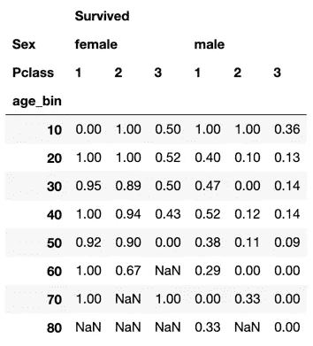
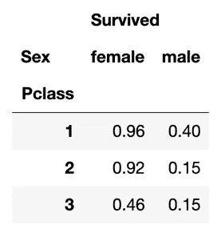

# 熊猫的数据透视表

> 原文：<https://towardsdatascience.com/pivot-tables-in-pandas-7834951a8177?source=collection_archive---------11----------------------->


[岛村永俊](https://unsplash.com/@shima_giraffe?utm_source=medium&utm_medium=referral)在 [Unsplash](https://unsplash.com?utm_source=medium&utm_medium=referral) 上的照片

## 数据透视表不仅仅是 Excel 的事情

如果你是一个经常使用 Excel 的用户，那么你每天都要做一个数据透视表或 10 个数据透视表。这是一种快速便捷的数据切片和识别关键趋势的方法，至今仍是 Excel 的主要卖点之一(也是美国公司初级分析师的克星)。

当不熟悉 Python 的人问我 Pandas 是什么时，我回答说，在高层次上，它就像 SQL 和 Excel 的结合体(功能更多)。因此，考虑到它包含了 Excel 的许多最佳部分，Pandas 对 Excel 著名的数据透视表有自己的实现是很自然的。让我们看看它是如何工作的，以及它如何帮助我们快速分析事物。

# 获取一些数据

*(* [*你可以在我的 GitHub 这里找到我的代码*](https://github.com/yiuhyuk/titanic_pivot_table) *)*

我们将使用泰坦尼克号数据集(从 Kaggle 下载)。我已经将它的训练部分下载到一个 csv 文件中，并将其加载到一个数据帧中:

```
import numpy as np
import pandas as pdtitanic = pd.read_csv('train.csv')
```

在开始构建数据透视表之前，让我们确保没有空值:

```
**In:**print(titanic.isna().sum())**Out:**PassengerId      0
Survived         0
Pclass           0
Name             0
Sex              0
Age            177
SibSp            0
Parch            0
Ticket           0
Fare             0
Cabin          687
Embarked         2
fare_bin        15
```

我们有几个空值，让我们把它们去掉。通常，如果我们试图构建一个健壮的模型，我们会更加努力地考虑如何处理空值。但是今天，我们只是在这里演示如何建立和使用熊猫的数据透视表，所以我们将更加漫不经心地放弃数据。我们将完全删除 Cabin 列，以及包含非 Cabin 空值的任何其他行。第一行放下舱柱。第二行查找包含空值的任何其他行并删除它们。

```
titanic.drop(axis=1, labels=['Cabin'], inplace=True)
titanic.dropna(axis=0, how='any', inplace=True)
```

结果是我们的数据帧从 891 行增加到 712 行。那还不算太糟。票价和年龄列都有很多不同的值，所以我们应该将它们绑定。我们可以利用 Pandas 的 cut 函数(和分位数方法)来做到这一点。下面的代码段根据它们的五分位数分成 5 个段(五分位数 1 是最低的，五分位数 5 是最高的):

```
fare_bin_edges = [0,
                  titanic['Fare'].quantile(0.2),
                  titanic['Fare'].quantile(0.4),
                  titanic['Fare'].quantile(0.5),
                  titanic['Fare'].quantile(0.8),
                  max(titanic['Fare'])+1]titanic['fare_bin'] = pd.cut(titanic['Fare'], 
                             fare_bin_edges, 
                             labels=[1,2,3,4,5])
```

并且这一组代码箱老化(我手动分配箱边缘)。注意，仓是范围，但是我只使用较大的仓边缘来命名每个仓。例如，第一个 bin 包括年龄在 0 到 10 岁之间的所有人，但我只称之为 10。

```
age_bin_edges = [0,10,20,30,40,50,60,70,80,1000]titanic['age_bin'] = pd.cut(titanic['Age'], 
                             age_bin_edges, 
                             labels=[10,20,30,40,50,60,
                                     70,80,999])
```

酷，是时候做些数据透视表了。

# 泰坦尼克号的旋转工作台

为了弄清我们的方位，让我们先按年龄组和性别算出乘客的数量。我们可以使用 **pivot_table** 函数来计算:

```
**In:**pivot1 = pd.pivot_table(titanic, values=['PassengerId'], 
                        index='age_bin', columns=['Sex'],
                        aggfunc='count'
                       )
print(pivot1)**Out:** PassengerId       
Sex          female   male
age_bin                   
10             31.0   33.0
20             46.0   69.0
30             81.0  149.0
40             54.0  100.0
50             31.0   55.0
60             14.0   28.0
70              2.0   14.0
80              NaN    5.0
```

对于那些不熟悉数据透视表的人来说，它基本上是一个表格，其中每个单元格都是经过筛选的计数(另一种方式是将其视为二维或多维分组)。例如，值 31 对应于 age_bin=10 和 gender = female 换句话说，有 31 名 0 到 10 岁的女性乘客。因此，它有助于我们快速观察几个感兴趣特征的数据的横截面组成。例如，从之前的数据透视表(pivot1)中，我们可以看到泰坦尼克号训练数据中的大多数乘客年龄在 20 到 40 岁之间，并且在我们所有的年龄区间中，男性乘客都比女性乘客多。在我们制作更多表格之前，让我们快速检查一下 **pivot_table** 函数的参数:

*   第一个参数是包含我们数据的数据帧。
*   第二个，**值**，是我们想要应用聚合函数的值。例如，在这种情况下，我们希望计算乘客的数量(通过 PassengerId)。
*   第三个参数 **index** ，是我们在行轴上分组的特性。所以我们的表的行标签将是这个特性的唯一值。在 pivot1 中，是 age_bin。
*   第四个是**列**，是我们在列轴上分组的特性。在 pivot1 中，是性别。
*   最后， **aggfunc** 是我们应用于**值**的函数。这里我们应用**计数**，但是我们也可以应用**总和**，**表示**，**最小**，**最大**或者其他。


安妮·斯普拉特在 [Unsplash](https://unsplash.com?utm_source=medium&utm_medium=referral) 上拍摄的照片

# 谁在泰坦尼克号上幸存了？

现在让我们用一张数据透视表来回答这个问题:谁最有可能在泰坦尼克号上幸存？从电影(我知道我真的做了我的历史研究对吗？)，我回忆起在珍贵而稀缺的救生艇上，女人和孩子是预留的空间。根据大多数游轮的布局，高级舱在船上更高的位置——当船迅速装满水时，这是一个有利的位置。因此，让我们制作一个数据透视表，在行轴上按 age_bin 分组，在列轴上按性别和乘客级别分组。由于我们的数据的幸存特征是 0 和 1(0 表示这个人没有幸存，1 表示他们幸存了)，取其平均值是计算幸存人数百分比的一种简便方法。那就是:

```
percentage that survived
= titanic['Survived'].mean()
= titanic['Survived'].sum()/titanic['Survived'].count()
```

现在让我们对数据透视表进行编码(我们将输出四舍五入到小数点后两位，以便于解释):

```
pivot2 = pd.pivot_table(titanic, values=['Survived'], 
                        index='age_bin', 
                        columns=['Sex','Pclass'],
                        aggfunc='mean',
                       )
pivot2.round(2)
```

这是数据透视 2。每个单元格是子组中幸存者的百分比(由 age_bin、sex/gender 和 Pclass 指定)。例如，**以最右上的单元格为例——它表明年龄在 0 到 10 岁之间且属于 Pclass 3 的男性乘客中有 36%幸存**。



数据透视 2

很明显发生了什么:

*   如果你是一名女性乘客，买得起高级机票(1 级或 2 级)，你很有可能在灾难中幸存下来。
*   对于 Pclass 3 的女乘客来说，这变成了抛硬币，不管你的年龄出奇的大。
*   除非你是个孩子(10 岁或 10 岁以下)，否则男乘客一般都不走运。尽管 Pclass 1 男性乘客仍然比他们不幸的同胞更有可能幸存。
*   同样令人惊讶的是，在三个等级中，男孩的存活率存在巨大差异。这也可能与以下事实有关:Pclass 3 有 22 名男生，而其他两个班总共只有 11 名男生)

如果我们通过删除年龄(并将 Pclass 移到行轴)来简化数据透视表，性别和可悲的阶级的影响会变得更加明显:

```
pivot3 = pd.pivot_table(titanic, values=['Survived'], 
                        index='Pclass', 
                        columns='Sex',
                        aggfunc='mean',
                       )
pivot3.round(2)
```



数据透视 3

差别是明显的:第一组和第二组中的雌性可能存活，而第二组和第三组中的雄性可能死亡。

感谢我们的数据透视表，我们现在有了一个简单模型的基础(也许是逻辑回归或决策树？).事实是，我们并不总是需要复杂的机器学习模型来弄清楚发生了什么(有时使用太复杂的模型实际上遮蔽了我们看到真相的能力)。很多时候，合理的逻辑和一些简单的交叉列表(以及一些热图或散点图)将帮助我们实现大部分目标。所以下次你分析你的数据时，先抛出几个数据透视表。你的发现可能会让你大吃一惊。干杯，大家注意安全！