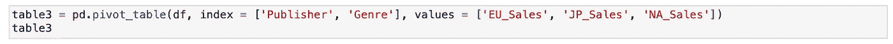
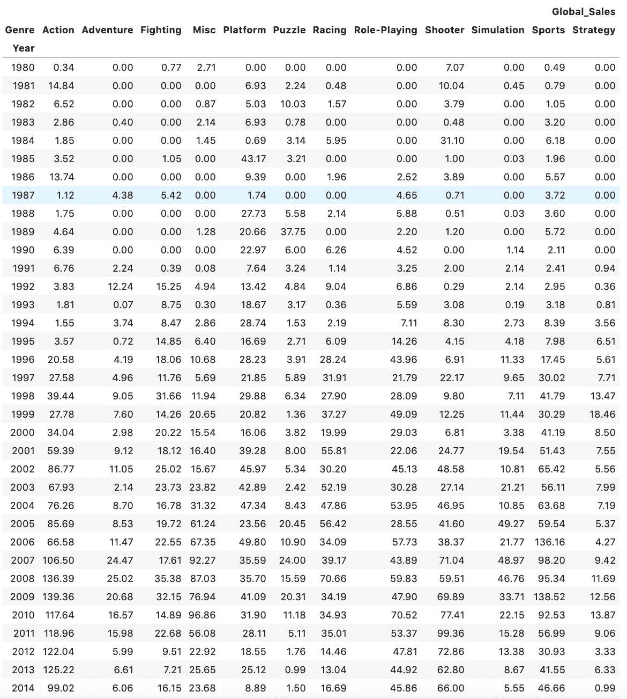

# 转向高效的数据汇总

> 原文：<https://towardsdatascience.com/pivoting-to-efficient-data-summaries-d2bfac31da4a?source=collection_archive---------39----------------------->

## 对数据实施数据透视表的快速指南

所有职业和行业中最强大的工具之一是数据透视表。在大多数传统分析中，Microsoft Excel 是必备技能，数据透视表是数据探索的核心。它们是动态的、相对直接的，并在数据的表层和深层提供重要的摘要。

资料来源:giphy.com

我本人来自基于 excel 的分析背景，当我在 Python 中处理数据时，从数据透视表的角度思考总是处于我思考过程的最前沿。在 Pandas 数据框架中使用数据透视表实际上相对简单，在汇总数据时可以节省大量时间和精力。让我们仔细看看如何在数据中直接实现数据透视表。

我们将使用一个显示多个大洲历史视频游戏销售的数据集。让我们首先导入必要的数据库，看看我们有哪些数据:

## **导入包&数据**

让我们看一下数据帧的快照。我们有视频游戏名称的等级、平台、记录年份、游戏类型、游戏发行商，以及来自北美、欧洲、日本、全球和其他地区的累计销售额。所有“销售”的销售数字都以**百万计。**查看我们的初始数据框架，我们看到 Wii Sports 是排名最高的游戏，全球销量相当于 8274 万。

这个来自 Kaggle 的数据集已经被清理过了，已经满了，所以我们不用担心任何数据清理，可以直接跳到数据透视表本身。

## 使用索引的基本数据透视表

创建数据透视表的语法非常简单。

我们指定数据、索引和想要聚合的列。生成的表格如下所示:

提醒:这些数值以**百万**为单位

这只是前十年销售的快照，但是我们可以看到给定列的数据汇总是多么简单和快速。这个数据框架现在很容易理解，并且可以被视为一段时间内的销售趋势。

我们很容易看到，随着时间的推移，日本是世界上最重要的视频游戏购买者，直到 1995 年左右，所有其他行业开始在销售上趋同。20 世纪 80 年代末，在视频游戏引入的第一波浪潮过去并成为一种社会规范之后，整体销售额显著下降。

让我们在表格中做一个小小的调整，将索引从“Year”改为“Genre”。

通过在代码中做这个简单的调整，我们可以得到一个完全不同的描述性统计数据。现在，我们可以通过流派和地理位置看到各种视频游戏的成功。我们看到平台和射击游戏是全球销量最高的视频游戏类型。在日本，角色扮演游戏卖得最多。

## 多索引数据透视表

如果我们想要跨多个索引进行聚合，pivot 函数只需要简单地增加' index '参数。我们唯一需要确定的是，我们以列表格式传递索引。现在让我们使用数据透视表来看看出版商的销售情况，然后是流派。

我们可以看到这是多么容易做到的，因为我们首先看到一个出版商公司的索引，然后是流派，接着是欧洲、日本和北美的各自销售情况。请注意，index 参数将['Publisher '，' Genre']作为其参数。我们指定“值”参数只包括欧洲、日本和北美的销售额。自然，最终的数量会低得多，因为有大量的出版商，所以销售会少得多。

## 具有不同聚合的数据透视表

默认情况下，数据透视表将使用 sum 函数聚合值。然而，我们并不总是希望这样。也许我们想检查平均值、中间值或标准差。这些都可以通过对数据透视表语法中的“aggfunc”参数进行简单修改来实现。

我们以字典的形式输入' aggfunc '参数，将聚合列指定为键，将我们想要的聚合函数指定为值(使用 numpy 函数)。在我们的例子中，我们对欧洲销售额使用平均值，对全球销售额使用总和，对日本销售额使用中值。通常，我们不会混合使用这些集合函数，因为这会导致一个混乱的表格，但是对于这个实验来说，这样就足够了。

## 数据透视表内的关系

最后，让我们看看在 x 轴和 y 轴上使用可变索引。我们想尝试看看每年每种类型的全球销售额。我们可以像前面的表格一样创建一个多层次的索引，但是因为有这么多的年份和这么多的流派，这将会形成一个非常长且无法消化的表格。相反，我们将列指定为特性索引，然后声明我们正在聚合的值。

该表现在在 y 轴上显示年份(索引参数)，在 x 轴上显示流派(列)。聚合函数对全球销售额求和。我们现在可以很容易地看到，例如，2011 年射击游戏在全球销售了 9936 万美元。

*注意:可以将“fill_value”参数调整为等于 0、NaN 或任何其他聚合函数，如列的中值或平均值。标准 NaN 填充流程适用。*

希望这将帮助您以更有效和高效的方式总结和探索您的数据，甚至帮助您从 Excel 分析转向 Python(参见我在那里所做的)!