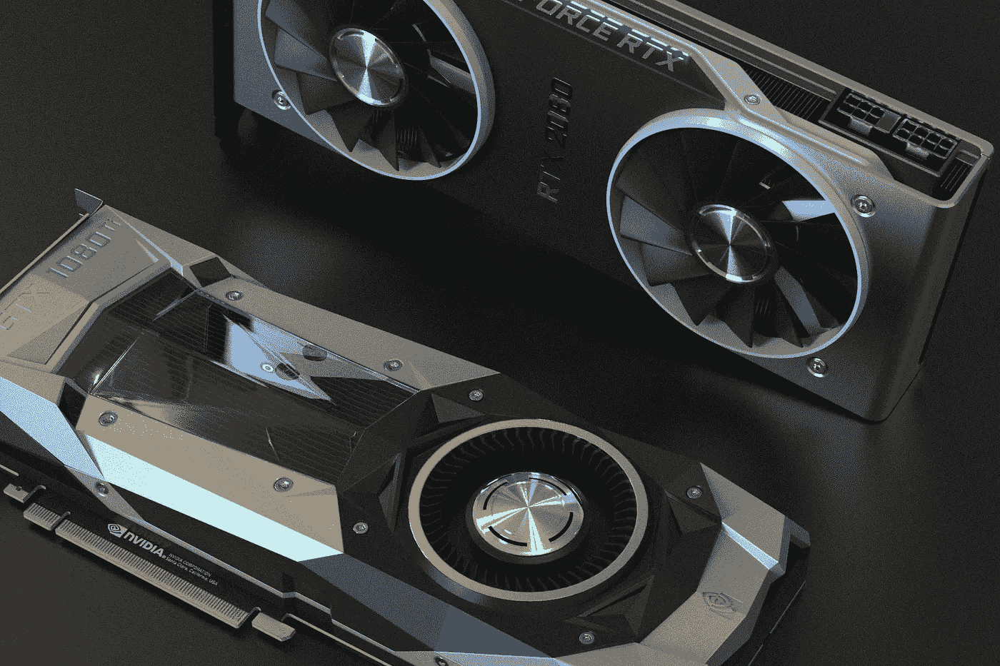
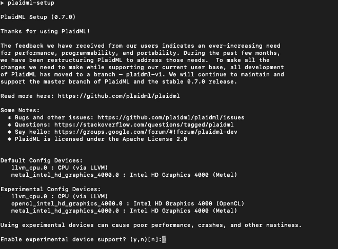
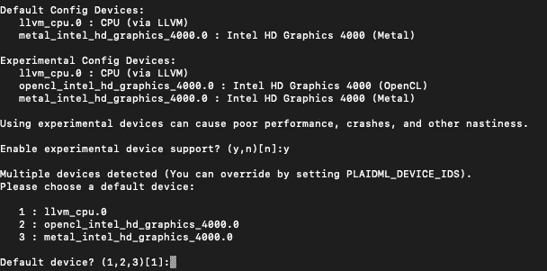

# PlaidML:基于预算的深度学习

> 原文：<https://towardsdatascience.com/plaidml-deep-learning-on-a-budget-ce22b58ba8c2?source=collection_archive---------17----------------------->

## PlaidML 允许人们像使用 Nvidia 显卡一样使用他们的 Intel 和 AMD 硬件

在深度学习和人工神经网络(ANN)的世界中，硬件一直是讨论的主要话题。由于 TensorFlow 等软件包，GPU 已经能够加速训练，并提供更精确的准确度分数；然而，它们通常都有很高的价格。在这个博客中，我希望勾勒出图形卡的世界，并为那些试图在预算有限的情况下学习人工神经网络的人提供替代方案。

在开始安装和使用 PlaidML 之前，我想先讨论一下显卡的重要性，以及为什么它会被广泛应用于深度学习。在每个专用显卡中，都有一块板(类似于主板)、专用散热风扇和一个处理单元(类似于 CPU)。这对深度学习如此有帮助的原因是，它为研究人员提供了同时运行多个进程的能力，同时释放了 CPU 工作负载——这反过来又允许更快的计算和更有效的 CPU 周期。今天，一个经常跟随深度学习的流行名字是 Nvidia，一家专注于 GPU 硬件的公司。英伟达在深度学习领域如此受欢迎的一个原因是，该公司提供允许这种类型培训的软件。例如，GPU 的传统用途往往是图形处理，如游戏、图形设计和视频编辑。当涉及到神经网络时，问题是大多数图形卡都是为了给它们如何处理视频的指令而创建的。Nvidia 已经成为这里的一个大玩家，因为他们已经创建了他们的硬件，以便它可以被给予各种不同的指令，而不仅仅是如何处理视频或游戏。虽然英伟达是提供深度学习软件的领导者，但出于同样的原因，他们也有比竞争对手更昂贵的产品。

RTX & GTX 显卡(图片来源:[娜娜杜瓦](https://unsplash.com/photos/A1blvxJxGU0)

我可能只是一个典型的粉丝，但我是 AMD 的所有方式。如果你从来没有听说过 AMD，他们是一家不仅专门研究 CPU，而且也研究 GPU 的公司。在过去的几年里，他们已经能够扩展他们的产品，超过像英特尔这样的大公司，在某些情况下也超过 Nividia。这里唯一的问题是 AMD 没有专注于深度学习，而是更关注游戏和图形设计等方面的计算机性能。

我如此热爱 AMD 的原因是我内心是一个游戏玩家。在我开始学习深度学习和神经网络之前，我真的很喜欢计算机硬件，以便提高我在堡垒之夜和英雄联盟等游戏中的表现。像许多其他游戏玩家一样，我遇到的问题是，由于内置的硬件，游戏电脑的价格通常比传统电脑和游戏控制台高得多。话虽如此，但考虑到现代英特尔 CPU 的价格可能在 200 美元到 1000 美元之间，而 Nividia GPUs 的价格在 500 美元到 1200 美元之间，我有点气馁。记住，这些只是你组装一台电脑所需的 6 到 7 个零件中的 2 个。然而，随着我做了越来越多的研究，我开始更多地了解 AMD 如何利用其竞争对手的价格优势。AMD 提供相同的硬件，如果性能不比其他领先品牌更好的话，但价格是其他品牌的一小部分。经过几个月的研究，我最终购买了锐龙 7 2700x 8 核 CPU(200 美元)和 RX 580 8gb GPU(220 美元)。为了与他们的竞争对手进行比较，英特尔提供了一款定价 350 美元以上的 8 核 CPU，而英伟达提供的 GPU 性能几乎相同，价格为 400 美元以上。因为 AMD，我能够建造我自己的计算机，它是强大的*和*，比我使用英特尔或英伟达的成本低得多。

然而，一旦我开始进入深度学习和数据科学领域，我非常失望地看到 TensorFlow 和其他流行的软件包只能与 CUDA 核心(Nvidia 的技术)一起工作。这对我来说毫无意义，因为英伟达和 AMD 之间的性能如此之小，以至于在玩计算密集型视频游戏时，你几乎感觉不到差异，所以为什么不能在 AMD GPUs 上进行深度学习呢？这里的答案不是因为他们没有能力或不如他们的竞争对手，而是因为 AMD 没有真正像 Nvidia 那样花费金钱或人力来开发这些类型的软件。

这让我想到了 PlaidML，这是我用过的最好的开源库。PlaidML 允许人们像使用 Nvidia 显卡一样使用他们的 Intel 和 AMD 硬件。像 TensorFlow 一样，PlaidML 作为 Keras 的后端，允许计算在你的显卡而不是 CPU 上进行。在本教程中，我将向您展示如何设置 PlaidML，以及与仅使用 CPU 相比，它如何能够将训练速度提高近 4 倍甚至更多。

PlaidML Logo ( [Github](https://github.com/plaidml/plaidml) )

在输入下面的代码之前，我建议创建一个虚拟环境，这样您就可以隔离这些更改，以防您想要恢复到旧版本。

在您的终端中，使用以下命令安装 PlaidML:

pip install -U plaidml-keras

安装 PlaidML 后，您必须通过在终端中键入以下命令来配置计算机中的硬件:

plaidml-设置

当出现此消息提示时，键入 y(是)并按 enter 键。然后会出现另一个屏幕提示您选择不同的选项。它应该是这样的:

我当前机器上的显卡是英特尔高清显卡 4000。这可能与您在终端中看到的有所不同，但无论如何，请选择 OpenCL 选项，然后按 enter 键。

就是这样！！

安装 PlaidML 后，运行以下代码:

运行上面的单元后，您应该看到以下内容:

使用 PlaidML 作为 Keras 后端

如你所见，我们没有将 TensorFlow 显示为后端，而是成功地将其更改为 PlaidML。现在，每当你运行一个带有神经网络的单元时，它将利用你在设置时指定的图形卡，而不是你的 CPU。

我想说明的是，这个教程是在 Mac OS 上完成的。在我运行 Windows 10 的游戏电脑上，要完成这个任务要稍微复杂一点。如果您使用的是 Windows 机器，请遵循与 Mac 相同的步骤。如果您运行上面的单元格，它仍然显示 TensorFlow backend，那么您必须找到 keras.json 文件，并将后端从“TensorFlow”更改为“plaidml.keras.backend”。

虽然这个软件包将帮助训练速度提高 4 倍或更多，但根据您使用的显卡，您仍可能会遇到内存问题。我还想指出的是，很多笔记本电脑和台式机都不是为处理这种计算而设计的，所以我建议安装第三方软件来监控你电脑内的温度。如果你训练超过 30 分钟，看到你的 CPU 或 GPU 超过 90-100 度，我会停止训练，并找到一个替代方法，因为你不想损坏你的电脑(特别是 MAC 电脑……业界最差的散热)。