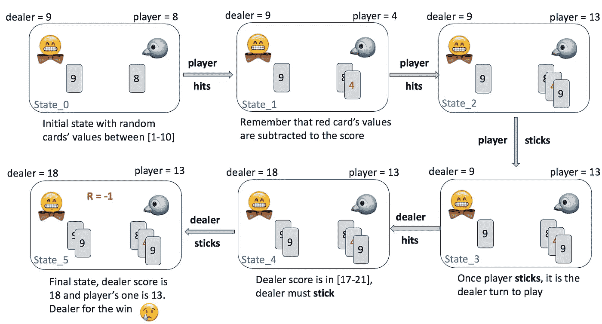
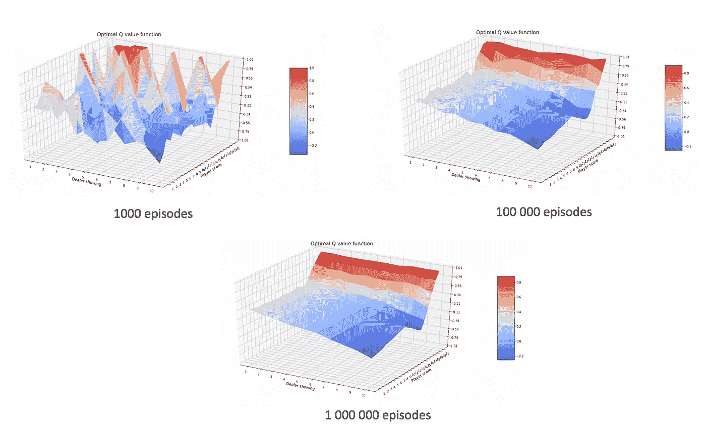
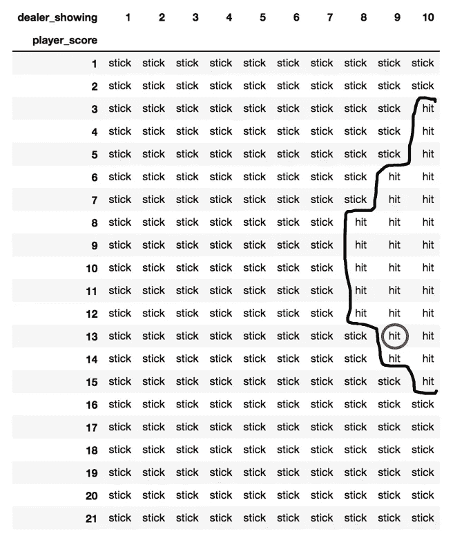
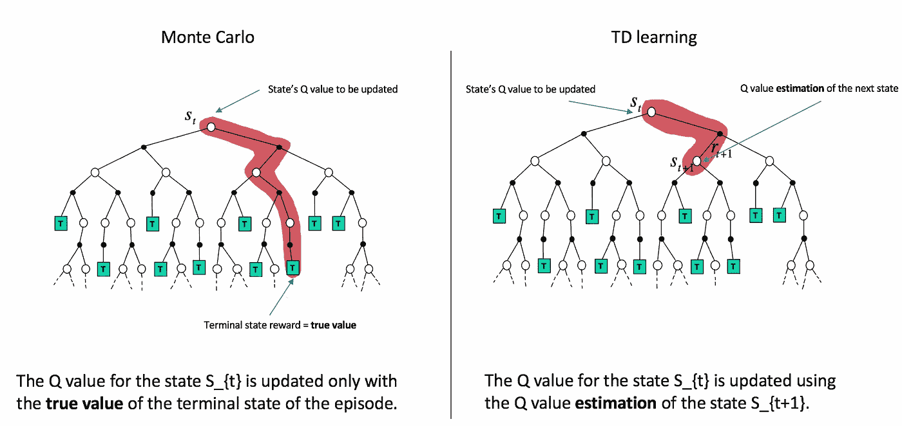
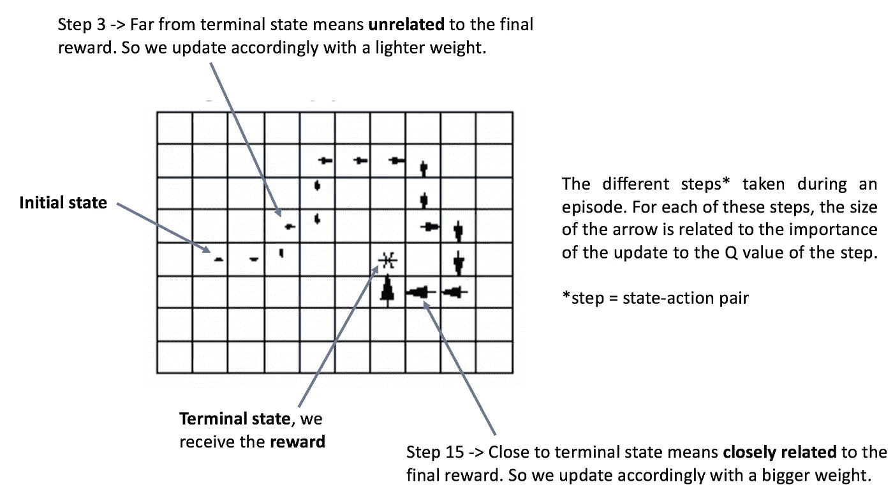
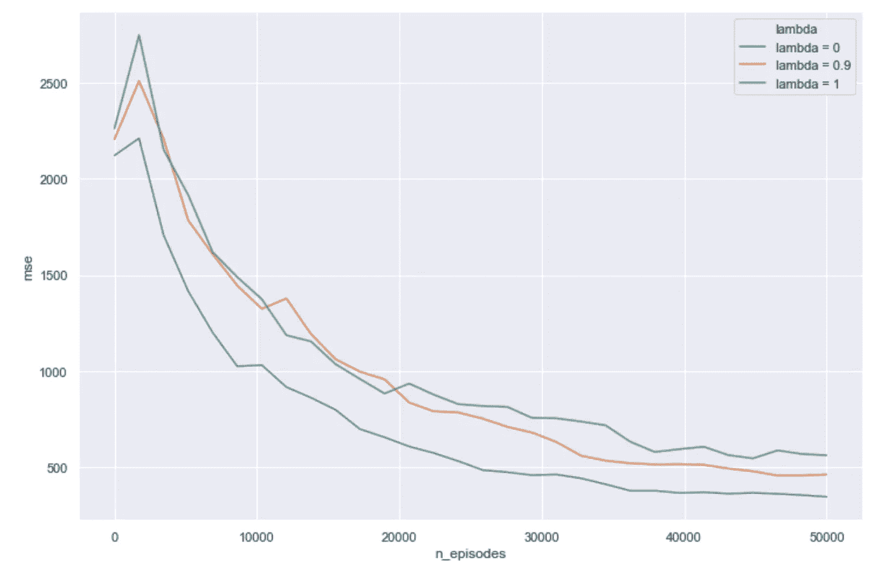
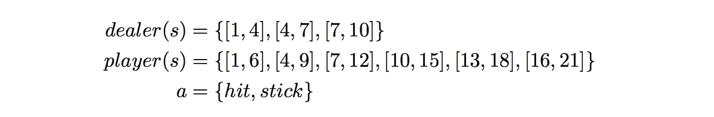
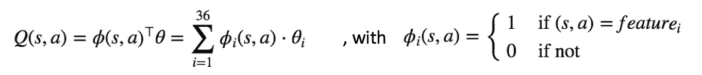
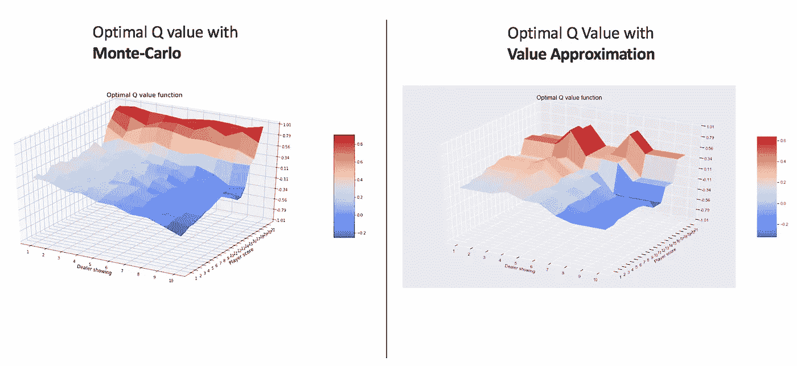

# 强化学习扑克牌

> 原文：<https://towardsdatascience.com/playing-cards-with-reinforcement-learning-1-3-c2dbabcf1df0?source=collection_archive---------31----------------------->

## 概念和代码🐍

♣️️蒙特卡洛赌场夜♠️ [来源](https://www.montecarlosbm.com/fr/casino-monaco/casino-monte-carlo)

今天，我们要去打牌！嗯，不完全是这样…我们打算造一个像职业玩家一样玩纸牌游戏的机器人😎🔥
更确切地说是 **Easy21** 游戏，是 21 点的一个变种。我从大卫·西尔弗在 UCL 的强化学习任务中挑选了这个项目。我认为这是一种有趣的方式，通过对每个人都有意义的真实具体的应用来抓住一些基本的 RL 概念:

> 尝试在任何情况下击败庄家💪

这篇文章是一篇个人笔记，我用它来提醒我并说明一些核心 RL 概念。所以，我会建议一个完全的 RL 初学者花些时间熟悉 RL 的词汇，因为我不会在基础上花太多时间。

让我们首先描述一下 Easy21 规则:

*   牌的值在 1 到 10 之间(游戏中没有人头)
*   玩家和庄家都从一张随机的牌开始
*   有 2 种可能的行动，玩家/庄家可以选择**击**(挑选一张新牌)或**棒**(停止挑选牌)
*   黑卡的值相加，而红卡的值从分数中减去(而不是与 21 点相比一直相加)
*   当庄家出牌时，他遵循一个固定的策略，如果他的分数在 17 和 21 之间，他就用**打**，否则就用**打**
*   如果牌的总数小于 1 或大于 21，玩家/庄家输

简而言之，Easy21 比 21 点更“复杂”，因为你可以减去牌的价值。你可能想检查图 1。下面看一个**完整的游戏序列示例**(在 RL 中称为**集**)或者看一下[任务](https://www.davidsilver.uk/wp-content/uploads/2020/03/Easy21-Johannes.pdf)的完整描述。

图一。RL 中的一个游戏序列或**集**…希望在不久的将来我们训练有素的代理人🤖会挑更好的动作让我们赢！

现在我们更好地理解了 Easy21 中发生的事情，让我们简单地介绍一下 RL 的一些基本概念，为我们的问题提供一个更正式的背景。RL 是关于在给定的**环境**中为**代理**找到**最优** **策略**。简单地说:RL 是在给定 **Easy21 规则**的情况下，为**玩家**找到**最佳策略**。

在 RL 中，代理人**通过奖励分配**进行学习。对于 Easy21 中的每个终端状态，**获胜状态**(玩家得分>庄家得分)、**松散状态**(玩家得分<庄家得分)或一个**平局状态**(玩家得分=庄家得分)关联一个奖励，分别为 **+1** 、 **-1** 和 **0** 。

由于奖励，代理学习了所谓的 **Q 值函数**。简而言之，Q 值函数是给定状态-行为对的**期望报酬。简单地说，Q 值是在特定情况下对潜在回报的估计。这个 Q 值函数是 RL 跳动的心脏💘**

现在我们可以把 Q 值函数想象成一个大的**查找表**，在这里我们可以找到给定一个**状态**和一个**动作**的相关预期报酬。

一旦 Q 值函数被计算出来，我们的代理人将会知道在给定的游戏状态下，哪一个动作，击或棒，具有最高的期望回报。记得在图 1 中，在状态:{玩家得分= 13，庄家得分= 9}中，玩家被粘住并输了。也许这不是最佳的行动，也许是…一个人怎么能忍受这样的不确定性...保持信念，RL 会告诉我们🔮

这篇文章涵盖了 3 种评估最佳策略的常用方法:**蒙特卡罗控制、SARSA(λ)** 和**数值逼近**。

闲聊够了，让我们做点真正的研究吧🚀

如果你对代码有更好的理解，你可以直接去注释本👇

 [## Matyyas/Easy21

### 实现各种 RL 算法学习玩 Easy21 - Matyyas/Easy21

github.com](https://github.com/Matyyas/Easy21) 

# 一.环境

首先，我们必须定义我们的**环境**，在这里我们的代理将学习在给定的状态下选择哪一个动作(击打或坚持)来击败庄家。
环境简单编码 Easy21 的规则。参考[笔记本](https://github.com/Matyyas/Easy21)查看实施细节。

太好了！但是现在我们有了一个代理环境，我们如何学习在这个环境中遵循最优策略呢？

# 二。蒙特卡罗控制方法

在本节中，我们将用简单的英语解释蒙特卡罗控制(MCC)方法背后发生的事情。但是，您可以去查看笔记本[以深入了解实现的细节。](https://github.com/Matyyas/Easy21)

让我们首先揭开这些术语的神秘面纱:

*   Monte-Carlo 是一个花哨的名字，用来表示我们将对剧集进行采样(在我们的例子中是游戏序列)。
*   控制意味着我们将找到最佳策略，即在任何状态下选择最佳行动，以最大化我们的获胜机会。

使用 MCC 方法，我们首先开始**取样一集↔️使用“当前”策略玩 Easy21** 的游戏，并观察终端状态的回报。
然后，非常简单，我们**更新**在采样剧集中遇到的每个状态-动作对的 Q 值函数(预期回报),该函数与在剧集结束时观察到的回报有关。

> 上面的**更新步骤**是从 MCC 代理的脑袋里面看到的:“如果玩的游戏是赢的(resp。损失)，我已经采取的状态-动作序列的值应该增加(相应地。减少了)”。

假设 Q 值函数已经更新，我们可以在它的基础上建立一个“新”策略，并且我们准备使用这个“新”策略来采样新的情节。

现在重复这个**采样/更新过程**，直到你达到固定的集数，或者直到新的策略与当前的策略不变……这里你有一个很好的**最优 Q 值函数**👨‍🍳

图二。显示了我们选择采样 1000、100 000 或 1 000 000 集时获得的不同最佳 Q 值函数。我们逻辑上看到，样本越多，最优 Q 值函数越平滑。

图二。**最佳 Q 值对不同数量的采样集起作用**。正如所料，采样的剧集越多，最佳 Q 值函数的方差越小。

根据上面计算的最优 Q 值函数(越红，预期奖励越高)，代理现在可以识别在任何给定状态下选择哪个动作，以优化他以获胜结束状态结束的机会。那是我的朋友们的**控制**👊

记得图 1，在状态:{玩家得分= 13，庄家得分= 9}，玩家**被粘住，输了** …现在，我们训练有素的代理🤖知道他将有更高的机会赢得它，他选择了**而不是**，正如我们在图 3 中看到的。

图三。🏆**最优策略**又名 RL 的 Holly Graal，在抽样一百万集后计算得出🏆

有了上面的最优策略，我们的代理人知道在任何可能的状态下应该采取什么样的行动来增加击败庄家的机会💥🥊

综上所述，MCC 是通过**采样剧集** **↔️玩 Easy21** 的多个游戏来学习的，采样的剧集越多，学习的越好。在 Easy21 这样的简单游戏中可能没问题，但是在更深的环境中，采样一百万或更多集可能是不可行的……为了克服这个主要缺点，我们需要从不完整的集开始学习。

# 三。**萨莎(λ)**

尽管这种算法的名字听起来像某种晦涩的蛇佬腔公式⚡🐍，SARSA 简单来说就是 **S** tate，**a**action➡️**r**eward， **S** tate **'** ，**a**action**'**的首字母缩写，这与算法向最优更新 q 值函数的方式有关。 **λ** 是一个模型的参数，我们将很快进一步开发。和往常一样，用代码更好理解的可以直接去[笔记本](https://github.com/Matyyas/Easy21)。

[***NB***](http://r)*:SARSA 方法有两种观点，一种是* ***前进*** *和一种* ***后退*** *观点，这两种观点都与* [*相当*](http://incompleteideas.net/book/first/ebook/node76.html) *。在这篇文章中，我们将只关注* ***向后*** *视图，因为它是我们使用的实现。*

🔎SARSA 算法的核心有两个主要概念，我们将在深入研究该方法之前简要回顾一下(如果有兴趣，我将留给读者来深化这些[主题](https://www.davidsilver.uk/teaching/))。

*   **时间差** (TD) **学习** : TD 学习是指我们要查看未来一步的 Q 值，以将当前 Q 值更新为这个未来 Q 值**估计值**。更简单地说，我们调整当前的 Q 值以更好地匹配未来的 Q 值估计。
    因此，Q 值在运行中被更新**，SARSA 开始从不完整的剧集中学习，而不是像在 MCC 中那样在采样剧集结束时学习(图 4 示出了该学习过程)。**

****

**图 4:蒙特卡罗和 TD 学习的比较**更新步骤** ( [来源](https://www.davidsilver.uk/wp-content/uploads/2020/03/MC-TD.pdf))**

**[***NB***](http://r) *:使用* ***现有估计*** *进行 Q 值更新，这就是为什么 SARSA 在文献中也被称为* ***自举*** *方法。***

*   ****资格痕迹**(👽ET):利用 ET，我们想要对每个状态-动作对的 Q 值更新进行加权，关于:**多频繁** t 和**多长时间前**在情节的给定步骤看到状态-动作对。
    λ参数又名**轨迹因子**指定轨迹消失的“速度”。λ参数在 0 和 1 之间，越接近 0 意味着衰落越快，越接近 1 意味着衰落越慢。这个概念用图 5 中的 Gridworld 示例来说明。**

****

**图五。一个简单的 Gridworld 环境示例来捕捉**资格跟踪**概念。为了适应我们的 Easy21 环境，需要做一点小小的心理调整**

**SARSA(λ)没有在 **TD 学习**或**蒙特卡罗采样**之间进行选择，而是使用**跟踪因子λ** ，从 0 到 1 进行缩放，以**结合两个概念中的最佳概念**。如果λ=1，我们回到经典的 MCC 方法(之前在第 II 节中看到),如果λ=0，我们进行简单的(一步)TD 学习更新。我们的工作是寻找和挑选最佳λ，使代理在不破坏其学习的情况下最快地学习最优策略。**

**与蒙特卡罗相比，**用** **SARSA 学习的代理不需要采样那么多片段来收敛到最优策略**，这得益于它从不完整片段中学习的能力。当剧集非常长，并且对其中许多剧集的采样开始变得计算过于密集时，这非常有用。如果你不相信我，请看图 6！👇**

****

**图六。 **MSE 曲线**在 ***最佳 Q 值*** 和**计算出的 Q 值**之间，取决于采样集数和不同的λ值。正如预期的那样，与经典 MCC 方法(λ=1)相比，TD 学习方法(λ=0)需要**更少的事件来收敛**到最优 Q 值函数。**

**我们刚刚部署的所有 RL 武器库还可能出什么问题？🤔其实还有最后一件事我们还没有考虑…
在 Easy21 中，有 10*21*2 = 420 个不同的状态-动作对。然而，在现实生活中，环境往往有成千上万种可能的状态和动作，甚至是连续的状态和动作域。在这样的环境中，不可能再存储或显式计算每个状态-动作组合，因此需要一个**Q**值函数近似值来将我们从这种维数灾难中解放出来。**

# **四。价值近似值**

**最后，一个有意义的标题🙌！**值近似** (VA)令人惊讶地意味着它所暗示的:我们将**近似 Q 值函数**，而不是为所有可能的状态-动作对计算它。**

**为了近似我们的 Q 值，我们将需要减少可能性的范围。为了做到这一点，我们可以想象一个对游戏有深刻了解的 Easy21 专家玩家，指导我们构建下面的特性(图 7)。这位专家知道什么样的庄家得分区间和玩家得分区间是有意义的，以便像职业玩家一样玩游戏。在 ML 中,**特征工程步骤**总是与领域专家的知识质量直接相关，并且可能与环境复杂性有关。**

****

**图 7。pro Easy21 播放器的不同**工程特征**。**

**记住上面所有的方法，我们可以把 Q 值函数看作每个状态-动作对的查找表。
**现在，我们正在使用 3∫6∫2 = 36 个可能的工程特征组合来对 Q 进行建模，这比我们之前的 420 个可能的状态-动作对要少得多。****

****

**图 8。没有更多的查找表，Q 值是一个线性函数。**

**Q 值函数不再是一个查找表，而是一个依赖于某些权重的函数。现在，我们需要学习最佳权重，以使我们的近似函数尽可能接近最佳 Q 值函数。
因此，前面章节中的“经典”更新步骤被线性函数的权重θ 的**更新所取代。很简单，对吧？****

****

**图九。我们都知道…ML 没有免费的午餐。当比较 MCC 和 VA 的 100 000 集后的 Q 值时，我们可以看到，时间和空间复杂度的降低伴随着精确度的降低。**

**[***NB***](http://r) *:在我们的例子中，我们实现了线性值近似。然而，可以考虑使用非线性方法，并进入使用神经网络逼近 Q 值函数的* ***深度强化学习*** *的惊人领域。使用神经网络导致更高的表示能力，并使特征工程无用。下集见……***

**好了👌！我们的强化学习之旅现在结束了，你是到达这篇文章终点的勇敢者之一，你的灵魂无疑会去瓦尔哈拉🙌**

****资源:** -【1】帖子的笔记本(所有代码/剧情都在那里):**

** [## Matyyas/Easy21

### 实现各种 RL 算法学习玩 Easy21 - Matyyas/Easy21

github.com](https://github.com/Matyyas/Easy21) 

- [2]大卫·西尔弗在 UCL 的完全在线和免费的 RL 课程( [youtube](https://www.youtube.com/watch?v=2pWv7GOvuf0) )
- [3]这个惊人的 Github [资源库](https://github.com/dennybritz/reinforcement-learning)收集了最知名的 RL 算法**