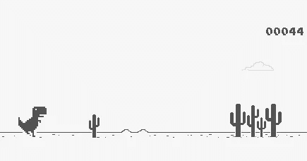

# 通过身体上的跳跃和蹲下来玩 chrome 的恐龙游戏

> 原文：<https://towardsdatascience.com/playing-chromes-dino-game-by-physically-jumping-and-crouching-a3d319234727?source=collection_archive---------32----------------------->

## 一个有创意的 PoseNet 应用程序，它运行在你的浏览器上，并试图预测你是在跳跃、蹲伏还是静止不动

截图来自 chromedino.com

你们都知道这个游戏的内容。这是世界上最好的离线道歉服务页面。人们制作了简单的机器人，在恐龙跳起来打败游戏的时候，用 CNN 状态编码器强化学习代理。

这是个游戏，我们应该玩得开心。今天，我将带你了解如何编写一些 JavaScript 代码，通过在房间里跳来跳去来玩这个游戏。

*这个东西很难玩。*

> 你可以试试游戏[这里](https://ntakour.is/posenet-dino-game/)查看完整源代码[这里](https://github.com/ntakouris/posenet-dino-game)。

# 克服技术壁垒

对于经验丰富的开发人员来说，建立一个具有基本 javascript 支持的小网页来获得网络摄像头提要和 dino 游戏容器是微不足道的。你所需要的只是最新的 chrome，一个`<video>`标签，[一些从 stack overflow](https://stackoverflow.com/questions/48049285/webcam-video-stream-not-showing-in-html5-video-tag)和[抓取的 t-rex 游戏](https://github.com/wayou/t-rex-runner/)加载网络摄像头的 JavaScript 片段。

接下来是有趣的部分。运动/动作检测。

Tensorflow Lite 开源了许多针对网络或移动应用的微调模型。我决定使用完整的(下半身和上半身)姿势探测器。通过在您的`<head>`中添加这两行代码，您可以导入 tensorflow lite for javascript 以及我在这里使用的模型。

下载并准备好每个依赖项后，我们可以开始处理相机元素的`loadeddata`事件。

一旦网络摄像头准备就绪，加载模型并开始姿势预测循环。

我还通过在 video feed 容器上添加一个点击事件，加入了一个小的录制播放/暂停功能。

# 检测动作

Posenet 输出每个预测骨骼位置的列表，以及一个*得分*值。

[https://www . tensor flow . org/lite/models/pose _ estimation/overview](https://www.tensorflow.org/lite/models/pose_estimation/overview)

为了简单起见，我们的算法非常简单。

1.  挑出左右髋骨
2.  选择最有把握(得分)的髋骨
3.  如果分数不是`> 0.6`(比随机猜测好)，则转到下一帧
4.  否则，在`y`轴上执行简单的阈值处理来检测动作

这是目前为止我们算法的第一部分:

继续进行**阈值处理。**

亲亲。

*   如果臀部位于摄像头进给的下部(底部`20%`),则将其视为下蹲。
*   如果臀部在进给的中间(在摄像机进给高度的`20%`和`70%`之间)，则视为空转。
*   否则，将此视为跳转

> 当然，这是假设玩家站在摄像机前的正确位置。这很容易做到。只要确保你离得很远，让你的臀部在视口的中间，有足够的空间让你可以蹲下和跳跃。

最后一部分，实现`toggleAction`非常简单。我们只是要模拟按键事件。键码`32`表示空格键，键码`40`表示下箭头。

> 你可以在这里试玩游戏[，在这里](https://ntakour.is/posenet-dino-game/)查看完整源代码[。](https://github.com/ntakouris/posenet-dino-game)

就是这样。感谢阅读！