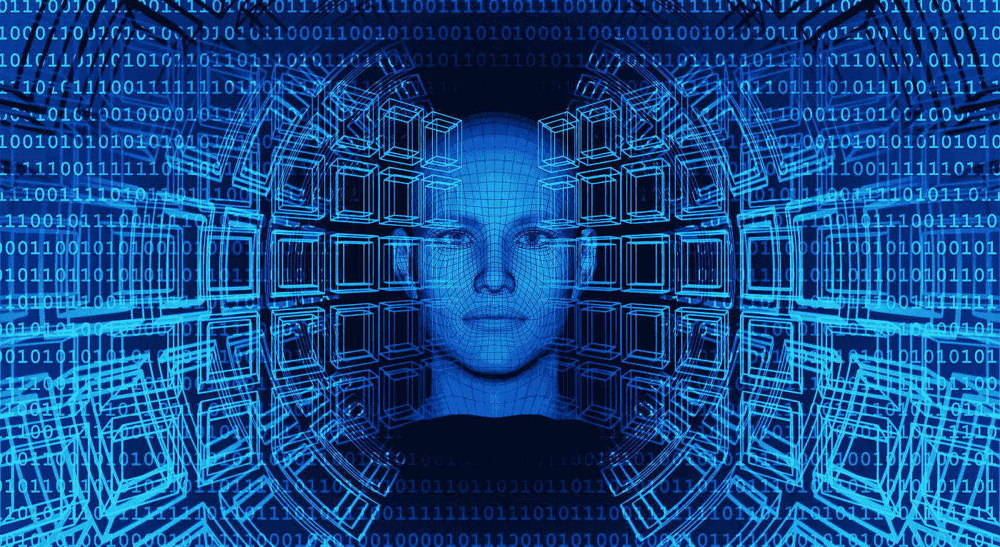
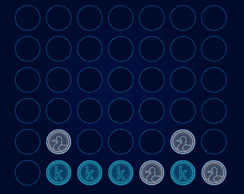
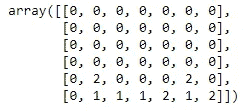
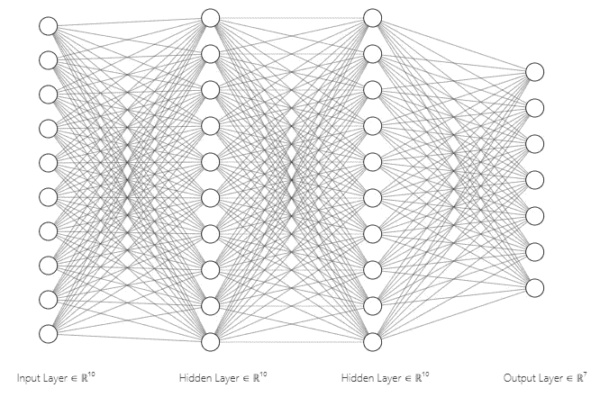

# 用深度 Q 学习玩 Connect 4

> 原文：<https://towardsdatascience.com/playing-connect-4-with-deep-q-learning-76271ed663ca?source=collection_archive---------12----------------------->

## 通过一个著名的游戏环境探索强化学习的力量

信用:allthefreestock.com

深度 Q 学习可能是所有强化学习中最重要的算法之一，因为它对它可以在复杂环境中进行的观察和采取的行动没有限制。这种强化学习方法结合了深度神经网络，允许代理重复“玩”一个环境，并通过一个观察、行动和奖励系统随着时间的推移学习环境。与标准的深度神经网络实现相比，这种结构具有明显的优势，因为它允许代理与其周围环境进行交互，从周围环境接收反馈，然后针对期望的(高回报的)未来动作进行优化。在这篇文章中，我们将看到一个熟悉的环境，它是最近由 Kaggle 在其 Kaggle 竞赛([https://www.kaggle.com/c/connectx](https://www.kaggle.com/c/connectx))中实例化的。

Kaggle 环境中的电路板状态示例

在我们开始探索深度 Q 学习代理的结构以玩 Connect 4 之前，让我们首先简要概述一个简单的、不太有用的 Q 学习代理的结构。Q-Learning 的基本思想是创建整个观察空间的地图，并在这个地图中记录代理的动作。随后，每当代理遇到相同的观察时，它将基于其先前的动作是否获得了正面或负面的奖励来递增地更新其先前采取的动作。这种数据结构被称为 Q 表，其中存储了观察空间中每个观察的先前动作。Q 表的这种增量更新通常通过以下 Q 学习等式来完成:

虽然这个等式乍一看似乎很复杂，但它只是简单地使用预期回报来更新与当前观察相对应的 Q 表的特定位置。通过一个代码示例可以更好地理解这一过程，尽管对我们的深度 Q 学习项目来说没有必要，因为我们将使用深度神经网络来更新我们的“Q 表”(稍后将详细介绍)。

为了更好地理解 Q-learning 的本质，让我们从我们非常著名的环境 Connect 4 的角度构建一个观察示例。以下是在游戏期间连接 4 板的上述示例状态，换句话说，观察空间的元素(玩家 1 筹码:1，玩家 2 筹码:2，空白空间:0)

之前显示的由神经网络看到的电路板观察

在这里，我们看到了先前播放的片段的特定排列，这些片段将作为观察结果发送给代理。代理将获取该观察结果，并在其 Q 表中找到该观察结果。本质上是问自己这样一个问题，“上次我看到这些碎片的排列时我做了什么，这次我如何做得更好？”。然后，它将继续以适当的方式行动，并在整个过程中为每次移动在 Q 表中的适当位置更新动作。从总体上看，这似乎是 Q-Learning 的一个很好的用例……而不是一个微妙的例外。你抓住它了吗？

# **标准 Q 学习的局限性**

Q-Learning 结构对于某些环境非常有用，但是它在其中起作用的环境的数量非常有限。这要归功于之前说过的一句话:“Q-Learning 的基本思想是创建整个观察空间的地图……”。即使在我们简单的 Connect 4 环境中，想想这意味着什么。在 Connect 4 中，我们有 42 个条目，可以由玩家 1 筹码、玩家 2 筹码或无筹码来填充。我们也必须给予重力应有的重视；因为只有在格子下面的空间中有先前玩过的筹码时，才可以在格子的位置中玩筹码。此外，如果任何 4 个相同颜色的筹码排成一行，游戏结束，因此未来的情况不能包括在观察空间中。这相当于一个有点复杂的计算，就像我们已经说过的；尽管如此，您可以看到可能的观察值的数量开始迅速增加。根据网上的整数序列百科全书，结果是 4531985219092(【oeis.org/A212693】T2)。我不知道你怎么想，但对于我的 1TB 硬盘来说，4000 亿次的入门级 Q 表似乎有点太大了。因此，标准 Q-Learning 不是一个好的起点，让我们转向一个不同的解决方案。

# 深度 Q 学习

记住了 Q 学习的基础结构，深度 Q 学习就很容易理解了；唯一的区别是 Q 表的替换。在 Q 学习中，对于具有大观察空间的环境，Q 表的限制很快达到。如果我们知道某种算法，可以将观察结果与我们从奖励中计算的某种损失函数结合起来，并对观察到的环境进行某种*概括*以选择单个输出(或动作),那么我们就不必存储这么多环境观察结果了。任何对机器学习感兴趣的人都知道，*、*深度神经网络就是针对这个问题的工具。总之，为了简化我们在 Connect 4 游戏中观察空间的惊人大小，我们将使用一个标准的 Q 学习结构，用一个简单的深度神经网络替代原本是 Q 表参考的内容。

# 连接 4 Kaggle 环境

为了方便起见，我们将使用正在进行的 Kaggle 竞赛中的 Connect X 框架(稍加修改)来构建我们的代理。这将允许我们非常简单地从环境中获取观察结果并向环境发送行动，而不必自己构建 Connect 4 游戏。接下来的 4 行代码处理环境的构建，以及两个代理相互玩 Connect 4 的模拟，在这个例子中是两个随机代理(【https://pypi.org/project/kaggle-environments/】)。该环境为训练提供了“随机”代理和“negamax”代理；其中，随机代理人只是进行随机合法移动，而 negamax 代理人进行初级水平，但优于随机合法移动。考虑到这一点，我们意识到自我游戏的概念对于我们的模型与自身游戏的训练是至关重要的。

# 环境奖励修改

对 Kaggle 提供的环境所做的唯一微小的改变是手动计算游戏何时结束。这允许奖励决定不同种类的赢，输，和无效的移动。例如，当我们的代理人与随机代理人对抗时，垂直胜利很容易到来，因为随机代理人只会在 3/7 的时间里阻止垂直胜利。在这个特定的训练实例中，可能有用的是在纵向胜利上放置较少的奖励，例如，导致代理仅在第 3 列中玩，并且仍然使用明显不好的策略在每 7 场游戏中赢得 4 场。赢/输的确定由下面的函数演示。这是简单的蛮力迭代，分别通过所有可能的垂直、水平和对角线配置。

# 创建神经网络模型和优化器

这些步骤在某种程度上是不言自明的，假设读者之前已经接触过神经网络；但是，下面是对模型创建、损失函数和优化的简要概述。首先，该模型只是一个密集的神经网络，它是通过非常方便地使用 tensorflow.keras.layers 模块而构建的。我首先尝试使用卷积神经网络，因为我认为关系信息是有益的，但发现这样做效果不好(我认为是由于电路板的尺寸较小)。网络的输出有 7 个神经元，每个神经元对应于将一个芯片投入棋盘 7 个不同列中的一列的动作。

类似的结构，我们的隐藏层各有 50 个神经元。使用 alexlenail.me 网络工具创建

损失函数简单地取一集(或 Connect 4 的一个完整游戏)的回报之和，将它们应用于网络的每个输入和输出(分别为观察和动作)，执行交叉熵，并给每个观察/动作对一个与收到的回报成反比的损失值。例如，如果代理赢得一场游戏，整个游戏中的所有观察/动作对将获得 20 的奖励，这是我们奖励结构中提供的最高奖励。这将反过来导致一个小的损失值，因此是相反的关系。这种反向关系使得我们的优化器朝着正回报优化网络，因为任何标准优化器的目标都是*最小化*网络的损失。理论上(实践中很少)，最小化损失将增加回报，反过来增加网络做出决定的能力，从而在 Connect 4 游戏中获胜。

train_step()函数中的优化步骤对于深度学习经验丰富的人来说可能有点陌生。这是因为它使用了 GradientTape()模块，这是 tensor flow 2.0 版新增的模块。总的来说，该模块“观察”(或记录)调整后的网络梯度，并允许使用自定义损失函数轻松训练网络，正如我们在这里实现的那样，这是对旧版本的 model.fit()方法的重大改进。

# 选择具有ε衰变的行动——探索与开发

在所有的强化学习问题中，在*探索*和*利用*之间存在着不可避免的权衡。探索是指一个代理人做出一些与角色无关的决定(不是由网络决定的),试图找到新的策略，并可能从中获得回报；因此，这是一个学习更好策略的机会。利用就是利用网络已经学会的策略。例如，如果代理已经学习了一点如何玩 Connect 4，并且它总是利用它已经学习的技术，它将永远不会被呈现新的观察/动作对来学习。另一方面，如果代理人总是在探索新的策略，它本质上总是在玩随机移动，永远不会达到一个高水平的游戏来学习。处理这个问题的方式通常是通过一种被称为*ε衰变*的现象。epsilon 衰减中的 *epsilon* 可以被认为是代理选择随机动作而不是网络选择的动作的概率。epsilon decay 中的*衰变*就是这样:因为在训练周期的开始，我们期望代理是哑的，因为没有更好的术语，我们将让它做出很大程度上随机的决定，从而让代理探索更多而不是利用，因为它还没有学到任何可以利用的东西。随着时间的推移，ε会变得越来越小，也就是说:智能体会越来越多地开始利用它学到的知识；会越来越少探索随机行动。该代理将使用ε衰减函数*ε*= .99985^*x*，其中 *x* 是训练的剧集数。这将根据培训期的集数进行相应调整，在本例中，我们使用 40，000 集。

使用 Desmos.com 网络工具创建

# 创建代理

这部分很简单。代理只是一个函数，它接受观察，并发出动作。下面显示的是一个非常简单的代理，它通过神经网络发送观察结果并输出一个动作。虽然有一个小的补充，如果你愿意，一个错误修复:在' else '语句中，你会看到它只是选择网络预测的下一个最大概率动作，如果该动作被确定为无效。如果网络决定在已经满员的栏目中播放，则动作无效。你会注意到，经过大量的训练和适当的奖励结构，代理最终学会了只玩有效的行动；使这成为一种“以防万一”的功能。

# 终于，开始训练的时间到了

这里的工作流相对简单，因为所有的结构函数都已经构建好了。我们首先实例化我们的内存对象，该对象将用于将信息从环境传递到网络。然后，我们遍历每一集，在本例中为 40，000 集，按照前面描述的函数，将观察结果和奖励正确地传递给网络。如前所述，请注意我们定制的特定奖励。训练过程总共包括三次训练:第一次训练对抗随机代理，第二次训练对抗 negamax 代理，第三次训练对抗它自己(或者更具体地说，训练成扮演 2 号玩家角色的相同模型)。

# 结果呢

下面是我们经纪人(蓝色)对 negamax 经纪人(灰色)的一场比赛。总的来说，我对经纪人的表现印象深刻；很明显，代理已经想出了如何阻止获胜，如何赢得自己，以及如何只在尚未满员的栏中玩(这些无论如何都会被纠正，但它在训练的这一点上没有尝试无效的移动)。这个例子中我印象最深的招式是它的倒数第二招，32 招。这一步令人印象深刻，因为它不仅设置了一个胜利，而且实际上通过同时设置水平胜利和对角胜利来保证胜利。

# 结论

从该项目中获得的一些主要信息旨在解决:

1.  我意识到深度 Q 学习可能不是解决这种环境的最佳方式。我认为，如果我真的与这个代理人在 Kaggle 比赛中竞争，深度学习辅助的蒙特卡罗树搜索算法是最好的方式。我选择这条路线的原因是，由于每个算法能够处理的环境的复杂性，我对基于树搜索的算法的深度 Q 学习更感兴趣。深度 Q 学习可以处理任何观察空间，只要观察本身对于网络来说不是太数据密集。我觉得这种算法更适合实验，因为它更有可能在现实环境中实现，而树搜索类型的算法是专门为受限环境设计的，比如棋盘游戏。
2.  虽然代理人的行动确实令人印象深刻；我不认为它能与人类水平的智力竞争。这个算法的训练过程只花了一天多一点的时间，我不想继续分配 GPU 资源来让它继续训练，但我有兴趣看看这个算法的过度训练是否会允许更大的改进，或者它是否接近其技能水平的最大阈值。