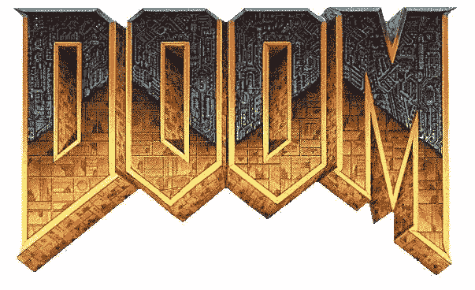
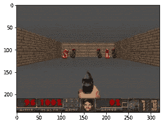
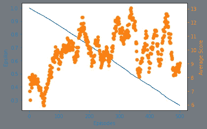
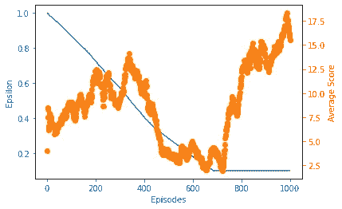
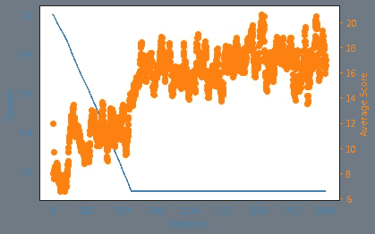

# 用人工智能玩毁灭:深度 Q 学习的多目标优化

> 原文：<https://towardsdatascience.com/playing-doom-with-ai-multi-objective-optimization-with-deep-q-learning-736a9d0f8c2?source=collection_archive---------51----------------------->

## Pytorch 中强化学习的实现。

# **简介**



O 在线学习方法是一个动态的算法家族，推动了过去十年强化学习的许多最新成就。在线学习方法属于[基于样本的学习](https://medium.com/gradientcrescent/fundamentals-of-reinforcement-learning-automating-pong-in-using-a-policy-model-an-implementation-b71f64c158ff)类强化学习方法，允许简单地通过重复观察来确定状态值，消除了对显式转换动态的需要。与它们的[离线对应物](https://medium.com/gradientcrescent/fundamentals-of-reinforcement-learning-understanding-blackjack-strategy-through-monte-carlo-88c9b85194ed)、**不同，诸如时间差异学习(TD)之类的在线学习方法，允许在代理-环境交互期间状态和动作值的增量更新，允许观察到持续的、增量的性能改进。**

除了 TD，我们还讨论了 Q-learning 的[理论](https://medium.com/gradientcrescent/fundamentals-of-reinforcement-learning-navigating-cliffworld-with-sarsa-and-q-learning-cc3c36eb5830)和[实际实现](/automating-pac-man-with-deep-q-learning-an-implementation-in-tensorflow-ca08e9891d9c)，Q-learning 是 TD 的一种发展，旨在允许对环境中的状态-动作值进行越来越精确的估计。Q-learning 因成为模拟游戏环境的强化学习方法的支柱而闻名，如在 OpenAI 的健身房中观察到的那些。因为我们已经在[过去的文章](/automating-pac-man-with-deep-q-learning-an-implementation-in-tensorflow-ca08e9891d9c)中涉及了 Q-learning 的理论方面，所以这里不再重复。

一个代理扮演我们之前 Tensorflow 实现中的基本场景

在我们的[上一篇文章](/automating-doom-with-deep-q-learning-an-implementation-in-tensorflow-db03c1b03a9c)中，我们探索了如何通过使用开源的 OpenAI gym 包装库 [Vizdoomgym](https://github.com/shakenes/vizdoomgym) ，将 Q-learning 应用于训练代理人在经典 FPS 游戏 **Doom** 中扮演一个基本场景。我们将在那篇文章的基础上引入一个更复杂的 Vizdoomgym 场景，并用 Pytorch 构建我们的解决方案。这是研究各种末日 RL 算法系列文章的第一篇，作为我们的基线。

# **实现**

我们将要探索的环境是 Vizdoomgym 的防线场景。环境中，代理在走廊的一端，恶魔在另一端繁殖。环境的一些特征包括:

*   一个 3 的动作空间:开火，左转，右转。不允许扫射。
*   向玩家发射火球的棕色怪物，命中率为 100%。
*   粉红色的怪物试图以曲折的方式靠近来咬玩家。
*   重生怪物的生命值明显更高。
*   杀死一个怪物+1 点
*   - 1 代表死亡。



防线场景的初始状态。

**毫无疑问，在这个环境中的成功需要平衡多个目标**:理想的玩家必须学会优先考虑褐色怪物，它们能够在产卵时伤害玩家，而粉红色怪物由于它们的旅行时间可以安全地忽略一段时间。这个设置与我们之前的末日文章形成了对比，在那篇文章中我们展示了单个目标。

我们的 Google 协作实现是使用 Pytorch 用 Python 编写的，可以在 [GradientCrescent Github 上找到。](https://github.com/EXJUSTICE/GradientCrescent)我们的方法基于 Tabor 的优秀强化学习[课程](https://www.manning.com/livevideo/reinforcement-learning-in-motion)中详述的方法。由于这种方法的实现非常复杂，让我们**总结一下所需动作的顺序**:

1.  我们定义了最大化性能所需的预处理函数，并将它们作为自动化健身房环境的包装器引入。这些主要是通过使用元素最大值和帧堆叠来捕捉环境的运动。
2.  **我们定义我们的深度 Q 学习神经网络**。这是一个 CNN，它拍摄游戏中的屏幕图像，并输出 Ms-Pacman gamespace 中每个动作的概率，或 Q 值。为了获得概率张量，我们在最后一层不包括任何激活函数。
3.  由于 Q-learning 要求我们了解当前和下一个状态，我们需要**从数据生成**开始。我们将表示初始状态 *s* 的游戏空间的预处理输入图像输入到网络中，并获得动作的初始概率分布，或 Q 值。在训练之前，这些值将是随机的和次优的。
4.  利用我们的概率张量，我们然后**使用 argmax()函数选择具有当前最高概率**的动作，并使用它来构建 epsilon 贪婪策略。
5.  使用我们的策略，我们将选择动作 *a* ，并评估我们在健身房环境中的决策**接收关于新状态*s’*、奖励 *r*** 以及该集是否已结束的信息。
6.  我们以列表形式~~将该信息组合存储在一个缓冲区中，并重复步骤 2-4 预设次数，以建立一个足够大的缓冲区数据集。~~
7.  G **生成我们的目标 *y* 值， *R'* 和 *A'*** ，这是损失计算所需要的。虽然前者只是从 *R* 中减去，但是我们通过将*S’*输入到我们的网络中来获得 A’。
8.  有了所有的组件，我们就可以**计算训练网络的损耗**。
9.  一旦训练结束，我们将评估我们的代理在新一集游戏中的表现，并记录他们的表现

让我们从导入所有必需的包开始，包括 OpenAI 和 Vizdoomgym 环境。我们还将安装火炬视觉所需的 AV 包，我们将使用它进行可视化。请注意，安装完成后必须重新启动运行时。

```
!sudo apt-get update!sudo apt-get install build-essential zlib1g-dev libsdl2-dev libjpeg-dev nasm tar libbz2-dev libgtk2.0-dev cmake git libfluidsynth-dev libgme-dev libopenal-dev timidity libwildmidi-dev unzip# Boost libraries!sudo apt-get install libboost-all-dev# Lua binding dependencies!apt-get install liblua5.1-dev!sudo apt-get install cmake libboost-all-dev libgtk2.0-dev libsdl2-dev python-numpy git!git clone [https://github.com/shakenes/vizdoomgym.git](https://github.com/shakenes/vizdoomgym.git)!python3 -m pip install -e vizdoomgym/!pip install av
```

接下来，我们初始化我们的环境场景，检查观察空间和动作空间，并可视化我们的环境..

```
import gymimport vizdoomgymenv = gym.make(‘VizdoomDefendLine-v0’)n_outputs = env.action_space.nprint(n_outputs)observation = env.reset()import matplotlib.pyplot as pltfor i in range(22): if i > 20: print(observation.shape) plt.imshow(observation) plt.show() observation, _, _, _ = env.step(1)
```

接下来，我们将定义预处理包装器。这些类继承自 OpenAI gym 基类，覆盖了它们的方法和变量，以便隐式地提供所有必要的预处理。我们将开始定义一个包装器来重复许多帧的每个动作，并执行元素方式的最大值以增加任何动作的强度。您会注意到一些三级参数，如 *fire_first* 和*no _ ops*——这些是特定于环境的，在 Vizdoomgym 中对我们没有影响。

```
class RepeatActionAndMaxFrame(gym.Wrapper):
 #input: environment, repeat
 #init frame buffer as an array of zeros in shape 2 x the obs space
 def __init__(self, env=None, repeat=4, clip_reward=False, no_ops=0,
 fire_first=False):
 super(RepeatActionAndMaxFrame, self).__init__(env)
 self.repeat = repeat
 self.shape = env.observation_space.low.shape
 self.frame_buffer = np.zeros_like((2, self.shape))
 self.clip_reward = clip_reward
 self.no_ops = no_ops
 self.fire_first = fire_firstdef step(self, action):
 t_reward = 0.0
 done = False
 for i in range(self.repeat):
 obs, reward, done, info = self.env.step(action)
 if self.clip_reward:
 reward = np.clip(np.array([reward]), -1, 1)[0]
 t_reward += reward
 idx = i % 2
 self.frame_buffer[idx] = obs
 if done:
 break max_frame = np.maximum(self.frame_buffer[0], self.frame_buffer[1])
 return max_frame, t_reward, done, infodef reset(self):
 obs = self.env.reset()
 no_ops = np.random.randint(self.no_ops)+1 if self.no_ops > 0 else 0
 for _ in range(no_ops):
 _, _, done, _ = self.env.step(0)
 if done:
 self.env.reset()
 #Fire first seems quite useless, probably meant for something like space invader
 if self.fire_first:
 assert self.env.unwrapped.get_action_meanings()[1] == ‘FIRE’
 obs, _, _, _ = self.env.step(1) self.frame_buffer = np.zeros_like((2,self.shape))
 self.frame_buffer[0] = obs return obs
```

接下来，我们为我们的观察定义预处理函数。我们将使我们的环境对称，将它转换到盒子空间，将通道整数交换到张量的前面，并将其从原始(320，480)分辨率调整到(84，84)区域。我们也将我们的环境灰度化，并通过除以一个常数来归一化整个图像。

```
class PreprocessFrame(gym.ObservationWrapper):
 #set shape by swapping channels axis
 #set observation space to new shape using gym.spaces.Box (0 to 1.0)
 def __init__(self, shape, env=None):
 super(PreprocessFrame, self).__init__(env)
 self.shape = (shape[2], shape[0], shape[1])
 self.observation_space = gym.spaces.Box(low=0.0, high=1.0,
 shape=self.shape, dtype=np.float32)def observation(self, obs):
 new_frame = cv2.cvtColor(obs, cv2.COLOR_RGB2GRAY)
 resized_screen = cv2.resize(new_frame, self.shape[1:],
 interpolation=cv2.INTER_AREA)
 new_obs = np.array(resized_screen, dtype=np.uint8).reshape(self.shape)
 new_obs = new_obs / 255.0 return new_obs
```

接下来，我们创建一个包装器来处理帧堆叠。这里的目标是通过将几个帧堆叠在一起作为单个批次，帮助从堆叠帧中捕捉运动和方向。这样，我们可以捕捉环境中元素的位置、平移、速度和加速度。通过堆叠，我们的输入采用(4，84，84，1)的形状。

```
class StackFrames(gym.ObservationWrapper):
 #init the new obs space (gym.spaces.Box) low & high bounds as repeat of n_steps. These should have been defined for vizdooom
 #Create a return a stack of observations
 def __init__(self, env, repeat):
 super(StackFrames, self).__init__(env)
 self.observation_space = gym.spaces.Box(
 env.observation_space.low.repeat(repeat, axis=0),
 env.observation_space.high.repeat(repeat, axis=0),
 dtype=np.float32)
 self.stack = collections.deque(maxlen=repeat)def reset(self):
 self.stack.clear()
 observation = self.env.reset()
 for _ in range(self.stack.maxlen):
 self.stack.append(observation) return  np.array(self.stack).reshape(self.observation_space.low.shape)def observation(self, observation):
 self.stack.append(observation) return np.array(self.stack).reshape(self.observation_space.low.shape)
```

最后，在返回最终环境供使用之前，我们将所有的包装器绑定到一个单独的 *make_env()* 方法中。

```
def make_env(env_name, shape=(84,84,1), repeat=4, clip_rewards=False,
 no_ops=0, fire_first=False):
 env = gym.make(env_name)
 env = PreprocessFrame(shape, env)
 env = RepeatActionAndMaxFrame(env, repeat, clip_rewards, no_ops, fire_first)

 env = StackFrames(env, repeat) return env
```

接下来，让我们定义我们的模型，一个深度 Q 网络。这本质上是一个三层卷积网络，它采用预处理的输入观察值，将生成的展平输出馈送到一个全连接层，生成游戏空间中的状态-动作值作为输出。请注意，这里没有激活层，因为激活层的存在会导致二进制输出分布。我们的损失是我们计算的状态-动作值与我们预测的状态-动作值的平方差。我们将使用 RMSProp 优化器来最小化我们在训练期间的损失。

```
import os
import torch as T
import torch.nn as nn
import torch.nn.functional as F
import torch.optim as optim
import numpy as npclass DeepQNetwork(nn.Module):
 def __init__(self, lr, n_actions, name, input_dims, chkpt_dir):
 super(DeepQNetwork, self).__init__()
 self.checkpoint_dir = chkpt_dir
 self.checkpoint_file = os.path.join(self.checkpoint_dir, name) self.conv1 = nn.Conv2d(input_dims[0], 32, 8, stride=4)
 self.conv2 = nn.Conv2d(32, 64, 4, stride=2)
 self.conv3 = nn.Conv2d(64, 64, 3, stride=1) fc_input_dims = self.calculate_conv_output_dims(input_dims) self.fc1 = nn.Linear(fc_input_dims, 512)
 self.fc2 = nn.Linear(512, n_actions) self.optimizer = optim.RMSprop(self.parameters(), lr=lr) self.loss = nn.MSELoss()
 self.device = T.device(‘cuda:0’ if T.cuda.is_available() else ‘cpu’)
 self.to(self.device)def calculate_conv_output_dims(self, input_dims):
 state = T.zeros(1, *input_dims)
 dims = self.conv1(state)
 dims = self.conv2(dims)
 dims = self.conv3(dims)
 return int(np.prod(dims.size()))def forward(self, state):
 conv1 = F.relu(self.conv1(state))
 conv2 = F.relu(self.conv2(conv1))
 conv3 = F.relu(self.conv3(conv2))
 # conv3 shape is BS x n_filters x H x W
 conv_state = conv3.view(conv3.size()[0], -1)
 # conv_state shape is BS x (n_filters * H * W)
 flat1 = F.relu(self.fc1(conv_state))
 actions = self.fc2(flat1) return actionsdef save_checkpoint(self):
 print(‘… saving checkpoint …’)
 T.save(self.state_dict(), self.checkpoint_file)def load_checkpoint(self):
 print(‘… loading checkpoint …’)
 self.load_state_dict(T.load(self.checkpoint_file))
```

回想一下，Q-learning 的更新功能需要:

*   当前状态 *s*
*   当前动作*一*
*   当前动作后的奖励 *r*
*   下一个状态*s’*
*   下一个动作*a’*

为了以有意义的数量提供这些参数，我们需要按照一组参数评估我们当前的策略，并将所有变量存储在一个缓冲区中，我们将在训练期间从该缓冲区中提取迷你批次中的数据。因此，我们需要一个重放内存缓冲区来存储和提取观察值。

```
import numpy as npclass ReplayBuffer(object):
 def __init__(self, max_size, input_shape, n_actions):
 self.mem_size = max_size
 self.mem_cntr = 0
 self.state_memory = np.zeros((self.mem_size, *input_shape),
 dtype=np.float32)
 self.new_state_memory = np.zeros((self.mem_size, *input_shape),
 dtype=np.float32) self.action_memory = np.zeros(self.mem_size, dtype=np.int64)
 self.reward_memory = np.zeros(self.mem_size, dtype=np.float32)
 self.terminal_memory = np.zeros(self.mem_size, dtype=np.bool)#Identify index and store the the current SARSA into batch memory
def store_transition(self, state, action, reward, state_, done):
 index = self.mem_cntr % self.mem_size
 self.state_memory[index] = state
 self.new_state_memory[index] = state_
 self.action_memory[index] = action
 self.reward_memory[index] = reward
 self.terminal_memory[index] = done
 self.mem_cntr += 1def sample_buffer(self, batch_size):
 max_mem = min(self.mem_cntr, self.mem_size)
 batch = np.random.choice(max_mem, batch_size, replace=False)

 states = self.state_memory[batch]
 actions = self.action_memory[batch]
 rewards = self.reward_memory[batch]
 states_ = self.new_state_memory[batch]
 terminal = self.terminal_memory[batch] return states, actions, rewards, states_, terminal
```

接下来，我们将定义我们的代理。我们的代理正在使用一个勘探率递减的ε贪婪策略，以便随着时间的推移最大化开发。为了学会预测使我们的累积奖励最大化的状态-行动-值，我们的代理人将使用通过记忆抽样获得的贴现的未来奖励。

您会注意到，作为代理的一部分，我们初始化了 DQN 的两个副本，并使用方法将原始网络的权重参数复制到目标网络中。这种双网络方法允许我们在使用现有策略的训练过程中生成数据，同时仍然为下一个策略迭代优化我们的参数，减少损失振荡。

```
import numpy as np
import torch as T
#from deep_q_network import DeepQNetwork
#from replay_memory import ReplayBufferclass DQNAgent(object):
 def __init__(self, gamma, epsilon, lr, n_actions, input_dims,
 mem_size, batch_size, eps_min=0.01, eps_dec=5e-7,
 replace=1000, algo=None, env_name=None, chkpt_dir=’tmp/dqn’):
 self.gamma = gamma
 self.epsilon = epsilon
 self.lr = lr
 self.n_actions = n_actions
 self.input_dims = input_dims
 self.batch_size = batch_size
 self.eps_min = eps_min
 self.eps_dec = eps_dec
 self.replace_target_cnt = replace
 self.algo = algo
 self.env_name = env_name
 self.chkpt_dir = chkpt_dir
 self.action_space = [i for i in range(n_actions)]
 self.learn_step_counter = 0self.memory = ReplayBuffer(mem_size, input_dims, n_actions)self.q_eval = DeepQNetwork(self.lr, self.n_actions,
 input_dims=self.input_dims,
 name=self.env_name+’_’+self.algo+’_q_eval’,
 chkpt_dir=self.chkpt_dir)self.q_next = DeepQNetwork(self.lr, self.n_actions,
 input_dims=self.input_dims,
 name=self.env_name+’_’+self.algo+’_q_next’,
 chkpt_dir=self.chkpt_dir)#Epsilon greedy action selection
 def choose_action(self, observation):
 if np.random.random() > self.epsilon:
 state = T.tensor([observation],dtype=T.float).to(self.q_eval.device)
 actions = self.q_eval.forward(state)
 action = T.argmax(actions).item()
 else:
 action = np.random.choice(self.action_space)return actiondef store_transition(self, state, action, reward, state_, done):
 self.memory.store_transition(state, action, reward, state_, done)def sample_memory(self):
 state, action, reward, new_state, done = \
 self.memory.sample_buffer(self.batch_size)states = T.tensor(state).to(self.q_eval.device)
 rewards = T.tensor(reward).to(self.q_eval.device)
 dones = T.tensor(done).to(self.q_eval.device)
 actions = T.tensor(action).to(self.q_eval.device)
 states_ = T.tensor(new_state).to(self.q_eval.device)return states, actions, rewards, states_, donesdef replace_target_network(self):
 if self.learn_step_counter % self.replace_target_cnt == 0:
 self.q_next.load_state_dict(self.q_eval.state_dict())def decrement_epsilon(self):
 self.epsilon = self.epsilon — self.eps_dec \
 if self.epsilon > self.eps_min else self.eps_mindef save_models(self):
 self.q_eval.save_checkpoint()
 self.q_next.save_checkpoint()def load_models(self):
 self.q_eval.load_checkpoint()
 self.q_next.load_checkpoint()
 #Make sure you understand this line by line
 def learn(self):
 if self.memory.mem_cntr < self.batch_size:
 returnself.q_eval.optimizer.zero_grad()self.replace_target_network()states, actions, rewards, states_, dones = self.sample_memory()
 indices = np.arange(self.batch_size)q_pred = self.q_eval.forward(states)[indices, actions]
 q_next = self.q_next.forward(states_).max(dim=1)[0]q_next[dones] = 0.0
 q_target = rewards + self.gamma*q_nextloss = self.q_eval.loss(q_target, q_pred).to(self.q_eval.device)
 loss.backward()
 self.q_eval.optimizer.step()
 self.learn_step_counter += 1 self.decrement_epsilon()
```

定义了所有支持代码后，让我们运行主训练循环。我们已经在最初的总结中定义了大部分，但是让我们为后代回忆一下。

*   对于训练集的每一步，在使用ε-贪婪策略选择下一个动作之前，我们将输入图像堆栈输入到我们的网络中，以生成可用动作的概率分布
*   然后，我们将它输入到网络中，获取下一个状态和相应奖励的信息，并将其存储到我们的缓冲区中。我们更新我们的堆栈，并通过一些预定义的步骤重复这一过程。
*   在一集的结尾，我们将下一个状态输入到我们的网络中，以便获得下一个动作。我们还通过对当前奖励进行贴现来计算下一个奖励。
*   我们通过 Q 学习更新函数生成我们的目标 y 值，并训练我们的网络。
*   通过最小化训练损失，我们更新网络权重参数，以便为下一个策略输出改进的状态-动作值。
*   我们通过跟踪模型的平均得分(在 100 个训练步骤中测量)来评估模型。

```
env = make_env(‘VizdoomDefendLine-v0’)
best_score = -np.inf
load_checkpoint = False
n_games = 500
agent = DQNAgent(gamma=0.99, epsilon=1.0, lr=0.0001,input_dims=(env.observation_space.shape),n_actions=env.action_space.n, mem_size=5000, eps_min=0.1,batch_size=32, replace=1000, eps_dec=1e-5,chkpt_dir=’/content/’, algo=’DQNAgent’,env_name=’vizdoogym’)if load_checkpoint:
 agent.load_models()fname = agent.algo + ‘_’ + agent.env_name + ‘_lr’ + str(agent.lr) +’_’+ str(n_games) + ‘games’
figure_file = ‘plots/’ + fname + ‘.png’n_steps = 0
scores, eps_history, steps_array = [], [], []for i in range(n_games):
 done = False
 observation = env.reset()score = 0
 while not done:
 action = agent.choose_action(observation)
 observation_, reward, done, info = env.step(action)
 score += rewardif not load_checkpoint:
 agent.store_transition(observation, action,reward, observation_, int(done))
 agent.learn()
 observation = observation_
 n_steps += 1scores.append(score)
 steps_array.append(n_steps)avg_score = np.mean(scores[-100:])if avg_score > best_score:
 best_score = avg_score

 print(‘Checkpoint saved at episode ‘, i)
 agent.save_models()print(‘Episode: ‘, i,’Score: ‘, score,’ Average score: %.2f’ % avg_score, ‘Best average: %.2f’ % best_score,’Epsilon: %.2f’ % agent.epsilon, ‘Steps:’, n_steps)eps_history.append(agent.epsilon)
 if load_checkpoint and n_steps >= 18000:
 break
```

我们绘制了 500、1000 和 2000 集的代理商平均得分和 epsilon 比率。



500 集后我们经纪人的奖励分配。



1000 集后我们经纪人的奖励分配。



2000 集后我们经纪人的报酬分配。

查看结果，您会注意到一些模式。

*   在最初的 400 集里，我们观察到了平均分数为 12 的表演的最初增长。这段时间，代理人在重重地探索。
*   在 400-750 个训练集之间，我们观察到 epsilon 衰减到 20%以下，表明探索率显著降低。因此，当代理试图最大化利用时，它的性能可能会显著提高或下降。
*   然而，在过去的 750 集里，代理已经进行了足够的探索来找到改进的策略，导致模型性能的增长和稳定。

有趣的是，我们可以在游戏中观察到这些点。下面是我们的特工分别在 500 集、1000 集和 2000 集时的游戏片段。

500 集特工训练的游戏性。

特工的游戏性训练了 1000 集。

2000 集特工训练的游戏性。

所有的特工都表现出持续射击——考虑到弹药消耗没有惩罚，这是可以理解的。请注意，在 500 集时训练过的特工如何表现出更大的转弯弧线，而训练更好的特工似乎坚持在地图的特定区域。这种行为可能是对棕色怪物产卵的预期，这是一种依靠粉色怪物走近穿越火线的策略。请注意，这个环境仍然相对简单，以便于相对容易的训练——引入弹药使用惩罚，或者增加行动空间包括扫射，将导致明显不同的行为。

这就结束了 Q-learning 的实现。在我们的下一篇文章中，我们将继续用更高级的 Q-learning 方法来检查我们的代理在这些环境中的性能。

我们希望你喜欢这篇文章，并希望你查看 GradientCrescent 上的许多其他文章，涵盖人工智能的应用和理论方面。为了保持对 [GradientCrescent](https://medium.com/@adrianitsaxu) 的最新更新，请考虑关注该出版物并关注我们的 [Github](https://github.com/EXJUSTICE/GradientCrescent) 资源库。

# **来源**

萨顿等人。al，“强化学习”

塔博尔，“运动中的强化学习”