# 用数据扮演上帝

> 原文：<https://towardsdatascience.com/playing-god-with-data-d7d566550745?source=collection_archive---------33----------------------->


泰勒·维克在 [Unsplash](https://unsplash.com?utm_source=medium&utm_medium=referral) 上的照片

## 5 个综合数据问题&评估新机器学习方法的代码

所以你有一个你想测试的机器学习方法。很好，但是你怎么证明它的价值呢？答案是:合成数据。

在评估新方法时，合成数据比真实数据有几个优势。对于合成数据，任务的性质、输入特征、维度、采样大小、噪声程度和其他数据因素完全由创建者控制。合成数据问题千差万别，模型在这些问题上的表现可以告诉我们很多关于模型的优点和缺点-也许它在线性可分数据上表现良好，或者不能很好地处理噪声-这可以帮助理解模型在真实世界的数据类型上会表现良好。

> 合成数据为如何将模型应用于真实数据提供了蓝图。

在本文中，我将概述 5 个二元分类合成数据问题，提供用于创建数据的 Python 代码(支持调整参数)，并解释如何解释这些问题的结果。此外，我将概述每个问题的扩展。

我们开始吧！

# 环形问题

## 问题是

在 2D 环分类问题中，有两个圆，都以(0.5，0.5)为中心。圆环由两个圆定义，外圆半径为 0.5，内圆半径为 0.3。

落在红色和蓝色区域的重叠中的所有数据点被标记为 1；否则，它们被标记为 0。

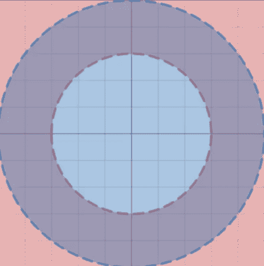

写成一个函数，环的问题是:

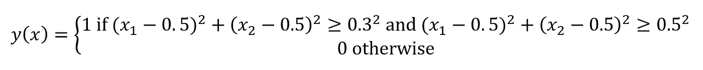

在下图中，红点代表 1，蓝点代表 0。

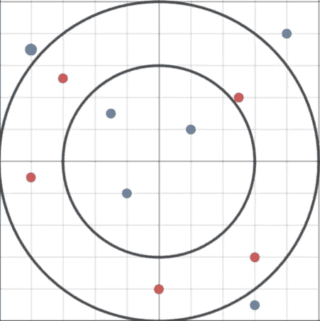

环形问题的价值在于它的非线性和几何上明显的模式。

## 扩展ˌ扩张

*   添加噪声。这种分类任务的噪声版本可以用沿着解边界的高斯噪声来构建。在下面的等式中， *z* 是从具有标准偏差 *s* 的高斯分布的正侧抽取的随机数的向量。

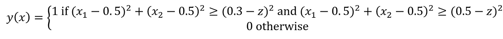

*   3+维的环问题。环带问题的另一种形式可以适用于三维或更多维，只需在方程中增加另一维即可。

## 密码

提供的四个参数是:

*   *n* ，数据点的数量
*   *内径*，内圆的半径
*   *外半径*，外圆的半径
*   *z* ，添加了随机性的正态分布的尺度

…可以对其进行微调以调整数据的属性。

```
import pandas as pd
import numpy as np
import math as m
import random as rn = 800 #number of data points
innerRadius = 0.3 #radius of inner circle
outerRadius = 0.5 #radius of outer circle
z = 0 #gaussian multiplierdata = {'x1':[],'x2':[],'label':[]}
for i in range(n):
	x1 = r.randint(1,100_000)/100_000
	x2 = r.randint(1,100_000)/100_000
	coef = abs(np.random.normal(scale=z))
	if (x1-0.5)**2 + (x2-0.5)**2 > (innerRadius-coef)**2:
		if (x1-0.5)**2 + (x2-0.5)**2 < (outerRadius-coef)**2:
			label = 1
		else:
			label = 0
	else:
		label = 0
	data['x1'].append(x1)
	data['x2'].append(x2)
	data['label'].append(label)
data = pd.DataFrame(data
```

数据输出的前 10 行是:

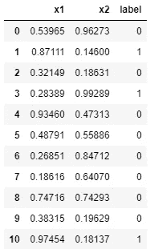

要绘制环:

```
import seaborn as sns
import matplotlib.pyplot as plt
fig = plt.figure(figsize=(5,5))
sns.scatterplot(data['x1'],data['x2'],data['label'])
```

400 个数据点，无噪声:

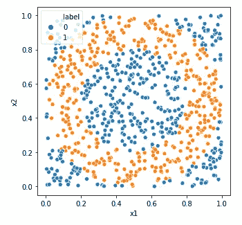

400 个数据点， *z* = 0.1:

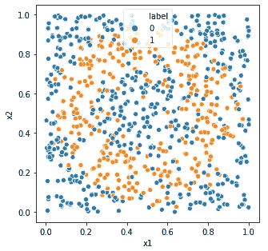

400 个数据点，其中 *z* = 0.25:

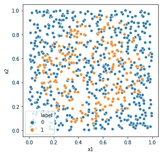

## 数据应用

许多真实世界的数据集(如医疗诊断)都有特征空间，在这些空间中，标注的分离更加清晰。在具有合理数量的噪声(z = 0.1 至 0.2)的环形问题上成功的模型可以识别真实世界数据中的几何上明显的非线性模式，并且具有合理的噪声容限。通过增加或减少环的面积，该模型可以适用于平衡或非平衡问题。通过减小环的面积，问题变得不平衡，类似于医学问题，如癌症诊断，其中阳性诊断的数量远小于阴性诊断的数量。通过将环的面积增加到网格面积的一半，问题变得更加平衡，这可能有助于识别男性或女性、18 岁以下或 18 岁以上等。比较几何上明显的问题和棋盘问题。

# 棋盘二元分类问题

## 问题是

像棋盘一样，交替的二维空间被标记为 0 和 1。所有值 1(红色)具有相同奇偶性的 *x1* 和 *x2* 值(或者都是偶数或者都是奇数),而所有值 0(蓝色)具有相反奇偶性的 *x1* 和 *x2* 值。

下面提供了一个视觉效果:

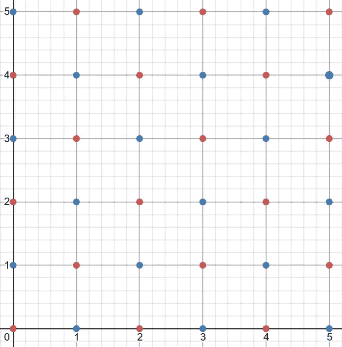

这在数学上可以表示为

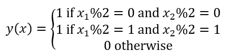

棋盘问题的一个解决方案如下:

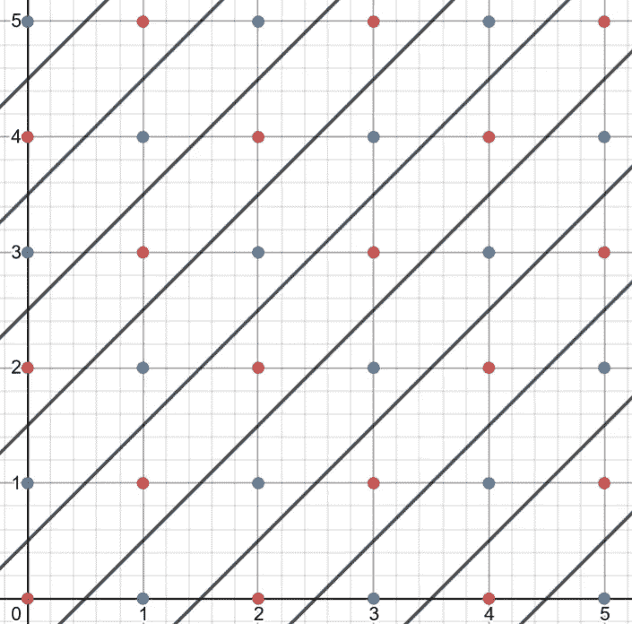

每条对角线将这些点分隔成各自的颜色。

棋盘问题在两个方面是有价值的——首先，因为虽然数据是线性可分的，但它需要多条线来分隔的事实使它更加真实和复杂；第二，数据是分散的，从计算机的角度来看，数据不是几何图形而是数字图形，没有几何图形，只有数字图形。

## 扩展ˌ扩张

*   棋盘问题可以扩展成包含 *n* 种颜色
*   这个问题也可以变成一个三维或 *m-* D 棋盘问题

## 密码

在棋盘问题中，可调参数是:

*   *dim1* ，二维空间的第一维
*   *dim2* ，二维空间的第二维度

```
import pandas as pd
dim1 = 20 #x-dimension
dim2 = 20 #y-dimension
data = {'x1':[],'x2':[],'label':[]}
for xcoor in range(dim1):
    for ycoor in range(dim2):
        if xcoor % 2 == 0 and ycoor % 2 == 0:
            label = 1
        elif xcoor % 2 == 1 and ycoor % 2 == 1:
            label = 1
        else:
            label = 0
        data['x1'].append(xcoor)
        data['x2'].append(ycoor)
        data['label'].append(label)
data = pd.DataFrame(data)
```

数据帧看起来像:

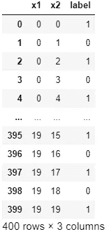

…可以想象为

```
import seaborn as sns
import matplotlib.pyplot as plt
fig = plt.figure(figsize=(5,5))
sns.scatterplot(data['x1'],data['x2'],data['label'])
```

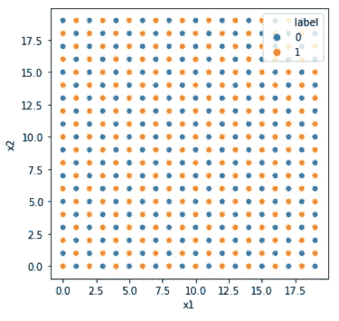

## 数据应用

在棋盘问题上表现良好的模型在大量分散的数据上表现良好；其更复杂的关系不一定是几何的而是数字的。它在分层数据上也表现良好；也就是说，只能用多条线分开。

# x 维奇偶二元分类问题

## 问题是

在 X 维(默认为 *X* = 10)奇偶校验问题中，如果一个 X 位字符串具有奇数个 1(因此，奇数个 0)，则该字符串被分类为 1；如果该字符串具有偶数个 1(因此，偶数个 0)，则该字符串被分类为 0。这个奇偶校验问题是非线性的。

X 维奇偶校验问题的价值在于，所有列之间存在更深层次的数学关系，而不是某一列是最重要的。这可能是没有几何方面的棋盘问题；宇称问题不能用几何来分析。

## 扩展ˌ扩张

*   充当噪声的附加噪声列。
*   增加值的范围(而不是只有 0 和 1，可能是 0、1、2 和 3)—例如，如果 3 的数量为奇数，则最终标签为 1。

## 密码

```
import pandas as pd
import numpy as np
import random as rdimensions = 10 #bitstring dimensions
data_points = 500 #number of data pointsdata = {'label':[]}
for dimension in range(dimensions):
    data['d'+str(dimension+1)] = []

for i in range(data_points):
    bitstring = [r.randint(0,1) for i in range(dimensions)]
    count0 = 0
    for i in range(len(bitstring)):
        if bitstring[i] == 0:
            count0 += 1
        data['d'+str(i+1)].append(bitstring[i])
    if count0 % 2 == 0:
        data['label'].append(0)
    else:
        data['label'].append(1)
data = pd.DataFrame(data)
```

这将输出数据帧:

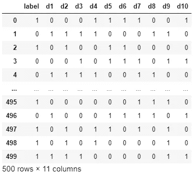

由于有 2 个以上的维度，我们将尝试用主成分分析来可视化数据。

```
from sklearn import decomposition
pca = decomposition.PCA(n_components=2)
pca.fit(data.drop('label',axis=1))
X = pca.transform(data.drop('label',axis=1))
pca.explained_variance_.sum()
```

这将输出:

```
0.5922694981939761
```

一个相当低的解释方差，但它应该足以显示数据的一般性质。

绘制数据:

```
import seaborn as sns
import matplotlib.pyplot as plt
fig = plt.figure(figsize=(5,5))
sns.scatterplot(X[:,0],X[:,1],data['label'])
```

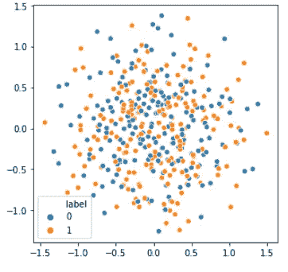

很明显，没有一个清晰的几何图案可以清晰地确定标签。

## **数据应用**

在 X 维奇偶校验问题上成功的模型在最终目标是所有特征的半相等组合的数据集中也是成功的，例如通过某种特征重要性方法消除了不太有用的列的数据。

# 异或二进制分类问题

## 问题

有两个特征的 XOR 值创建了最终目标，还有 *x* 个额外的随机特征作为噪声。默认情况下， *x* 是 97(这样总共有 100 列，包括标签列)。

XOR 函数的作用如下:

*   0, 0 : 0
*   1, 1 : 0
*   0, 1: 1
*   1, 0: 1

如果两个输入相同，则输出为 0；否则，输出为 1。

XOR 问题的价值来自于这样一个事实:在几层随机数据下隐藏着一个非常简单的数字关系。

## 密码

可以调整的参数有:

*   *noise_features，*数据中随机噪声特征的数量
*   *数据点*，数据点的数量

```
import pandas as pd
import randomnoise_features = 97
data_points = 500def XOR(bit1,bit2):
    if bit1 and bit2:
        return 0
    elif not bit1 and not bit2:
        return 0
    else:
        return 1data = {'label':[],'bit1':[],'bit2':[]}
for index in range(noise_features):
    data['nf'+str(index)] = []
for i in range(data_points):
    bit1 = random.randint(0,1)
    bit2 = random.randint(0,1)
    label = XOR(bit1,bit2)
    data['label'].append(label)
    data['bit1'].append(bit1)
    data['bit2'].append(bit2)
    for noise_index in range(noise_features):
        data['nf'+str(noise_index)].append(random.randint(0,1))
data = pd.DataFrame(data)
```

输出数据帧(“nf”代表“噪声特征”):

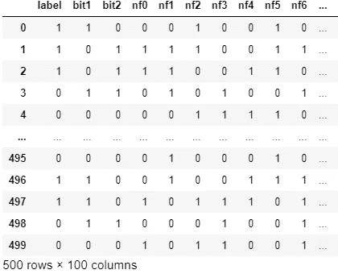

## 数据应用

在 XOR 问题中表现良好的模型(尤其是具有高维数的模型)能够强有力地识别哪些特征是重要的，哪些是不相关的。这些类型的模型可能在用于数字识别的 MNIST 数据集上表现良好，因为某些像素在确定最终数字时是无用的，而某些像素的潜在关系在最终标注中具有重大影响。

# 相关问题

## 问题

畜栏数据集有 6 个二元特征，标签由( *f* 1 和 *f* 2)或( *f* 3 和 *f* 4)确定，其中 *fn* 表示 *nt* h 输入。任何额外数量的特征 *n* (默认为 1)与类别标签具有 *m* %(默认为 75%)相关性，并且可以添加任何数量的 *p* (默认为 5)额外随机特征。

相关性问题的价值在于衡量模型如何利用相关特征，以及如何从随机特征中识别高度相关的特征。

## 密码

可以调整的参数有:

*   *数据点*，数据点的数量
*   *随机 _ 特征*，随机特征数量
*   *相关特征*，与目标相关的特征数量
*   *相关性*，相关特征与目标的相关百分比

```
import pandas as pd
import randomdata_points = 500 #number of data points
random_features = 5 #number of random features
corr_features = 1 #number of correlated features
correlation = 75 #% correlation with targetdef logic_oracle(f1,f2,f3,f4):
    if f1 and f2:
        return 1
    elif f3 and f4:
        return 1
    else:
        return 0data = {'label':[],'f1':[],'f2':[],'f3':[],'f4':[]}
for corr_feature in range(corr_features):
    data['corr'+str(corr_feature+1)] = []
for rand_feature in range(random_features):
    data['rand'+str(rand_feature+1)] = []for i in range(data_points):
    f1 = random.randint(0,1)
    f2 = random.randint(0,1)
    f3 = random.randint(0,1)
    f4 = random.randint(0,1)
    label = logic_oracle(f1,f2,f3,f4)
    data['f1'].append(f1)
    data['f2'].append(f2)
    data['f3'].append(f3)
    data['f4'].append(f4)
    data['label'].append(label)
    for index in range(random_features):
        data['rand'+str(index+1)].append(random.randint(0,1))for corr_feature in range(corr_features):
    for label in data['label']:
        if random.randint(1,100) < correlation:
            data['corr'+str(corr_feature+1)].append(int(label))
        else:
            data['corr'+str(corr_feature+1)].append(int(not label))
data = pd.DataFrame(data)
```

输出数据帧:

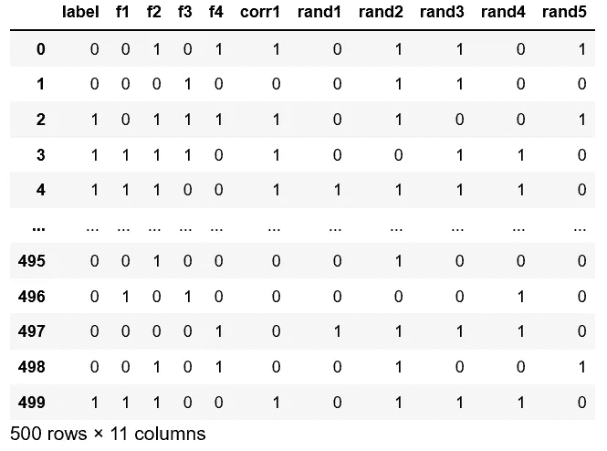

## 数据应用

在几个真实世界的数据集中，特征将*相关*，因为它们不完全预测目标，但足够紧密地联系在一起，因此它在标签中有很大的发言权。在相关性问题中表现良好的模型可以区分现实数据中存在的三种类型的要素-直接要素，其组合揭示了查找输出的“黄金法则”、在大多数情况下给出正确答案的相关要素，以及其存在会影响准确性的不相关要素。

感谢阅读！