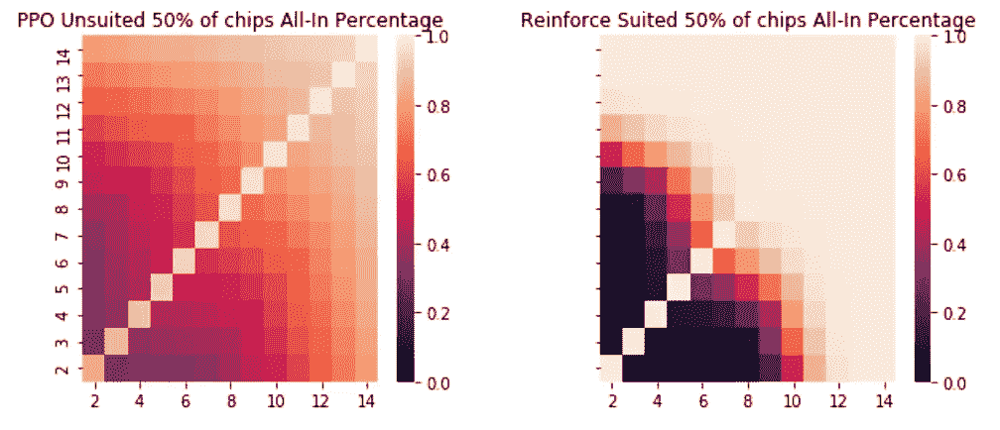

# 使用强化学习玩最佳单挑扑克

> 原文：<https://towardsdatascience.com/playing-optimal-heads-up-poker-with-reinforcement-learning-5fefe6261889?source=collection_archive---------25----------------------->

## 采用近似策略优化和强化蒙特卡罗算法玩最优单挑扑克

照片来自 Unsplash 的 CCO

强化学习一直是近年来许多人工智能突破的核心。算法在没有数据收集的繁重约束的情况下学习的机会为关键的进步提供了巨大的机会。谷歌的 DeepMind 一直处于强化学习的中心，其项目突破引起了全国的关注，如 AlphaZero，一个自学成才的竞争代理人在 4 天内成为了世界上最好的围棋选手。

传统的强化学习算法如 Q-learning、SARSA 等。在封闭的单代理环境中工作良好，他们能够不断探索，直到找到最佳策略。然而，这些算法的一个关键假设是一个稳定的环境，这意味着转移概率和其他因素在每集之间保持不变。当代理人互相训练时，例如在扑克的情况下，这种假设是不可能的，因为两个代理人的策略都在不断地演变，导致一个动态的环境。此外，上述算法本质上是确定性的，这意味着在给定状态下，与另一个动作相比，一个动作总是被认为是最优的。

然而，确定性政策不适用于日常生活或扑克游戏。例如，在扑克游戏中，当有机会时，玩家可以虚张声势，这意味着他们通过投入过大的赌注来吓唬其他玩家弃牌，从而代表比他们实际拥有的牌更好的牌。但是，如果一个玩家每次都虚张声势，对手会认可这样的策略，并很容易让这个玩家破产。这导致了另一类被称为策略梯度算法的算法，该算法输出随机最优策略，然后可以从中进行采样。

然而，传统策略梯度方法的一个大问题是，由于动态环境以及相对较低的数据效率，缺乏收敛性。幸运的是，近年来出现了许多算法，这些算法提供了一个竞争性的自我游戏环境，可以产生最优或接近最优的策略，如 OpenAI 在 2017 年发布的近似策略优化(PPO)。PPO 的独特性源于目标函数，该函数从以前的模型到新的模型剪切概率比，鼓励小的政策变化而不是剧烈的变化。

PPO 论文中的概率比

PPO 论文中的目标函数，其中 A(t)是优势函数

这些方法已经成功应用于许多多人 Atari 游戏，所以我的假设是它们可以很容易地适用于单挑扑克。在锦标赛扑克中，大部分奖金都集中在赢家圈，这意味着要获利，赢钱比简单的“兑现”或每次赚点钱重要得多。在两人对决扑克中，很大一部分的成功在于全押或不全押的决定，所以在这个模拟中，代理人有两个选择，弃牌或全押，这也极大地减少了可能的状态空间，这是用 PPO 等算法解决这个问题的关键。

扑克规则规定“小盲注”和“大盲注”开始下注，这意味着小盲注玩家必须投入一定数量的筹码，而大盲注玩家必须投入两倍的筹码。然后发牌，玩家下注。给代理人的唯一参数如下:他们在与随机的两人对决中赢得当前牌局的几率有多大，他们是否是第一个下注的，以及他们已经下注了多少。然后将它们输入一个简单的双层神经网络。

在我的 Github [here](https://github.com/dcaustin33/poker) **上可以找到用于比较赢家以及模拟确定给定玩家牌的获胜概率的软件包。**为了判断 PPO 的有效性，我决定将它的性能与传统策略梯度法中的增强算法进行比较。我选择在不同的大盲注水平下测试代理，我将其设置为总筹码的 1/50、总筹码的 1/20、1/10、1/4 和 1/2。每手牌结束后，他们的筹码数被重置，这一集再次播放。我对每一个都进行了一百万次模拟，然后进行了比较。令我非常感兴趣的是，在任何盲注水平下，在 0.05 的水平上，增强算法和 PPO 算法之间以赢得的筹码衡量的差异都变得不显著。然而，这两种不同算法的策略却大相径庭。例如，当盲注为筹码的 1/20 时，PPO 策略对不合适牌的热图，在完全相同的情况下，与加强策略相比，代理是第一个下注的。

轴是牌值，a 值为 14

强化实际上是一种确定性策略，而 PPO 则是一种温和得多的转变，这意味着 PPO 会虚张声势，而强化只会与可能的赢家玩。有趣的是，这些对应着两种不同类型的扑克玩家。那些被称为“紧”的玩家只在他们认为自己胜算较大时才玩，而“松”玩家会玩很多手牌，虚张声势，甚至在他们认为自己被击败时盖掉一些大牌。随着手中牌的增加，强化代理人仍然更接近于确定性策略，但增加了他们全押的组合数量。

轴是牌值，a 值为 14

这可以看作是代理学习扑克中的一个关键策略，称为底池赔率。这是一个概念，随着你可以赢得的筹码数量相对于你下一次下注的规模增加，你应该愿意玩更多的牌。原因是只要彩池相对较大，期望值将允许较低的获胜概率。例如，如果底池是$800，而您全押的赌注是$200，那么您只需要有 20%的机会赢得这手牌，就可以在长期内达到收支平衡，因为您有 20%的机会赢得$1000 筹码，这样就等于您的赌注是 200。但是，如果底池是$200，而你的全押是$200，你需要 50%的胜率。代理人认识到了这一点，他们玩的筹码更宽松了，因为与盲注较低时相比，他们获得了底池赔率。当盲注占每个代理总筹码的 50%时，我们可以看到这达到了一个临界点，实际上所有的牌都可能被玩。

轴是牌值，a 值为 14

虽然代理人在表现上没有显著差异，但正如你从图表中看到的，他们有着非常不同的游戏风格，这是一个有趣的发现。我预计，随着复杂性的增加，PPO 会做得更好，因为它似乎有一个更平滑的函数，可以适应最优的随机政策，而钢筋接近确定性政策。扑克，尤其是这个有限的场景，只是政策梯度定理的许多可能应用之一，这些应用正在被不断探索。此外，Carnegie Mellon 和脸书创造了一个真正不可思议的代理，能够在 6 人无限注德州扑克中击败顶级扑克玩家。对于强化学习来说，这确实是一个非常激动人心的时刻。

# **参考文献**

1.  西尔弗，休伯特，施里特韦瑟，哈萨比斯。 *AlphaZero:给国际象棋、日本兵棋和围棋带来新的启示。*[https://deep mind . com/blog/article/alpha zero-sheding-new-light-grand-games-chess-shogi-and-go](https://deepmind.com/blog/article/alphazero-shedding-new-light-grand-games-chess-shogi-and-go)
2.  舒尔曼，沃尔斯基，德里瓦尔，拉德福德，克里莫夫。*近似策略优化算法。https://arxiv.org/abs/1710.03748*T2
3.  布朗，桑德霍尔姆。*用于多人扑克的超人 AI。*[https://science.sciencemag.org/content/365/6456/885](https://science.sciencemag.org/content/365/6456/885)