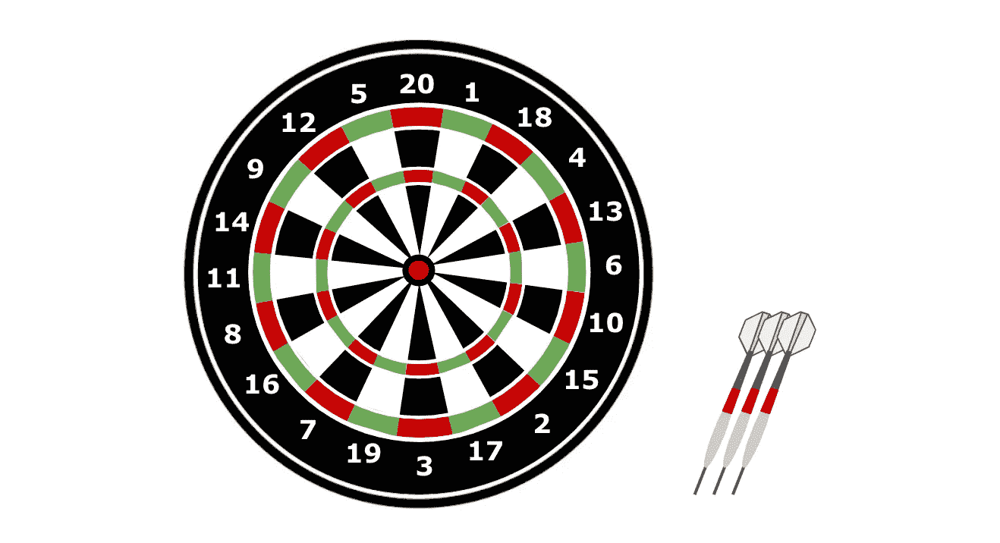
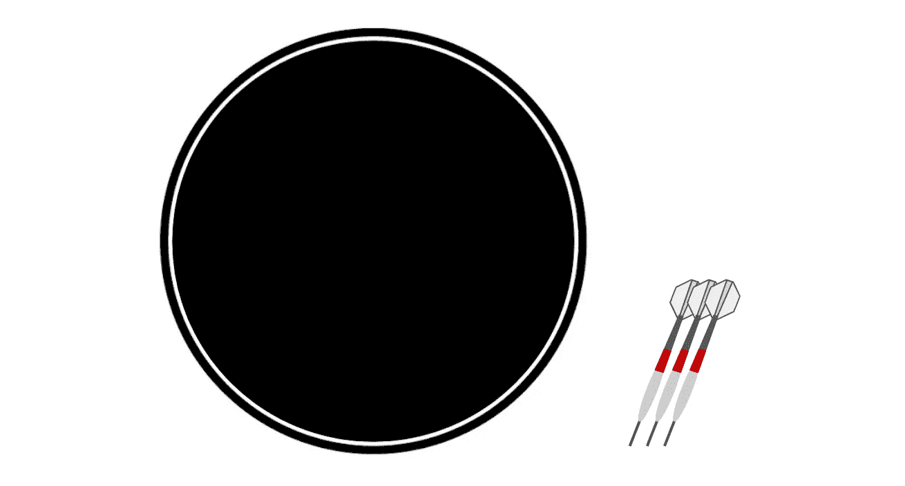
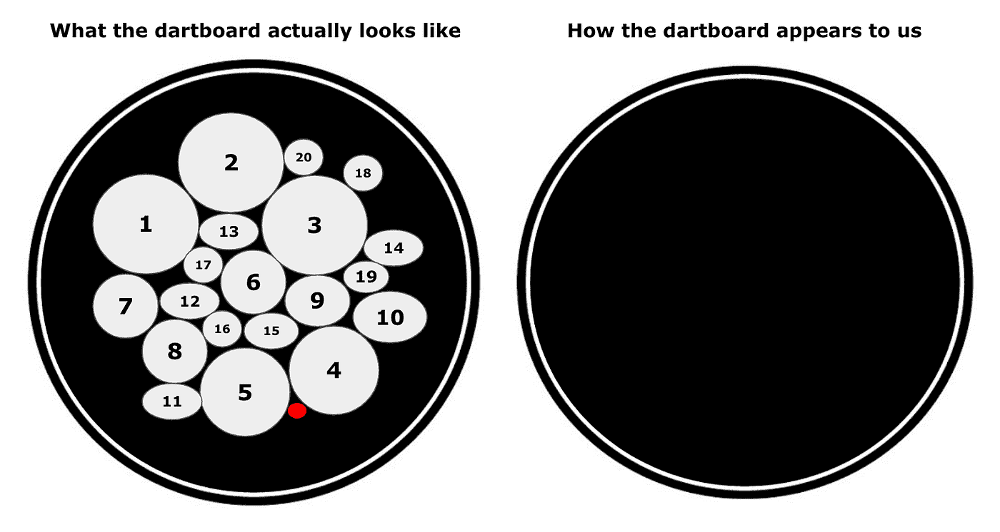
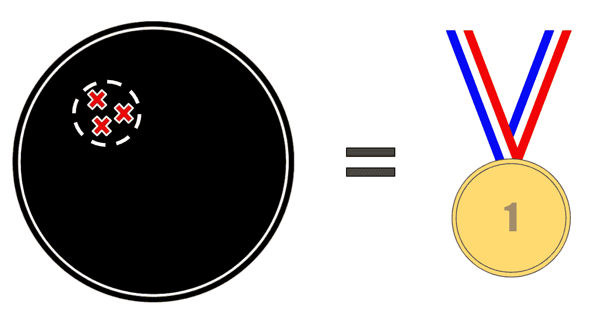
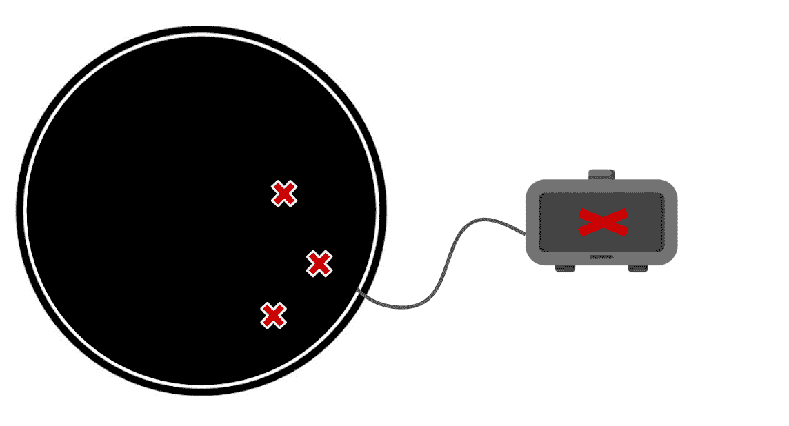
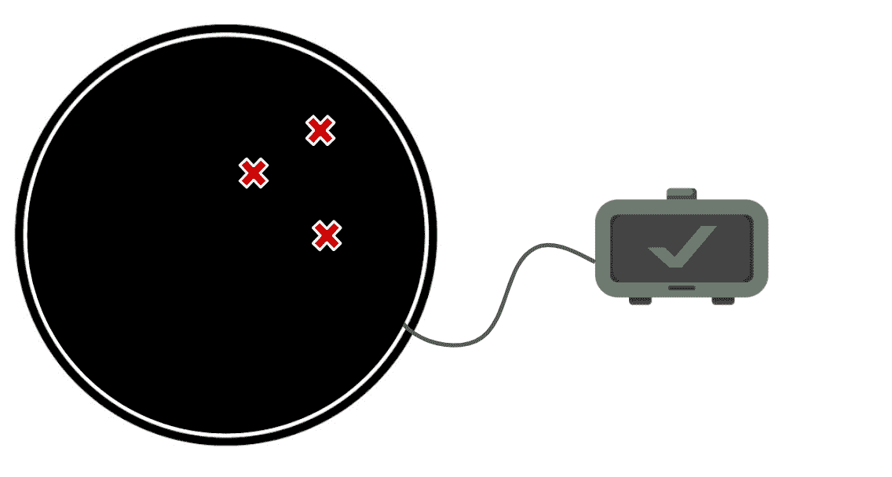
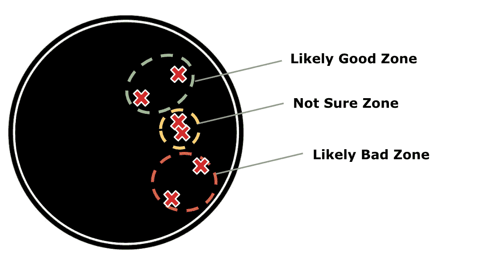
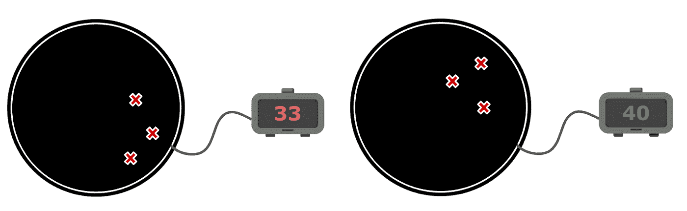
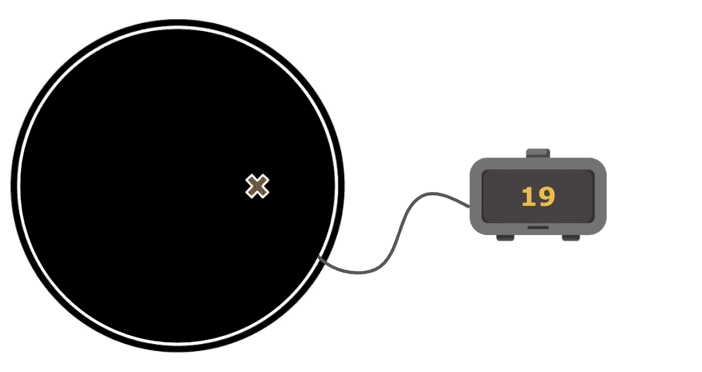
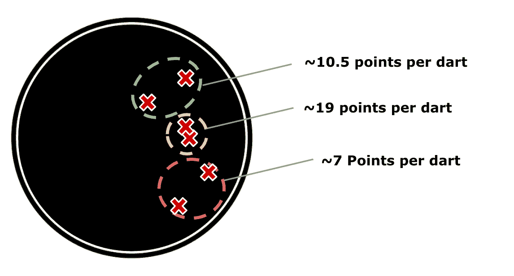

# 玩产品飞镖

> 原文：<https://towardsdatascience.com/playing-product-darts-9b0ce2ed6833?source=collection_archive---------56----------------------->

## 寻找产品杠杆常常感觉像蒙着眼睛扔飞镖，但这不应该阻止你找到它。

你的产品杠杆是你的产品如何为你的用户和企业创造价值的主要控制手段。如果你找到了你的杠杆，那么你知道使用它你会创造价值。这表明你有控制权，你的行动*会带来*可预测的回报。你是否能控制你的产品杠杆会有很大的不同。

一旦你找到了你的杠杆，你可以通过学习它如何工作，发现它的极限来优化它，并产生尽可能多的价值。一些产品经理(pm)努力寻找杠杆(即产品-市场匹配工作)，其他人试图优化现有的杠杆(即增长工作)，但无论哪种方式，过程都是相似的。

我在 Eventbrite 的一个重要角色是通过指导项目经理如何像科学家一样思考来帮助他们找到杠杆*。十几个产品团队的经验和结果表明，你可以通过实践找到并优化杠杆。更快也更有战略意义的方法是玩一个*产品飞镖*的游戏，但是要像一个*科学家*。*

## 一个定义明确的产品飞镖游戏

把构建产品想象成一个(简化的)飞镖游戏。假设你有三个飞镖和一个普通的镖靶。每一次投掷都根据它的落点给你加分(为了简单起见，让我们忽略双倍或双倍)。如果你最终获得足够的分数，比如说 40 分，那么你会从狩猎监督官那里得到一份奖励——非常简单。

作者图片

在这里，飞镖代表你的产品发布，你的分数是对业务产生的影响。40 分的门槛是你的目标，达到它可能意味着找到一个新的杠杆或优化现有的杠杆。奖励可以是自我肯定、他人尊重或加薪/奖金/升职的任意组合。

> 渴望得到所有这些丰厚的回报，你手里拿着三个飞镖站到了起跑线上，但在投掷之前，你仔细考虑了你的策略。你是不是直奔靶心，想马上拿到 50 分就赢了？你有没有试着更安全一点，把三个飞镖都瞄准 20 分的楔形？你选择什么策略取决于你的技能水平。只使用一个飞镖击中靶心就能彻底获胜听起来很理想，但如果你是飞镖新手，这很快就会成为一种非常冒险的策略。幸运的是，你可以一次投一个镖，根据第一次的结果，你可以调整你的策略。
> 
> 考虑到这一点，你下了第一注，瞄准靶心，希望能走运。你的技术很好，但不是完美的，你的飞镖错过了，而是返回 12 点。再次瞄准靶心似乎有风险，所以你要调整策略。你打赌瞄准 20 楔形仍然会让你赢。成功！你目前的分数是 32 分，你只需要再赢 8 分就可以了。你看着棋盘，看到棋盘左侧有一大片区域，有六个楔形，都在 8 到 16 分之间。你打赌瞄准这个区域会给你很大的胜算。投掷一次飞镖，轻松获得 14 分后，奖励就是你的了。

这个版本的产品飞镖游戏最常见于那些真正了解他们的杠杆以及如何使用它们的发达公司。虽然玩这个游戏更多的是关于逻辑和执行，但也有一些真正的策略。拥有每个楔形点的完整信息就像在开始构建产品之前对预期的商业价值有高度的信心。就像在游戏中一样，有了这种信息，在计划策略和下注(瞄准)时，您可以在努力/时间/能力(飞镖技能)和商业价值(点数)之间做出权衡。一旦你开始推出产品(扔飞镖)，你会得到事情是否按计划进行的即时反馈。如果他们没有成功(比如靶心太难击中)，那么你可以改变策略，仍然会赢。

LinkedIn 是一个很好的公司玩产品飞镖游戏的例子。根据与我过去共事过的 LinkedIn 项目经理的交谈*，*产品和 BizOps 组织一起为每个团队建立一个定义良好的目标。但是，大部分公司不是这样的。让一家公司玩一场定义明确的产品飞镖游戏需要大量的时间、努力和领导力。在 LinkedIn 的对面，我们有创业公司，他们玩的是非常不同版本的产品飞镖——看起来有点像下面的棋盘——但这个游戏不仅仅是为创业公司准备的。许多成熟的公司也不了解他们所有的杠杆，或者正在积极寻找新的杠杆。当我在 2017 年开始在 Eventbrite 比赛时，我们经常盲投。

## 产品飞镖的蒙眼游戏

作者图片

在 Eventbrite 与 PMs 合作时，产品飞镖游戏并没有很好的定义。不要把棋盘分成 20 个大小相等的楔形块，想象一下棋盘上布满了一堆大小不同的斑点，每个斑点都有看似随机的点。如果你只做了这一点改变就玩这个游戏(左下)，除了你的技巧和精确度会更重要之外，它将和定义良好的游戏非常相似。然而，还有一个主要的规则变化:斑点和点是不可见的(右下方)。看不到它们，你就不知道该瞄准哪里，也没有反馈。否则，规则是一样的，你仍然得到三个飞镖，是 40 分才能得奖。

作者图片

> 你再次站在线上，不知道该瞄准哪里，你只是投掷你的飞镖，看看会发生什么。当你发现什么都没发生时，你很快变得非常失望。飞镖在黑板上，但是你不知道你得了多少分。你问狩猎监督官，她告诉你，要赢得奖金，你必须证明你得到了 40 分。当你问她怎么会告诉你你需要自己去发现。

这不是一个很好的位置，以我的经验，我见过一些不同的策略在经前综合症试图得到他们的奖励时展开。

**策略一:改变规则。**你回到狩猎监督官那里，讨价还价使用不同的度量标准来赢得奖励。

> *谁需要积分？相反，假设你在黑板上画了一个圆，如果你把三个飞镖都投进了这个圆，那么我就得到奖励。为了公平起见，你甚至可以让狩猎监督官来画圈。听起来怎么样？*

作者图片

现在，如果你的目标只是收集你的奖品，那么这种方法工作得相当好，但你失去了所有的策略。在定义明确的游戏中，策略和路线修正是获胜的关键，但在这里却是零。即使你有完美的目标，到最后，当涉及到商业价值时，你也没有什么可以展示的。不适合客户、企业，也不适合想玩有趣的战略游戏的人！

策略二:像科学家一样思考。在这里，你继续按照狩猎监督官的规则玩游戏，但你看起来自己也在得分。您构建了一个简单的小框，显示您在投掷完所有三个飞镖后是否获得了 40 分或更多(通过显示“X”或复选标记)。

> 再次站在空白飞镖靶前，你已经准备好带着你的三个飞镖、你的新分数追踪盒和你的科学家帽出发了。基于一些研究，你假设镖靶的右侧是得分最高的区域，并决定瞄准那里。你投，三个飞镖都落在右下角——差不多(没有人的飞镖技术是完美的)。你检查你的盒子，它上面有一个红色的大“X”——这不足以获得奖励。

作者图片

现在不要对自己太苛刻，失败往往是成功的先决条件。此外，在接下来的步骤中，您有多种选择。您可以:

1.  扔掉你的科学家帽子，扔掉盒子，回到策略 1，改变规则。
2.  戴上帽子，根据你最近的结果重新考虑你的理论，或者(a)保持你的理论不变，假设把飞镖扔得离右边更近会产生更好的结果，或者(b)更新你的理论，假设把飞镖扔在别处会产生更好的结果。

考虑到我们都在展示业务影响，让我们深入研究后面的选项。

> 回顾你最近一次不太理想的结果，你更新了你的假设。你现在的假设是棋盘右侧的胜算很大，就像研究所说的那样，但是你的目标有点太低了。然后你把你的飞镖投向棋盘的右上角。出乎意料的是，丁成功了！

作者图片

但是发生了什么？回头看看你的两个假设和你的两个结果，你现在可以对镖靶表面下的东西有一个更好的了解。叠加最后两组飞镖投掷可以让我们绘制出你认为在棋盘下的东西——一个假设图。

作者图片

当然，事情仍然相当生硬，但它仍然比空白板好得多，我们可以不断迭代以填充更多内容。例如，我们可以通过瞄准绿色*可能的好区域*的一半来测试我们上面的假设，以查看哪个飞镖对我们最后的成功贡献更大。

在真实的产品世界中，这非常类似于了解你的用户以及什么适合他们。你收集证据来创造一个最初的理论和假设。你下注，发布一些东西，然后看看你的用户会有什么反应。根据结果，你稍微调整一下，直到你得到更好的反应。就像现实世界一样，这个产品飞镖游戏并不总是给你一个清晰的答案，告诉你用户是否喜欢它，但只要你有一些信号，你就可以展示进展。

即使只有简单的信号作为反馈，你也可以构建一个相当好的假设图。只要有足够的时间，这个策略最终会找到你的杠杆。一旦你找到了它，你将到达一个目标点，即发现它能走多远——你能从中获得多少商业价值。做到这一点的最好方法是更好地定义我们的游戏。

**更好地定义产品飞镖游戏**

虽然简单的是或否反馈系统(和一些三角测量)足以找到并优化任何杠杆，但它并不总是非常有效。在某些时候，值得放下飞镖一会儿，努力升级你的跟踪框。现在，它不再在三次投掷后显示简单的“X”或勾号，而是显示三次投掷后的总分数。

回顾过去两轮的得分，我们看到我们的第一轮实际上并不遥远，我们在第二轮中几乎没有达到目标。鉴于两个分数接近，我们可以假设单个重叠的飞镖是携带分数的一个，并打赌通过瞄准那里，我们可以得到远远超过 40 分。

作者图片

跟踪框的下一次升级是让它为每个单独的 dart 提供反馈。这可以让你真正微调你对棋盘背后的东西的理解。我称这种跟踪为*内部视图*，其中我们必须测量总分的跟踪是*外部视图*。在这种情况下，外界的看法是重要的衡量标准，它决定了你是否获奖，以及你的假设是否正确。内部观点告知你的赌注有多有效，并有助于将它们和你的假设联系起来。

我在这里看到的常见错误是项目经理过于关注内部视图，试图最大化单个飞镖的点，而不是更大的图片。在真实的产品世界中，外部的观点甚至更加重要，因为第一次飞镖的结果通常会改变第二次飞镖的结果；他们并不像这个简单的游戏所暗示的那样独立。此外，人们喜欢谈论和写的所有数据或指标陷阱几乎都属于*内部观点陷阱*类别。换句话说，你不需要把它们都背下来，只要留意外面的景色就可以了。

回到游戏中来。

> 在你的新定位中，你决定在黄色的不确定区域*下注来测试你的假设。你扔一个新的飞镖，看到一个巨大的 19 分！你的赌注验证了你的假设，即你过去的分数是由击中这个小区域所驱动的。*

作者图片

是时候更新你的假设地图了！除了模糊的好/坏描述符，您还可以更具体地用每个 dart 值的平均分来标记每个部分。如果你试图根据这些信息优化你的杠杆，瞄准黄色区域听起来是个好主意——假设你有这个技能。在某些时候，探索棋盘的其余部分并找到靶心可能是值得的。

作者图片

虽然我的小例子只关注了一个戴着科学家帽、擅长投掷飞镖的项目经理，但他们的学习也为其他项目经理提供了证据。随着足够多的投掷飞镖的科学家都记录下他们的假设和结果，最终一个空白的棋盘可能看起来像这样——一个非常明确的产品飞镖游戏。

所有图片由作者|使用谷歌幻灯片制作

感谢阅读。🏅

**主要产品经理要点:**

*   为了找到你的杠杆，你需要投掷飞镖并获得反馈。甚至方向信号通常也是足够的。
*   确保你找到杠杆的最好方法是像科学家一样思考。制定理论和假设，然后在投掷飞镖(推出产品)之前下注(写下它们)。在下另一个赌注之前，利用你的反馈来测试你的假设，并根据你所学到的来调整你的理论。

**主要产品领导要点:**

*   通过记录分数来展示影响力，不要让别人为了赢得奖励而改变规则。
*   通过聚集和分享每个人的假设和结果来提升每个人。