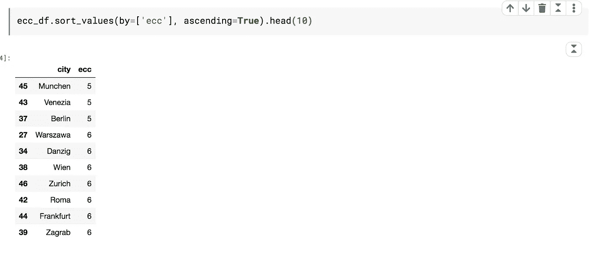

# 像电脑程序员一样玩车票游戏

> 原文：<https://towardsdatascience.com/playing-ticket-to-ride-like-a-computer-programmer-2129ac4909d9?source=collection_archive---------23----------------------->

戴夫·普托兹在 Unsplash[上拍摄的照片](https://unsplash.com?utm_source=medium&utm_medium=referral)

## 运用图论和网络分析建立有效的棋盘游戏策略。

“乘车券”是为数不多的战略棋盘游戏之一，它要求玩家在游戏过程中需要大量的计划和策略构建。通过网络分析和图论概念的简单应用，人们可以更有效地玩这个游戏。在这篇文章中，我将分享一些我对“票到乘车”棋盘游戏的计算分析结果。此外，我将讨论如何建立这个游戏的最佳策略。

在我们继续之前，让我澄清一下，这篇文章并不是向你介绍这个游戏或它的规则，期望这篇文章的读者熟悉这个游戏。不管怎样，对于那些不熟悉这个游戏和它的规则的人，请访问这个页面[票乘坐维基](https://en.wikipedia.org/wiki/Ticket_to_Ride_(board_game))

## **建筑**结构

我们将使用流行的 python 包`[networkx](https://networkx.github.io/)`来构建图形结构。为了适应当前的环境，城市被表示为节点，城市之间的线段可以表示为边。然后，我们使用下面的代码构建网络。

一旦构建了网络，我们可以使用下面的代码快速查看基本信息。

从上面可以注意到，该网络具有 47 个城市(节点)和 90 条轨道(边)。

## 基本统计

在网络理论中，一个节点的 ***度*** 就是它所连接的边数，翻译过来就是一个城市所连接的轨道数。根据下图(图 1)所示的度数分布图，可以看出所有城市的度数都在 1-7 之间。大约 15 个城市的学位为 4，14 个城市的学位为 3。最大 7 度的城市只有一个，6 度的城市有两个。

图 1:学位分布

同样，网络理论术语 ***边*** 翻译为轨迹段， ***边权重*** 翻译为当前上下文中的轨迹长度。从下面的边分布图(图 2)可以看出，近 33 条边的轨迹权重为 2，26 条边的权重为 4，25 条边的权重为 3。有 2 条权重为 6 的边。只有一个权重为 8 的边恰好是运行在彼得格勒-斯德哥尔摩之间的轨道段。只需认领这条路线，就能扣上 21 分。

图 2:边缘分布

不出所料，这个游戏的难度随着玩家数量的增加而增加。从下面的比率可以明显看出这一点。

图 3:游戏难度说明

例如，在一个 3 人游戏中，只有 10%的城市度数小于 3，这意味着阻止其他玩家很困难，所以这对于每个玩家来说都是一个简单的游戏。然而，在 4 人和 5 人游戏中，阻挡概率更大。在一个 5 人游戏中，大量的城市近 72%的度数小于 5，这意味着其他玩家有更多的空间来阻止策略，因此游戏变得更加困难。

图 4(下图)显示了目的地卡积分分布。可以观察到非常少的长路线，大约 3 张目的地卡每张 21 分，3 张卡每张 20 分。大量的卡片都是短路线的，大约有 13 张卡片，每张 8 分。

图 4:目的地卡积分分布

现在让我们定义网络的一些常见属性:

*   ***半径*** 是将最中心的节点(城市)连接到所有其他节点所需的最小边数。
*   ***直径*** 是连接相距较远的两个节点的最小边数。
*   ***偏心率*** 是给定节点到所有其他节点的最大距离。较低的离心率值意味着节点相对更靠近网络的中心，而较高的离心率值意味着节点相对远离网络的中心。
*   ***网络的中心*** 是离心率等于网络半径的节点的集合。网络中心有 3 个城市(如下所列)。从所有这些城市，到达网络的任何部分都相对容易。
*   ***网络的外围*** 是离心率等于网络直径的节点的集合。网络的外围有 7 个城市(如下所列)。从这些城市中的每一个，到达网络的更远的部分是相对困难的。

这些网络参数中的一些计算如下。从下面可以注意到，网络的半径为 5，直径为 9。

图 5:网络参数

图 6:高度古怪的城市

图 7:低怪癖的城市

基于这些网络属性，我们可以得出以下结论:

*   这是一个很好的策略，开始你的游戏时，在像`Berlin,Venezia,Munchen`这样古怪程度低的城市周围宣称路线，因为随着游戏的展开，你可以相对容易地到达你希望继续前进的任何方向。
*   选择包括`Lisboa,Cadiz,Edinburgh,Erzurum,Sochi,Rostov,Moskva`等任何周边城市在内的目的地卡都是不错的策略。这些也是怪癖比较高的城市。在你的控制中拥有一个或多个这些可以增加你建造最长路线的机会。你最好的选择是拥有两个这样的城市，但位于网络的两端。
*   以下列出的是所有来自周边城市的长度等于直径的路线。在你的计划中考虑这些将是一个聪明的策略，特别是如果你正在建造最长的路线。

图 8:周边城市的路线

## 一些城市的重要性

当然，有些城市比其他城市更重要。这可以用各种中心性度量、聚类系数、连通性和效率来衡量。

这些属性定义如下:

*   ***度中心性*** 对于一个节点来说是连接到它的节点的分数。
*   ***一个节点的介数中心性*** 是通过它的所有对最短路径的分数之和。
*   ***节点的接近中心性*** 是从当前节点到所有其他节点的最短路径距离之和的倒数。
*   ***节点的聚类系数*** 是节点邻域内的连接数与邻域全连通时的连接数之比。这个比率表明了节点的邻域连接得有多好。如果邻域是完全连通的，则聚类系数为 1，接近 0 的值意味着邻域中几乎没有任何连接。
*   ***一个节点的*** 连通性是为了阻断到该节点的所有路径而需要移除的最少节点数。值越高越好。

所有上述性质可以从网络推导如下:

上面的代码创建了一个数据帧 **cities_df** ，如下所示(下面只显示了 5 行)

图 9:中心性和聚类系数的图示(仅显示了 5 行)

以下是我们从结果中得出的一些观察结果:

*   基于程度中心性，城市`Paris, Kyiv, Frankfurt`具有较高的值，而城市`Ediburgh, Cadiz, Lisboa, Kobenhavn`具有较低的值。此指标的值越低，意味着您在这些城市周围需要更加谨慎，因为您很有可能被这些城市拒之门外。
*   基于中间中心性，城市`Frankfurt, Wien, Budapest`的值较高，而城市`Brest, Palermo, Cadiz`的值最低。该度量值越高，意味着经过这些城市的最短路径越多，因此经过这些城市的路线竞争也就越激烈。更多的竞争再次导致堵塞，所以你需要留意这些城市，如果你的计划中有它们的话。
*   基于接近中心性，城市`Wien, Munchen, Budapest`具有更高的价值，因此从这些城市很容易到达网络的远端。而城市`Cadiz, Lisboa, Edinburgh`价值较低，因此从这些城市到达远端相对困难。
*   根据聚集系数值，很明显像`Lisboa, Cadiz, Sochi, Barcelona, Brest`这样的城市的邻近区域非常强大，所以即使你的对手试图在一条路线上阻挡你，你也一定能够找到出路并继续前进。不过对于`Edinburgh, Moskva, Stockholm, Kharkov, Kobenhavn. London`这样的城市你需要更加谨慎，因为他们的邻里关系并不牢固，你可能会被挡在门外。

除了中心性测量和聚类，我们还可以通过某些攻击策略来测量每个城市的重要性。任何东西的重要性只有在它消失的时候才更为人所知。因此，我们可以迭代地从网络中一次删除一个城市，并测量某些属性的变化，如连通性、效率等。在这种情况下，移除一个城市意味着你的对手已经占领了该城市周围的所有路线，而你被封锁在该城市之外。这个过程可以使用下面的代码来完成:

上述代码将生成如下所示的数据帧 **node_importance_df** (仅显示 5 行):

图 10:节点重要性的图示(只显示了前 5 行)

下面是我们从节点重要性结果中得出的一些观察结果:

*   可以观察到，当您删除除了`London`和`Madrid.`之外的任何城市时，网络几乎保持连接。当您删除`London`时，`Edinburgh`变得不可达，当您删除`Madrid`时，`Lisboa`和`Cadiz`从其他地方都变得不可达。所以，如果你对这些城市感兴趣，你最好小心`London`或`Madrid.`
*   有趣的是，移除`Essen`会使建造一条路线的总平均成本增加`+8.24%`。如果你占领了通往这个城市的所有路线，你将会显著影响到你所有的对手，因为他们的建造成本会增加，因此，他们的游戏会稍微延迟。但是，如果情况反过来，对你就不好了。
*   另一个有趣的观察是，`Marsielle`的缺失通过`-10.35%`降低了平均连接性，这同样对你的对手不利，因为他们更容易受到阻塞。

## 某些轨道段的重要性

在游戏的背景下，任何人在一个城市被封锁是相对困难的，但在一个路段被封锁是相当容易的，因此知道某些边缘路段的重要性在这个游戏中更有用。每个路段的重要性可以通过边的介数中心性以及平均连通性、平均聚类系数、效率等因素的变化来衡量。

使用下面的代码，我们可以计算每条边的介数中心性:

图 11:基于中间中心性的前 5 条边

图 12:基于中间中心性的底部 5 条边

下面是我们从图 11 和图 12 中得到的一些观察结果:

*   可以观察到`Budapest-Wien, Zagrab-Vienna, Wien-Munchen`具有很高的中间中心性。因此，毫无疑问，这些细分市场存在巨大的竞争，因此，如果它们在你的计划中，你需要相对更快地赶上它们。
*   然而，对于像`Rome-Venezia, Barcelona-Marsielle`这样的细分市场，你不需要强调太多，因为它们的介数分值越低，意味着竞争越小。

现在，让我们根据一些攻击策略来评估每条边的重要性，这些攻击策略与我们在上一节中针对节点重要性所做的类似。这可以使用下面的代码来完成:

上述代码将生成如下所示的数据框结果(仅显示了 5 行):

图 13:边的重要性的图示(只显示了 5 行)

下面是我们从边重要性结果中得出的一些观察结果:

*   您可以观察到，只有当您移除边`London-Edinburgh`时，网络才断开连接，当这种情况发生时，只有`Edinburgh`变得不可达。但是，网络不受任何其他边的影响。
*   当`Kobenhavn-Essen`消失时，平均最短路径成本增加`7.34%.`
*   可以观察到，平均连通性受到几乎每次边缘移除的显著影响，当平均连通性下降`8.47%.`时，移除边缘`Rostov-Kharkov`导致的影响最大
*   当你移除像`Lisboa-Cadiz, Cadiz-Madrid, Lisboa-Madrid`这样的边缘时，邻域也会受到很大影响，这从网络的平均聚类系数值的巨大下降中可以明显看出。
*   此外，移除边缘`London-Edinburgh.`会导致效率下降`2.81%`

## 目的地卡盈利能力分析

如果你知道选对牌的艺术呢？当然，这是很有可能的，但前提是你知道基本的数字。使用下面的代码，我们可以计算所有目的地卡的最短路径特征。

上述代码将生成如下数据帧(仅显示 10 行):

图 14:目的地卡最短路径特征

下面是我们从最短路径结果中得出的一些观察结果:

*   可以观察到，如果你选择最短的路径，所有的长路线(卡点数> =20)都会给你带来大约 50-54 个最终点数。除了在这些路线中的一条路线上走最短的路线之外，你仍然会失去将近一半的机车，因为它最多只花费你大约 20-21 个机车。
*   此外，有趣的是，由于额外的卡点数，路线`Edinburgh-Athina (21)`可能看起来比`Lisboa-Danzig (20)`更有吸引力，但最短的路径`Lisboa-Danzig`将为您带来`50`点数，而`Edinburgh-Athina`只能为您带来`48`点数。事实上，这一点在`shorest path profitability`中表现得更为明显，该比率从本质上解释了该路线的盈利能力。它仅仅是总终点和成本的比率，也就是你用来建造这条路线的机车数量。同样从表中可以看出，最有利可图的最短路径路线是`Palermo-Constantinople`,只需花费`8`辆机车即可获得`25`个积分。除了一条长路线，这将是一个很好的短路线卡。
*   另一个值得关注的因素是`connectivity`，在这种情况下，它适用于所有相关的路由。它指示要删除的最少边数，以封锁给定源节点和目的节点之间的所有路径。越高越好。可以观察到，`Berlin-Bucuresti`是迄今为止最稳健的路线，因为它需要`5`边缘来阻挡任何人。在较长的路线中，`Edinburgh-Athina, Kobenhavn-Erzurum, Cadiz-Stockholm`由于其较低的边缘连通性值，更容易发生堵塞。所以，如果你要走这些路线，你必须更加小心。

## 替代得分策略

在任何路线上，最短路径完成需要最少的机车数量，但不一定能给你带来最多的分数。在游戏过程中，玩家经常会走一些弯路，特别是为了获得一些额外的分数。

让我们更详细地分析路线`Palermo-Moskva`。从目的地卡分析中，我们可以看到，路线`Palermo-Moskva`的最短路径以`20 locomotives.`为代价为您赢得了总共`54`分，但是，如果您有更多的时间，您更有可能计划绕道以获得额外的分数。那你是怎么做到的呢？好吧，这里你需要仔细考虑与每条替代路径相关的各种特性，以便获得好的收益。例如，如果游戏剩下的时间不多了，你可能想选择一条`path length`较少的路径，因为完成路径长度的每一段都要花费你一个回合。此外，您应该能够支付所选路径的成本，因此`path cost`有时会成为选择最佳路径的重要因素。有时候，`path profitability`更有意义，尤其是当你想获得更多投资回报的时候。

推断给定源和目的地之间的所有替代路由需要找到整个网络中的所有简单路径，这有时会导致不确定的时间，尤其是对于大型网络。因此，我们将只找到比最短路径多 2 段的所有替代路径，这简化了我们的过程。下面是实现这一功能的代码片段。

使用上述方法，我们生成了路线`Palermo-Moskva`的所有备选路径。您可以仔细分析以下路径，并根据您的标准选择最佳路径。类似地，对于任何给定的路线，可以推导出备选路径。

图 15:巴勒莫-莫斯科备选得分选项

## 阻挡策略

在上一节中，我们已经看到了替代得分策略。但是，你需要清楚别人阻挡你完成你想要的路线需要付出什么代价。对任何路线使用`Mininum edge cut`,我们可以找出最关键边的列表，如果所有边都被阻塞，将意味着您无法完成该路线。

例如，对于上面讨论的同一条路线`Palermo-Moskva,`，任何人都需要 3 条边才能把你撞倒。换句话说，这本质上意味着你需要做出明智的选择，相对更快地建立在这些优势上，减少其他人阻碍你的机会。

根据最小边割分析，我们可以得出以下结论:

*   `Berlin-Bucurest`和`Paris-Wien`是最坚固的，因为任何人都需要 5 个回合来阻挡它们。这意味着你可以相对轻松地使用这些目标卡，没有被阻挡的压力。
*   `Edinburgh-Athina`是最易受攻击的路线，因为任何人只需 1 条边就可以阻止您填写目的地卡。

图 16:最小边缘切割图

## 结论

虽然你们每个人对游戏都有不同的看法，但知道这里讨论的细节总是有好处的，例如何时走最短路径，何时从最短路径绕道以获得额外的分数，等等，如何阻止某人或如何避免被阻止，哪些部分需要注意，哪些部分可以减少压力，等等。等等。希望你喜欢阅读这篇文章。

分析中使用的所有代码都可以从这个 [Github 库](https://github.com/genielab/network_analysis_ticket_to_ride)下载。