# 用深度强化学习玩宝藏游戏—第 3/3 部分

> 原文：<https://towardsdatascience.com/playing-treasure-drop-with-deep-reinforcement-learning-part-3-3-e4a2992112a1?source=collection_archive---------82----------------------->

## 艾玩拼图

在这个系列文章中，我解释了我从事的强化学习(RL)项目。最后，你会知道这是怎么回事:

[观看这个人工智能在实时益智游戏中击败人类玩家](https://youtu.be/FhhPJIZnJ1M)

我讨论了问题的独特和值得注意的方面，我使用了什么技术以及为什么。希望对深度强化学习感兴趣的读者会发现所有这些都很有见地。

在[第一部分](https://medium.com/p/2eb789c2ff5e/)和[第二部分](https://medium.com/p/e7097478d402/)中，解释了*宝藏掉落*的游戏，并且用一些专门用于深度强化学习的方法实现了深度 Q 网络。这一部分是关于通过绘制度量来监控模型的学习进度，通过对抗来比较代理，以及代理在线游戏的框架。

# 摘要

跟踪学习进度和绘图是深度学习研究的关键。为了跟踪学习进度，解释了启发式度量，并绘制了情节迭代的 MSE 损失。经过训练的模型相互挑战，以了解哪个学习过程产生更好的代理。为游戏的不同回合(1、2、3 和 4)训练的代理被放在一起在线执行。最后，对 GitHub 库中的一些类进行了高层次的解释。接受来自屏幕的输入，点击适当的点，代理能够击败大多数玩家。

**3/3 部分的 GitHub 知识库:**[TD-deepreinforcementlearning-Part 3](https://github.com/arapfaik/td-deepreinforcementlearning-part3)

# 测绘

虽然我是最后提的，但是**策划远不是最不重要的。在整个项目中，我一直在绘图，这非常有帮助。不策划，至少不可能成功到这种程度。**

在任何机器学习项目中，绘制关于情节的损失是无可争议的关键步骤。在强化学习中，跟踪代理的学习进度也是必不可少的。有时有一些明显的指标你可以跟踪，比如累计奖励或准确性，有时你必须编造它们。无论如何，学习过程有时可能看起来像一个黑匣子，而度量标准将是你黑暗中的灯塔。

**指标应传达损失图未能提供的模型进度信息。当你在处理这个问题时，你可能会想到一些有意义的事情。我鼓励你把它们标在损失旁边，并注意它们在训练中的趋势。**

在训练循环之后，模型会自动与其绘图一起保存:

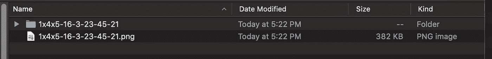

这是其中之一:

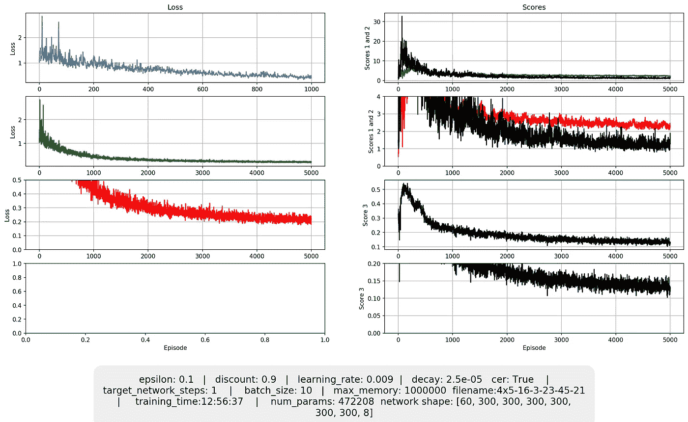

左栏中的只是损耗，沿 x 轴和 y 轴放大。左下角的点是为学习率计划保留的，如果学习率是恒定的，则留为空白。右边是自定义的启发式分数。你可以在每个图的 y 标签上看到它们是什么分数。它们是对模型学习过程的启发式测量，这就引出了我们对它们的讨论。

# 启发式得分

在[第 1 部分](https://medium.com/p/2eb789c2ff5e/)中详细解释了为什么这些分数与模型进度相关。简单地说，一个具有 100%精确 q 值预测的完美模型的得分为 0。分数越低，很可能模型越好。

## 得分 1

随机选取的(来自经验重放缓冲区)镜像游戏状态的 q 值之间的 MSE 损失。在理想模型中，输出是非常精确的 q 值。因此，镜像的相应动作会非常接近。因为分数是 MSE，理想的模型应该非常接近于 0。

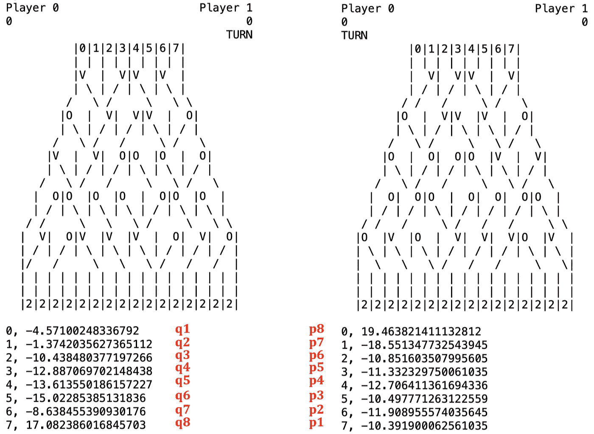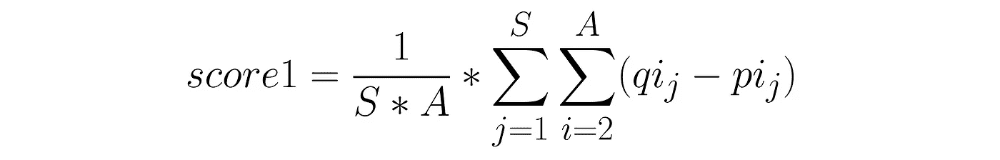

## 得分 2

相邻等效动作之间的 MSE 损失。如果两个位置下方的直接控制杆中有一枚硬币，则认为动作是等效的。左或右动作将导致完全相同的下一个状态。

左和右的动作对游戏产生相同的效果。

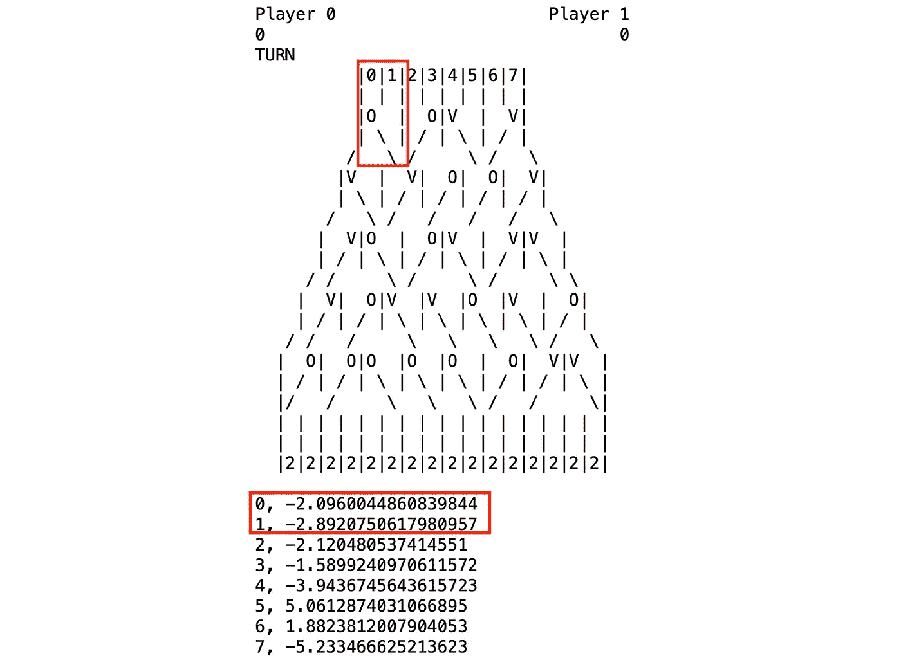

动作 0 和 1 都导致完全相同的下一个状态。

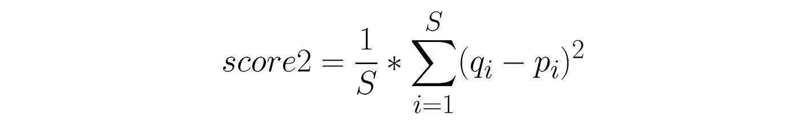

得分公式 2。

## 得分 3

q 值将显示镜像态之间的差异，因为我们的模型永远不会完美。然而，只有最高的 q 值决定了动作，不管单个值是什么。**正因为如此，即使得分和损失都很高，经纪人最终也能打得很好。**

得分 3 是 0-1 损失的平均值。它的值在 0 和 1 之间。其测量方法类似于 score1。然而，只考虑最大 q 值。如果镜像状态下的两个动作导致相同的结果，对平均值的贡献为 0。如果不是，那么贡献是 1。例如，如果 score3 为 0.2，这意味着在 10 个镜像状态中的 2 个中，代理仅在 8 个中是一致的。请参见下面每个案例的示例。

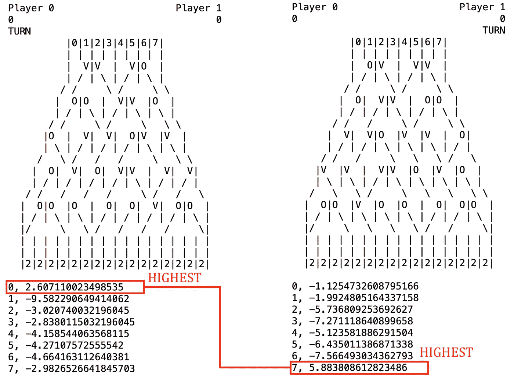

尽管这两种状态下的 q 值大相径庭，但最高值属于同一动作。

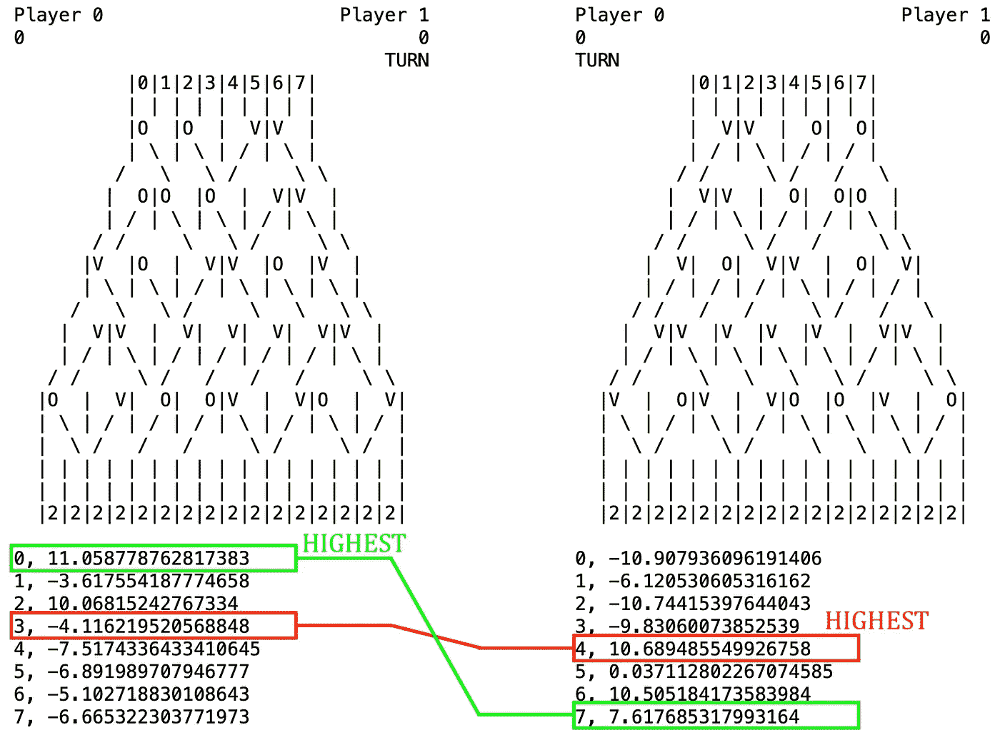

这里，两个镜像状态具有不一致的最优动作。

# 情节中的启发式得分

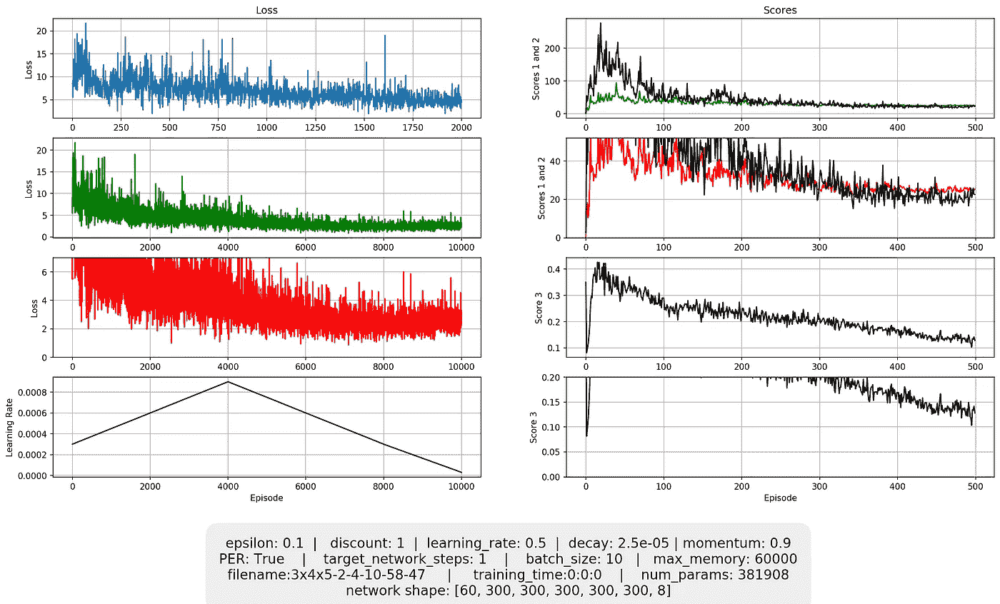

这是另一个循环学习率的训练图。注意分数 3 是如何持续下降的，即使损失在某个点后没有改善(视觉上)。在对超参数进行网格搜索后，对我来说，分析这组图是很有见地的。

分数确实有帮助，但是，在一个装满模型的文件夹中，很难知道哪个模型是最好的。这就把我们带到了对 Duel 和 DuelFolder 类的讨论。

# 决斗和决斗文件夹类

决斗班有两个训练有素的特工，他们打了几局，结果如下图所示。

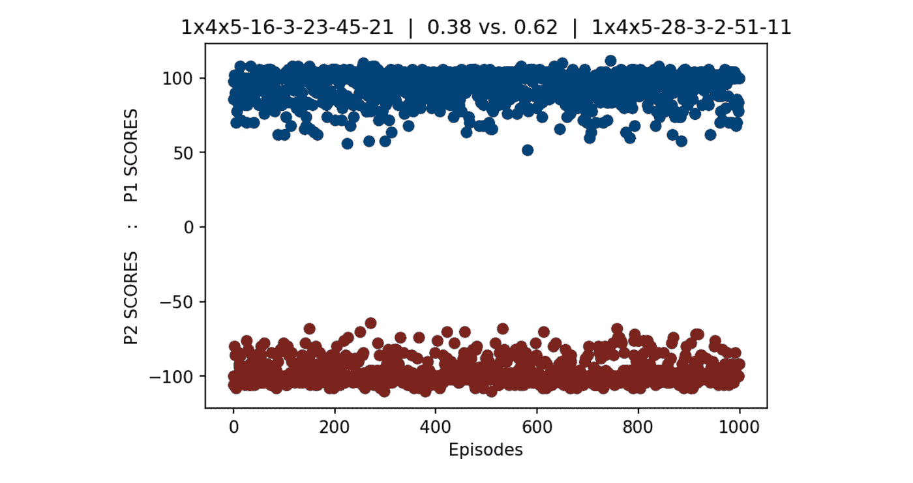

结果来自 1000 集。看起来 51-11 大部分时间都会赢。

DuelFolder 以批量方式做同样的事情，将整个模型文件夹作为输入。两两对抗的代理，输出胜利计数他们每一个。

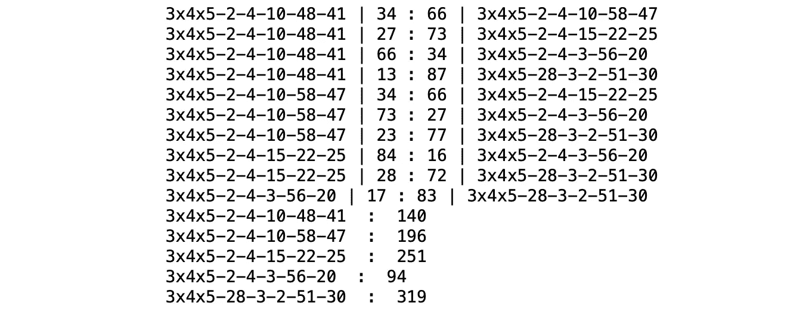

似乎以 51–30 结尾的模型是最好的。

这只是衡量学习过程的另一种形式。没有完美的模型可以和训练过的模型进行比较。然而，我们可以通过击退他们来相互比较。决斗训练模型允许我们比较在不同条件下训练的模型。

在大多数情况下，具有好看的损失和启发式度量图的模型表现最好。基于该比较选择最终模型。

在一个没有自动方法来衡量一个智能体相对于人类表现如何的环境中，衡量模型之间的相对表现是很有趣的。

# AgentFull 类

在最开始，为了训练的简单，我们忽略了原始游戏有四轮的事实。每一轮在游戏底部都有不同的分数。这改变了交易的回报。因此，为一轮训练的代理对另一轮无效。

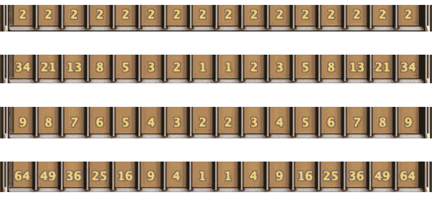

第 1 轮、第 2 轮、第 3 轮和第 4 轮的分数。

这使得有必要为每一轮训练单独的代理。然后 AgentFull 将这四个单独训练过的模型。每当要求给定状态的最佳动作时，它只是将推理过程转发给适当的代理。

# 游戏控制器类

这个类是 AgentFull 类在线运行的框架。它截取屏幕截图，使用 OpenCV 库检测对象。当轮到代理时，从游戏中读取状态并用鼠标点击适当的点。

# 行动模型！⚔️

[链接到 GitHub 库](https://github.com/arapfaik/td-deepreinforcementlearning-part3)

以下是如何运行“运行游戏控制器”笔记本。你打开笔记本和游戏，在同一个屏幕上可见。一旦你运行细胞。start_playing()方法，游戏将被检测到，程序将开始每 0.5 秒抓取一个屏幕截图，与其他玩家进行游戏。请注意，这样做可能会让你被禁止游戏。

# 仅此而已！

[在线观看代理如何对抗真实玩家。](https://medium.com/p/27fde513333e)

希望你喜欢！😊

# 关于我

我是一名数据科学家，住在旧金山。热衷于从数据中寻找答案。在 Linkedin 上找到我:[梅尔·萨卡里亚](http://linkedin.com/in/sakarya)