# 用深度强化学习玩宝藏游戏—第 1/3 部分

> 原文：<https://towardsdatascience.com/playing-treasure-drop-with-reinforcement-learning-tabular-q-learning-part-1-x-2eb789c2ff5e?source=collection_archive---------73----------------------->

## 艾玩拼图

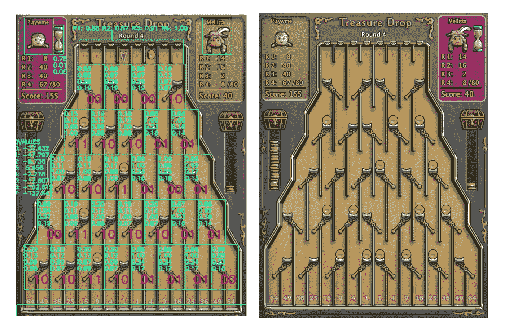

这是代理在与其他玩家在线对战时“看到”的内容。

## 在这个系列文章中，我解释了我从事的强化学习(RL)项目。最后，你会知道这是怎么回事:

[观看这个人工智能在实时益智游戏中击败人类玩家](https://youtu.be/FhhPJIZnJ1M)

将强化学习应用于一个新奇的、尚未探索的问题的想法一直吸引着我。我有很多空闲时间在疫情冠状病毒中忙碌。另外，我年轻的时候也玩过这个游戏。这个项目只是在这段时间里的一个完美的侧面。

我讨论了问题的独特和值得注意的方面，我使用了什么技术以及为什么。希望对深度强化学习感兴趣的读者会发现所有这些都很有见地。

## 在第 1 部分(本部分)，

通过缩小游戏桌的尺寸，开始着手解决原始问题的一个更小更简单的版本。这大大减少了状态空间，使问题更容易解决。除了这个小问题之外，还有一个相对简单的技术，适用于更小的状态空间:表格 Q-learning。这有助于建立对问题的直觉。这种直觉在后来用深度 Q 学习网络(DQN)解决问题时非常有用。

## 在第 2 部分中，

在获得了表格方法所需的验证和早期成功之后，使用 Keras 库实现了 DQN 来解决与第 1 部分相同的问题。然而，由于项目的性质，学习过程变得不稳定。从研究论文中借用了几种方法，并实施这些方法来缓解这个问题。即，优先经验重放、目标 Q 网络、具有学习率查找器的循环学习率。([第二部](https://medium.com/p/e7097478d402))

## 最后，在第 3 部分中，

跟踪学习进度和绘图是深度学习研究的关键。为了跟踪学习进度，解释了启发式度量，并绘制了情节迭代的 MSE 损失。经过训练的模型相互挑战，以了解哪个学习过程产生更好的代理。代理接受不同回合游戏(1、2、3 和 4)的培训，并被组织起来进行在线表演。解释了从计算机屏幕获取输入和执行动作的框架。接受来自屏幕的输入，点击适当的点，代理能够击败大多数玩家。 ( [第三部分](https://medium.com/p/e4a2992112a1))

**1/3 部分的 GitHub 知识库:**[TD-deepreinforcementlearning-Part 1](https://github.com/arapfaik/td-deepreinforcementlearning-part1)

## 在这一部分，

我们的问题域，*宝藏掉落*的游戏，是按照任何强化学习应用的五大要素来解释和细分的: ***环境*、*智能体*、*状态*、*动作*和*奖励*** 。接下来，学习算法被简单地提及并且给出了为什么它适合这个问题的原因。接下来，定义了收敛的启发式度量，我们的模型由这两个度量以及(有趣的部分)与之对抗来评估。

让我们从定义环境开始。

# 环境

每个玩家轮流把一枚硬币一次扔进棋盘的顶部。这个游戏的目标是使硬币从棋盘底部掉落到投币口。因此得名，*宝降！*积分值越大越好。关于游戏的更多描述:[链接到官方网站](https://yppedia.puzzlepirates.com/Official:Treasure_Drop)

如果你对最终代理在网上与真实玩家的对战表现很好奇，可以随意看看下面的视频。为了更好地理解游戏，强烈建议观看，因为仅仅通过文字描述来解释游戏动态是很有挑战性的。

**观察:代理人在“真实世界”中的表现**

正如你可能在视频中看到的，这个游戏分四轮进行。每一轮，棋盘底部的分数都不一样。为了简化模型训练，忽略了轮次，它们不是模型的输入。对于给定的模型，只考虑第一轮(第一轮)。

你可能想知道，视频中的代理人在 4 轮游戏中表现如何？答案是，实际上有 4 个模型，每一个都被单独训练了不同的回合，不同的分数，用一个包装类放在一起。根据游戏回合的不同，只有一个被激活。

游戏机制是用 python 模拟的，以创建一个训练环境。`TreasureDrop`类是游戏的抽象。下面是`printState()`方法的控制台输出。另外，代理类的`demo()`方法让你通过从控制台接受输入来对抗它。在这个项目的过程中，看到经纪人如何与我对抗是非常有用的。

demo()方法还打印预测的 q 值。由于熟悉这个游戏，我能够很快判断 q 值是否有意义。在下图中，“O”表示槽中有硬币的杠杆，而“V”表示没有硬币的杠杆。现在不要担心回合，这部分只考虑第一回合。想象他们不存在。

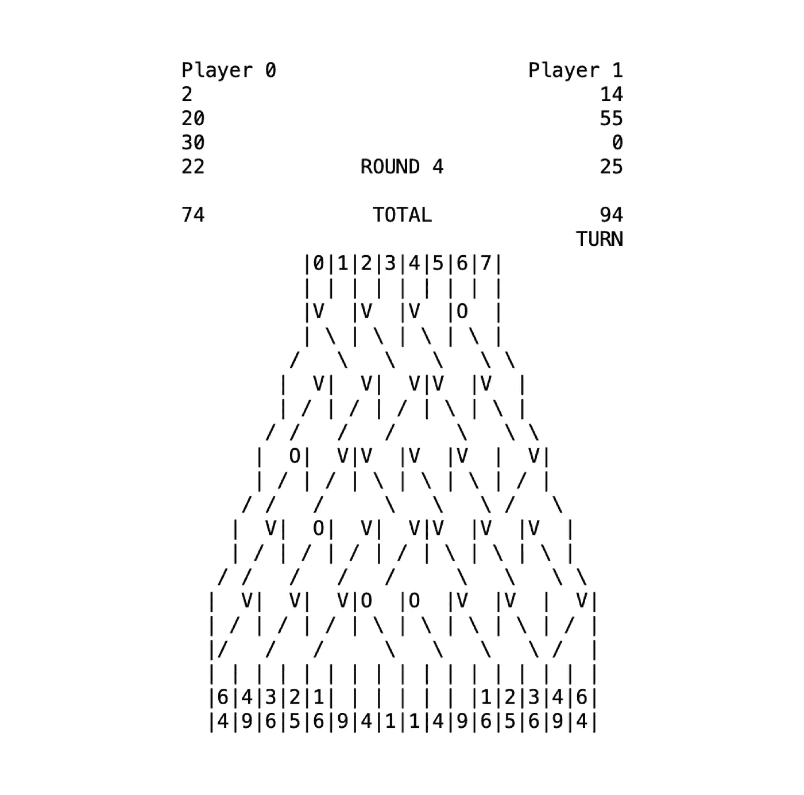

上面的板子是 4x5 的。纸板尺寸是指{顶行宽度} x {纸板高度}。在任何项目中从小处着手都是好的。针对较小的董事会规模培训代理更容易。此外，它还验证了这个问题可以通过强化学习技术来学习的假设。对于这一部分，我们将解决较小的电路板尺寸，例如:

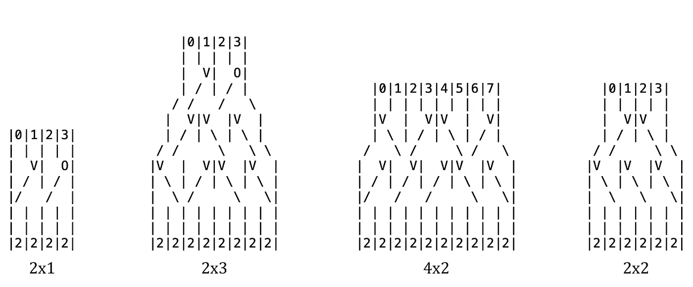

为了应用一种成功率更高的技术，并验证我的假设，即这个游戏是可以学习的，首先使用表格的方法来解决这个问题。使用较小的尺寸是为了使问题可行。在原始(4x5)游戏表中有 2⁶⁰可能的状态。用 2⁶⁰条目构建一个表在计算上是不可行的。但是上面的尺寸还可以，

# 状态

这将我们的讨论带到了*状态*的定义。游戏有几个数据点可以包含在状态中，并且可以被模型感知。也就是说，回合、分数、轮到谁以及杠杆的位置。为了保持模型的简单性和训练过程的鲁棒性，只有集体*杆状态*被认为包括在状态中。*杆状态*是单个杆的状态，编码如下:

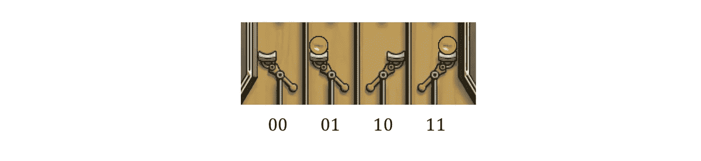

正如你在视频中可能注意到的，这正是模型对杠杆的感知。游戏的*状态*只是单个*操纵杆状态*的集合。每个杠杆状态从左到右、从上到下相加，顺序与书面英语相同。给定游戏桌的相应状态如下所示:

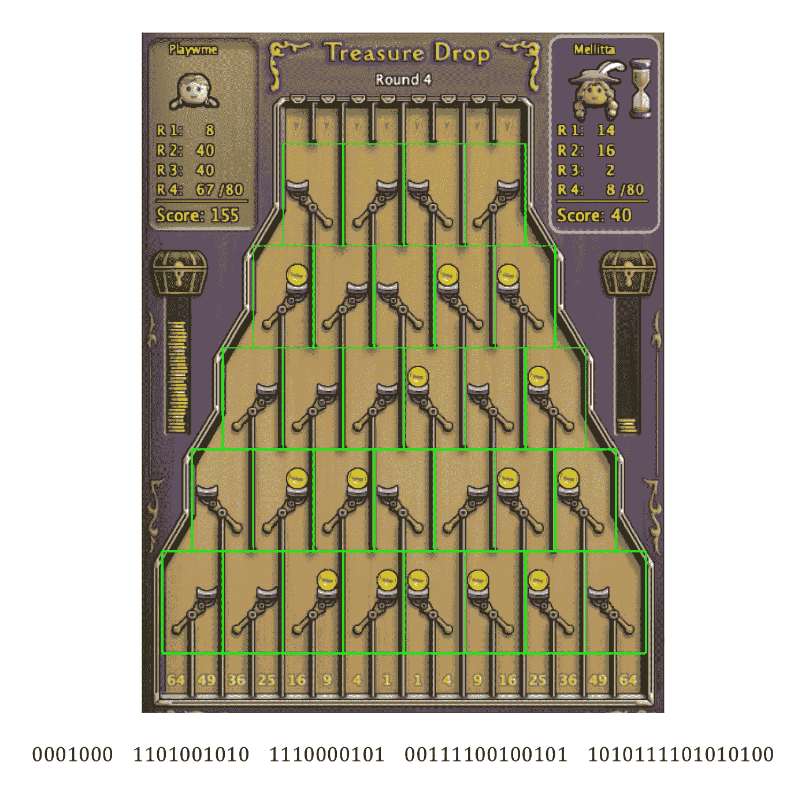

**状态**是模型的输入。它是通过连接杠杆状态组合在一起的。

# 行动、奖励和下一个状态

一个*动作*是指从游戏桌面的任何一个投币口投出一枚硬币。插槽的索引从 0 开始，向右移动时递增 1。根据所采取的*动作*，一个*奖励*和*下一个状态*将确定地跟随。奖励是采取行动后获得的总点数的总和。这是由硬币到达棋盘底部的分数决定的。

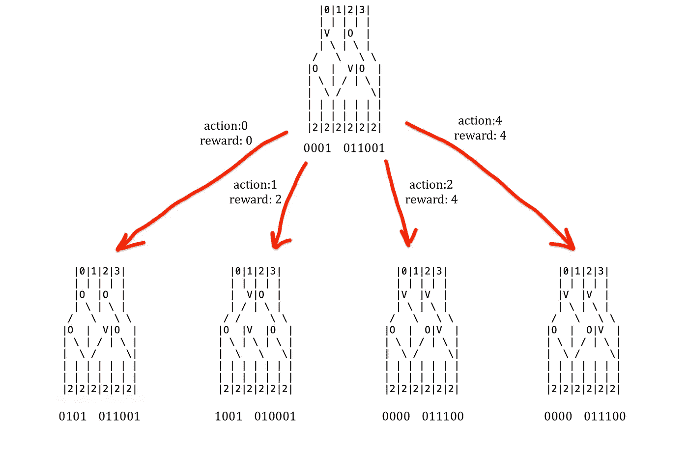

# 代理人

政策决定下一步采取什么行动。每个动作的 q 值将由基础模型决定。代理遵循*贪婪策略*，这意味着它将选择具有最高 q 值的动作。

强化学习是从互动中学习如何表现以达到目标。强化学习代理及其环境在整个训练过程中通过一系列离散的时间步骤进行交互。同样，我们的目标是训练一个能够做出好的决策序列的智能体。

这个决策过程被建模为马尔可夫决策过程(MDP)。在 MDPs 中，我们估计每个州 s 中每个行动 a 的值 Q(s，a)。q 值，𝑄(𝑠，𝑎)是*预期贴现回报*如果我们在𝑠州执行行动𝑎，那么从那时起遵循最优策略。这些状态和动作相关的量对于准确地将长期后果的信用分配给单个动作选择是至关重要的。

考虑上图。给定状态 s 和动作 0、1、2 和 3，我们的策略在 Q(s，0)、Q(s，1)、Q(s，2)和 Q(s，3)中挑选具有最高**Q 值的动作。因此，强化学习的任务变成了寻找正确输出 Q 值的函数 Q。**

为了实现这个功能，在这一部分中，我们将为每个(状态、动作)对建立一个包含条目(q 值)的表。这就是所谓的 Q 表。在下面的部分中，这个 Q 值函数将被近似。然而，表格和 DQN 实现中的学习算法将保持不变。

# 学习算法

> 如果一个人必须确定一个核心的和新颖的强化学习的想法，它无疑将是时间差 TD 学习。
> 
> —萨顿&巴尔托公司

选择称为 TD 学习的时间差学习作为学习算法。它的工作是在每个时间步更新 Q 值函数。这意味着每当代理采取行动时，它将更新 Q 表中的一些条目。

TD 方法优于其他强化学习方法的一个优点是，TD 方法可以直接从原始经验中学习，而不需要环境的动态模型。此外，TD 更新可以在每一步调用，这与蒙特卡罗(MC)方法形成对比，在蒙特卡罗方法中，算法要等到剧集结束时才进行更新。这使得 TD 以在线方式实现变得非常自然。这个项目中使用的方法称为一步 TD，即 TD(0)。一步式仅仅意味着更新方程只考虑一步奖励。

最初，所有 Q 值都被初始化为任意值。代理通过遵循ε-贪婪策略来玩游戏，在每次迭代中，代理丢硬币并获得奖励，在每次迭代中，Q 值函数根据贝尔曼方程更新:

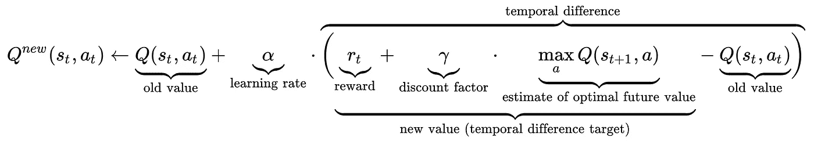

贝尔曼方程是 Q 学习的核心。这也是在 TD(0)算法的每一步中更新表格的方式。

对于固定大小的策略，TD(0)被证明确定性地收敛到算法的表格实现的单个答案。

# 对贝尔曼方程的修正

由于问题的性质，需要对贝尔曼方程做一个小的改动。在一些流行和众所周知的强化学习问题中，如 [gridworld](https://cs.stanford.edu/people/karpathy/reinforcejs/gridworld_td.html) 、[月球着陆器](/ai-learning-to-land-a-rocket-reinforcement-learning-84d61f97d055)和 [cartpole](/cartpole-introduction-to-reinforcement-learning-ed0eb5b58288) ，下一个状态的动作也是由 agent 决定的。换句话说，下一个状态属于同一个代理。我们的问题是一个回合制游戏，下一个状态不属于代理。事实上，**下一个状态其实是属于敌人的。**

在登月过程中，最好去一个 q 值高的州。然而在我们的问题中，情况恰恰相反。代理人必须确保在收集最多奖励的同时，下一个状态必须总是尽可能低的值。重复一遍，(下一个状态，行动)的最大值对我们来说和奖励本身一样重要。这是一个零和游戏，获胜的策略是在获得奖励的同时限制敌人的奖励。

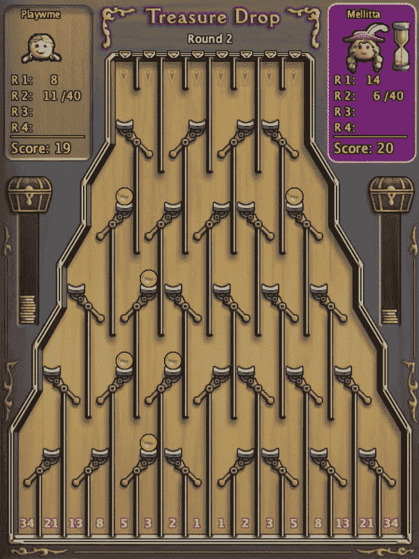

有经验的最终代理对在线对手。

代理使用用户名“Playwme”进行游戏。虽然并不总是如此，但它通常会避免对手采取这样的行动，因为它知道下一个状态可能会给敌人带来比短期奖励更多的分数。由于这种现象，特工**必须**确保敌人不会做出太有价值的行动，至少不会比我们得到的奖励更好。

这个关于游戏动力学的知识需要对 TD(0)算法使用的更新方程(贝尔曼方程)做一个小的改变，以适应这个问题。

由于这种特定于领域的现象，将属于*折扣因子*的加号以及最优未来值的*估计值切换为负数是有意义的。在下面的修正贝尔曼方程中，它用红色表示:*

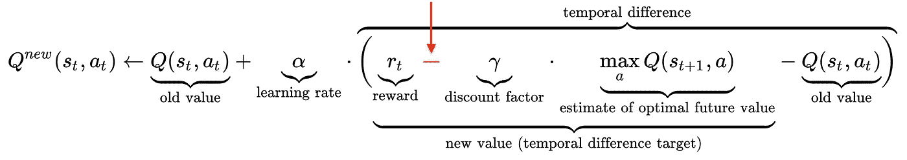

用书面英语翻译这个变化，意思是:{状态值，动作} = {我得到的奖励}–{下一个状态的最大值，属于敌人的动作}

# 超参数

这里没有太多的超参数调整，因为这只是一个玩具例子。但是，提到探索率的影响是值得的。

探索率对主体在整个学习过程中遇到的状态分布有影响。**在数据科学中，数据的底层分布决定了模型学习的内容。**

如果探索率较低，(大约 0.05–0.1)代理人会比探索率较高的情况更频繁地暴露于竞争游戏中可能遇到的状态。相反，如果探索率是 1，代理随机地玩，并且当动作被随机地挑选时暴露于状态。就像人类一样，代理人将会更多地了解它所接触到的东西。

让我们假设有一个*边缘状态*，一个不经过深入探索就不可能达到的状态。如果勘探率较低，则不能很好地达到该状态，从而导致表中的 q 值不太准确。让我们假设有一个*核心状态*，这是一个在竞技游戏中经常遇到的重要状态，为了更多地暴露于该状态，探索率需要较低。代理越多地暴露于核心状态，它就越知道在竞争游戏中面对核心状态时如何表现。

无论探索率是 0.05 还是 1，Q-table 迟早会用正确的 Q 值填充，这取决于表的大小。边缘和核心状态被探索只是时间问题，取决于探索速度。TD(0)的表格实现保证收敛到正确的解。

# 模型验证

虽然不是最科学的，但验证模型最有趣的方式是和它玩。作为一种测试模型的自动化方法，没有像登月那样直接的方法，在登月中，累积奖励是有意义的。然而，我们有几种方法可以获得模型捕捉正确 q 值能力的“启发式”评分。其中之一是查看下面两个镜像电路板的 q 值。两个镜像板简单地意味着游戏桌被 y 轴颠倒。

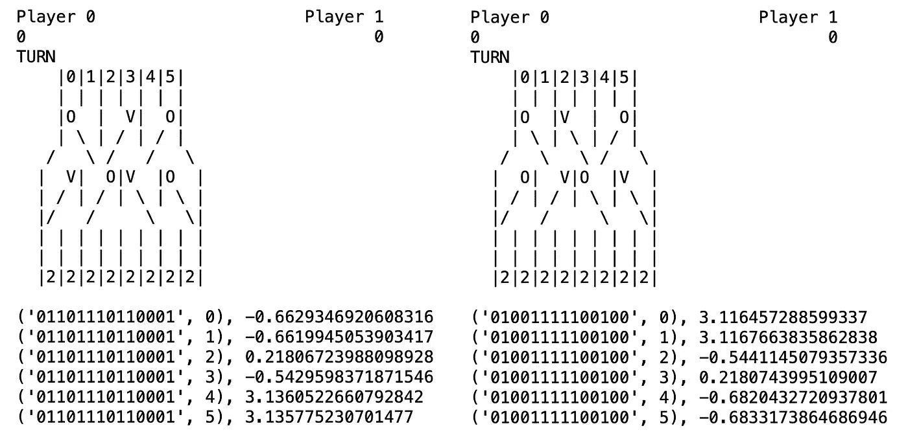

注意到彼此对应的动作有非常接近的 Q 值吗？为什么这很重要？如果与另一张桌子上的等效动作相对应的动作的 Q 值非常接近，这意味着我们的模型可以看到这两个动作带来了相同的奖励并过渡到等效状态。值得注意的是，该模型能够捕捉到这一点，而无需我们提供游戏机制或让模型知道这两种状态是彼此沿 y 轴的镜像。

注意，分数可能不存在，更不用说接近了，如果状态是在竞争游戏期间不可能发生的。毕竟，我们在这里处理的是一个统计模型，没有魔法。如果代理在训练中没有遇到这种状态，它很可能不会对此有任何意见。

另一个启发是基于这样的事实，一些相邻的动作对转移到相同的下一个状态，并获得相同的回报。更具体地说，如果最上面一排的杠杆上有一枚硬币，那么向左和向右的动作对该杠杆产生相同的效果，因此对整个棋盘也产生相同的效果。

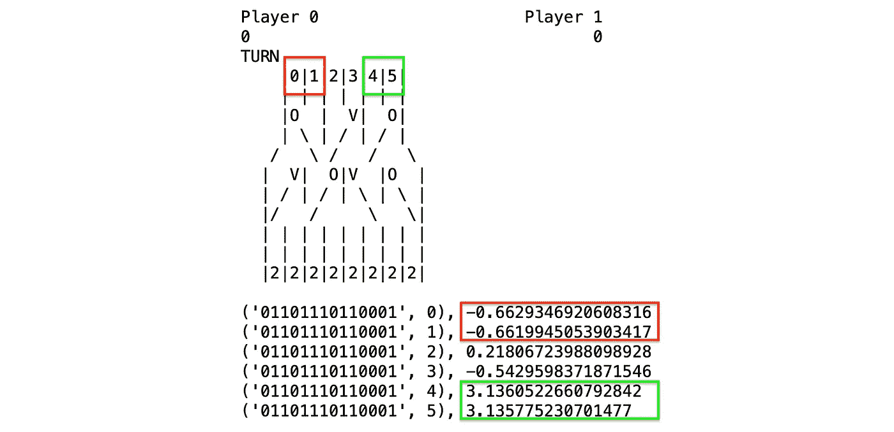

如上图所示，0 & 1 和 4 & 5 的 Q 值非常接近。这是因为简单地说，两个动作都会导致相同的回报和下一个状态，都是通过移动杠杆上的硬币。如果代理人发现了这一点，很可能就发现了整个游戏。

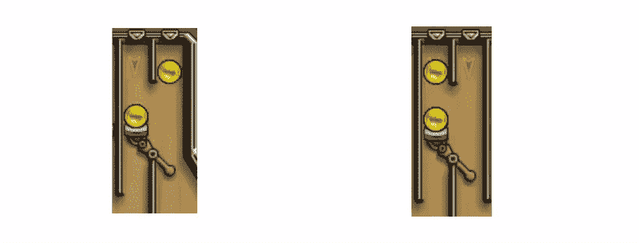

虽然动作 2 和动作 3 彼此相邻，但情况并非如此。因此，这两个动作共享一个非常接近的 q 学习是有意义的。同样，如果模型可以说这些动作的 q 值非常接近，这是一个强有力的指标，表明模型非常了解这个游戏。

# ⚔️行动模型

[链接到 GitHub 库](https://github.com/arapfaik/td-deepreinforcementlearning-part1)

去查查笔记本吧。GitHub 资源库中有两个笔记本。一个用于从已经计算的 q 表中运行代理。另一方面，你可以从头开始训练一个代理，只需要一路运行细胞。

看你能不能打败它！

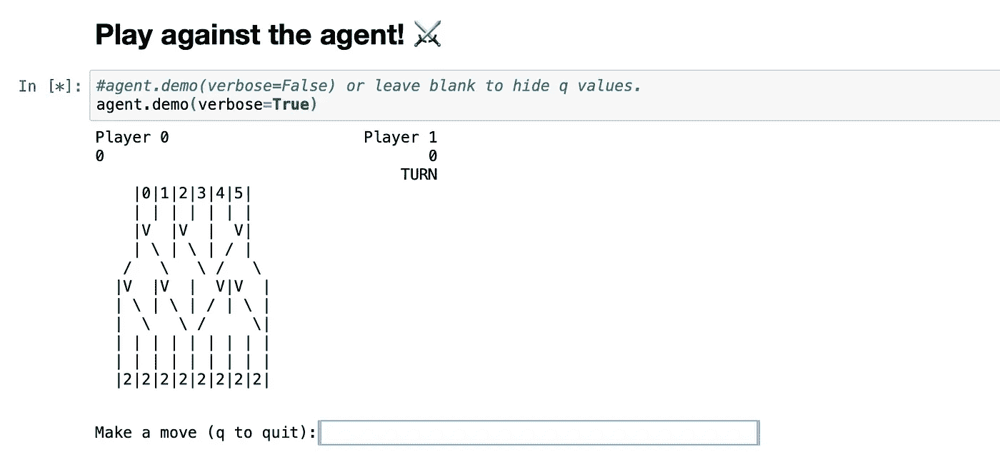

# 下一步是什么？

现在我们知道这个问题可以通过强化学习方法来解决。在第 2 部分中，我们将 DQN 的表格实现转换为适用于更大的问题。

表格法往往能找到精确解，即往往能精确找到最优值函数和最优策略。这与下一部分中描述的近似方法形成对比，后者只能找到近似解，但反过来可以有效地应用于更大的问题。

[链接到第二部分](https://medium.com/p/e7097478d402)

# 关于我

我是一名数据科学家，住在旧金山。热衷于从数据中寻找答案。在 Linkedin 上找到我:[梅尔·萨卡里亚](http://linkedin.com/in/sakarya)

# 参考

[1]: [宝藏掉落:益智海贼官网](https://yppedia.puzzlepirates.com/Official:Treasure_Drop)

[2]:萨顿&巴尔托。 [*【强化学习】*](https://www.amazon.com/Reinforcement-Learning-Introduction-Adaptive-Computation-ebook/dp/B07JN1QFW5/ref=sr_1_2?crid=352FL757QDCAK&dchild=1&keywords=sutton+and+barto+reinforcement+learning&qid=1587862288&sprefix=sutton+barto+rein%2Caps%2C249&sr=8-2) (2018)

[3]:古德费勒，本吉奥&库维尔。**(2016)**