# 从流数据到新冠肺炎推特分析:使用 Spark 和 AWS Kinesis

> 原文：<https://towardsdatascience.com/playing-with-data-gracefully-1-a-near-real-time-data-pipeline-using-spark-structured-streaming-409dc1b4aa3a?source=collection_archive---------17----------------------->

## 摆弄社交媒体数据、大数据平台和代码的指南。


图片引自[www.siasat.com](http://www.siasat.com)

随着新冠肺炎的蔓延和确诊病例的飙升，世界正在关闭。曾经熙熙攘攘的地方已经变成了鬼城。相比之下，社交媒体比平时更吵。好消息、坏消息和假消息在推特、脸书和 Instagram 上流传。恐惧和安慰，错误的信息和澄清，可以很容易地在所有激烈的讨论中找到。社交媒体可能从未像现在这样发挥过如此重要的作用，让人们体验外部世界和自己。

对于数据科学界来说，是时候做出反应并跟踪新冠肺炎的全球影响了。在这篇文章中，我将展示一个研究社交媒体的简单方法——分析 Twitter。

# 概述

本文将讲述如何利用流行的大数据平台 *Spark* 和 *AWS* 构建数据管道，实现 Twitter 上的**情绪**和**时间序列** **分析**。管道将把通过标签和关键词过滤的推文转换成流数据格式，这种格式可以在 Spark 和 Pandas 中操作。以接近实时处理的方式处理流数据[。](https://blog.syncsort.com/2015/11/big-data/the-difference-between-real-time-near-real-time-and-batch-processing-in-big-data/)

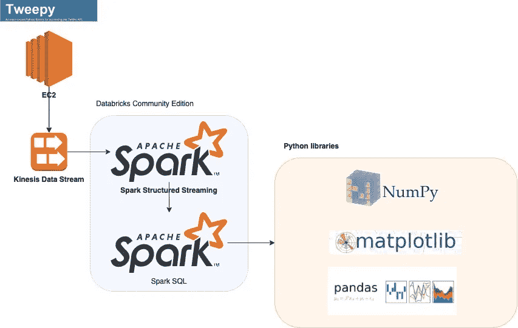

数据管道的架构

如上图所示，该流程将经历以下步骤:

*   **步骤 1** :使用 *Tweepy* 的 python 程序将在 *EC2* 实例上运行，获取用标签和关键字过滤的 tweets。数据将被发送到 Kinesis 数据流中。
*   **第二步**:*kine sis 数据流*以可管理、可扩展的方式消化数据。监控指标并检查数据是否进入 Kinesis。
*   **步骤 3** :依靠*Data bricks Community Edition*提供的笔记本，应用程序将实现 *Spark 结构化流*和 Kinesis 数据流之间的连接。该应用程序使用 *Spark SQL* 和 T *extBlob* 构建了一个情感分析器。
*   **步骤 4** :转换成 *Pandas Dataframes* ，使用 *Matplotlib* 用时间戳索引数据，并用时间序列可视化。

[推文捕捉](https://github.com/joking-clock/twitter-capture-python/blob/master/twitter_kinesis_data.py)和[分析](https://github.com/joking-clock/twitter-analysis-bigdata/blob/master/spark_SStream_Pandas.ipynb)的源代码已经上传到 GitHub。

# 第 1 部分:捕获推文

要分析数据，首先需要有数据。 [Tweepy](http://docs.tweepy.org/en/latest/getting_started.html) 是一个强大的 python 库，用于捕捉实时推文。想象一下，捕获 tweets 的程序可能需要几个小时，这会消耗 CPU 和内存。在这种情况下，在远程机器 EC2 上运行它是个好主意。

下面附上了 tweet 捕获代码的一个片段。[这里用的是 Tweepy 流](http://docs.tweepy.org/en/latest/streaming_how_to.html)。完整的代码上传到[这里](https://github.com/joking-clock/twitter-capture-python/blob/master/twitter_kinesis_data.py)。

```
stream_name = ''  # fill the name of Kinesis data stream you createdif __name__ == '__main__':
    # create kinesis client connection
    kinesis_client = boto3.client('kinesis', 
       region_name='',  # enter the region
       aws_access_key_id='',  # fill your AWS access key id
       aws_secret_access_key='')  # fill you aws secret access key
    # create instance of the tweepy tweet stream listener
    listener = TweetStreamListener()
    # set twitter keys/tokens
    auth = OAuthHandler(consumer_key, consumer_secret)
    auth.set_access_token(access_token, access_token_secret)
    # create instance of the tweepy stream
    stream = Stream(auth, listener)
```

记得用您的 AWS 和 twitter 凭证填写缺失的字段。

# 第 2 部分:使用 Kinesis 数据流处理流数据

如果我们开始运行代码，数据就会像水一样源源不断地被提取出来。它需要通过软管或管道，或者需要储存。AWS Kinesis 数据流(KDS)就是这样一个软管，提供弹性缩放、实时度量和数据分析等功能。

创建 KDS 非常简单。进入 AWS Kinesis 服务页面，选择创建数据流，填写数据流名称。至于碎片的数量，因为这只是一个演示，1 个碎片应该没问题。

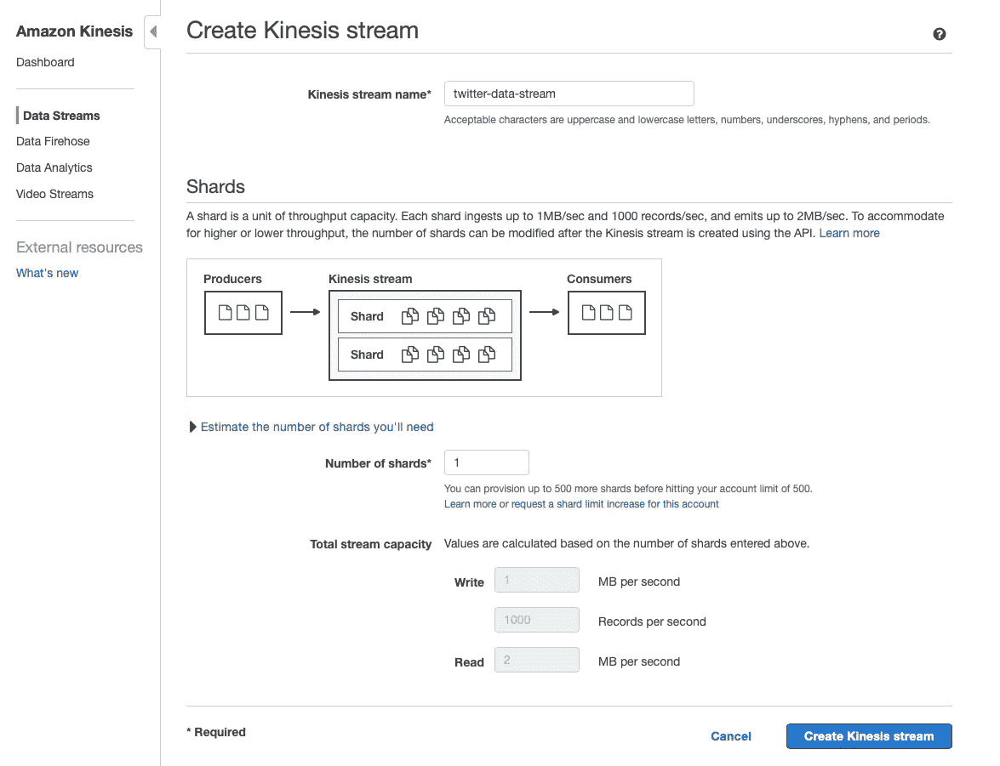

创建 Kinesis 数据流的页面

一旦创建了 KDS，我们就可以运行第 1 部分中的 tweet 捕获代码。在这个演示中，捕获的推文应该包含标签“#新冠肺炎”和关键字“加拿大”。

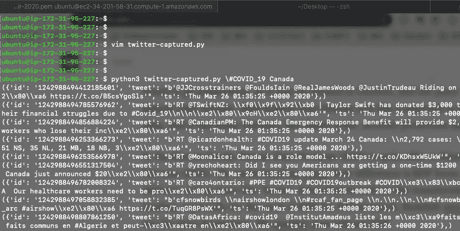

运行 tweet 捕获代码

等待几分钟后，从 Kinesis 数据流的 monitoring 选项卡中，我们可以看到 tweet 流的指标。

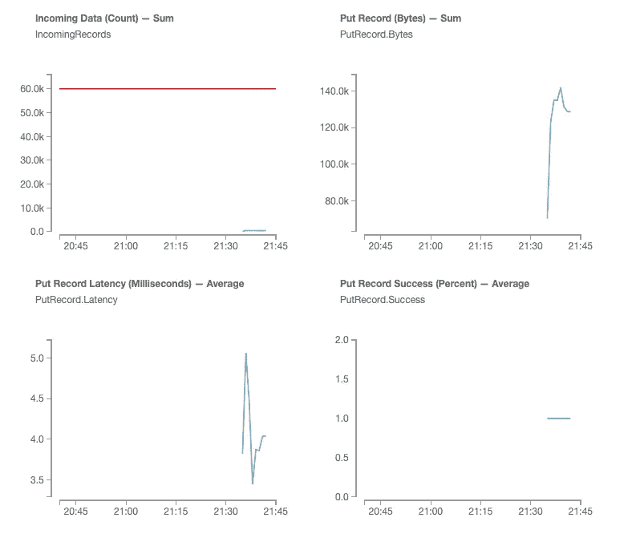

反映在 Kinesis 数据流上的指标

# 第 3 部分:使用 Spark 结构化流接收数据

Spark 是一个流行的集群计算框架，用来处理大数据问题。自 2014 年诞生以来，Spark 一直在不断发展，经历了很多变化。某些变化是关键的，可能会令人困惑，所以我会解释一下。

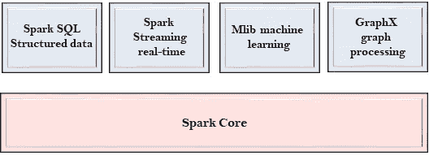

引自 javatpoint.com

[**【Spark】弹性分布式数据集(RDD)**](https://spark.apache.org/docs/latest/rdd-programming-guide.html) 是跨集群节点划分的、可以并行操作的元素集合。rdd 是 Spark 中主要的逻辑数据单元。基于 RDD， [**Spark Streaming**](https://spark.apache.org/docs/latest/streaming-programming-guide.html) 构建为可扩展的容错流式处理系统，本机支持批处理和流式工作负载。

从 Spark 2.x 开始引入了变化。 [*数据帧*](https://spark.apache.org/docs/latest/sql-getting-started.html#creating-dataframes) 作为 RDD 之上的抽象发布，随后是*数据集*。在 Spark 1.x 中，RDD 是主要的 API，但是从 Spark 2.x 开始，鼓励使用 DataFrame API。为了支持数据帧和数据集， [**Spark 结构化流**](https://spark.apache.org/docs/latest/structured-streaming-programming-guide.html) 应运而生，提供了比 *Spark 流 API* 更高级的接口。

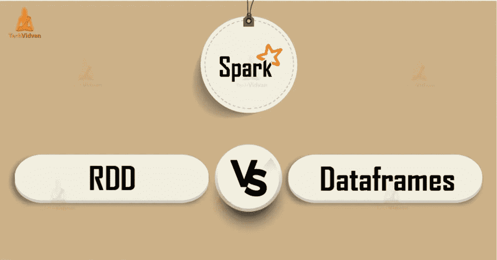

位于[链接的幻灯片](https://www.slideshare.net/AnkitBeohar/spark-rdd-vs-data-frame-vs-dataset)

[**Spark SQL**](https://spark.apache.org/docs/latest/sql-getting-started.html) 允许用户操作数据帧。从名字我们就能猜到 Spark SQL 提供了 *SQL* 语言支持，挺像 [Hive](https://en.wikipedia.org/wiki/Apache_Hive) 的。

现在我们已经完成了理论，是时候动手了。Spark 结构化流的编程范例如下:

*   导入必要的类并创建一个本地 SparkSession
*   创建火花流数据帧
*   在数据帧上进行操作

更多内容请参考[如何使用 Spark 结构化流进行编程](https://spark.apache.org/docs/latest/structured-streaming-programming-guide.html#quick-example)。

[Databrick 社区版](https://databricks.com/product/faq/community-edition)是一站式大数据平台。用户可以像在 *Jupyter* 笔记本中一样编写 Python 代码，但是能够与 Spark 集群流畅地交互。此外，Databricks 社区版还提供了有用的功能，如 [*混合语言*](https://docs.databricks.com/notebooks/notebooks-use.html#mix-languages) 和 [*可视化*](https://docs.databricks.com/notebooks/visualizations/index.html#visualizations) 。

首先，我们需要创建一个 spark 会话:

```
spark = SparkSession.builder\
                    .master("local")\
                    .appName("Structured Streaming")\
                    .getOrCreate()
```

然后从 Kinesis 数据流中创建火花流数据帧:

```
pythonSchema = StructType() \
          .add("id", StringType(), True) \
          .add("tweet", StringType(), True) \
          .add("ts", StringType(), True)awsAccessKeyId = "" # update the access key
awsSecretKey = ""   # update the secret key
kinesisStreamName = ""  # update the kinesis stream name
kinesisRegion = ""kinesisDF = spark \
  .readStream \
  .format("kinesis") \
  .option("streamName", kinesisStreamName)\
  .option("region", kinesisRegion) \
  .option("initialPosition", "LATEST") \
  .option("format", "json") \
  .option("awsAccessKey", awsAccessKeyId)\
  .option("awsSecretKey", awsSecretKey) \
  .option("inferSchema", "true") \
  .load()
```

通过在 EC2 和 Kinesis 数据流上运行 tweet 捕获程序，我们可以看到来自 Kinesis 数据流的数据是如何进入 Spark 流数据帧的:

```
df = kinesisDF \
  .writeStream \
  .format("memory") \
  .outputMode("append") \
  .queryName("tweets")  \
  .start()
```

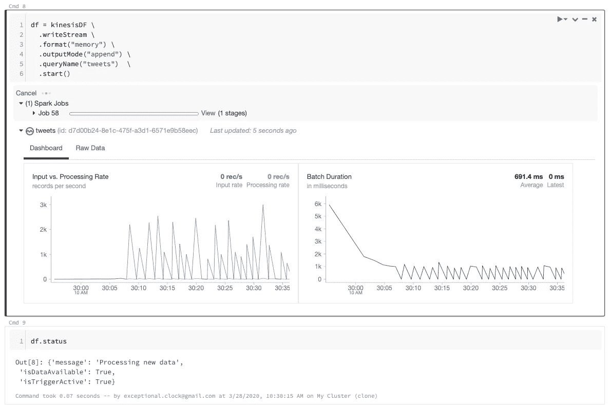

流式数据正在进入 Spark

*df* 是一个*流查询*来处理主动流查询。 *format("memory")* 表示输出将作为内存表存储在内存中。**输出模式**指定写入输出接收器的内容，这里我们选择*追加*模式，这意味着只向结果表添加新行。

一旦开始流式传输，就可以通过控制面板监控传入的数据。通过检查 *df* 的状态，我们知道数据是可用的，并且我们可以开始探索数据。

对查询应用 SQL 命令:

```
tweets = spark.sql("select cast(data as string) from tweets")
```

查看查询的标题数据:

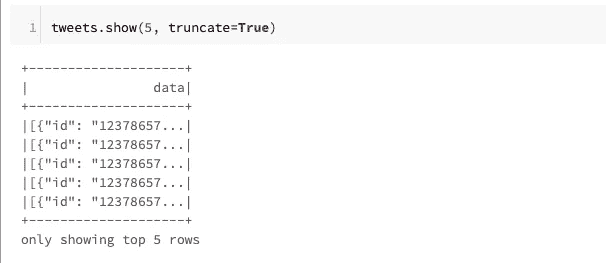

浏览数据帧中的前 5 行数据

# 第 4 部分:使用 Spark 数据框架进行情感分析

为了分析数据，它需要更加结构化。所有返回 tweets 的 Twitter APIs 都提供了使用 JavaScript Object Notation (JSON)编码的数据。让我们简单看一下一个例子:

```
{
    "created_at": "Thu May 10 15:24:15 +0000 2018",
    "id_str": "850006245121695744",
    "text": "Here is the Tweet message.",
    "user": {
    ...
    },
    "place": {},
    "entities": {},
    "extended_entities": {
     ...
    }
}
```

当 [tweet 捕获代码](https://github.com/joking-clock/twitter-capture-python/blob/master/twitter_kinesis_data.py)运行时，我们已经指定了所需的字段:“id”表示为 tweet id，“text”表示为 tweet 内容，“ts”表示为时间戳。

```
# tweet capture code running in EC2def on_data(self, data):
        # decode json
        tweet = json.loads(data)
        # print(tweet)
        if "text" in tweet.keys():
            payload = {'id': str(tweet['id']),
                                  'tweet': str(tweet['text'].encode('utf8', 'replace')),
                                  'ts': str(tweet['created_at']),
            },
            print(payload)
            try:
                put_response = kinesis_client.put_record(
                                StreamName=stream_name,
                                Data=json.dumps(payload),
                                PartitionKey=str(tweet['user']['screen_name']))
                ...
```

所以我们收集的数据已经组织好了。使用 [*UDF*](https://docs.databricks.com/spark/latest/spark-sql/udf-python.html) ，我们可以将这些字段添加到 Spark 数据帧中。

```
def parse_tweet(text):
    data = json.loads(text)
    id = data[0]['id']
    ts = data[0]['ts']
    tweet = data[0]['tweet'] 
    return (id, ts, tweet)

# Define your function
getID = UserDefinedFunction(lambda x: parse_tweet(x)[0], StringType())
getTs = UserDefinedFunction(lambda x: parse_tweet(x)[1], StringType())
getTweet = UserDefinedFunction(lambda x: parse_tweet(x)[2], StringType())# Apply the UDF using withColumn
tweets = (tweets.withColumn('id', getID(col("data")))
               .withColumn('ts', getTs(col("data")))
               .withColumn('tweet', getTweet(col("data")))
         )
```

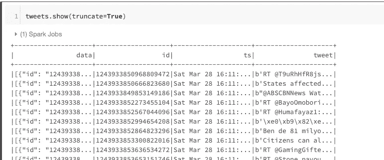

添加字段后浏览数据框架

现在我们对它进行情感分析。情感分析是自然语言处理( **NLP** )的一部分，对文本中的情感进行解释和分类。有许多学术和工业作品涉及这一领域，大多数 NLP 图书馆都有能力做到这一点。仅出于演示目的，我们使用 [*TextBlob*](https://textblob.readthedocs.io/en/dev/quickstart.html) 来执行这项工作。

情感分析的基本任务是将给定文本的[](https://www.analyticsvidhya.com/blog/2018/02/natural-languageNatural%20Language%20Processing%20for%20Beginners:%20Using%20TextBlob-processing-for-beginners-using-textblob/)**极性分类，分为负面、中性和正面。极性数是一个位于[-1，1]范围内的浮点数。1 表示肯定的陈述，而-1 表示否定的陈述。因此，我们可以将数据分类如下:**

```
import textblobdef get_sentiment(text):
    from textblob import TextBlob
    tweet = TextBlob(text)
    if tweet.sentiment.polarity < 0:
      sentiment = "negative"
    elif tweet.sentiment.polarity == 0:
        sentiment = "neutral"
    else:
        sentiment = "positive"
    return sentiment
```

**现在我们有了情感信息的领域，我们可以利用它对推文进行高层次的洞察。在这里，我们希望看到这些捕获的推文的情绪分类，猜测哪些类型的情绪被揭示。利用 Databricks Community Edition 平台上的 [*混合语言*](https://docs.databricks.com/notebooks/notebooks-use.html#mix-languages) 和 [*可视化*](https://docs.databricks.com/notebooks/visualizations/index.html#visualizations) 的特性，实现了关于情感与推文数量关系的情感分析。**

```
%sql
select sentiment, count(*) as cnt from tweets_parsed group by sentiment
```

**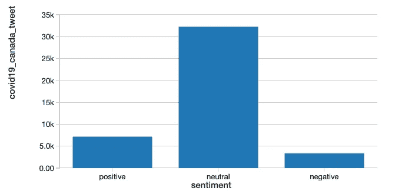**

**用条形图表示的情感分析**

# **第 5 部分:使用 Numpy，Pandas，Matplotlib 进行时间序列分析**

**以上分析基于[*PySpark data frame*](https://spark.apache.org/docs/latest/api/python/pyspark.sql.html?highlight=streamingquery#pyspark.sql.DataFrame)*s*。但是 Numpy/Pandas/Matplotlib 的组合更专业的对数据做操作。因此，我们需要将 PySpark 数据帧转换成帕纳斯数据帧。幸运的是，这并不难。**

```
tweets_pdf = tweets.toPandas()
```

**现在，我们可以使用 Pandas 的丰富功能来探索数据:**

**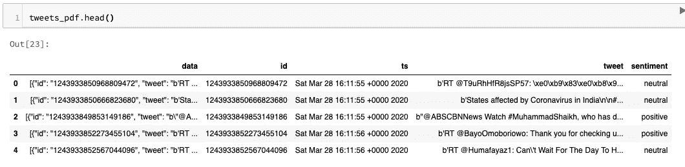**

**要进行时间序列分析，最佳实践是用时间单位索引数据。这里我们需要将字段 *ts* 转换成 *datatime* 类型，然后用它来索引数据帧。**

```
pd.to_datetime(tweets_pdf['ts'])
idx = pd.DatetimeIndex(pd.to_datetime(tweets_pdf['ts']))
```

**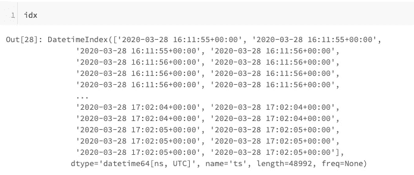**

**检查 ts 字段是否被正确解析为时间戳索引**

**下面的代码是对数据进行操作，然后使用 Matplotlib 将其可视化成时间序列折线图。该图表描述了包含标签“#新冠肺炎”和关键词“加拿大”的推文数量如何随时间变化。**

```
# Plotting the series
%matplotlib inlinefig, ax = plt.subplots()
ax.grid(True)ax.set_title("Tweet Numbers")
interval = mdates.MinuteLocator(interval=10)
date_formatter = mdates.DateFormatter('%H:%M')datemin = datetime(2020, 3, 28, 16, 00) 
datemax = datetime(2020, 3, 28, 17, 10)ax.xaxis.set_major_locator(interval) 
ax.xaxis.set_major_formatter(date_formatter) 
ax.set_xlim(datemin, datemax)
max_freq = per_minute.max()
min_freq = per_minute.min()
ax.set_ylim(min_freq-100, max_freq+100) 
ax.plot(per_minute.index, per_minute)display(fig)
```

**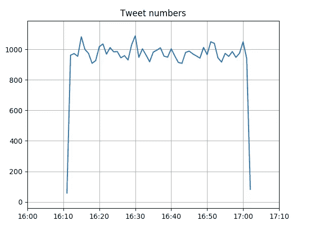**

**x 轴:推文发布时间，y 轴:推文数量**

# **结论**

**在这项工作中，我们经历了从建立数据管道到进行有意义的分析的过程。但这只是挖掘社交媒体的一小步。在未来，我将继续探索并找出其他方法来洞察大数据。**

*****编者按:*** [*走向数据科学*](http://towardsdatascience.com/) *是一份以数据科学和机器学习研究为主的中型刊物。我们不是健康专家或流行病学家，本文的观点不应被解释为专业建议。想了解更多关于疫情冠状病毒的信息，可以点击* [*这里*](https://www.who.int/emergencies/diseases/novel-coronavirus-2019/situation-reports) *。***