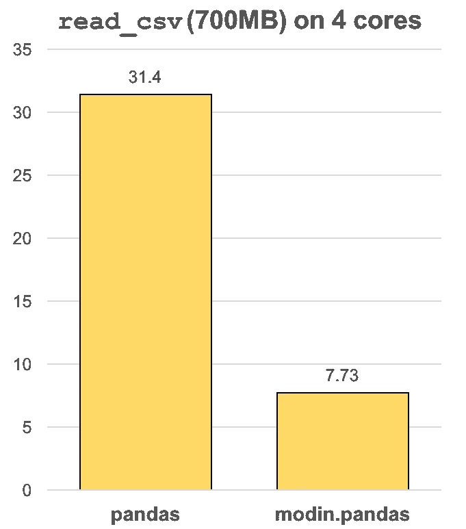

# 请停止在熊猫身上做这 5 件事

> 原文：<https://towardsdatascience.com/please-stop-doing-these-5-things-in-pandas-9fbabea897aa?source=collection_archive---------1----------------------->

## 这些错误非常普遍，也非常容易纠正。

作为一个在进入数据科学之前从事了十多年开发工作的人，我看到数据科学家在使用熊猫时犯了很多错误。好消息是这些真的很容易避免，修复它们也能让你的代码更可读。


丹妮拉·霍尔泽在 [Unsplash](https://unsplash.com?utm_source=medium&utm_medium=referral) 上的照片

# 错误 1:缓慢地获取或设置值

这不是任何人的错，熊猫有太多的方式来获得和设定价值。在某些情况下，您必须只使用索引来查找值，或者只使用值来查找索引。然而，在许多情况下，您将有许多不同的方法来选择数据:索引、值、标签等。

在这种情况下，我更喜欢用最快的。以下是一些常见的选择，从最慢到最快，这表明你可能会错过 195%的收益！

使用 20，000 行的数据框架进行测试。[如果你想自己运行，这是笔记本](https://colab.research.google.com/drive/1heqQy_55YHA9vacunPIbrf8zqd5SWqN5)。

```
**# .at - 22.3 seconds**
for i in range(df_size):
    df.at[i] = profile
Wall time: **22.3 s****# .iloc** - **15% faster than .at**
for i in range(df_size):
    df.iloc[i] = profile
Wall time: **19.1 s****# .loc** - **30% faster than .at**
for i in range(df_size):
    df.loc[i] = profile
Wall time: **16.5 s****# .iat**, doesn't work for replacing multiple columns of data.
# Fast but isn't comparable since I'm only replacing one column.
for i in range(df_size):
    df.iloc[i].iat[0] = profile['address']
Wall time: **3.46 s****# .values / .to_numpy()** - **195% faster than .at** for i in range(df_size):
    df.values[i] = profile
    # Recommend using to_numpy() instead if you have Pandas 1.0+
    # df.to_numpy()[i] = profile
Wall time: **254 ms**
```

*(如*[*Alex Bruening*](https://medium.com/u/c5d0dede6d1?source=post_page-----9fbabea897aa--------------------------------)*和*[*miraculixx*](https://medium.com/u/3af1160a401f?source=post_page-----9fbabea897aa--------------------------------)*注释中指出，对于循环来说并不是执行这种动作的理想方式，* [*请看。*敷()](https://pandas.pydata.org/pandas-docs/stable/reference/api/pandas.DataFrame.apply.html)敷*。我在这里用它们，纯粹是为了证明，回路内部，线路的速度差。)*

# 错误 2:只使用了 25%的 CPU

无论你是在服务器上还是在笔记本电脑上，绝大多数人都不会使用他们所有的计算能力。如今大多数处理器(CPU)都有 4 个内核，默认情况下，熊猫只会使用一个。



从摩丁文档来看，4 核机器上的 4 倍加速。

Modin 是一个 Python 模块，通过更好地利用硬件来增强 Pandas。摩丁数据帧不需要任何额外的代码，在大多数情况下，它会将你对数据帧所做的一切加速 3 倍或更多。

摩丁更像是一个插件，而不是一个库，因为它使用熊猫作为后备，不能单独使用。

摩丁的目标是悄悄地扩充熊猫，让你不用学习新的库就能继续工作。大多数人需要的唯一一行代码是用`import modin.pandas as pd`替换普通的`import pandas as pd`，但是如果你想了解更多，请查看这里的文档[。](https://modin.readthedocs.io)

为了避免重复已经做过的测试，我在 Modin 文档中添加了这张图片，展示了它可以在标准笔记本电脑上加速`read_csv()`功能的程度。

*请注意，Modin 正在开发中，虽然我在生产中使用它，但您应该会遇到一些错误。查看 GitHub* *中的* [*问题和*](https://github.com/modin-project/modin/issues) [*支持的 API*](https://modin.readthedocs.io/en/latest/supported_apis/index.html)*了解更多信息。*

# 错误 3:让熊猫猜测数据类型

当您将数据导入到数据帧中，并且没有明确地告诉 Pandas 列和数据类型时，Pandas 会将整个数据集读入内存，以确定数据类型。

例如，如果您有一个充满文本的列，熊猫将读取每个值，看到它们都是字符串，并将该列的数据类型设置为“字符串”。然后对所有其他列重复这个过程。

您可以使用`df.info()`来查看一个数据帧使用了多少内存，这与 Pandas 计算每一列的数据类型所消耗的内存量大致相同。

除非您在处理微小的数据集或者您的列经常变化，否则您应该总是指定数据类型。为此，只需添加`dtypes`参数和一个字典，将列名及其数据类型作为字符串。例如:

```
pd.read_csv(‘fake_profiles.csv’, dtype={
    ‘job’: ‘str’,
    ‘company’: ‘str’,
    ‘ssn’: ‘str’
})
```

注意:这也适用于不是来自 CSV 的数据帧。

# 错误 4:剩余的数据帧

数据帧的一个最好的特点是它们很容易创建和更改。不幸的是，这样做的副作用是大多数人最终会得到这样的代码:

```
# Change dataframe 1 and save it into a new dataframedf1 = pd.read_csv(‘file.csv’)df2 = df1.dropna()df3 = df2.groupby(‘thing’)
```

所发生的是你将`df2`和`df1`留在 Python 内存中，即使你已经转移到了`df3`。不要在内存中留下多余的数据帧，如果你用的是笔记本电脑，它几乎会影响你做的所有事情的性能。如果你在一个服务器上，它会损害该服务器上其他人的性能(或者在某个时候，你会得到一个“内存不足”的错误)。

相反，这里有一些简单的方法来保持你的记忆干净:

*   使用`df.info()`查看数据帧使用了多少内存
*   [在 Jupyter](https://jupyter-contrib-nbextensions.readthedocs.io/en/latest/install.html) 中安装插件支持，然后为 Jupyter 安装[变量检查器插件](https://jupyter-contrib-nbextensions.readthedocs.io/en/latest/nbextensions/varInspector/README.html?highlight=varinspector)。如果你习惯在 R-Studio 中有一个变量检查器，你应该知道 [R-Studio 现在支持 Python](https://support.rstudio.com/hc/en-us/articles/360023654474-Installing-and-Configuring-Python-with-RStudio) ！
*   如果你已经在 Jupyter 会话中，你可以通过使用`del df2`删除变量而无需重启
*   在一行中将多个数据帧修改链接在一起(只要它不会使你的代码不可读):`df = df.apply(thing1).dropna()`
*   *正如*[*Roberto Bruno Martins*](https://medium.com/u/7ebfe5448045?source=post_page-----9fbabea897aa--------------------------------)*所指出的，另一种保证干净内存的方法是* ***执行函数*** *内的操作。您仍然可以这样无意中滥用内存，解释范围超出了本文的范围，但是如果您不熟悉，我鼓励您阅读这篇文章。*

# 错误 5:手动配置 Matplotlib

这可能是最常见的错误，但它排在第五位，因为它影响最小。我甚至在经验丰富的专业人士的教程和博客帖子中看到这种错误。

Matplotlib 是由 Pandas 自动导入的，它甚至在每个数据帧上为您设置了一些图表配置。

没有必要为每个图表导入和配置它，因为它已经为您烤成熊猫了。

这里有一个错误做法的例子，尽管这是一个基本图表，但仍然是浪费代码:

```
import matplotlib.pyplot as plt
ax.hist(x=df[‘x’])
ax.set_xlabel(‘label for column X’)
plt.show()
```

正确的方法是:

`df[‘x’].plot()`

更容易，对吗？你可以对这些[数据帧绘图对象](https://pandas.pydata.org/pandas-docs/stable/reference/api/pandas.DataFrame.plot.html)做任何你可以对任何其他 [Matplotlib 绘图对象](https://matplotlib.org/3.1.3/api/_as_gen/matplotlib.pyplot.plot.html)做的事情。例如:

`df[‘x’].plot.hist(title=’Chart title’)`

我确信我正在犯我不知道的其他错误，但是希望与您分享这些已知的错误将有助于更好地使用您的硬件，让您编写更少的代码，完成更多的工作！

*如果你还在寻找更多的优化，你一定会想读:*

[](/the-3-secret-weapons-that-changed-my-python-editor-forever-c99f7b2e0084) [## Python 的 3 个疯狂的秘密武器

### 我不知道没有他们我是如何生活的

towardsdatascience.com](/the-3-secret-weapons-that-changed-my-python-editor-forever-c99f7b2e0084)