# 用 Python 和 Matplotlib 一步一步地绘图

> 原文：<https://towardsdatascience.com/plot-in-python-with-matplotlib-step-by-step-dd69f2e9175a?source=collection_archive---------8----------------------->

## 从基础到更高级的特性，掌握 Matplotlib 的指南…以我希望被解释的方式。


Paola Galimberti 在 [Unsplash](https://unsplash.com?utm_source=medium&utm_medium=referral) 上拍摄的照片

Matplotlib 是 Python 中**最流行的图形库。例如，如果我们在 StackOverflow 中查找，我们可以看到有大约 47k 个问题标记有 Matoplotlib，而如果我们查找其他类似的库，如 Seaborn 或 Plotly，我们分别得到大约 4k 和大约 7k。**

因此，如果你开始使用 Python 绘图，我强烈建议你使用 Matplotlib，不仅是因为受欢迎的原因，还因为 Seaborn 是建立在 Matplotlib 之上的，所以如果你理解如何在 Matplotlib 中绘图，那么你将很容易理解如何处理 Seaborn(反之则不同)。

如果你已经使用 Matplotlib，我也鼓励你留在这里，因为你可能会发现关于用 Python 绘图的新东西。

所以在这篇文章中，我想告诉你如何在 Matplotlib 中绘图，从简单的绘图到更复杂的东西，给你必要的工具去发现如何自己绘制新的东西。

你不需要下载任何数据集。我们将在文章中创建必要的内容，这样你就可以复制、粘贴并自己尝试，比如在 Juptyer 笔记本中。

先睹为快，我们将看到从第一部分的第一个基本图到第二部分末尾的直方图所需的所有工具。

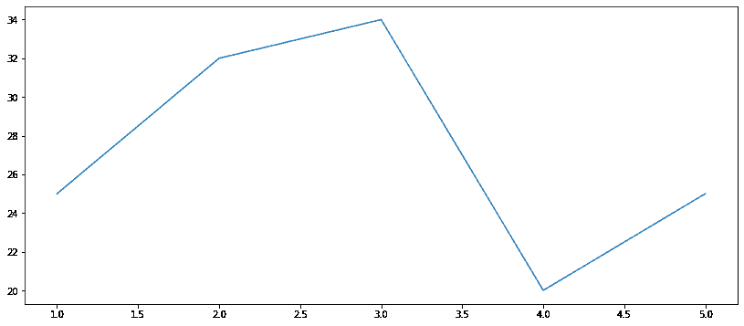

第一基本情节

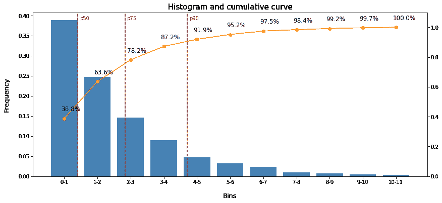

直方图—第二部分结束

# 本文的结构

## 第一部分:基础知识

*   导入必要的包
*   更改地块大小
*   从第一个基本情节开始
*   更改线条样式、标记和宽度
*   散点图
*   条形图
*   将几块地合二为一
*   修改轴
*   添加网格和图例
*   关于修改轴的更多信息

## 第二部分:添加额外功能

*   在绘图顶部添加值
*   在绘图顶部添加线条
*   直方图
*   奖励:双斧

让我们现在就开始吧！

# 第一部分:基础知识

## 导入必要的包

首先，我们必须导入 Matplotlib 包，并内联运行神奇的函数%matplotlib。这个*魔法功能*就是让情节出现在你的 Jupyter 笔记本上的那个。

```
import matplotlib.pyplot as plt
%matplotlib inline
```

例如，Matplotlib 预安装在 Anaconda 发行版中，但是如果前面的命令因为您没有安装 Matplotlib 包而失败，您可以在您的终端中运行以下命令:

```
python -m pip install -U pip
python -m pip install -U matplotlib
```

此外，为了遵循我们将经历的所有示例，您必须执行以下基本导入:

```
import pandas as pd
import numpy as np
```

## 地块大小

如果我们想改变地块大小输出，我们需要改变从属性。首先，我们可以看到当前的属性是什么:

```
# get current size
fig_size = plt.rcParams["figure.figsize"]
print ("Current size:", fig_size)# let's make the plots a bit bigger than the default
# set figure width to 14 and height to 6fig_size[0] = 14
fig_size[1] = 6plt.rcParams["figure.figsize"] = fig_sizeprint ("Current size:", fig_size)
```

## 第一基本情节

正如我们所说的，我们将生成自己的数据集来工作。

```
# datasets x and y are lists, but they can also be, for instance, numpy arrays or pd.Series.x = [1, 2, 3, 4, 5]
y = [25, 32, 34, 20, 25]# plot
plt.plot(x, y)
```

由此，我们得到了简单的情节:


情节 1

对您正在处理的数据进行快速检查是很有用的，但是，如果您要将它放入演示文稿中，这并不能真正提供信息。我们继续，看看怎么给它上类固醇。

## 更改颜色、线条样式和标记

假设我们希望线条变粗变短，标记变圆变大，颜色为绿色。然后，我们在 **x** 和 **y** 之后加上你能看到的五个参数。

```
x = [1, 2, 3, 4, 5]
y = [25, 32, 34, 20, 25]plt.plot(x, y, color='green' , marker='o', markersize=20, linestyle='--', linewidth=4)
```

现在我们得到了以下结果:

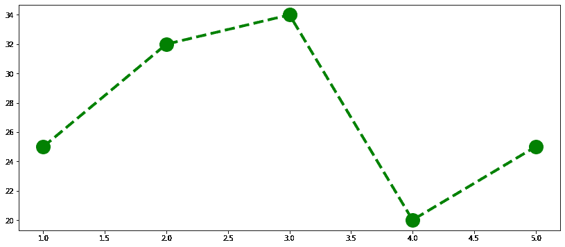

情节 2

这些只是您可以修改的一些参数，但是您可以在 Matplotlib 文档中找到完整的列表(我将在文章底部添加链接)。

## 散点图

如果您正在绘制一些离散数据，您可能只想绘制点(或者更一般地说，标记)。然后，您可以使用 plt.scatter，它的工作方式几乎与 plt.plot 相同，例如:

```
x = [1, 2, 3, 4, 5]
y = [25, 32, 34, 20, 25]# specifying the type of marker (dots) and its sizes
plt.scatter(x, y, marker='o', size=150)
```

给予的结果:

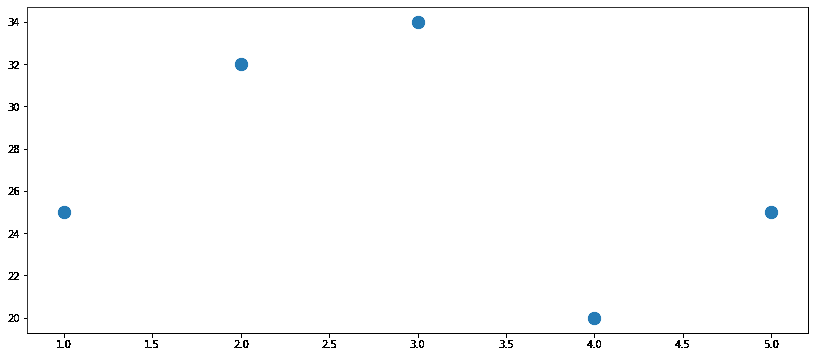

情节 3

## 条形图

如果我们想将数据绘制成柱状图，我们也可以这样做:

```
x = [1, 2, 3, 4, 5]
y = [25, 32, 34, 20, 25]# specifying the bar colors
plt.bar(x, y, color=’green’)
```

得到如下图:

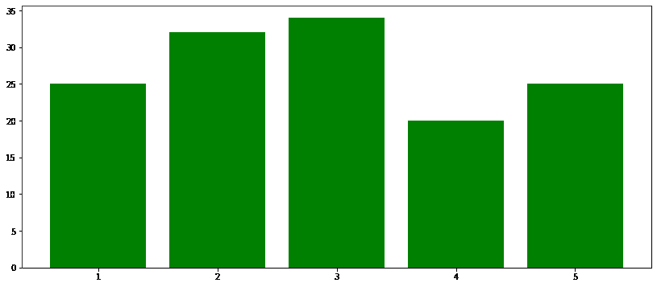

情节 4

## 将几块地合二为一

值得指出的是，我们可以将这三者结合起来，这样做:

```
x = [1, 2, 3, 4, 5]
y = [25, 32, 34, 20, 25]plt.plot(x, y, color=’blue’, lw=4, alpha=0.5)plt.scatter(x, y, marker=’o’, s=400, color=’red’,alpha=0.5)plt.bar(x, y, color=’green’,alpha=0.5)
```

给予的结果:

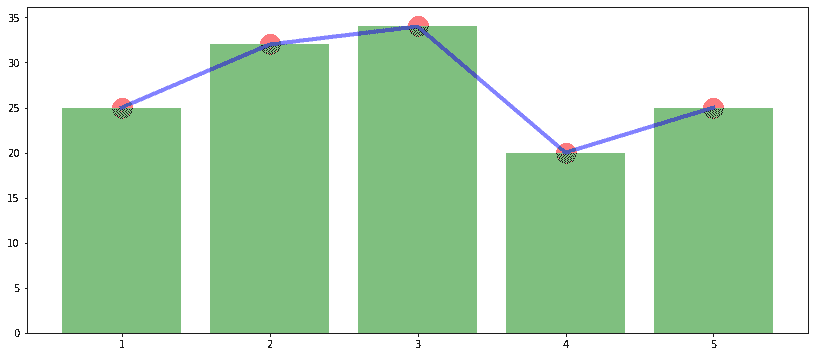

地块 5

你可能想知道那个新变量 **alpha** 是什么:它是一个代表透明度水平的参数。alpha=0 是完全透明的，alpha=1 就好像我们没有设置任何 alpha 参数一样(完全不透明)。正是因为这种透明度，你可以看到横条后面的红点，横条上面的蓝线也是如此。你可以用 **alpha=1** 做同样的尝试，你会看到不同之处！

## 修改轴

之前的情节很好，但我们还有很多可以做的，特别是如果我们想让情节更容易理解或用于演示。也许我们想设置一些限制，或者从中扩展坐标轴。因此，让我们运行以下命令并检查结果:

```
x = [1, 2, 3, 4, 5]
y = [25, 32, 34, 20, 25]plt.plot(x, y)# here we modify the axes, specifying min and max for x and y axes.
plt.axis(xmin=-1, xmax=10, ymin=0, ymax=40)
```

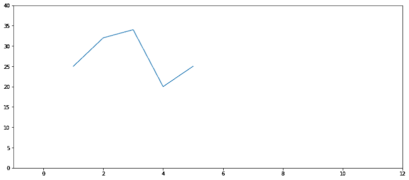

地块 6

那是一个简单的方法。但是如果你想指定什么在 x 轴上或者在 y 轴上呢？例如，我们可以看到 x 轴上的数字是 2 乘 2。我们可以用 **x 轴**或 **y 轴**来改变它:

```
plt.plot(x, y)
plt.axis(xmin=-1, xmax=12, ymin=0, ymax=40)plt.xticks(np.arange(0,13,1))
```

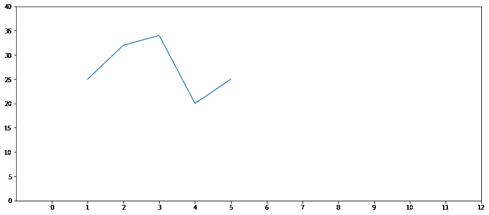

情节 7

## 添加网格和图例

有时候我们会有点迷失在剧情中，我们需要一个网格。那很简单！我们必须像这样添加 plt.grid 方法:

```
plt.plot(x, y)
plt.axis(xmin=-1, xmax=12, ymin=0, ymax=40)
plt.xticks(np.arange(0,13,1))plt.grid(True)
```


地块 8

添加到情节中的另一个有用的功能是添加图例，特别是如果您计划添加到演示文稿中以交流发现，并且您希望观众尽快理解情节。这很简单，是这样的:

```
plt.plot(x, y,**label='Nice Blue Line'**)
plt.axis(xmin=-1, xmax=12, ymin=0, ymax=40)
plt.grid(True)plt.legend(loc='upper right',prop={'size':24})
```

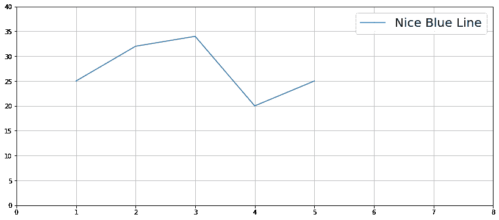

情节 9

在上面的 plt.legend()示例中，我从中选择了大小和在图中的位置(右上)。

## 关于修改轴的更多信息

现在让我们回到坐标轴，让我们一次修改一些东西:

*   更改 x 刻度名称(在本例中是日期)
*   旋转轴
*   从轴中的 x 刻度和 y 刻度开始增加大小
*   给轴添加标签(用 **labelpad** 选择字体大小和与轴的间距)
*   给情节添加标题

```
plt.plot(x, y,label='Nice Blue Line')
plt.axis(xmin=0, xmax=6, ymin=0, ymax=40)# here we change the x-ticks
plt.xticks(x, ('2019-02-01', '2019-02-02', '2019-02-03','2019-02-04', '2019-02-05'))# here we rotate the x-ticks
plt.xticks(rotation=45)# here we change the size from both axes ticks
plt.tick_params(axis='both', labelsize = 16)# here we add the axes labels
plt.ylabel('Y Label', size=16, labelpad=20)
plt.xlabel('X Label', size=16, labelpad=20)# here we add the title
plt.title('Plot Title', size=18)# here we add the grid
plt.grid(True)
```

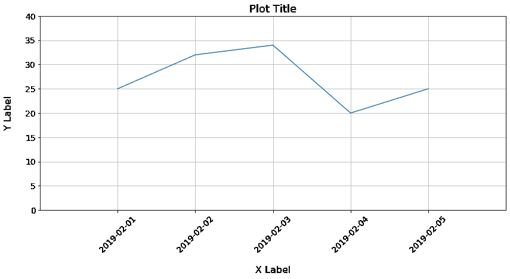

地块 10

当 x 轴上有日期时，如本例所示，或者一个值可以超过前一个值和下一个值的较大数字时，旋转标签特别有用。

现在，我们已经使我们的情节整洁，并有明确的参考，让我们继续第二部分。

# 第二部分:添加额外功能

这第二部分是关于增加额外的功能到情节本身。

我将向您展示如何添加指示图中值的数字，如何添加线条，最后作为奖励，在直方图中显示所有这些的示例。

## 在绘图顶部添加值

```
# we use the same data points as before
x = [1, 2, 3, 4, 5]
y = [25, 32, 34, 20, 25]# we plot the data points
plt.plot(x, y)
plt.axis(xmin=0, xmax=6, ymin=10, ymax=40)
plt.title('Plot Title', size=18)# here we add the value in one data point
plt.annotate(str(25),xy=(1,25+1), fontsize=14)
```

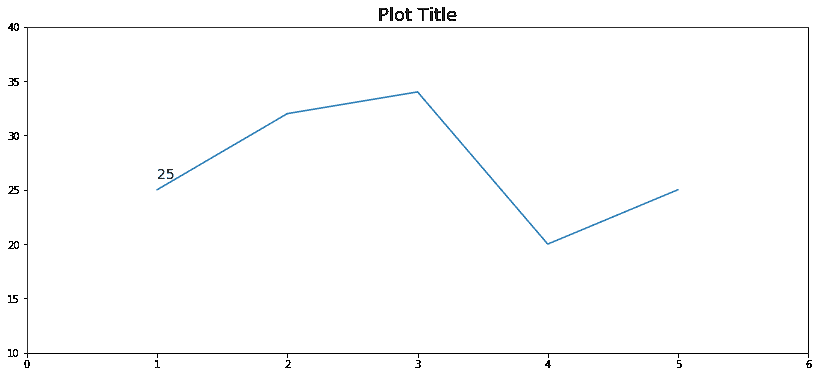

地块 11

这就是我们想要的。

在 *plot.annotate* 方法中，我们将想要显示的字符串作为第一个参数传递(在本例中是字符串形状的值 25 ),然后是坐标:x:1 和 y:25+1(我们添加了+1，这样数字就不会与线条重叠)。

**这是没有用的，但是**，如果我们有很多数据点，我们想在曲线的顶部绘制所有的值。让我们从另一个角度来看，为了自动计算所有的值:

```
x = [1, 2, 3, 4, 5]
y = [25, 32, 34, 20, 25]# we plot the data points
plt.plot(x, y)
plt.axis(xmin=0, xmax=6, ymin=10, ymax=40)
plt.title('Plot Title', size=18)# here we add all the values
# we also specify font size and colorfor i,j in zip(x,y):
    inplot = plt.annotate(str(j)
                          ,xy=(i,j+1)
                          ,fontsize=12
                          ,color='black')
```

结果，得到了这个图:

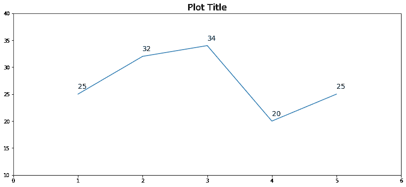

地块 12

如你所见，我们为循环做了一个**来绘制所有的值。**

我们使用了 zip 函数，这是一个非常有用的函数，它允许我们在每个循环中获取多个变量。

## 添加线条

当您想要突出显示图中的一个值时，这是很方便的。如果要突出显示 x 轴值，可以使用垂直线；如果要突出显示 y 轴值，可以使用水平线。出于本例的目的，让我们同时使用这两种方法:

```
x = [1, 2, 3, 4, 5]
y = [25, 32, 34, 20, 25]plt.plot(x, y)
plt.axis(xmin=0, xmax=6, ymin=10, ymax=40)
plt.title('Plot Title', size=18)# here we add the vertical line
plt.axvline(x[1], color='red',linestyle='--',linewidth=1)# here we add the horizontal line
plt.axhline(y[1], color='orange',linestyle='--',linewidth=1)
```

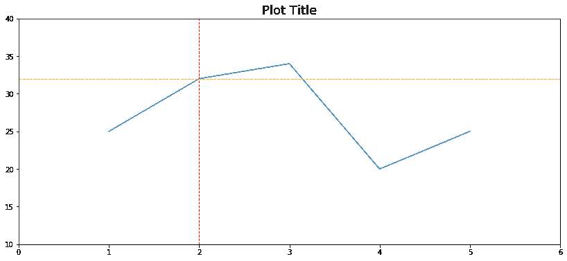

第 13 号地块

## 直方图(并将所有数据放在一起)

正如在第二部分开始时所承诺的，我们将创建一个直方图。我们将添加一条累积曲线，我们将使用之前解释的所有额外特征，显示所有这些特征如何向图中添加有价值的信息。

我们的目标是从一个非常简单的直方图开始，比如这个:

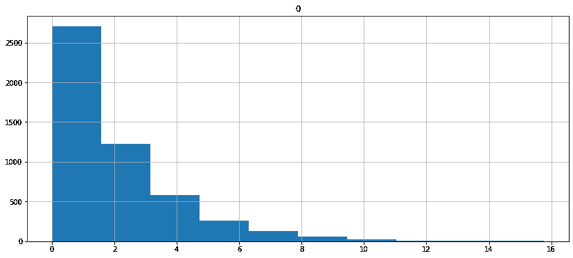

为了(剧透警报)这一个:

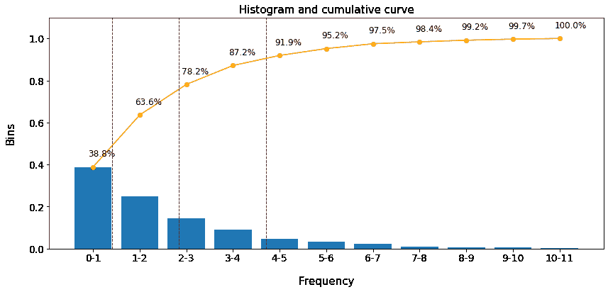

或者这一个(具有双轴，以便曲线和条具有相同的高度):


我要用下面的代码生成一个**玩具数据集。**您可以将其复制并粘贴到您的 Jupyter 笔记本中，继续学习本示例。**我的目的是向您展示情节，而不是数据集的创建，因此，我不打算解释以下代码的细节。但是，如果你对此有任何疑问，请在评论中告诉我。**

```
data = np.random.chisquare(2,5000)r = range(12)df = pd.DataFrame(data)values = np.histogram(df, bins=r)[0]bins = np.histogram(df, bins=r)[1].astype(int)df = pd.DataFrame({'bins_left': bins[:-1],'bins_right': bins[1:], 'values': values})df['values_norm'] = df['values'] / df['values'].sum()df['labels'] = df.apply(lambda x: str(int(x['bins_left'])) + '-' + str(int(x['bins_right'])),axis=1)df['cumulative'] = df['values'].cumsum()df['perc_cumulative'] = df['cumulative']/df.cumulative.max()df['perc_cum_label'] = df.apply(lambda x: str(round(x['perc_cumulative']*100,1)) + '%',axis=1)df = df[['labels','values','values_norm','cumulative','perc_cumulative','perc_cum_label']]
```

最后，我们有了这个数据框架:

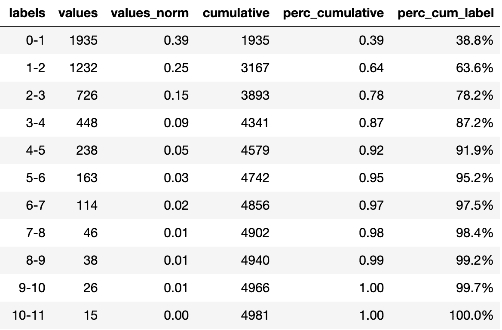

df —刚刚生成的数据帧

因此，在这个**数据**数组中，我们有 5000 个值，为了这个例子，让我们说它们代表来自 5000 只兔子的社区的重量。因此，我们有 1935 只体重在 0 到 1 公斤之间的兔子，其中 1232 只体重在 1 到 2 公斤之间，只有 15 只体重在 10 到 11 公斤之间。因为它们中的大多数都很轻，我们可以假设这是一群小兔子，只有一些成年兔子在周围。

**直方图 x 轴和 y 轴上唯一感兴趣的值是前两列**(标签和值)。

其他列将有助于指示图中的其他特征。

现在，让我们去建立直方图。

我们可以做一个非常简单的，这样做:

```
pd.DataFrame(data).hist()
```

这将给我们一个情节，但远不是一眼就能完全理解的。

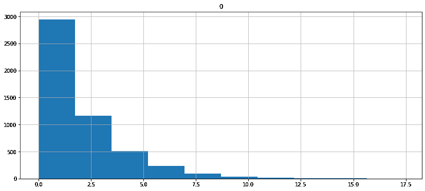

简单直方图——帮助不大——图 14

如果有人问我们，“兔子的体重在 0 到 1 公斤之间的百分比是多少？“看着这个情节很难回答。

如果我们想制作一个**更有意义的直方图**，让我们制作一个之前的(来自剧透警告的那个)**，只使用我们之前**讨论过的工具:

```
# plot the bars from the histogram
x = np.array(df['labels'])
y = np.array(df['values_norm'])
plt.bar(x,y)# plot the cumulative curve
x = list(range(len(x)))
y = list(df['perc_cumulative'])
plt.plot(x,y,color='orange',marker='o')# change the y-axis limits
plt.axis(ymin=0, ymax=1.1)# plot the values from the cumulative curve on top of ity_labels = list(df['perc_cum_label'])for i,j in zip(x,y):
    inplot = plt.annotate(str(y_labels[i])
                          ,xy=(i-0.1,j+0.05)
                          ,fontsize=12
                          ,color='black')# draw vertical lines in 50, 75 and 90 percentile.
plt.axvline(np.percentile(data,50)-1, color='maroon',linestyle='--',linewidth=1)
plt.axvline(np.percentile(data,75)-1, color='maroon',linestyle='--',linewidth=1)
plt.axvline(np.percentile(data,90)-1, color='maroon',linestyle='--',linewidth=1)# indicate which percentile is each line
p_values = [np.percentile(data,50),np.percentile(data,75),np.percentile(data,90)]
p_numbers = ['p50', 'p75', 'p90']for i, j in zip(p_values, p_numbers):
    inplot = plt.annotate(j
                          ,xy=(i-1 + 0.05, 1.05)
                          ,fontsize=12
                          ,color='maroon')# some final tweaking in title, axis and labels
plt.title('Histogram and cumulative curve',fontsize=15)
plt.ylabel('Bins', size=15, labelpad=18)
plt.xlabel('Frequency', size=15, labelpad=18)
plt.tick_params(axis='both', labelsize = 14)
```

给予的结果:


直方图—图 15

## 奖励:双斧

我们可以做同样的图，但是让条形和曲线在同一水平上。我们通过生成双轴来实现这一点。

正如您将看到的，代码非常相似，特别是在开始时我们创建了双轴。然后，我们生成两个图(条形图和曲线)，但不是以 *plt 开始。*，其中一个会从*主机开始。*还有另一个，跟*不相上下。*

```
# we import this package for the twin axes
from mpl_toolkits.axes_grid1 import host_subplot# we generate the twin axes
host = host_subplot(111)
par = host.twinx()# we plot the bars (use host. instead of plt.)
x = np.array(df['labels'])
y = np.array(df['values_norm'])
p1 = host.bar(x, y, color='steelblue')# we plot the curve (use par. instead of plt.)
x = list(range(len(x)))
y = list(df['perc_cumulative'])
p2 = par.plot(x, y, color='darkorange',marker='o')# we plot the values from the cumulative curve on top of ity_labels = list(df['perc_cum_label'])for i,j in zip(x,y):
    inplot = par.annotate(str(y_labels[i])
                         ,xy=(i-0.1,j+0.05)
                         ,fontsize=12
                         ,color='black')# some final tweaking in title, axis and labels
plt.title('Histogram and cumulative curve',fontsize=15)
par.axis(ymin=0, ymax=1.1)
host.set_xlabel("Bins", size=13, labelpad = 16)
host.set_ylabel("Frequency", size=13, labelpad = 16)# draw vertical lines in 50, 75 and 90 percentile.
plt.axvline(np.percentile(data,50)-1, color='maroon',linestyle='--',linewidth=1.5)
plt.axvline(np.percentile(data,75)-1, color='maroon',linestyle='--',linewidth=1.5)
plt.axvline(np.percentile(data,90)-1, color='maroon',linestyle='--',linewidth=1.5)# indicate which percentile is each line
p_values = p_values = [np.percentile(data,50),np.percentile(data,75),np.percentile(data,90)]
p_numbers = ['p50', 'p75', 'p90']for i, j in zip(p_values, p_numbers):
    inplot = plt.annotate(j
                          ,xy=(i-1 + 0.05, 0.39)
                          ,fontsize=10 
                          ,color='maroon')
```

最终，得到想要的情节:


双轴直方图—图 16

我们到达了终点！我希望您喜欢这篇文章，并且您已经学到了很多(或者至少一些)新东西来提高您的 Python 绘图技能。

如果你想在以后看到更多类似的文章，请关注我。

你也可以看看我以前的文章，比如:

*   [掌握 Pandas(和 Python)中的日期和时间戳](/mastering-dates-and-timestamps-in-pandas-and-python-in-general-5b8c6edcc50c)(与当前文章风格相同)

其他文章:

*   [用特征重要性分析用户行为和 UX 表现](/analyzing-feature-importance-user-behaviour-and-ux-performance-cbf32d55eff8)

正如在第一部分开始时所承诺的，一个到 Matplotlib 文档的链接，在那里你可以看到关于标记、线条样式等的一切:

Matplotlib 文档

感谢阅读！