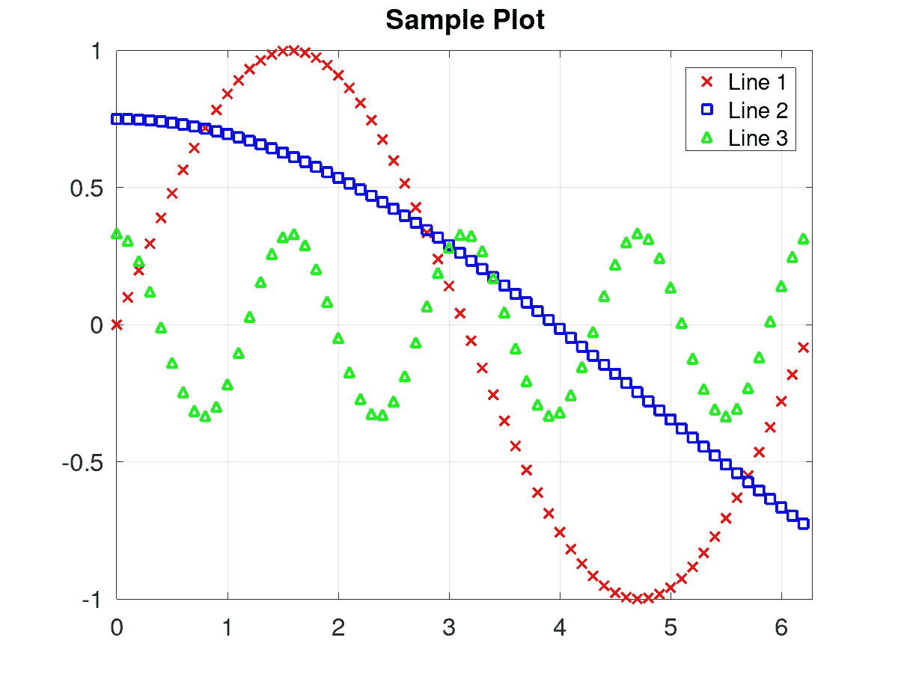
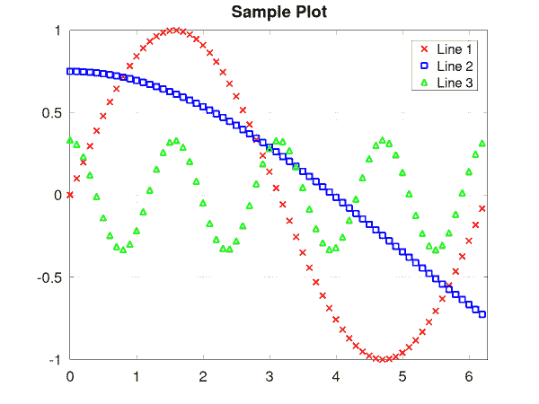
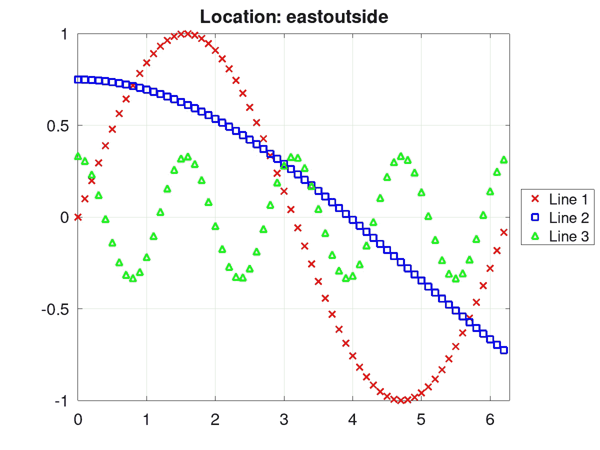
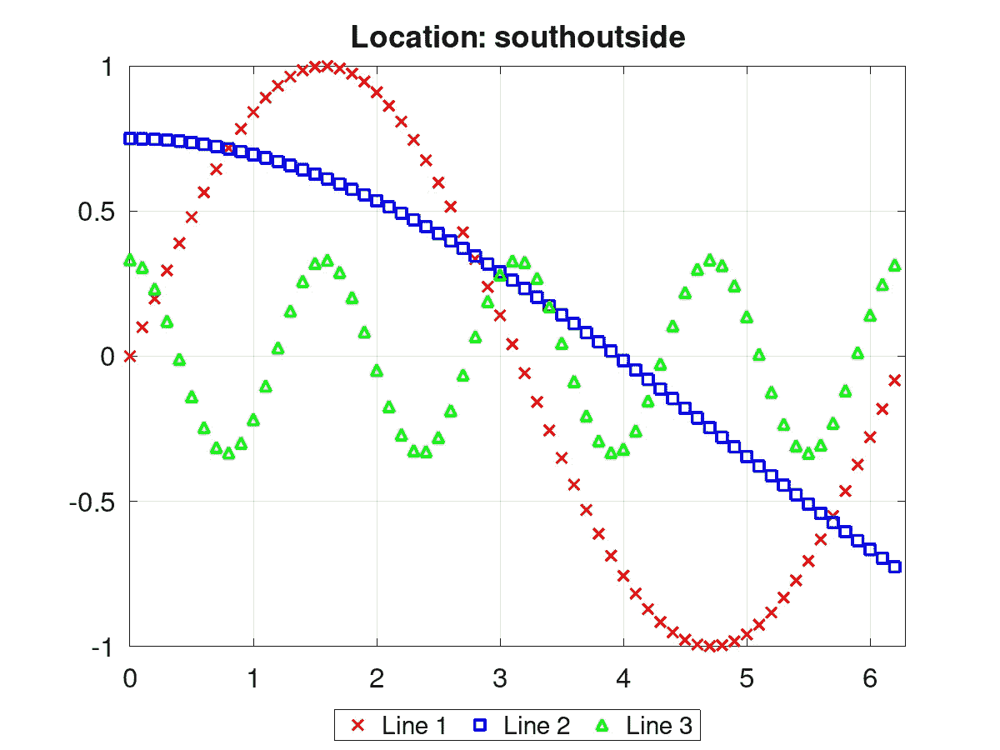
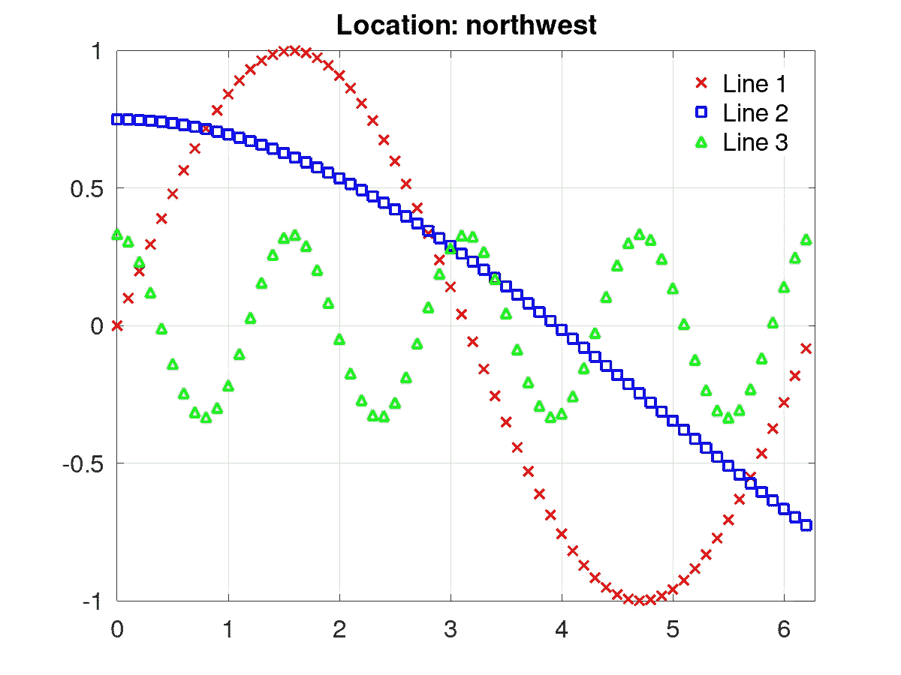
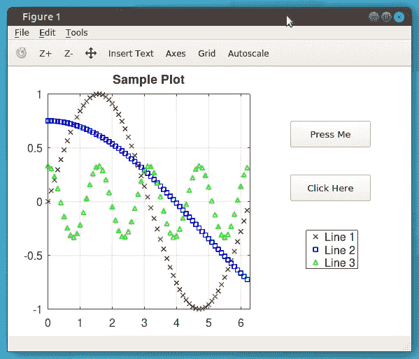
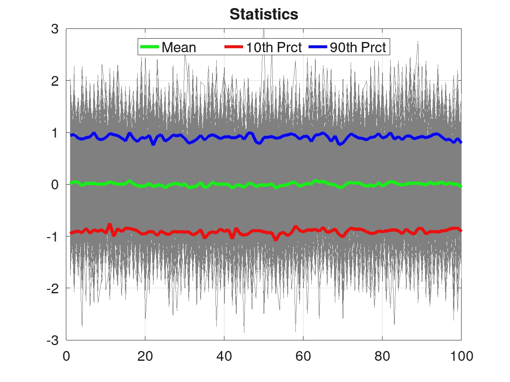

# MATLAB/Octave 中的绘图图例

> 原文：<https://towardsdatascience.com/plot-legends-in-matlab-e992650f245e?source=collection_archive---------17----------------------->


作者图片

## 让你的情节成为传奇

地块图例对于正确注释图形至关重要。幸运的是，MATLAB/Octave 包含了 *legend()* 函数，它为生成图例提供了一些灵活易用的选项。在本文中，我将介绍 *legend()* 函数的基本用法，以及一些我经常使用的特殊情况。

包含示例的源代码可以在 [GitHub 库](https://github.com/ThinkData-science/CodingTips)中找到。

# 情节图例的基本用法

MATLAB/Octave 中的 *legend()* 函数允许您向绘图添加描述性标签。使用该函数最简单的方法是为绘图上的每一行传递一个字符串。基本语法是:*图例('描述 1 '，'描述 2 '，… )* 。

对于本节中的示例，我们将使用以下代码生成一个样例图形。

```
x = 0 : 0.1 : ( 2pi ); 
plot( x, sin( x ), 'rx', 'linewidth', 2 ); 
hold on; 
plot( x, cos( x/3 ) - 0.25, 'bs', 'linewidth', 2 ); 
plot( x, cos( 4x )/3, '^g', 'linewidth', 2 );
hold off;
xlim( [ 0, 2*pi ] );
grid on;
title( 'Sample Plot' );
set( gca, 'fontsize', 16 );
```

可以使用以下命令添加图例。

```
legend( 'Line 1', 'Line 2', 'Line 3' );
```

除了将标签指定为单独的字符串之外，通常将字符串收集在单元数组中也很方便。这在以编程方式创建图例字符串时最有用。

```
legStr = { 'Line 1', 'Line 2', 'Line 3' };
legend( legStr );
```

为了方便起见，这个方法将用于其余的例子。得到的数字如下所示。



作者图片

默认情况下，图例位于右上角。但是，可以使用“位置”关键字来调整它的显示位置。使用基于基本方向的约定来选择位置。可以使用以下关键词:北、南、东、西、东北、西北、东南、西南。以下代码片段会将图例放在绘图的顶部中间。

```
legend( legStr, 'location', 'north' );
```

类似地，所有其他关键字都可以用于在绘图周围放置图例。下面的动画演示了所有不同的关键字。



作者图片

关键字“outside”也可以附加到所有位置，以将图例放置在绘图之外。下图显示了图例位于外部东侧的示例。

```
legend( legStr, 'location', 'eastoutside' );
```



作者图片

除了设置位置， *legend()* 功能还允许您将图例的方向设置为“垂直”(默认)或“水平”。以下示例将图例定位在底部，在绘图之外，水平方向。

```
legend( legStr, 'orientation', 'horizontal', ...
  'location', 'southoutside' );
```



作者图片

# 使用“显示名称”属性

添加图例标注的另一种简便方法是在绘制线条时设置线条的“显示名称”属性。这可以在 *plot()* 调用期间或使用手柄上的 *set()* 完成。在这两种情况下，设置完属性后，您需要不带任何参数的所有 *legend()* 来打开图例。

*plot()* 的语法应该如下所示。

```
plot( x, sin( x ), 'rx', 'linewidth', 2, 'DisplayName', 'Line1' );
hold on;
plot( x, cos( x/3 ) - 0.25, 'bs', 'linewidth', 2, 'DisplayName', 'Line2' );
plot( x, cos( 4*x )/3, '^g', 'linewidth', 2, 'DisplayName', 
'Line3' );
hold off;
```

*set()* 的语法应该是这样的。

```
% Plot the lines
h1 = plot( x, sin( x ), 'rx', 'linewidth', 2, 'DisplayName', 'Line1' );
hold on;
h2 = plot( x, cos( x/3 ) - 0.25, 'bs', 'linewidth', 2, 'DisplayName', 'Line2' );
h3 = plot( x, cos( 4*x )/3, '^g', 'linewidth', 2, 'DisplayName', 'Line3' );
hold off;% Update the display names
set( h1, 'DisplayName', 'Line1' );
set( h2, 'DisplayName', 'Line2' );
set( h3, 'DisplayName', 'Line3' )
```

然后，在没有任何输入参数的情况下，通过调用 legend()来打开图例。

```
legend();
```

结果图将与本教程前面显示的第一个示例相同。

# 使用图例手柄

与所有其他图形对象类似，图例属性可以使用 *set()* 和 *get()* 函数进行调整。下面的代码将捕获图例句柄，然后设置一些图例属性。在这个特定的例子中，位置被设置为东北，方向被设置为垂直，字体大小被设置为 16，并且框轮廓被移除。

```
hl = legend( legStr );     % save the legend handle
set( hl, 'orientation', 'vertical' );     % set the orientation
set( hl, 'location', 'northeast' );     % set the location
set( hl, 'fontsize', 16 );     % set the font size
set( hl, 'box', 'off' );    % turn off the box lines
```



作者图片

在 legend 对象上还可以设置许多其他属性。只需在命令窗口中调用 *get(hl)* 来显示它们。这些属性中最方便的一个是“位置”属性。position 属性允许我们通过指定图例的水平原点(h0)、垂直原点(v0)、宽度(w)和高度(h)来设置图例的确切位置。如果你不熟悉在图形对象上设置 position 属性，你可以在这里看到[的简要描述。](https://thinkdata.science/?p=145)

每当你使用支线剧情或图形用户界面时，通常需要为图例指定一个准确的位置。这可以确保您的图例不会与其他元素重叠或产生奇怪的间距。在前一个示例的基础上，我们可以模拟一个示例 GUI，其中包括我们的绘图、几个按钮和一个手工放置在图上的图例。

```
% Set up the subplot
set( f, 'units', 'normalized' );
a = subplot( 'position', [ 0.1, 0.1, 0.5, 0.8 ] );% Build our sample plot
x = 0 : 0.1 : ( 2*pi );
plot( x, sin( x ), 'rx', 'linewidth', 2 );
hold on;
plot( x, cos( x/3 ) - 0.25, 'bs', 'linewidth', 2 );
plot( x, cos( 4*x )/3, '^g', 'linewidth', 2 );
hold off;
xlim( [ 0, 2*pi ] );
grid on;
title( 'Sample Plot' );
set( a, 'fontsize', 16 );% Add some buttons
a = uicontrol( f, 'units', 'normalized', 'position', [ 0.7, 0.7, 0.2, 0.1 ], ...
  'style', 'pushbutton', 'string', 'Press Me' );
a = uicontrol( f, 'units', 'normalized', 'position', [ 0.7, 0.5, 0.2, 0.1 ], ...
  'style', 'pushbutton', 'string', 'Click Here' );% Add a legend manually
hl = legend( legStr );
set( hl, 'fontsize', 16 );
set( hl, 'position', [ 0.74   0.25   0.12721   0.14310 ] );
```



作者图片

# 向图例添加特定线条

不需要为绘图上的所有线条提供字符串，可以指定应包含在图例中的特定线条对象的数组。我发现这对于你只需要注意图上几行的情况特别有用。当我绘制大量的例子或某种实现，并且想要覆盖和突出一些统计数据或度量时，我倾向于使用这个特性。

以下示例创建了一些随机数据，并从中计算了一些统计数据。所有实现都绘制为细灰色线，统计数据叠加为更粗的彩色线。

```
% Generate some random data and calculate a few statistics
t = sqrt( 0.5 ) * randn( 100, 500 );
ts = sort( t, 2 );
t10 = ts( :, floor( 0.10 * size( t, 2 ) ) );
t90 = ts( :, floor( 0.90 * size( t, 2 ) ) );% Plot realizations as thin gray lines and statistics as thicker, colored lines
plot( t, 'linewidth', 0.2, 'color', [0.5 0.5 0.5] );
hold on;
l1 = plot( mean( t, 2 ), 'linewidth', 4, 'color', [0, 1, 0] );
l2 = plot( t10, 'linewidth', 4, 'color', [1, 0, 0] );
l3 = plot( t90, 'linewidth', 4, 'color', [0, 0, 1] );
hold off;
grid on;
ylim( [-3, 3] );
title( 'Statistics' );
set( gca, 'fontsize', 16 );% Add a legend to just the statistics
hl = legend( [ l1, l2, l3 ], 'Mean', '10th Prct', '90th Prct', ...
  'orientation', 'horizontal', 'location', 'north' );
set( hl, 'fontsize', 16 );
```



作者图片

结果是一个非常好的情节(在我看来)。如果我们没有传入行句柄，那么 *legend()* 函数会尝试为每个实现添加一个图例标签。当然还有其他的用例；然而，这是我经常画的一种类型的图。

# 摘要

在本文中，我介绍了在 MATLAB/Octave 中使用 *legend()* 函数的几种方法。这里有一些需要记住的关键事情。

*   图例标签可以作为单个字符串或单元格数组传入。
*   有许多位置和方向选项可用于将图例放置在图形的某些部分。
*   图例图形句柄可用于直接设置任何图例属性，包括手动设置图中任何位置。
*   线图形手柄可用于指定将在图例中标注的线的子集。

编码快乐！