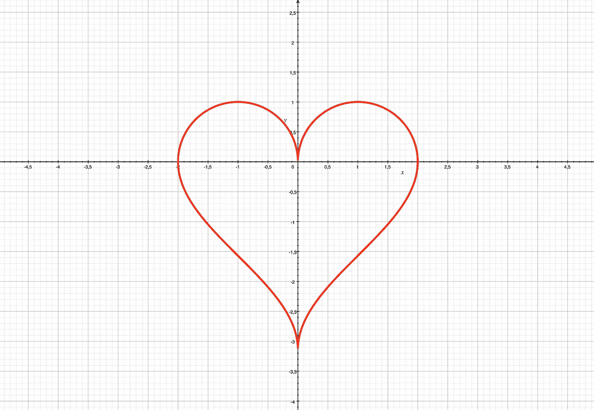
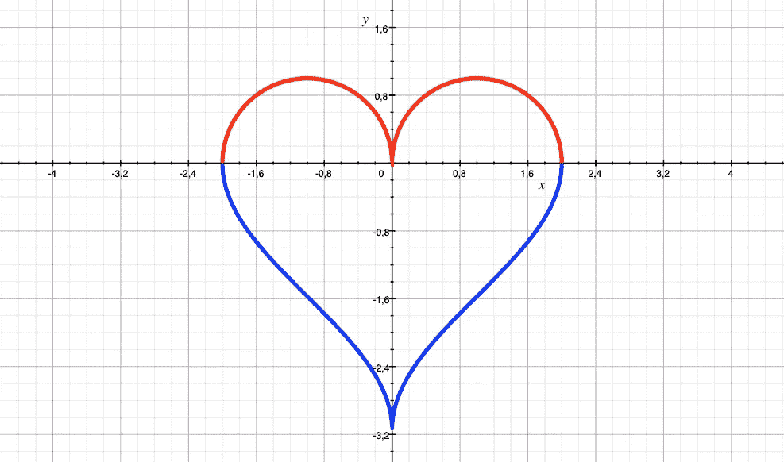
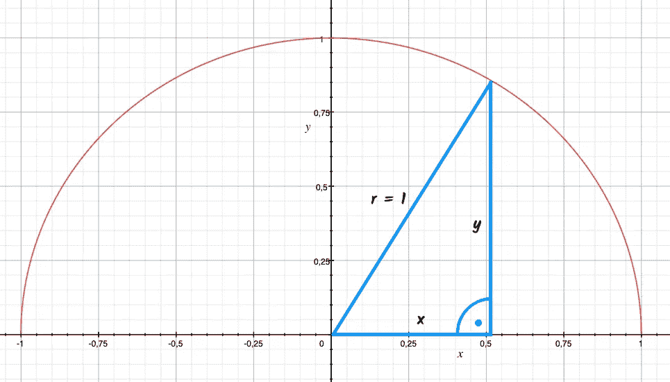
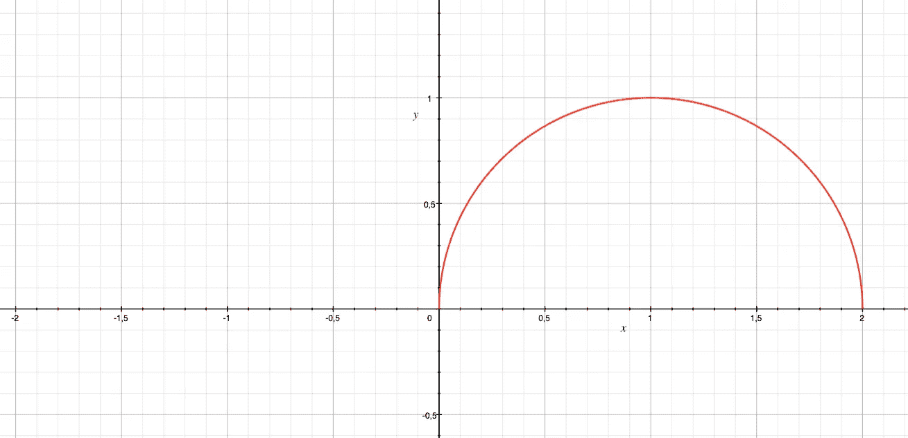
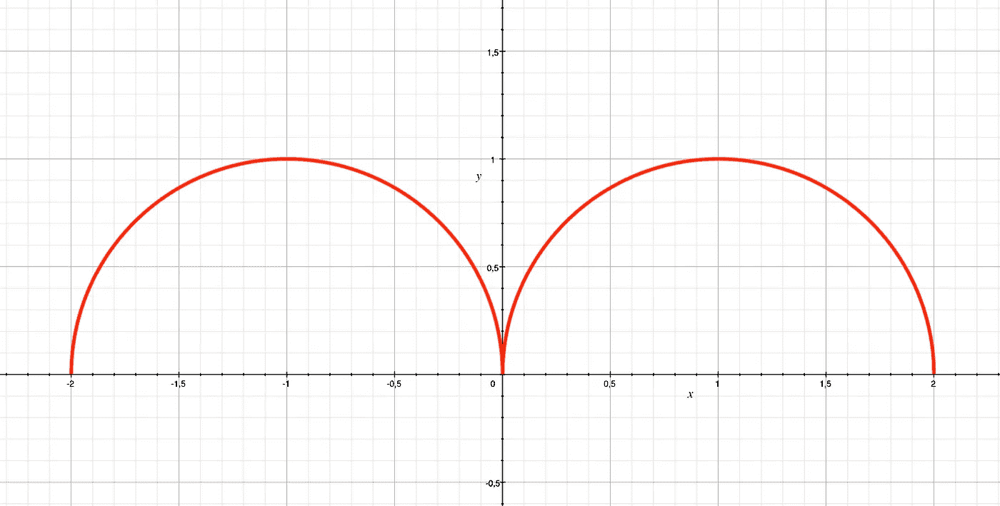
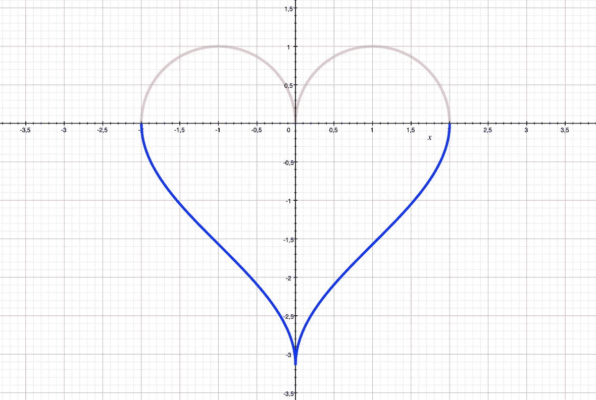
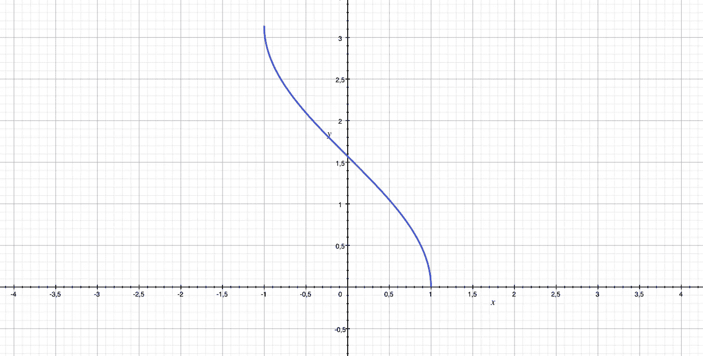
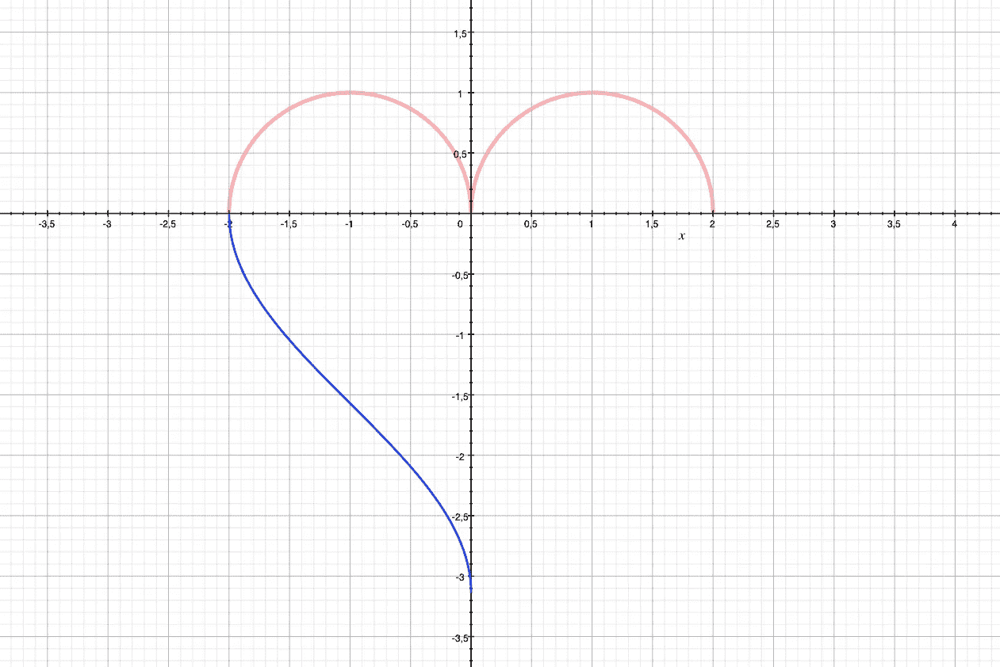
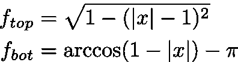

# 画出我心的形状

> 原文：<https://towardsdatascience.com/plot-the-shape-of-my-heart-698d4776c51a?source=collection_archive---------7----------------------->

## 两个简单的功能如何形成一个美丽的象形图

一个由基本功能构成的美丽的心脏象形图

让我们来探索形状是如何构造的。

# 将顶部和底部分开

形式为`y=*f*(x)`的函数不能同时接受两个值。所以我们的计划将不得不涉及一个以上的功能。注意，x 轴整齐地将象形图分成两部分，每个*可以用`y=*f*(x)`表示。*

象形图由两个功能组成

# 形成顶部罩杯

对于顶部，我们寻找两个半径为 1 的半圆。

我们如何得到它们？

## 创建一个半圆

让我们从半径为 1 的单个半圆开始。我们对它了解多少？嗯，在半径为 1 的圆里，我们总是可以构造一个最长边长为 1 的直角三角形。想起毕达哥拉斯，我们知道 T2。让我们利用这一点。

`Upper half circle as prescribed by the [Pythagorean Theorem](https://medium.com/swlh/why-the-pythagorean-theorem-is-true-1d4c8a508510): y=sqrt(1-x²)`

让我们求解`y`，我们得到`y = ±sqrt(1-x²)`。如果我们只使用正解，有效地选择我们圆的上半部分，我们可以把它标为`y=sqrt(1-x²)`。

请注意高于和低于 1 的 x 值是如何定义的。我们要求一个负数的平方根，我们不能用实数来做这个。

## 移动杯子

如果我们能把我们的形状向右移动 1，我们就得到我们想要的函数的一半。我们想要移动我们的图表，这样我们现在得到的任何`f(x)`都应该返回 x 值，再向上一个单位。我们本质上想要`f(x-1)`。在我们的函数中，我们得到了`y=sqrt(1-(x-1)²)`。

`Graph of y=sqrt(1-(x-1)²)`

## 镜像杯子

我们现在想要另一个杯子，就像我们得到的那个一样，但是在左边。我们注意到我们的函数只为正的 x 值定义。如果我们能让它被定义为相同范围的负值，这将实现我们的目标。我们希望定义`f(x)`和`f(-x)`并产生相同的 y 值。换句话说，我们想要`f(|x|)`。让我们把它代入我们的函数，我们得到`y=sqrt(1-(|x|-1)²)`。

`Graph of y=sqrt(1-(|x|-1)²)`

这样，我们心脏的上部就准备好了。让我们移到底部。

# 形成底线

对于底部，我们也有左右对称。中间有一个间断。让我们回忆一下底部是什么样子的。

我们在寻找一个描绘心脏底部的函数

先搞清楚左边。

## 寻找形状

我们正在寻找一个两边都接近垂直的函数，它被定义在跨越两个单位的范围上，并且它的 y 值范围看起来可疑地可能是 3.1415… =π。

这听起来像三角函数或其逆函数。我们来看看`arccos(x)`

y=arccos(x)具有我们需要的所有性质

看起来我们有一场不错的比赛。我们需要把它向下推π，这样图形就落在 x 轴下面，我们需要把我们的 x 向左变换一个单位。

考虑到这一点，我们将`y=arccos(1+x)-π`作为我们的左侧。

`y=arccos(1+x)-π forms our left side on the bottom`

## 镜像形状

现在我们有了左侧，我们需要将函数扩展到右侧。该函数应该假设 x 的正值与左边的负值相同

注意我们左边的值是负 x 的结果。因此，我们不能简单地通过用 x 的绝对值代替 x 来扩展我们的函数。这在将图表的右侧镜像到左侧时是有效的。现在有点棘手了。

我们正在寻找一个表达式，使得 arccos 产生对称值。对于`x≤0`，它应该等于`1+x`——这是我们保持现有形状的方式——并且对于`x>0`，它应该等于`1+(-x)=1-x`——这对于正值`x`产生相同的结果。

看来我们可以用:`1-|x|`。对于负 x 值，它相当于`1+x`，对于正 x 值，它变成`1-x`。

我们到达:`y=arccos(1-|x|)-π`

`y=arccos(1-|x|)-π nicely forms the bottom of our heart`

# 结论

所以，当下一个情人节到来时，如果你和一个数学或科学类的人约会，你知道该在礼物的卡片上写些什么。

