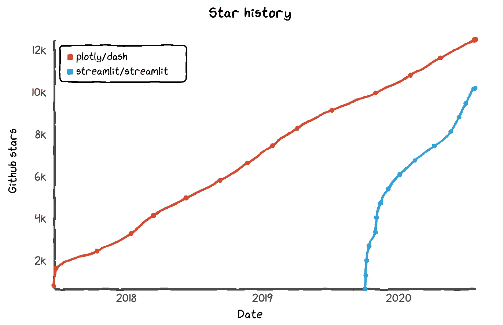
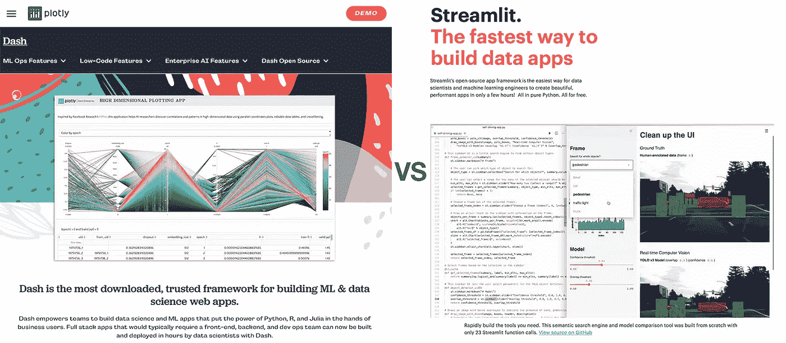
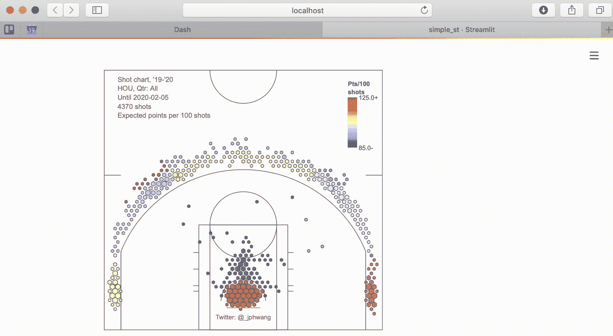
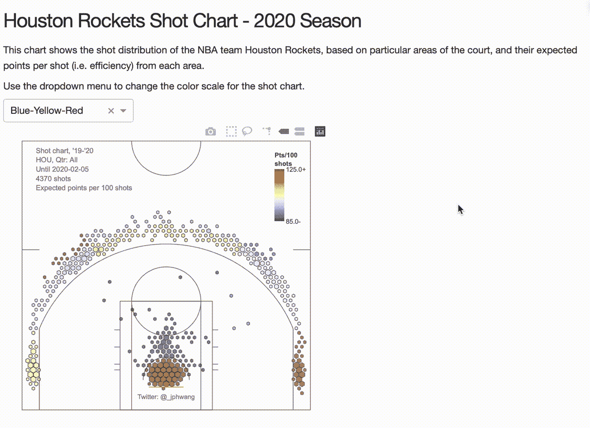
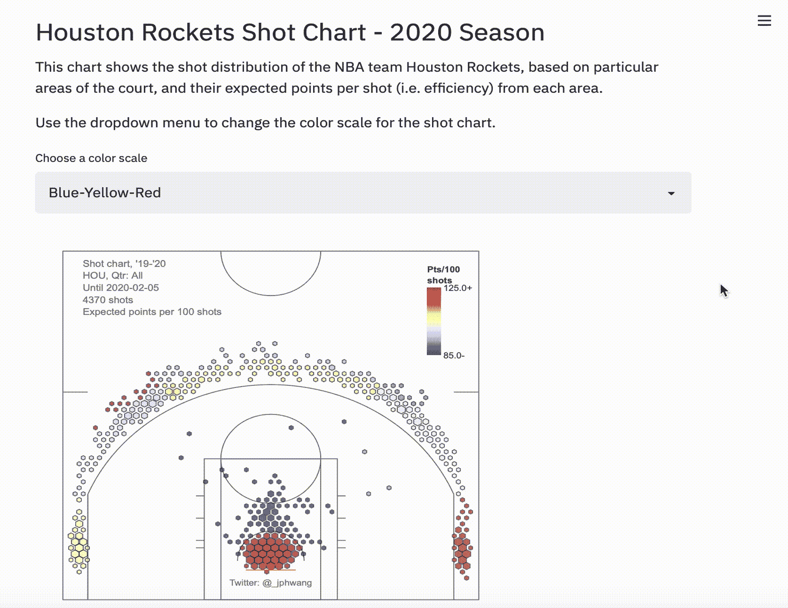
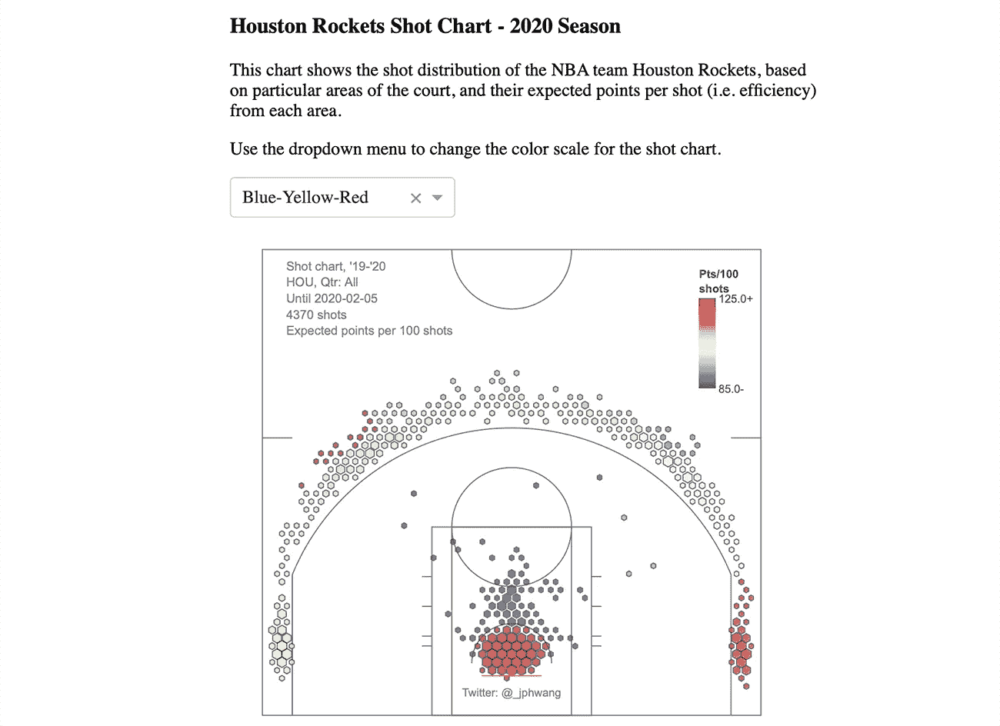
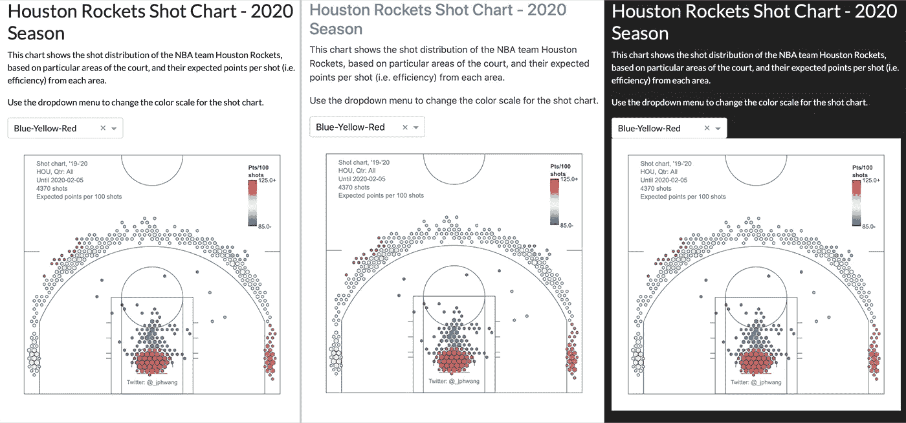
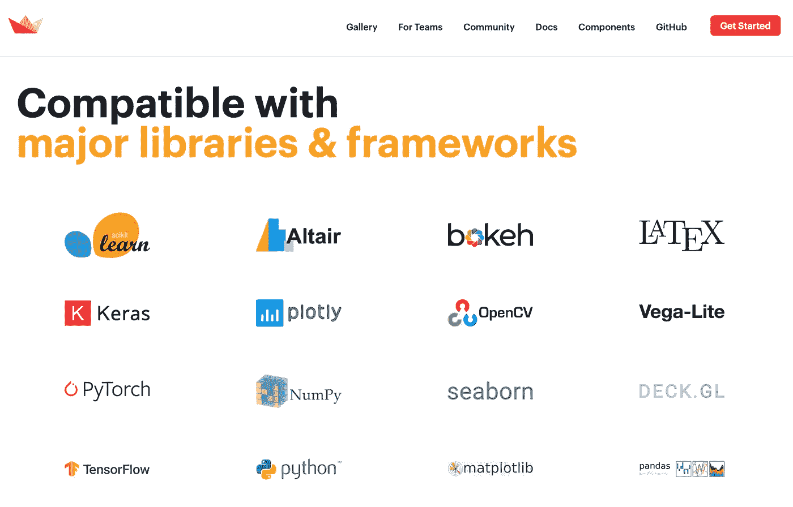

# Plotly Dash 与 Streamlit——哪个是构建数据仪表板 web 应用程序的最佳库？

> 原文：<https://towardsdatascience.com/plotly-dash-vs-streamlit-which-is-the-best-library-for-building-data-dashboard-web-apps-97d7c98b938c?source=collection_archive---------1----------------------->

## 用于共享数据科学/可视化项目的两个顶级 Python 数据仪表板库的比较-包括示例代码。


Dash 还是 Streamlit 来生成 web 应用？(作者图片，右图来自[星史](https://star-history.t9t.io/))

他们说总有适合工作的工具。

但是我们都知道实用性不是空谈，在大多数情况下，*找到合适的工具并不是一项简单的任务。*

这甚至适用于 Python 数据可视化的相对利基领域。有大量令人惊叹的工具，如 [Plotly](https://github.com/plotly/plotly.py) 、 [Altair](https://altair-viz.github.io) 、 [Bokeh](https://docs.bokeh.org/en/latest/) 以及 matplotlib、seaborn 和 ggplot 等经典工具。这还没算上其他语言的，比如 D3.js，ggplot2 或者 Highcharts。

找到它们，然后继续对每个包进行研究，比较它们的优缺点，这可能会令人筋疲力尽。

此外，如果您希望以 web 应用程序的形式共享您的输出或增加交互性，搜索和研究标准会变得更加复杂，从而进一步增加搜索和研究的难度。

因此，在这篇文章中，我比较了几个领先的数据仪表板包，即 Plotly 的 [Dash](https://dash.plotly.com) ，它可以说是该领域的行业领导者，以及该领域的一个新参与者，名为 [Streamlit](https://www.streamlit.io) 。

本着数据可视化的精神，下一张图讲述了迄今为止的故事。



Plotly Dash 和 Streamlit 的 GitHub 明星历史([明星历史](https://star-history.t9t.io/))

在正常情况下，Dash 出现的时间并不长。但是在数据科学和开源软件的背景下，3 年是一生。在此期间，它在 GitHub 上累积了超过 12k 颗星。

与此同时，Streamlit 成立还不到一年，在此期间，它的受欢迎程度迅速上升。从这个指标来看，它还没有 Dash 那么受欢迎，也没有 Dash 的社区，但 Streamlit 的发展势头令人印象深刻。

换句话说，它们都是非常受欢迎的库，正如您将看到的那样，这是有充分理由的。

## 主要差异

> Streamlit 的重点是快速原型制作，而 Dash 侧重于生产/企业设置。

在这一点上，有必要指出这两个库在理念上的两个关键差异，一些设计决策就是从这两个差异中衍生出来的。



dash vs Streamlit——网站讲述故事(图片由作者提供，截图来自[plotly.com](https://plotly.com)/[Streamlit . io](https://www.streamlit.io))

首先，Streamlit 似乎更倾向于快速原型化应用，而 Dash 似乎更倾向于生产/企业环境。对他们网站的观察(2020 年 7 月下旬的截图)确实证实了这个假设。正如您将在下面看到的，这导致了一些设计决策和功能差异。

其次，Dash 主要设计用于 Plotly，而 Streamlit 对底层可视化库(如 Altair、Bokeh、Plotly、Seaborn 或 Matplotlib)更不可知。

***注意*** *:我在本文的早期版本中错误地指出 Dash 只与 Plotly 兼容——这是不正确的。使用第三方库的例子可以在* [*这里*](https://github.com/plotly/dash-alternative-viz-demo) *找到。*

这意味着我认为它们都是令人惊奇的工具，为稍微不同的目的而制造。因此，正确工具的选择可能取决于您的用例以及您的背景。

让我们深入研究一下细节。

## 在开始之前

接下来，安装几个包— `plotly`、`dash`、`dash-bootstrap-components`和`streamlit`。用一个简单的`pip install [PACKAGE_NAME]`安装每一个(在你的虚拟环境中)。

为了评估仪表板方面，我们只需从 JSON 文件中加载一个现有的图形，并围绕它构建我们的 web 应用程序。这是剧本。

```
*import* json
*import* plotly.graph_objects *as* go
*with* open("srcdata/fig.json", "r") *as* f:
    fig = go.Figure(json.load(f))
```

如果想看代码，可以在这里找到附带的 [git repo。](https://github.com/databyjp/dash_v_streamlit)

# Dash vs Streamlit —战斗！

让我们开始认真的比较。如果你在这里，你可能对这两者都相对陌生(或者至少是其中之一)。那么学习曲线是什么样的呢？

## 学习曲线——绝对最小值

他们都做了很好的工作，让开发一个 web 应用程序变得非常简单。

这是生成一个功能完整的 Dash 应用程序所需的代码:

```
*import* dash
*import* dash_html_components *as* html
*import* dash_core_components *as* dcc

app = dash.Dash(__name__)

app.layout = html.Div([dcc.Graph(id="main-graph", figure=fig)])

*if* __name__ == '__main__':
    app.run_server(debug=*True*)
```

这是在 Streamlit 中生成相同图形所需的代码，

```
*import* streamlit *as* st
st.write(fig)
```

注意，Streamlit 脚本需要使用 shell 命令在外部运行:

```
streamlit run [app_name]
```



一个网络应用——只有几行代码(图片由作者提供)

令人惊讶的是，这两个库都能够用不到十行代码开发出一个正常运行的 web 应用程序。

## 学习曲线——为了可观的功能

上面的内容很可爱，但这并不代表真正的 web 应用。

一个真正的网络应用不仅仅服务于一个数字。让我们开始给这个应用程序添加一些零碎的东西，看看这两个库是如何处理它们的。

为了近似真实仪表板可能包含的元素，我们将添加一个标题、一些占位符文本和一个交互组件，我们将使用它来改变图形的颜色。

这就是 Dash 和 Streamlit 之间的不同哲学开始显现的地方。这是我在 Dash 中添加了这些元素后的代码:



我们的基本网络应用程序，由 Dash 构建(图片由作者提供)

这是用 Streamlit 构建的等效应用程序:



我们的基本 web 应用程序，现在使用 Streamlit(图片由作者提供)构建

您会注意到，Streamlit 版本的脚本更短，它更线性地流动(我不需要构建额外的函数或回调——我们稍后将回到这一点),并且函数与用于呈现页面的底层 html 无关。

Dash 比 Streamlit 略显冗长，而 Streamlit 会为您处理更多的决策，因此用户可以专注于构建数据科学/分析方面。

例如，你会注意到在 Streamlit 中，命令`st.write()`可以用来添加一个绘图图形，或者简单地添加正文文本。

需要明确的是，没有一种哲学天生就比另一种更好——这些是设计选择。话虽如此，就学习曲线而言，这意味着 Streamlit 更容易掌握和使用。

作为另一点，如果你正在寻找使用一个不是 Plotly 的图形包，采用 Streamlit 意味着你可以继续使用它，而不必学习 Plotly。

> **学习曲线:优势简化**

## 美学

Streamlit 专注于快速原型的一个结果是，它比 Dash 更加固执己见。

在基本层面上，Streamlit 应用程序看起来比 Dash 应用程序更好看。上面，我通过添加一个预编程的样式表稍微作弊了一下。这是同一个应用程序，但在 Dash 中是“开箱即用的”(即没有应用格式)。



开箱即用(即无风格)的美学——破折号(图片由作者提供)

看看那些默认的 HTML 格式——把我们直接带回到 1995 年！！

但是，这是由*设计*(没有双关语)。虽然 Dash 为像我这样的懒人提供了默认的样式表，但是它是与样式无关的，这意味着您可以应用您喜欢的任何样式。事实上，像[dash-bootstrap-components](https://dash-bootstrap-components.opensource.faculty.ai)这样的第三方库使得应用现有的引导样式表变得轻而易举。

这里只有一两行代码:

```
*import* dash_bootstrap_components *as* dbc
app = dash.Dash(__name__, external_stylesheets=[dbc.themes.**FLATLY**])
```

我们可以应用 [Bootwatch 主题](https://www.bootstrapcdn.com/bootswatch/)中的任何主题。这意味着您不必重新发明轮子，并且您可以利用 Bootstrap 社区已经完成的惊人工作。仅仅通过编辑上面代码的最后(粗体)部分，我就可以彻底改变应用程序的外观。



快速更改主题！(图片由作者提供)

在企业环境中，你可能会遇到公司风格指南，Dash 是这两者中的唯一选择。

所以对我来说，虽然 Streamlit 提供了一个非常好的开箱即用的外观，Dash 的卓越灵活性和利用现有引导主题的能力使它获得了认可。

> **美观:优势仪表板，灵活性&自举兼容性**

## 速度(性能)

这是两个项目的不同理念对最终产品行为产生重大影响的另一个领域。

正如你可能在我上面的代码中看到的，Dash 使用了“[回调](https://dash.plotly.com/basic-callbacks)的概念来增加交互性。需要设置函数，以便每当链接的输入改变时，它触发该函数(就像上面的`update_fig()`函数)。

这可能更冗长，但是 Dash 应用程序只需要重新运行已经调用的函数。另一方面，Streamlit 的配置使得任何时候输入发生变化，所有的应用程序都会重新运行。

现在，它确实提供了一个[缓存功能](https://docs.streamlit.io/en/stable/caching.html)来规避其中的一些问题，但这肯定是一个限制，每次输入改变时都必须重新运行整个脚本。我会再次给达什点头。

> **性能:基于回调的模块化优势突进**

## 功能

我这里所说的“*功能*”基本上是指你可以用哪个库做更多的事情，或者构建更好的应用。

Streamlit 自夸它与机器学习领域的许多巨头兼容——看看他们的网站:



Streamlit 的“兼容”应用列表(截图来自 [streamlit.io](https://www.streamlit.io)

现在，其中一些很明显是在做标记——所有的 python 库，比如 Streamlit，都将与……python 兼容。其中许多甚至不是图形库。

尽管如此，你可以把 Altair、Bokeh 和 Plotly 构建的可视化混合并匹配到一个演示文稿中，这仍然是一个很大的优势，因为它们各有优缺点，在团队环境中，每个成员可能更喜欢彼此合作。

这不是达什的强项。虽然在某种程度上可以使用第三方库(参见[这个概念验证库](https://github.com/plotly/dash-alternative-viz-demo))，但它是由 Plotly 主要为 Plotly.py 库构建的。但是，Dash 的亮点在于它为其构建的健康的现有模块库。

由于它的成熟、社区支持和企业采用，它有时间建立一整套模块，不仅用于交互性或 html 包装，还用于在[生物信息学](https://dash.plotly.com/dash-bio)空间和[网络可视化](https://dash.plotly.com/cytoscape)的 [DAQ 整合](https://dash.plotly.com/dash-daq)的专门模块。


用 Dash 构建的网络可视化示例(图片来自作者，来自我的[文章](https://medium.com/plotly/exploring-and-investigating-network-relationships-with-plotlys-dash-and-dash-cytoscape-ec625ef63c59))

我称之为平局，每个库在关键领域都比另一个强。

> **功能:Tie，Streamlit 兼容 viz 库，Dash 拥有强大的模块库**

## 证明文件

这个问题很容易回答，尽管可能不公平——原因如下。Dash 轻松获胜；这是一场不公平竞争的原因是，Dash 是一个非常非常成熟的产品，拥有庞大的用户群体，它的历史意味着人们有大量的时间来提问和获得答案。

不仅如此，由于 Plotly 的成熟，它还有一个庞大的第三方回购库、教程和文章库。这些都作为补充文件，是 Plotly 的另一个优势来源。

这并不是说 Streamlit 的[文档不好。这很好，而且他们还有一个论坛，在那里你可以问问题或者分享展示。它只是没有 Dash 的文档好，也没有它的论坛大。](https://docs.streamlit.io)

Streamlit 能在一两年内赶上吗？可能吧。就目前而言，Dash 在这方面远远占优。

> **文档:Dash**

# 结论

这一切给我们带来了什么？

我在上面提到过，在这两者之间选择合适的工具可能取决于您的用例以及背景。

如果你的目标是快速构建一个好看的数据可视化应用程序，用于原型制作和与他人共享，或者如果你决定使用 Plotly 以外的东西作为底层可视化包，Streamlit 是一条好路。

这两者中 Streamlit 更容易识别。它的设计目标是快速原型化，因此更简洁。它还兼容多种可视化软件包，如 Bokeh、Altair 或 matplotlib。

但是，如果你正在寻找建立一个企业级的应用程序，如果性能是最重要的，如果你正在寻找你喜欢的应用程序风格(例如，企业风格指南)，Dash 是正确的选择。

此外，可用模块、应用回购和文档的深度和广度意味着应用变得越复杂，使用 Dash 可能就越有利。

如果你喜欢这个，比如说👋/关注 [twitter](https://twitter.com/_jphwang) ，或点击此处获取更新。

**编辑**:我正在为**所有事情数据和可视化**开始一个**子任务**——这将是我与你直接接触的一种方式。我希望你能加入我。

[](https://visualnoise.substack.com/p/coming-soon) [## 在噪音中引入视觉:所有的数据和视觉化

### 数据无处不在，并且随着媒体对“大数据”的大量报道而呈指数级增长

visualnoise.substack.com](https://visualnoise.substack.com/p/coming-soon) 

我也写了一点关于为什么我要开始一个子栈。

ICYMI:我也写过这篇关于用 Dash 构建 web 数据仪表板的文章。

[](/build-a-web-data-dashboard-in-just-minutes-with-python-d722076aee2b) [## 使用 Python 在几分钟内构建一个 web 数据仪表板

### 通过将您的数据可视化转换为基于 web 的仪表板，以指数方式提高功能和可访问性…

towardsdatascience.com](/build-a-web-data-dashboard-in-just-minutes-with-python-d722076aee2b) 

如果你对我如何制作我在这里使用的篮球形象感兴趣:

[](/interactive-basketball-data-visualizations-with-plotly-8c6916aaa59e) [## 用 Plotly 实现交互式篮球数据可视化

### 用 hexbin shot 图表分析体育数据，用 Plotly 和 Plotly Express 分析气泡图(源代码&我自己的数据…

towardsdatascience.com](/interactive-basketball-data-visualizations-with-plotly-8c6916aaa59e)