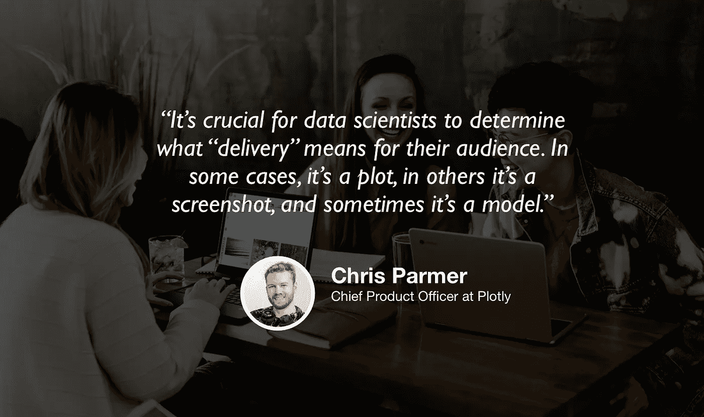

# Plotly 是数据科学及其发展方向的创始人

> 原文：<https://towardsdatascience.com/plotly-founder-on-what-data-science-is-and-where-its-going-46c5d6ec6a7d?source=collection_archive---------40----------------------->

## [苹果](https://podcasts.apple.com/ca/podcast/towards-data-science/id1470952338?mt=2) | [谷歌](https://www.google.com/podcasts?feed=aHR0cHM6Ly9hbmNob3IuZm0vcy8zNmI0ODQ0L3BvZGNhc3QvcnNz) | [SPOTIFY](https://open.spotify.com/show/63diy2DtpHzQfeNVxAPZgU) | [其他](https://anchor.fm/towardsdatascience) | [剪辑](https://youtu.be/jet1iqKPtsU)

## 克里斯·帕默在 [TDS 播客](https://towardsdatascience.com/podcast/home)

*编者按:迈向数据科学播客的“攀登数据科学阶梯”系列由 Jeremie Harris 主持。Jeremie 帮助运营一家名为*[*sharpes minds*](http://sharpestminds.com)*的数据科学导师初创公司。可以听下面的播客:*

很容易把数据科学家想成“探索数据并为数据建模的人”。但实际上，这份工作的描述要灵活得多:**作为一名数据科学家，你的工作是解决人们在数据方面的实际问题**。

你会注意到我写的是“人们实际存在的问题”，而不是“建立模型”。人们遇到的问题实际上很少需要使用预测模型来解决。相反，一个好的可视化或交互式图表几乎总是解决问题过程的第一步，也可能是最后一步。

你知道谁非常非常了解可视化策略吗？[阴谋地](https://plot.ly/)，就是他。Plotly 是一家开发大量优秀的开源可视化、探索和数据基础设施工具的公司。今天，他们的工具被全球超过 5000 万人使用，他们开发了许多工具和库，现在已经成为行业标准。所以你可以想象我和 Plotly 联合创始人兼首席产品官 Chris Parmer 交谈时有多兴奋。

Chris 分享了一些关于数据科学和分析工具的深刻见解，包括他认为该领域未来的发展方向。但正如他的职称所暗示的那样，他还关注所有伟大的数据科学家早期开发的另一个关键特征:产品本能(又名:“知道下一步要做什么”)。以下是我在对话中最喜欢的一些观点:

*   自动驾驶和复制一些规范的“数据科学生命周期”流程是危险的。相反，在你开始任何工作或个人项目之前，你能做的最重要的事情是问自己:*交付你的工作产品意味着什么？* *它应该采取什么形式？*这可能会节省大量时间:它可以避免你花费数周时间优化复杂的机器学习模型，而你真正需要的只是一个简单的可视化或绘图。
*   这就是产品感变得至关重要的地方。正如我们在节目中一次又一次地说的那样，生活不是一场猜谜比赛，在这场比赛中，给你一个数据集和一个精确的数字来优化，你所要做的就是建立和改进模型。产品意识是决定你的模型应该优化什么的因素，更重要的是，你是否首先需要一个模型。
*   随着时间的推移，数据科学工具——尤其是 Plotly 的工具——已经抽象出越来越多曾经被认为是“数据科学”生命周期一部分的东西。例如，今天，大多数数据科学家可以不需要学习任何 Javascript 就可以完成工作，而十年前，如果你想与他人分享你的工作成果，进行基本的全栈 web 开发的能力更为重要。
*   随着新工具的不断出现，让数据科学家跟上步伐变得比以往任何时候都更加重要。(补充说明:我认识的许多数据科学家都将他们工作周的一小部分专门用于此。)
*   尽管数据科学工具的发展可能会继续朝着这个方向发展，但产品直觉以及从数据中得出结论并清晰传达数据的能力肯定会成为数据科学家未来的关键技能。
*   项目是给雇主留下深刻印象的好方法，但它们需要展示产品感:除了展示你知道如何回答这些问题之外，你还需要展示你能够提出正确的问题。

你可以[在这里](https://twitter.com/plotlygraphs)的推特上关注 Plotly，你也可以[在这里](https://twitter.com/jeremiecharris)的推特上关注我。

## [夹子](https://youtu.be/jet1iqKPtsU)

我们正在寻找能与我们的观众分享有价值的东西的客人。如果你碰巧知道谁是合适的人选，请在这里告诉我们:[publication@towardsdatascience.com](mailto:publication@towardsdatascience.com)。