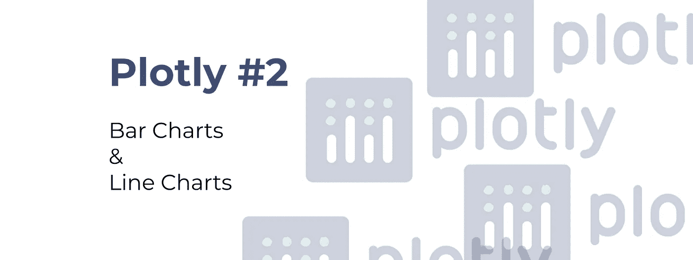
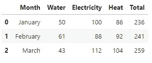
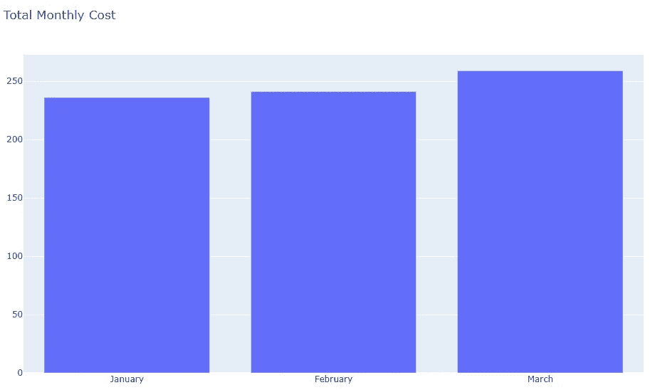
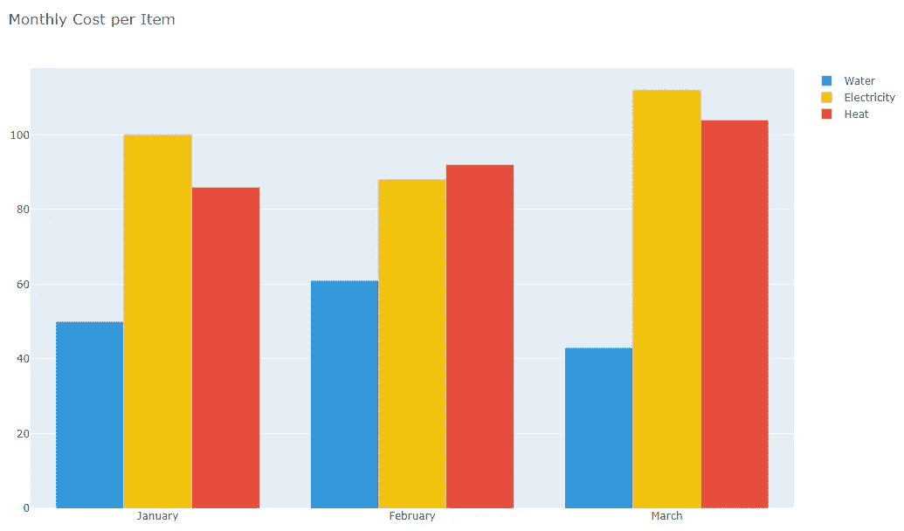
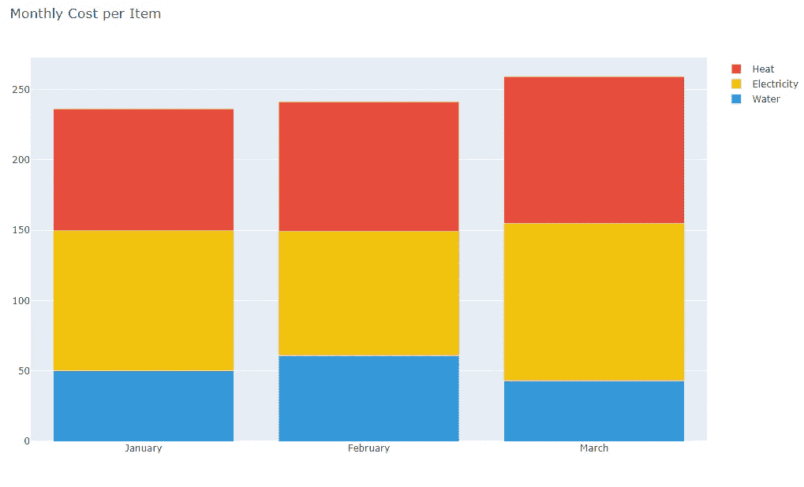
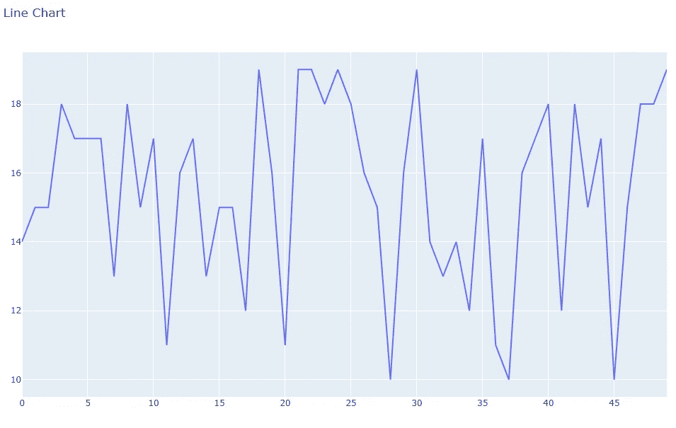
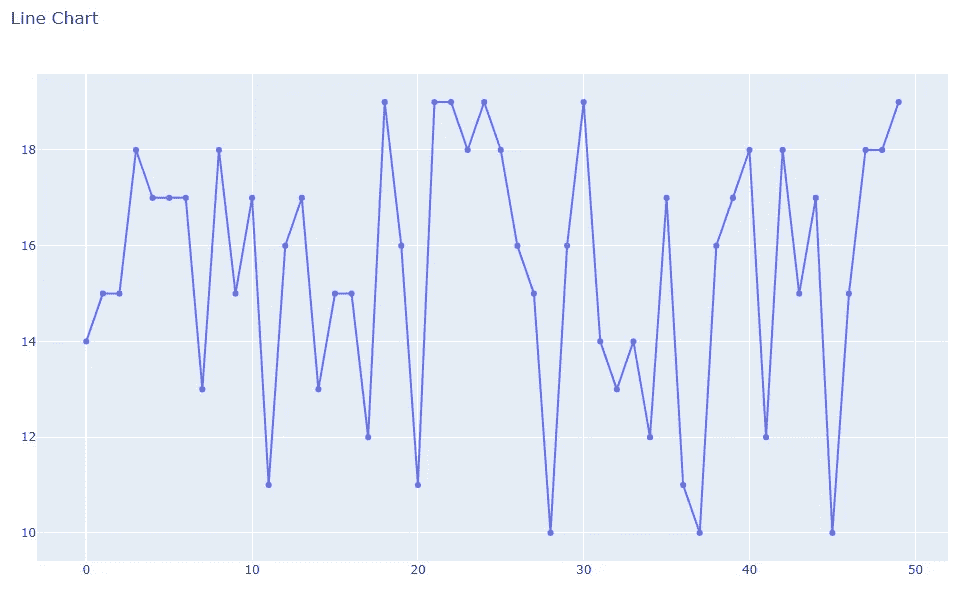
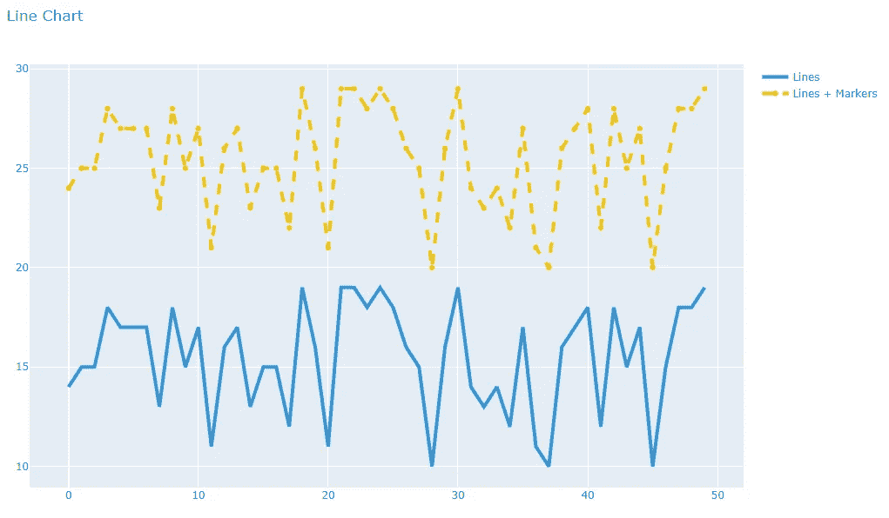

# 从前到后:条形图和折线图

> 原文：<https://towardsdatascience.com/plotly-front-to-back-bar-charts-line-charts-2b591d29c6ba?source=collection_archive---------25----------------------->

## 让我们了解一下基本情况。包括源代码。

几天前，我宣布了一个关于 Plotly 库的即将到来的系列，涵盖了让你的可视化更上一层楼所需要知道的一切。虽然我建议你从一开始就阅读这个系列，但文章是以这样的方式形成的，每篇文章都是独立的，不要求你阅读之前的所有内容。



今天，您将阅读该系列的第二篇文章，其中第一篇文章仅涉及为什么您应该考虑 Plotly 的原因:

[](/4-reasons-why-im-choosing-plotly-as-the-main-visualization-library-dc4a961a402f) [## 我选择 Plotly 作为主要可视化库的 4 个原因

### 把你的想象带到 21 世纪

towardsdatascience.com](/4-reasons-why-im-choosing-plotly-as-the-main-visualization-library-dc4a961a402f) 

因此，如果您正在努力选择一个数据可视化平台，或者只是想尝试一些新的东西，一定要去看看。

今天，我们将关注两种非常常见的图表类型:

*   **条形图**
*   **折线图**

第一个是你几乎在任何时候想要看到类别之间的区别时都会用到的，这个阶梯基本上存在于任何仪表盘中，通常代表某种时间序列数据。

事不宜迟，让我们开始吧。

# 导入和数据集—条形图

在导入方面，我们只有几个库，其中两个出现在每个数据科学笔记本中，最后两个来自 Plotly:

```
import numpy as np
import pandas as pd
import plotly.graph_objs as go 
import plotly.offline as pyo
```

至于数据集，我们将在 Pandas 中声明一些随机的东西，比如说一年中不同月份的各种账单金额:

```
df = pd.DataFrame(data={
   ‘Month’: [‘January’, ‘February’, ‘March’],
   ‘Water’: [50, 61, 43],
   ‘Electricity’: [100, 88, 112],
   ‘Heat’: [86, 92, 104],
   ‘Total’: [236, 241, 259]
})
```



好了，我们有一切可以开始了。让我们探索绘制该数据集的所有不同方式。

# 条形图

今天我们将讨论三种类型的条形图:

1.  (正常)条形图
2.  嵌套条形图
3.  堆积条形图

你不需要事先知道它们之间的区别，因为所有的东西都会在文章中解释。这个想法是向您展示用条形图表示数据的每一种方法，然后由您选择最合适的选项。

## 普通条形图

好了，让我们在 x 轴上画出`Month`，在 y 轴上画出`Total`。像往常一样，您将声明一个`figure`对象并将数据和布局放入其中。这个非常简单，不需要进一步解释:

```
fig = go.Figure(
   data=[
       go.Bar(
           x=df[‘Month’],
           y=df[‘Total’]
       )
   ],
   layout=go.Layout(
       title=’Total Monthly Cost’
   )
)pyo.plot(fig)
```

如果您要执行这段代码，将会出现这样一个图:



好吧，还不错，但也不太好——这里我们**只显示了总量**，这并没有向我们展示全貌。我们来看看如何改进。

## 嵌套条形图

在这个例子中，我们将能够**可视化每笔费用**而不仅仅是总额。请记住，如果您有大量的数据和大量的类别，这种类型的图表可能会变得难以查看——但它对我们的情况来说是很好的。

这样做真的很简单——我们只需要在我们的数据数组中为我们想要可视化的每个类别放置一个`go.Bar`对象。代码如下:

```
fig = go.Figure(
   data=[
       go.Bar(
           x=df[‘Month’],
           y=df[‘Water’],
           name=’Water’,
           marker=dict(color=’#3498db’)
       ),
       go.Bar(
           x=df[‘Month’],
           y=df[‘Electricity’],
           name=’Electricity’,
           marker=dict(color=’#f1c40f’)
       ),
       go.Bar(
           x=df[‘Month’],
           y=df[‘Heat’],
           name=’Heat’,
           marker=dict(color=’#e74c3c’)
       )
   ],
   layout=go.Layout(
       title=’Monthly Cost per Item’
   )
)pyo.plot(fig)
```

执行上面的代码会产生一个好看的图表:



如果你问我的话，我会说这比我们以前有了很大的进步。在结束本节之前，让我们探索另一个选项。

## 堆积条形图

在大多数情况下，这是我最喜欢的选择。占用的空间与常规条形图一样少，显示的信息与嵌套条形图一样多。代码与嵌套条形图的代码非常相似，唯一的区别是您需要在布局中指定`barmode='stack'`。

让我们来看看实际情况:

```
fig = go.Figure(
   data=[
       go.Bar(
           x=df[‘Month’],
           y=df[‘Water’],
           name=’Water’,
           marker=dict(color=’#3498db’)
       ),
       go.Bar(
           x=df[‘Month’],
           y=df[‘Electricity’],
           name=’Electricity’,
           marker=dict(color=’#f1c40f’)
       ),
       go.Bar(
           x=df[‘Month’],
           y=df[‘Heat’],
           name=’Heat’,
           marker=dict(color=’#e74c3c’)
       )
   ],
   layout=go.Layout(
       title=’Monthly Cost per Item’,
       **barmode=’stack’**
   )
)pyo.plot(fig)
```

执行上面的代码将会产生如下所示的图表:



太好了！我们已经深入讨论了条形图，现在让我们看看可以用折线图做什么！

# 数据集-折线图

对于这一部分，我们只需要两个`Numpy`数组:

```
x = np.linspace(0, 49, 50)
y = np.random.randint(10, 20, 50)
```

就这样——我们可以开始探索。

# 折线图

与条形图一样，我们将讨论两个选项:

*   基本折线图
*   带标记的折线图
*   多折线图

如果你不清楚第二个选项是什么意思，请耐心听我说。

## 基本折线图

下面是我们如何从这两个先前声明的 Numpy 数组制作一个基本的折线图:

```
fig = go.Figure(
   data=[
       go.Scatter(
          x=x,
          y=y,
          mode=’lines’ 
       )
   ],
   layout=go.Layout(
       title=’Line Chart’
   )
)pyo.plot(fig)
```

执行此代码将产生以下图表:



这不是最好看的折线图，我们将在文章结尾探索如何调整视觉效果。

## 带标记的折线图

如果没有太多的数据点，有时在线旁边显示小的**标记**会很方便。代码方面的变化很小——因为我们只需要调整模式选项，并将其设置为`mode='lines+markers'`。让我们看看代码:

```
fig = go.Figure(
   data=[
       go.Scatter(
           x=x,
           y=y,
           **mode=’lines+markers’** 
       )
   ],
   layout=go.Layout(
       title=’Line Chart’
   )
)pyo.plot(fig)
```

执行上面编写的代码将会得到这个图表:



很好。现在让我们看看如何将多条线组合成一个折线图。

## 多折线图

现在让我们看看将多条线组合成一个图表是多么容易。就像条形图一样，我们将把多个`go.Scatter`对象放到我们的数据数组中。

为了增加一点趣味，我们添加了一些布局选项，只是为了让你从外观上感受一下可以做些什么。

代码如下:

```
fig = go.Figure(
   data=[
     go.Scatter(
         x=x,
         y=y,
         mode=’lines’,
         name=’Lines’,
         line=dict(
             color=’#3498db’,
             width=4
         )
     ),
     go.Scatter(
         x=x,
         y=y + 10,
         mode=’lines+markers’,
         name=’Lines + Markers’,
         line=dict(
             color=’#f1c40f’,
             dash=’dash’,
             width=4
         )  
     )
   ],
   layout=go.Layout(
       title=’Line Chart’,
       hovermode=’x’
   )
)pyo.plot(fig)
```

执行该代码将生成以下图表:



厉害！今天这样就够了。

# 在你走之前

这篇文章比我平时写的要长得多。但我希望你能理解。我们今天谈了很多，但还有更多的要谈。

接下来的文章将涵盖**散点图**和**气泡图**，如果你对此感兴趣，请继续关注。

感谢您的阅读，请一如既往地提出您的问题和评论。

喜欢这篇文章吗？成为 [*中等会员*](https://medium.com/@radecicdario/membership) *继续无限制学习。如果你使用下面的链接，我会收到你的一部分会员费，不需要你额外付费。*

[](https://medium.com/@radecicdario/membership) [## 通过我的推荐链接加入 Medium-Dario rade ci

### 作为一个媒体会员，你的会员费的一部分会给你阅读的作家，你可以完全接触到每一个故事…

medium.com](https://medium.com/@radecicdario/membership)