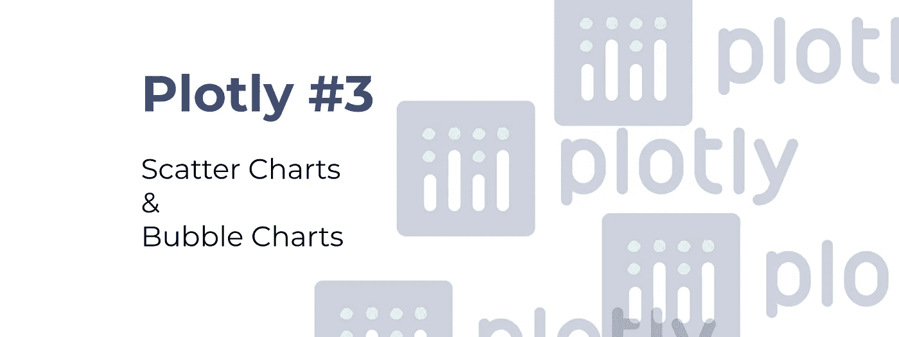
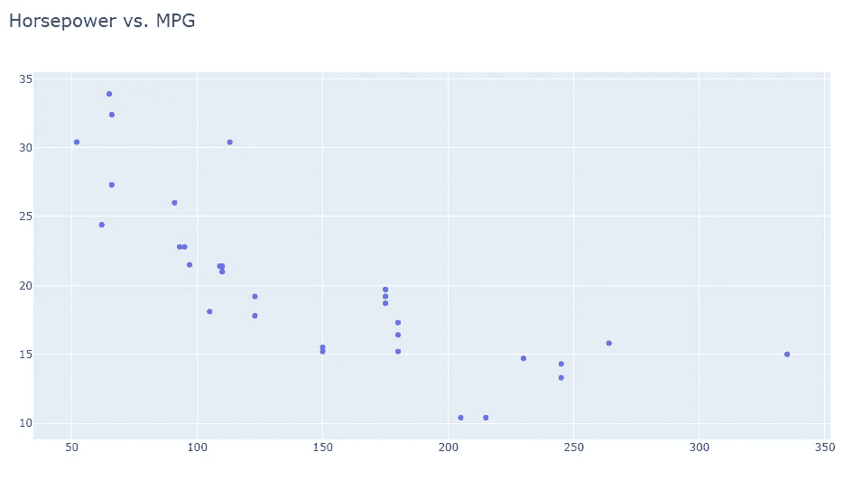
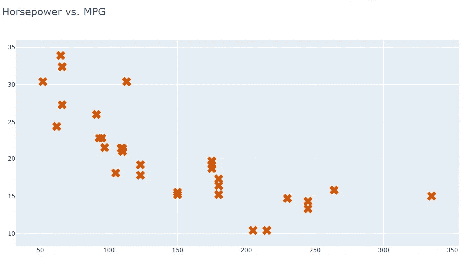
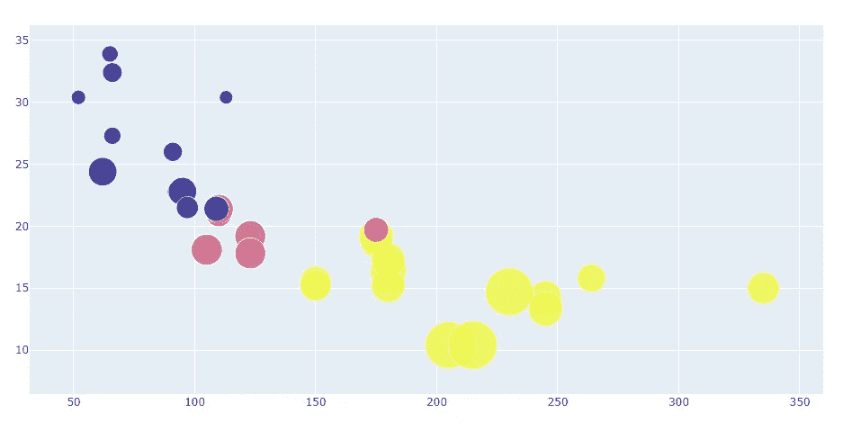
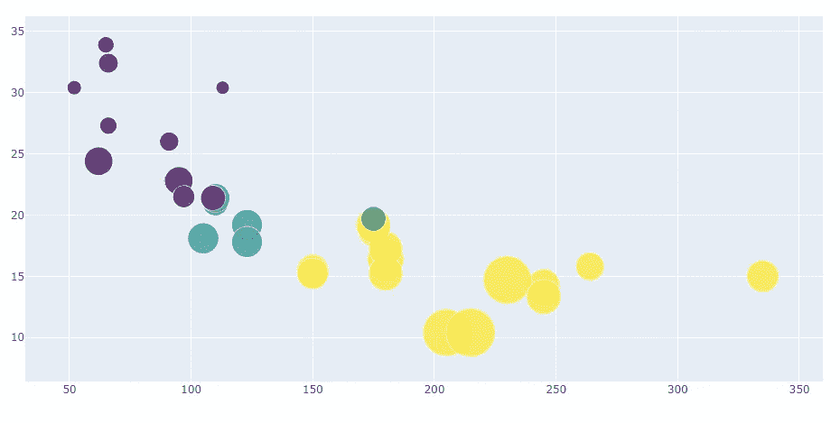

# 从前到后:散点图和气泡图

> 原文：<https://towardsdatascience.com/plotly-front-to-back-scatter-charts-and-bubble-charts-8e6dc5f77b54?source=collection_archive---------27----------------------->

## 知道其中的区别——并在这个过程中让他们看起来很棒！

距离我在 Plotly 库上的上一篇文章已经过去了几天，上一篇文章介绍了**棒线**图表和**线**图表。虽然我建议在此之前先阅读那篇文章，但这绝不是强制性的，因为每篇文章都是为了讲述完整的故事。



如果你想跟进这个系列，这里有一些链接:

1.  [我选择 Plotly 作为我的主要可视化库的 4 个原因](/4-reasons-why-im-choosing-plotly-as-the-main-visualization-library-dc4a961a402f)
2.  [从前到后绘制:条形图&折线图](/plotly-front-to-back-bar-charts-line-charts-2b591d29c6ba)

好了，事不宜迟，让我们花点时间讨论一下这篇文章涵盖的内容。主要想法是获取一个数据集(一个众所周知的数据集，稍后会详细介绍)并探索如何可视化它——使用散点图和气泡图。

所用的数据集很小，但足以满足我们的需求，可以从这个 URL 下载。你不需要下载它，因为我们会直接从**网站**导入它。

好吧，没有任何麻烦，让我们开始吧！

# 导入和数据集

导入方面，我们需要两个库——`Pandas`和`Plotly`——下面是如何导入它们:

```
import pandas as pd
import plotly.graph_objs as go
import plotly.offline as pyo
```

至于数据集，我们直接从 GitHub 抓取。这是众所周知的汽车数据集，非常适合我们将要进行的可视化类型:

```
df = pd.read_csv(‘[https://raw.githubusercontent.com/plotly/datasets/master/mtcars.csv'](https://raw.githubusercontent.com/plotly/datasets/master/mtcars.csv'))
df.head()
```

好了，就这样，现在让我们开始吧。

# 散点图

现在，散点图背后的基本思想是可视化一组变量之间的**关系。就关系而言，我们指的是变量之间的依赖性——或运动——如果第一个变量运动了一定量，第二个变量会发生什么——或者用最简单的方式说，相关性。**

用 Plotly 制作散点图非常简单——几乎任何东西都是如此(除了地图，这些可能是底部的痛苦，但在两篇文章中会有更多的讨论)—因为我们需要定义众所周知的`data`和`layout`选项。

就像线图一样，我们将使用`go.Scatter()`作为我们的数据，但是我们需要指定`mode='markers'`来使一切正常工作。

下面是你如何在 x 轴上可视化属性`hp`(马力)，在 y 轴上可视化属性`mpg`(每加仑英里数):

```
fig = go.Figure(
    data=[
        go.Scatter(
            x=df[‘hp’],
            y=df[‘mpg’],
            mode=’markers’,
        )
    ],
    layout=go.Layout(
        title=dict(
            text=’Horsepower vs. MPG’,
            font=dict(size=20)
        ),
        hovermode=’closest’
    )
)pyo.plot(fig)
```

没有太多的代码行，但是让我们看看它会产生什么结果:



我知道你现在在想什么:

*   基础点太无聊了
*   颜色很糟糕
*   马克笔太小了

好吧，让我们来解决这些问题:

```
fig = go.Figure(
    data=[
        go.Scatter(
            x=df[‘hp’],
            y=df[‘mpg’],
            mode=’markers’,
            **marker=dict(
                size=16,
                symbol=’x-dot’,
                color=’#d35400'
            )**
        )
    ],
    layout=go.Layout(
        title=dict(
            text=’Horsepower vs. MPG’,
            font=dict(size=20)
        ),
        hovermode=’closest’
    )
)pyo.plot(fig)
```

我们之前遇到的每个问题都可以通过调整标记参数来解决，通过`marker`参数。我们的图表现在看起来是这样的:



尽管不是最漂亮的，但现在也可以了。现在让我们探索散点图的更大的兄弟——气泡图——看看显示**附加信息**和将大小设置为动态是多么容易。

# 气泡图

以防你没有阅读整篇文章，而是跳到这一部分，这里有你应该知道的:我们通常使用气泡图来显示额外的信息，或者通过尺寸显示，或者通过颜色显示。

例如，假设我们仍然希望将`hp`(马力)放在 x 轴上，将`mpg`(每加仑英里数)放在 y 轴上——但是我们还希望将大小设置为动态的——假设根据`wt`(重量)属性，并且还将颜色设置为动态的——根据气缸数量`cyl`。

对于单个图表来说，这听起来像是太多的信息，但实际上不是。下面是如何用代码实现上述内容:

```
fig = go.Figure(
   data=[
       go.Scatter(
           x=df[‘hp’],
           y=df[‘mpg’],
           mode=’markers’,
           marker=dict(
               size=df[‘wt’] * 10,
               color=df[‘cyl’]
           )
       )
    ]
)pyo.plot(fig)
```

如果您想知道，我们将`wt`属性的值相乘，因为否则，它会太小。您可以随意调整这个值。图表如下所示:



很好。我们在两个轴上都有与简单散点图相同的信息，但这里显示了两条附加信息。

如果你问我，这种黄色有点太多了，所以让我们看看如何改变**调色板**:

```
fig = go.Figure(
    data=[
        go.Scatter(
            x=df[‘hp’],
            y=df[‘mpg’],
            mode=’markers’,
            marker=dict(
                size=df[‘wt’] * 10,
                color=df[‘cyl’],
                **colorscale=’Viridis’**
            )
        )
    ]
)pyo.plot(fig)
```

图表如下所示:



如你所见，这种视觉化对眼睛来说更容易一些。你可以参考[这个页面](https://plotly.com/python/builtin-colorscales/)来获得可用调色板的完整列表。

我想今天这样就够了。

# 在你走之前

我希望这对你来说不会太难——我知道这种复杂的语法可能需要一段时间来适应——但如果你问我，这是值得的。

接下来的文章将涵盖**饼状图**和**树形图**——如果你对此感兴趣，请继续关注。

感谢阅读。

喜欢这篇文章吗？成为 [*中等会员*](https://medium.com/@radecicdario/membership) *继续无限制学习。如果你使用下面的链接，我会收到你的一部分会员费，不需要你额外付费。*

[](https://medium.com/@radecicdario/membership) [## 通过我的推荐链接加入 Medium-Dario rade ci

### 作为一个媒体会员，你的会员费的一部分会给你阅读的作家，你可以完全接触到每一个故事…

medium.com](https://medium.com/@radecicdario/membership)