# 帕尔默企鹅的熊猫

> 原文：<https://towardsdatascience.com/plotly-pandas-for-the-palmer-penguins-f5cdab3c16c8?source=collection_archive---------26----------------------->

## PalmerPenguins——虹膜替代品！！

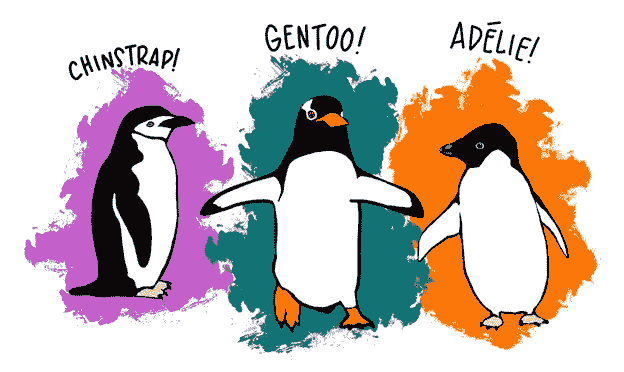

作品鸣谢:@ Allison _ horst[https://github.com/allisonhorst/palmerpenguins](https://github.com/allisonhorst/palmerpenguins)

# PalmerPenguins 数据集

最近推出了 PalmerPenguins 数据集，作为常用于数据探索、可视化和分类建模的`Iris`数据集的替代。

帕尔默彭金斯的数据由[Kristen Gorman](https://www.uaf.edu/cfos/people/faculty/detail/kristen-gorman.php)博士和[LTER 南极洲帕尔默站](https://pal.lternet.edu/)收集和提供，帕尔默站是[长期生态研究网络](https://lternet.edu/)的成员。

palmerpenguins 包包含两个数据集，可以从最初的 GitHub 链接—[https://github.com/allisonhorst/palmerpenguins](https://github.com/allisonhorst/palmerpenguins)下载，也可以从 Kaggle 访问。

两个数据集都包含 344 只企鹅的数据。在这个数据集中有 3 种不同种类的企鹅，它们是从南极洲帕尔默群岛的 3 个岛屿上采集的。

# 使用 Pandas 和 Plotly 进行数据探索和可视化！

现在让我们使用 Pandas 和 Plotly 对 palmerpenguins 数据集进行探索性数据分析和可视化。

要安装 Pandas 和 Plotly，请在终端中运行以下命令:

```
**pip install pandas
pip install plotly**
```

**导入所需的库**

```
# importing dependencies here
import pandas as pd
import os# importing plotly modules for visualizations
import plotly.graph_objects as go
from plotly.offline import init_notebook_mode, iplot
```

**读取数据集**

```
# reading the penguins dataset
penguins_df = pd.read_csv(path to your dataset)# checking the top 5 rows
penguins_df.head()
```

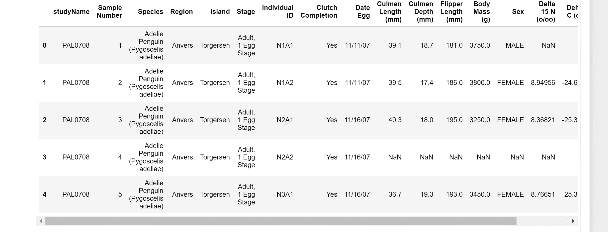

企鹅数据集


作品鸣谢:@ Allison _ horst[https://github.com/allisonhorst/palmerpenguins](https://github.com/allisonhorst/palmerpenguins)

**检查行数和列数**

```
# checking the number of rows and columns
penguins_df.shape**Output:** (344, 17)
```

**检查数据集中的列名**

```
# checking the column names
penguins_df.columns**Output:** Index([‘studyName’, ‘Sample Number’, ‘Species’, ‘Region’, ‘Island’, ‘Stage’, ‘Individual ID’, ‘Clutch Completion’, ‘Date Egg’, ‘Culmen Length (mm)’, ‘Culmen Depth (mm)’, ‘Flipper Length (mm)’, ‘Body Mass (g)’, ‘Sex’, ‘Delta 15 N (o/oo)’, ‘Delta 13 C (o/oo)’, ‘Comments’, ‘Color’], dtype=’object’)
```

**检查数据集统计数据**

```
# checking the dataset stats
penguins_df.describe()
```

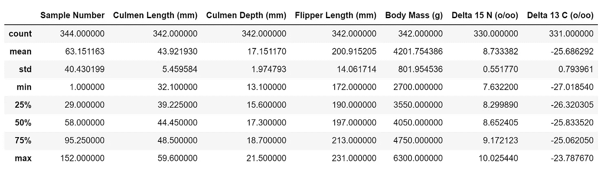

**检查计数和数据类型**

```
# checking counts and data type for each column
penguins_df.info()
```

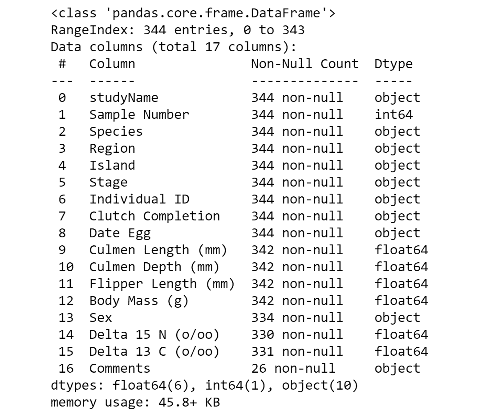

**检查数据集中是否存在空值**

```
# checking for the presence of null values
penguins_df.isnull().sum()
```

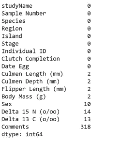

某些列存在缺失值/空值

**处理空值**

```
**# Using Scikit Learn to substitute the null values with the most frequently occurring value in that column.**from sklearn.impute import SimpleImputer
imputer = SimpleImputer(strategy=”most_frequent”)
penguins_df.iloc[:, :] = imputer.fit_transform(penguins_df)# ensuring that there are no more null values left
penguins_df.isnull().sum()
```

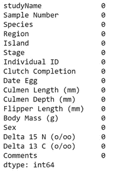

不再有丢失的值

**探索岛屿数据**

```
# checking island data
island_df = pd.DataFrame(
penguins_df.groupby(["Island", "Species"])["Island"].count()).rename(columns={"Island": "Count"})island_df
```

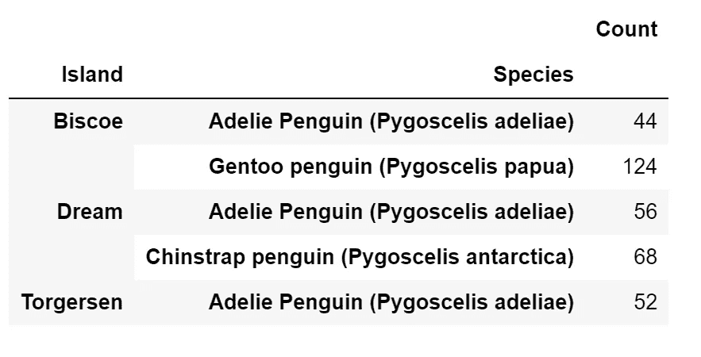

# **为基于绘图的可视化准备数据**

> 请注意，如果我们可以首先使用 Pandas Dataframes 聚集每个可视化所需的数据，Plotly 可视化会更容易实现。

所以，首先，想想你想要的视觉效果，然后相应地创建数据框架。这将有助于在创建地块时高效快速地设置地块轨迹。

```
**# since each of the 3 penguin species present in the dataset has a particular color associated, adding a color column to the dataset to keep track of the color associated with a specie.**cls = {
"Adelie Penguin (Pygoscelis adeliae)": "darkorange",
"Gentoo penguin (Pygoscelis papua)": "teal",
"Chinstrap penguin (Pygoscelis antarctica)": "mediumorchid",
}penguins_df["Color"] = penguins_df["Species"].apply(lambda x: cls[x])
```

## C ***为每一个物种创建单独的数据帧，以便于下面的可视化！！***

## 阿德利企鹅

```
adelie_df = penguins_df[
penguins_df[“Species”] == “Adelie Penguin (Pygoscelis adeliae)”
].reset_index(drop=True)adelie_df.head(2)
```

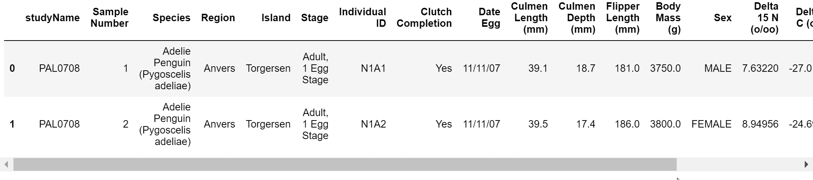

阿德利企鹅数据

```
adelie_count_df = (
pd.DataFrame(adelie_df.groupby([“Species”, “Color”])[“studyName”].count())
.sort_values(“studyName”, ascending=False)
.reset_index()
.rename(columns={“studyName”: “Count”})
)adelie_count_df
```

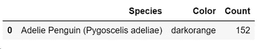

## 巴布亚企鹅

```
gentoo_df = penguins_df[
penguins_df[“Species”] == “Gentoo penguin (Pygoscelis papua)”
].reset_index(drop=True)gentoo_df.head(2)
```

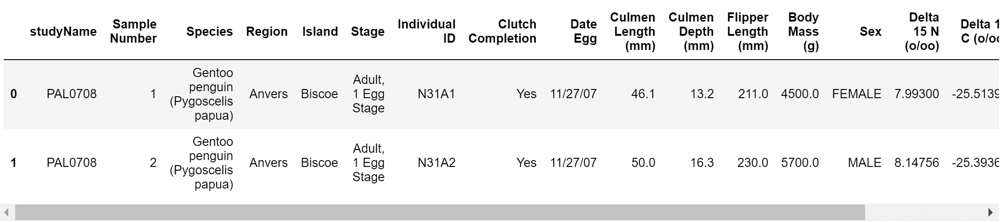

巴布亚企鹅数据

```
gentoo_count_df = (
pd.DataFrame(gentoo_df.groupby([“Species”, “Color”])[“studyName”].count())
.sort_values(“studyName”, ascending=False)
.reset_index()
.rename(columns={“studyName”: “Count”})
)gentoo_count_df
```


## 下颚带企鹅(南极企鹅)

```
chinstrap_df = penguins_df[
penguins_df[“Species”] == “Chinstrap penguin (Pygoscelis antarctica)”
].reset_index(drop=True)chinstrap_df.head(2)
```

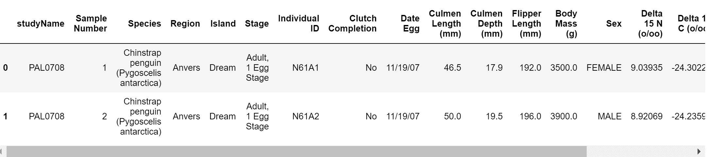

下颚带企鹅数据

```
chinstrap_count_df = (
pd.DataFrame(chinstrap_df.groupby([“Species”, “Color”])[“studyName”].count())
.sort_values(“studyName”, ascending=False)
.reset_index()
.rename(columns={“studyName”: “Count”})
)chinstrap_count_df
```

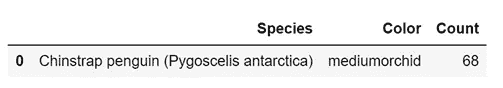

## 基于物种的性别计数

```
female_df = (
pd.DataFrame(
penguins_df[penguins_df[“Sex”] == “FEMALE”][[“Species”, “Sex”, “Color”]]
.groupby(“Species”)[“Sex”]
.count()
)
.sort_values(“Sex”, ascending=False)
.reset_index()
.rename(columns={“Sex”: “Female”})
)female_df
```

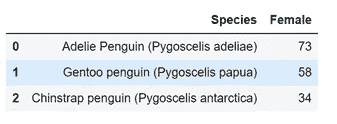

```
male_df = (
pd.DataFrame(
penguins_df[penguins_df[“Sex”] == “MALE”][[“Species”, “Sex”]]
.groupby(“Species”)[“Sex”]
.count()
)
.sort_values(“Sex”, ascending=False)
.reset_index()
.rename(columns={“Sex”: “Male”})
)male_df
```

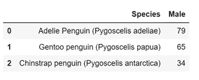

# 奇妙的视觉效果

现在，当我们已经很好地处理了我们的数据，将它们聚合成数据帧，记住具体的可视化，让我们开始在企鹅数据集上构建 Plotly plots！！

## 企鹅物种计数图

```
# Penguin Species Count
trace1 = go.Bar(
x=adelie_count_df[“Species”],
y=adelie_count_df[“Count”],
marker=dict(color=adelie_count_df[“Color”], line_color=”rgb(0,0,0)”),
name=”Adelie Penguin”,
)trace2 = go.Bar(
x=gentoo_count_df[“Species”],
y=gentoo_count_df[“Count”],
marker=dict(color=gentoo_count_df[“Color”], line_color=”rgb(0,0,0)”),
name=”Gentoo penguin”,
)trace3 = go.Bar(
x=chinstrap_count_df[“Species”],
y=chinstrap_count_df[“Count”],
marker=dict(color=chinstrap_count_df[“Color”], line_color=”rgb(0,0,0)”),
name=”Chinstrap penguin”,
)data = [trace1, trace2, trace3]layout = dict(
title=”<b>Penguin Species Count</b>”,
showlegend=True,
xaxis=dict(showgrid=False, title=”Species”),
yaxis=dict(title=”Count”),
plot_bgcolor=”rgba(0,0,0,0)”,
paper_bgcolor=”rgba(0,0,0,0)”,
)fig = dict(data=data, layout=layout)iplot(fig)
```

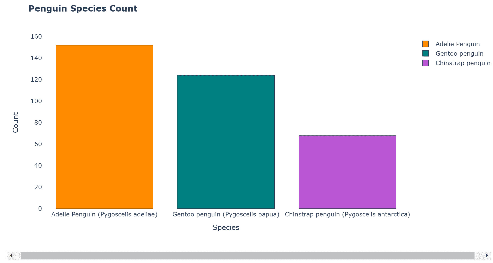

**基于企鹅种类的性别计数图**

```
# penguins gender count based on speciestrace1 = go.Bar(
x=female_df[“Species”],
y=female_df[“Female”],
text=”Female”,
textposition=”outside”,
marker=dict(color=species_df[“Color”], line_color=”rgb(0,0,0)”),
)trace2 = go.Bar(
x=male_df[“Species”],
y=male_df[“Male”],
text=”Male”,
textposition=”outside”,
marker=dict(color=species_df[“Color”], line_color=”rgb(0,0,0)”),
name=”Male”,
)data = [trace1, trace2]layout = dict(
title=”<b>Penguin Gender-Based Species Count</b>”,
showlegend=False,
plot_bgcolor=”rgba(0,0,0,0)”,
paper_bgcolor=”rgba(0,0,0,0)”,
)fig = dict(data=data, layout=layout)iplot(fig)
```

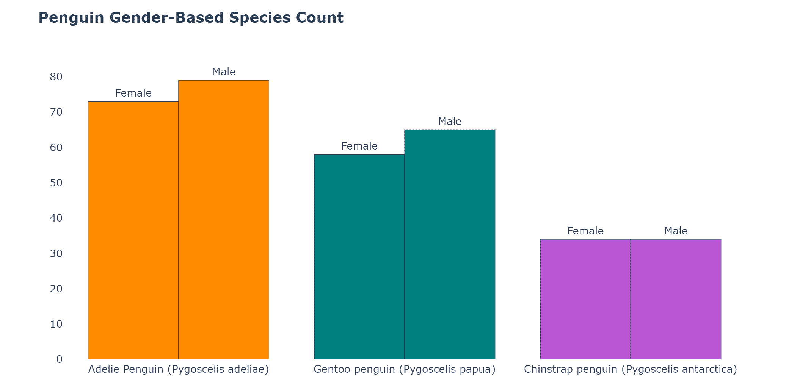

# 相关图

下面我们将看到如何创建基于 Plotly 的相关图的长度和脚蹼长度(相对于身体质量)。可以遵循相同的步骤为其他特征创建相关图。

```
# checking for correlation between features
penguins_df.corr()
```

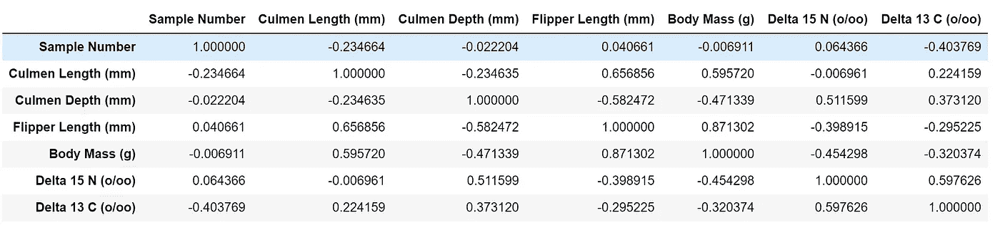

列之间的相关性

**身高(mm)与体重(g)的相关图**

```
# Culmen Length (mm) vs. Body Mass (g)trace1 = go.Scatter(
x=adelie_df[“Culmen Length (mm)”],
y=adelie_df[“Body Mass (g)”],
text=adelie_df[“Species”],
mode=”markers”,
marker=dict(size=10, symbol=”circle”, line=dict(color=”rgb(0,0,0)”, width=0.5)),
marker_color=adelie_df[“Color”],
name=”Adelie Penguin”,
)trace2 = go.Scatter(
x=gentoo_df[“Culmen Length (mm)”],
y=gentoo_df[“Body Mass (g)”],
text=gentoo_df[“Species”],
mode=”markers”,
marker=dict(size=10, symbol=”square”, line=dict(color=”rgb(0,0,0)”, width=0.5)),
marker_color=gentoo_df[“Color”],
name=”Gentoo penguin”,
)trace3 = go.Scatter(
x=chinstrap_df[“Culmen Length (mm)”],
y=chinstrap_df[“Body Mass (g)”],
text=chinstrap_df[“Species”],
mode=”markers”,
marker=dict(
size=12, symbol=”triangle-up”, line=dict(color=”rgb(0,0,0)”, width=0.5)
),
marker_color=chinstrap_df[“Color”],
name=”Chinstrap penguin”,
)data = [trace1, trace2, trace3]layout = dict(
title=”<b>Culmen Length (mm) vs. Body Mass (g)</b>”,
showlegend=True,
xaxis=dict(title=”Culmen Length (mm)”),
yaxis=dict(title=”Body Mass (g)”),
plot_bgcolor=”rgba(0,0,0,0)”,
paper_bgcolor=”rgba(0,0,0,0)”,
)fig = dict(data=data, layout=layout)iplot(fig)
```

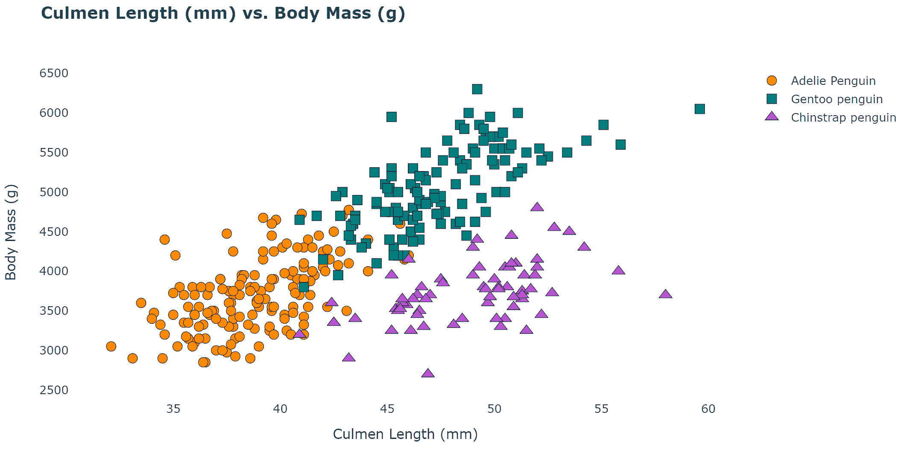

**鳍状肢长度(毫米)与体重(克)的相关图**

```
# Flipper Length (mm) vs. Body Mass (g)trace1 = go.Scatter(
x=adelie_df[“Flipper Length (mm)”],
y=adelie_df[“Body Mass (g)”],
text=adelie_df[“Species”],
mode=”markers”,
marker=dict(size=9, symbol=”circle”, line=dict(color=”rgb(0,0,0)”, width=0.5)),
marker_color=adelie_df[“Color”],
name=”Adelie Penguin”,
)trace2 = go.Scatter(
x=gentoo_df[“Flipper Length (mm)”],
y=gentoo_df[“Body Mass (g)”],
text=gentoo_df[“Species”],
mode=”markers”,
marker=dict(size=9, symbol=”square”, line=dict(color=”rgb(0,0,0)”, width=0.5)),
marker_color=gentoo_df[“Color”],
name=”Gentoo penguin”,
)trace3 = go.Scatter(
x=chinstrap_df[“Flipper Length (mm)”],
y=chinstrap_df[“Body Mass (g)”],
text=chinstrap_df[“Species”],
mode=”markers”,
marker=dict(
size=11, symbol=”triangle-up”, line=dict(color=”rgb(0,0,0)”, width=0.5)
),
marker_color=chinstrap_df[“Color”],
name=”Chinstrap penguin”,
)data = [trace1, trace2, trace3]layout = dict(
title=”<b>Flipper Length (mm) vs. Body Mass (g)</b>”,
showlegend=True,
xaxis=dict(title=”Flipper Length (mm)”),
yaxis=dict(title=”Body Mass (g)”),
plot_bgcolor=”rgba(0,0,0,0)”,
paper_bgcolor=”rgba(0,0,0,0)”,
)fig = dict(data=data, layout=layout)iplot(fig)
```

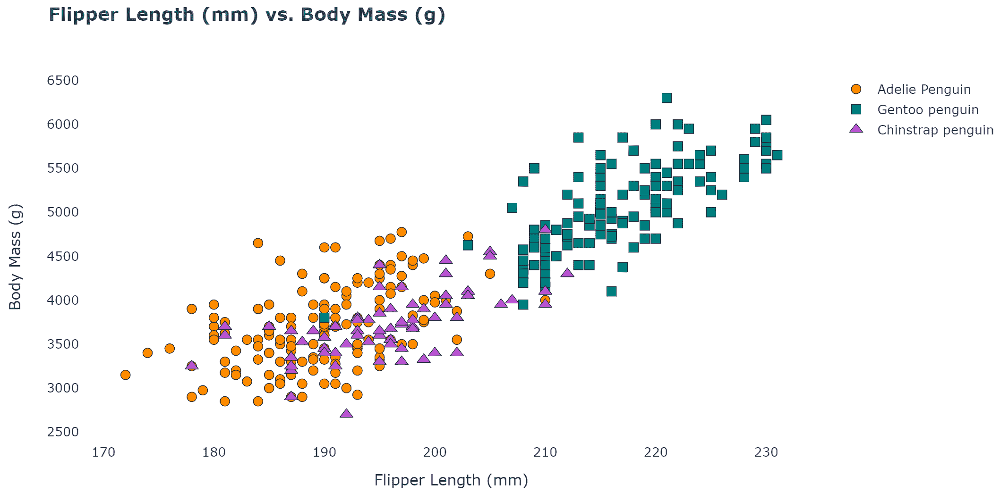

# 可视化分布

下面我们将看到如何创建基于 Plotly 的脚蹼长度和 Culmen 长度的分布图。可以按照相同的步骤为其他胎儿创建分布图。

**脚蹼长度分布图**

```
# Flipper Length Distributionstrace1 = go.Violin(
x=adelie_df[“Species”],
y=adelie_df[“Flipper Length (mm)”],
box_visible=True,
meanline_visible=True,
points=”all”,
line_color=”darkorange”,
name=”Adelie Penguin”,
)trace2 = go.Violin(
x=gentoo_df[“Species”],
y=gentoo_df[“Flipper Length (mm)”],
box_visible=True,
meanline_visible=True,
line_color=”teal”,
points=”all”,
name=”Gentoo penguin”,
)trace3 = go.Violin(
x=chinstrap_df[“Species”],
y=chinstrap_df[“Flipper Length (mm)”],
points=”all”,
box_visible=True,
meanline_visible=True,
line_color=”mediumorchid”,
name=”Chinstrap penguin”,
)data = [trace1, trace2, trace3]layout = dict(
title=”<b>Flipper Length (mm) Distribution for the 3 Species</b>”,
showlegend=True,
xaxis=dict(title=”Penguin Species”),
yaxis=dict(title=”Flipper Length (mm)”),
plot_bgcolor=”rgba(0,0,0,0)”,
paper_bgcolor=”rgba(0,0,0,0)”,
)fig = dict(data=data, layout=layout)iplot(fig)
```

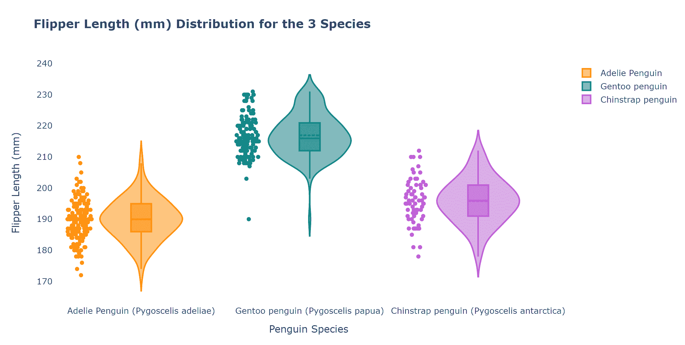

**秆长分布图**

```
# Culmen Length Distributionstrace1 = go.Violin(
x=adelie_df[“Species”],
y=adelie_df[“Culmen Length (mm)”],
box_visible=True,
meanline_visible=True,
points=”all”,
line_color=”darkorange”,
name=”Adelie Penguin”,
)trace2 = go.Violin(
x=gentoo_df[“Species”],
y=gentoo_df[“Culmen Length (mm)”],
box_visible=True,
meanline_visible=True,
line_color=”teal”,
points=”all”,
name=”Gentoo penguin”,
)trace3 = go.Violin(
x=chinstrap_df[“Species”],
y=chinstrap_df[“Culmen Length (mm)”],
points=”all”,
box_visible=True,
meanline_visible=True,
line_color=”mediumorchid”,
name=”Chinstrap penguin”,
)data = [trace1, trace2, trace3]layout = dict(
title=”<b>Culmen Length (mm) Distribution for the 3 Species</b>”,
showlegend=True,
xaxis=dict(title=”Penguin Species”),
yaxis=dict(title=”Culmen Length (mm)”),
plot_bgcolor=”rgba(0,0,0,0)”,
paper_bgcolor=”rgba(0,0,0,0)”,
)fig = dict(data=data, layout=layout)iplot(fig)
```

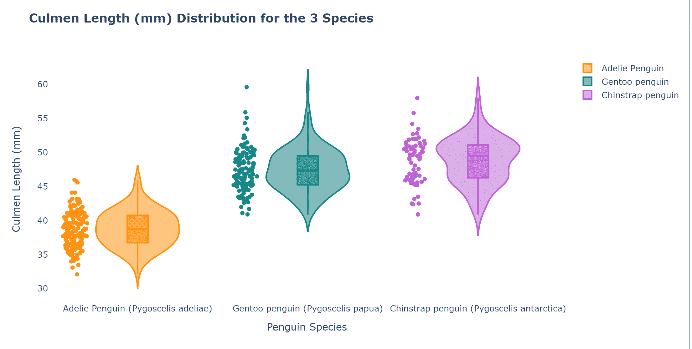

## 参考

[https://github.com/allisonhorst/palmerpenguins](https://github.com/allisonhorst/palmerpenguins)