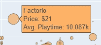

# Plotly Python:散点图

> 原文：<https://towardsdatascience.com/plotly-python-scatter-plots-2ea1b4885c90?source=collection_archive---------16----------------------->

## 用 Plotly 深入研究散点图


照片由[艾萨克·史密斯](https://unsplash.com/@isaacmsmith?utm_source=medium&utm_medium=referral)在 [Unsplash](https://unsplash.com?utm_source=medium&utm_medium=referral) 拍摄

在我上一篇关于 Plotly 的文章中，我们对这个库本身做了一个简单的介绍——包括一个图形对象的一般结构，使用跟踪，以及通过 update_trace 和 update_layout 函数进行定制。

今天，我们将更深入地了解如何使用 Plotly 库构建和定制散点图。

对于我们今天的数据集，我从 Kaggle 选择了一个 [Steam 游戏数据集](https://www.kaggle.com/nikdavis/steam-store-games)，我有兴趣看看游戏的价格和平均游戏时间之间是否有任何关系。

加载到数据帧中，我们可以看到头部如下:


现在，如果你不熟悉 Steam，你可能不会意识到这个平台上有多少游戏。在这个数据集的例子中，如果我们计算 name 列中的条目数，我们得到 27075 个标题。

然而，由于任何人都可以在 Steam 上发布内容，因此也有许多异常游戏会影响我们的结果——即平均游戏时间为 0 的游戏数量。
如果我们运行`steamdf[steamdf[‘average_playtime’] == 0].count()`我们可以看到有 20905 个游戏没有游戏时间！

一旦我应用了以下标准:

```
steamdf = steamdf[(steamdf['average_playtime'] != 0) &
          (steamdf['average_playtime'] < 40000)] steamdf = steamdf[steamdf['price'] < 80]
```

我还剩下 6160 场比赛可以看。

所以，让我们把它扔进一个快速散点图，看看初始数据是什么样的。

```
import plotly.graph_objects as gofig = go.Figure(data=go.Scatter(
                x=steamdf['price'],
                y=steamdf['average_playtime'],
                mode='markers'
))fig.show()
```


非常基本——但是，嘿，我们需要从某个地方开始，对吗？

让我们继续添加标题和轴图例。
现在，让我们来设计一下我们的标记。它们看起来有点平淡，融合在一起。

```
import plotly.graph_objects as gofig = go.Figure(data=go.Scatter(
                x=steamdf['price'],
                y=steamdf['average_playtime'],
                mode='markers',
                marker_size=steamdf['ratio'],
                marker=dict(
                     color='rgb(255, 178, 102)',
                     size=10,
                     line=dict(
                        color='DarkSlateGrey',
                        width=1
                      )
               )
))fig.update_layout(
    title='Price vs. Average Playtime',
    xaxis_title='Price (GBP)',
    yaxis_title='Average Playtime (Minutes)'
)
fig.show()
```


我们从使用`marker=dict()`开始，然后它接受我们用来样式化我们的标记(数据点)的所有参数。marker 中还有一个附加的 dict，它对应于标记边框的样式选项。

请注意我们如何使用 RGB 值给标记本身着色，而我们使用 CSS 颜色代码给标记轮廓着色。两者都是完全可以接受的——你甚至可以用 RGBA 来设置 alpha。

标记大小通过`marker_size`属性进行调整。我创建了一个新的数据框架列“ratio ”,在那里我计算了正评级/负评级的比例值。
气泡越大，表示游戏正面与负面评分的比率越高；我们预计这些游戏通常会有更长的平均游戏时间。

现在，当我们悬停在这些点上时，我们只能看到 x 和 y 值，这并不十分有用。然而，很容易添加适当的悬停文本到我们的点，所以我们可以看到我们正在看的游戏的名称。


通过在我们的图形对象中包含下面的代码，我们可以将上面的悬停数据变成更好的东西！

```
hovertext=steamdf['name'],
hoverlabel=dict(namelength=0),
hovertemplate='%{hovertext}<br>Price: %{x} <br>Avg. Playtime: %{y}'
```



这可能看起来有点让人不知所措，但是让我们来分解一下:
- `**hovertext**`是我们定义的用于模板的变量
- `**hoverlabel**`主要是为了美观。如果你把它放在里面，你可以在工具提示框的旁边看到跟踪号。我不喜欢，所以这段代码会删除它。
- `**hovertemplate**`允许你创建一个模板字符串来呈现你想要出现在悬浮框上的任何信息。

使用%{variable}格式添加变量，您可以使用 HTML 标签，如
、*、**等。***

你可能会花上数不清的时间去尝试所有可用的风格选项。
如果你觉得自己缺少一些灵感，可以使用 fig.update_layout()中的 template 属性。

示例:`fig.update_layout(template=’plotly_white’)`

选项有:“plotly”、“plotly_white”、“plotly_dark”、“ggplot2”、“seaborn”、“simple_white”

然而，我很快就做了一些东西，向你展示一些你想做的最常见的定制。

也就是说，我们改变了:
-轴网格/零/绘图边框线(颜色、宽度和可见性)
-绘图背景和纸张背景颜色
-标题字体、大小、颜色
-自定义范围


```
fig = go.Figure(data=go.Scatter(
                x=steamdf['price'],
                y=steamdf['average_playtime'],
                mode='markers',
                marker_size=steamdf['ratio'],
                hovertext=steamdf['name'],
                hoverlabel=dict(namelength=0),
                hovertemplate='%{hovertext}<br>Price: %{x:$}
                              <br>Avg. Playtime: %{y:,} min',
                marker=dict(
                       color='rgb(255, 178, 102)',
                       size=10,
                       line=dict(
                            color='DarkSlateGrey',
                                   width=1
                       )
                )
))fig.update_layout(
    title='Price vs. Average Playtime',
    xaxis_title='Price (GBP)',
    yaxis_title='Average Playtime (Minutes)',
    plot_bgcolor = 'white',
    paper_bgcolor = 'whitesmoke',
    font=dict(
         family='Verdana',
         size=16,
         color='black'
    )
)fig.update_xaxes(showline=True,
                 linewidth=2,
                 linecolor='black',
                 mirror=True,
                 showgrid=False,
                 zerolinecolor='black',
                 zerolinewidth=1,
                 range=[-1, 65])fig.update_yaxes(showline=True,
                 linewidth=2,
                 linecolor='black',
                 mirror=True,
                 showgrid=True,
                 gridwidth=1,
                 gridcolor='grey',
                 zerolinecolor='black',
                 zerolinewidth=1,
                 range=[-2000, 40000])fig.show()
```

我希望这足以让你对使用 Plotly 创建和定制散点图充满信心！


[彼得·康伦](https://unsplash.com/@peterconlan?utm_source=medium&utm_medium=referral)在 [Unsplash](https://unsplash.com?utm_source=medium&utm_medium=referral) 上的照片