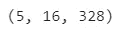

# 情节九情节解构:正则化逻辑回归诊断情节

> 原文：<https://towardsdatascience.com/plotnine-plot-deconstruction-regularised-logistic-regression-diagnostic-plots-ae33aeba0285?source=collection_archive---------26----------------------->

## 解释对桶样品进行分类的逻辑回归模型的交叉验证结果

*注意，这是我写的另一篇文章* *与* [*的姊妹篇，虽然我试图让这篇文章自成一体，但那篇文章确实更详细地讨论了统计数据。本文重点介绍如何使用* `*plotnine*` *制作诊断图。如果你不熟悉 plotnine，*](/expanding-your-regression-repertoire-with-regularisation-903d2c9f7b28) [*这篇文章*](https://www.datascienceworkshops.com/blog/plotnine-grammar-of-graphics-for-python/) *提供了很好的库介绍。和我的任何文章一样，你也可以阅读关于 Github***的文章。另外，这是我写的关于用 Python 制作朱朱情节的* [*系列文章*](https://towardsdatascience.com/tagged/plot-deconstruction-paul) *的一部分。**

# *介绍*

*统计学中的一个主要问题是欠确定性:缺乏数据使我们无法在模型之间进行选择，因为它们基于该数据共享相同的性能。[正则化](https://en.wikipedia.org/wiki/Regularization_(mathematics))通过向问题中引入额外的信息来帮助我们做出选择。回归中正则化的一种常见形式是将模型系数的范数添加到标准的平方差损失函数中。这种技术的各种形式被称为[套索](https://en.wikipedia.org/wiki/Lasso_(statistics))、[脊回归](https://en.wikipedia.org/wiki/Tikhonov_regularization)或[弹性网调整](https://en.wikipedia.org/wiki/Elastic_net_regularization)。*

*当将[正则化](https://en.wikipedia.org/wiki/Regularization_(mathematics))引入我们的回归方法时，我们需要做出的一个主要选择是正则化强度，即我们在多大程度上关注模型系数的范数与损失函数的平方差部分。选择这个[超参数](https://machinelearningmastery.com/difference-between-a-parameter-and-a-hyperparameter/)的一个常用方法是使用交叉验证。选择产生最佳交叉验证性能的超参数设置。*

*本文的目标是构建一些诊断图，帮助你解释交叉验证的正则化强度的结果。在本文中，您将了解以下主题:*

**如何预处理交叉验证结果以便在 plotnine* 中绘图*

*   *多维数组到平面数据帧*
*   *对分类数据进行排序以影响绘图中的绘图顺序*
*   *将列`MultiIndex`展平到仅一个索引级别*

**如何使用 plotnine* 生成图*

*   *堆叠多个几何图形*
*   *对不同的几何图形使用不同的数据*
*   *使用自定义标签功能*

*在继续构建诊断图之前，我们将从对案例研究的简单介绍开始这篇文章。*

# *分类鼓形样品*

*人类真的很擅长识别声音。根据一种声音，我们可以识别附近是否有鸟或熊。非常熟练的听众甚至能认出他们听到的鸟的类型。将这种技能转移到数学模型中并不简单。在本文中，我们将重点放在识别鼓的声音上:特别是底鼓(或低音鼓)、小鼓和小军鼓。每个声音都存储在一个 wav 文件中，例如:*

****

*[高分辨率版本](https://raw.githubusercontent.com/PaulHiemstra/lasso_tsfresh_article/master/pics/stereo_drum.png)*

*我们可以看到左右声道的振幅随时间的变化。为了训练模型，我们需要采取一些步骤:*

*   *将数据读入内存*
*   *基于每个鼓样本构建特征*
*   *使用交叉验证来确定正则化强度*

*GitHub 上的`[generate_drum_model.py](https://github.com/PaulHiemstra/lasso_tsfresh_article/blob/master/generate_drum_model.py)`脚本执行所有这些步骤，并将结果转储到 disc。在下一节中，我们将获得交叉验证结果，并构建一些有用的诊断图。*

# *诊断图*

*诊断图的基础是使用`[LogisticRegressionCV](https://scikit-learn.org/stable/modules/generated/sklearn.linear_model.LogisticRegressionCV.html)`生成的交叉验证结果。它们与原始训练数据一起被输入到诊断图中。我们可以从文件中读取这些，因为它们已经通过运行`[generate_drum_model.py](https://github.com/PaulHiemstra/lasso_tsfresh_article/blob/master/generate_drum_model.py)`生成:*

*交叉验证对象的主要结果是选择的正则化强度，存储在`C_`属性中:*

**

*注意，我们将这里的`C_`属性转换为来自 sklearn 的`LogisticRegressionCV`与正则化强度相反。我使用 Lasso 使用的𝛼α定义，它等于`1/2C`。我添加了对数转换，使数字更易读。*

*基于`cv_result`，我将构建两个诊断图:一个关注模型的系数，另一个关注模型的整体性能。在这两种情况下，我将首先展示情节，然后慢慢分解制作情节所需的每个步骤。*

# *图 A:系数的发展*

*在交叉验证过程中，我们使用了 L1 范数，这意味着随着正则化强度的增加，模型中的系数被推至零。如果你不清楚前面一行说了什么，我建议你读一下我写的关于公司的文章，这篇文章详细解释了统计数据。*

*为了直观显示这种效果，我们使用 GitHub 上的`helper_functions.py`文件中的`plot_coef_paths`绘制了系数值与正则化强度的关系图:*

**

*[高分辨率版本](https://raw.githubusercontent.com/PaulHiemstra/lasso_tsfresh_article/master/pics/coef_paths.png)*

*在这里，我们可以看到`kick`模型的系数如何随着正则化强度的变化而变化。请注意，图中有五条线，每条线对应一个交叉验证折叠。*

*在接下来的部分中，我将展示生成上面的图所需的每个步骤。*

## *步骤 1:宽到长的数据*

*该图的主要数据源是`LogisticRegressionCV`对象的`coef_paths_`属性。该属性存储一个字典，其中包含模型可以预测的每个可能类别的条目:在我们的例子中是 kick、snare 和 tom。字典中的值是`[numpy.ndarray](https://numpy.org/doc/stable/reference/generated/numpy.ndarray.html)`对象，存储所有的系数值。`ndarray`的形状是:*

**

*对于`kick`模式。第一个轴是交叉验证折叠，第二个轴是正则化强度，第三个轴是特征。*

*Plotnine 不与`ndarray`对象一起工作，但需要[一个长格式](https://www.theanalysisfactor.com/wide-and-long-data/#:~:text=In%20the%20long%20format%2C%20each,below%20in%20the%20long%20format.)，其中每一行由单个系数值及其相关的正则化强度、系数名称和模型组成。[基于`ndarray`生成这种长格式](https://stackoverflow.com/questions/36853594/easy-multidimensional-numpy-ndarray-to-pandas-dataframe-method)数据帧的一种非常有效的方法是将整个`ndarray`展平成一列，并添加一个`MultiIndex`，显示系数属于哪个折叠、正则化强度和特征。*

*首先，我们使用`reshape`生成单列数组，它展平为`(number of samples, 1 column)`:*

**

*接下来，我们使用`[pd.MultiIndex.from_product](https://pandas.pydata.org/docs/reference/api/pandas.MultiIndex.from_product.html)`生成适当的`MultiIndex`:*

**

*注意，我们传递给`pd.MultiIndex.from_product`的嵌套列表中的大小与多维数组的形状完全匹配。这是因为`index`中的每个元素都包含了`single_column_array`中相应元素的元数据。元数据列表`index`中的每个元素包含三个元素(如`index[0]`)。它们分别是元数据元素折叠、正则化强度和特征名称。*

*现在我们可以将单列数组与`MultiIndex`组合成一个`DataFrame`:*

**

*产生的`DataFrame`有四列。前三个是来自`MultiIndex`的元数据，最后一个是来自单列数组的系数值。*

*注意我们使用`.reset_index()`,因为我们需要索引中的列作为绘图的普通列。在 github 的`[helper_functions.py](https://github.com/PaulHiemstra/lasso_tsfresh_article/blob/master/helper_functions.py)`中，你可以找到执行这个操作的`ndarray_to_long`函数。*

## *步骤 2:将 C 转换为α并应用 log*

*sklearn 中的逻辑回归函数与正则化强度相反。然而，我发现直接使用正则化强度更直观。在这篇文章中，我用𝛼定义的正则化强度，等于`1/2C`。此外，我对这些值进行了对数变换，以提高图的可读性，因为为正则化强度选择的值遵循对数分布。更多细节，我参考 Github 上的`[generate_drum_model.py](https://github.com/PaulHiemstra/lasso_tsfresh_article/blob/master/generate_drum_model.py)`脚本。*

**

## *第三步:丢弃不相关的特征*

*使用 tsfresh，我们为模型生成了 328 个特征。在一个图中绘制所有这 328 个特征，包括它们的系数的发展，简直太多了。因此，我们只选择平均系数大小高于某个阈值的系数。选择这个截止值需要一点反复试验。这里我选择了一个截止值`1e-8`:*

*注意`abs(coef_value)`的使用，它确保我们也包括具有负系数的特征。如果你为自己的分析绘制图表，你可能想要试验截止值的精确值。*

## *步骤 4:从高到低系数值对特征进行排序*

*在这个图中，我们为每一个可能的特征使用了一个子图网格。我们希望最重要的功能放在网格的左上角，因为这是大多数用户最先关注的地方。此外，我们希望特性的重要性决定进一步从左到右和从上到下的排序。我们将特征的重要性定义为其系数的平均绝对值。*

*为了强制 plotnine 使用这个顺序，我们需要对 feature names 列进行排序。我们使用`pd.Categorical`函数来实现这一点:*

*其中通过查看每个特征(`.groupby(['feature_name']`)的绝对值(`.abs`)平均值(`.mean`)系数值来进行类别排序。实际上，对值的排序是使用`.sort_values`完成的。还要注意，我们使用`.index`来返回特性名称，而不是排序后的系数值。基于从重要到不重要排序的系数名称，我们构建分类变量。这里要记住的重要一点是`plot_data['feature_name']`中的实际值是不排序的:元数据中的类别顺序是排序的。*

## *步骤 5:计算数据的最小值/最大值*

*在图中，我们使用了一组线，交叉验证中的每个折叠一条线，以及一个覆盖线的最小值和最大值的带。所以每个面上有一条带子和五条线。*

*在准备`geom_ribbon`时，我们需要预计算最小值/最大值:*

**

*请注意，`.agg`会在列上产生一个`MultiIndex`。为了在`plotnine`中绘图，我只想有一个扁平的列名列表。为了使`MultiIndex`变平，我使用:*

*在这里我用一个`_`连接了`MultiIndex`中的所有关卡。比如`('coef_value', 'min')`展平为`coef_value_min`。*

*最后，我去掉了行索引，因为我希望这些列可以在`plotnine`中使用:*

## *步骤 6:在 plotnine 中打印*

*现在我们已经准备好了所有的数据，我们可以绘制图表了:*

*请注意，我:*

*   *使用两种几何图形:基于数据最小值和最大值的带状几何图形，以及交叉验证中各个折叠的线几何图形。*
*   *带状几何图形有自己的数据(`plot_data_min_max`)，不使用主绘图数据(`plot_data`)。这很有用，因为带状几何体不使用每个折叠的所有原始数据，而只使用数据的最小值和最大值。*
*   *在线上使用 0.3 的 alpha。这确保了线条不会主导情节，我们可以发现重叠的线条。*
*   *在`facet_wrap`中使用自定义标签功能。由 tsfresh 生成的特性名称非常大，大到无法放入一个方面的标题框中。为了缓解这个问题，我使用了一个自定义标签函数:`helper_functions.py`的`abbreviate_label`。这将使用`...`将绳子的头和尾连接起来。这大大提高了面标签的可读性。*
*   *使用`( )`左右代码。这是为了不用每次都包含`\`就能使用换行符。*

# *图 B:总体绩效与正规化强度*

*在前面的图中，我们看到了特征的系数值如何随着正则化强度而变化。在第二个情节中，我们关注情节的整体表现。在这种情况下，性能意味着预测的准确性，即模型预测正确的钢轮类型的时间比例。我们使用`helper_functions.py`中的`plot_reg_strength_vs_score`函数绘制该图:*

**

*[高分辨率版本](https://raw.githubusercontent.com/PaulHiemstra/lasso_tsfresh_article/master/pics/overall_performance.png)*

*请注意，精确度涵盖了每个正则化强度的一系列值，因此使用了`geom_ribbon`。拥有一个值范围源于拥有交叉验证中每个折叠的结果。从图中可以明显看出`kick`型号性能最好，tom 型号性能最差。接下来我们分解这个情节，告诉你如何制作。*

## *从宽到长*

*正如前面的图一样，我们需要将数据转换为 plotnine 所需的长格式。为此，我们使用与`[helper_functions.py](https://github.com/PaulHiemstra/lasso_tsfresh_article/blob/master/helper_functions.py)`相同的`ndarray_to_long`函数，例如对于`kick`型号:*

**

*请注意，我们这里有两个轴:交叉验证折叠和正则化强度。*

*接下来，我们希望将所有三个模型的数据合并到一个大的数据框架中。为此，我们构建了一个助手函数，它为每个子模型使用`ndarray_to_long`，并添加子模型的名称。接下来，我们使用 list comprehension 和 helper 函数来获取所有子模型的数据。最后，我们使用`pd.concat`将所有子模型数据粘合成一个大的`DataFrame`:*

**

*在我看来，这种列表理解和`pd.concat`的结合是一种非常有效的技术。*

## *步骤 2:将 c 转换为𝛼并应用 log*

*与前面的图一样，我们转换了正则化强度:*

**

## *步骤 3:计算数据的最小值/最大值*

*作为`geom_ribbon`的输入，我们需要最小/最大精度数据:*

**

## *步骤 4:在 plotnine 中打印*

*现在我们已经将所有数据排列好了，我们可以使用 plotnine 绘制图表:*

*请注意，我同时使用了带和段几何图形。使用两种几何图形是因为我发现这样绘制的图形可读性更好。*

# *承认*

*我要感谢[伯恩哈德·特拉克](https://www.linkedin.com/in/bernhard-terlaak)为本文的草稿提供了宝贵的反馈。*