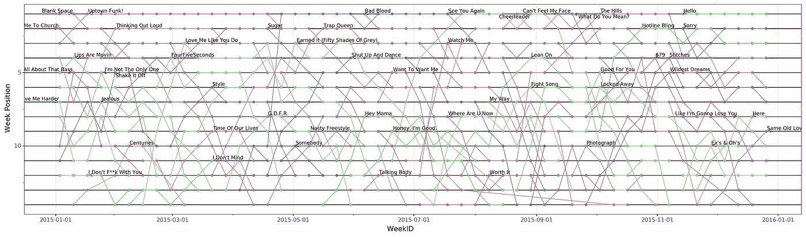
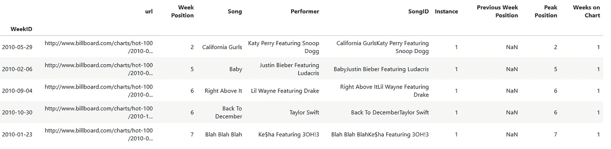
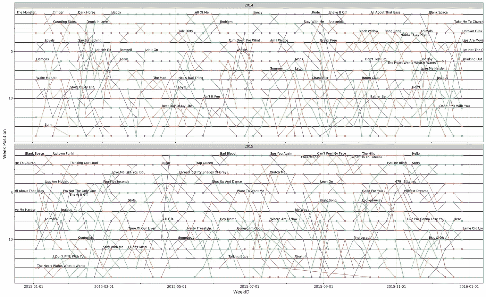

# Plotnine 情节解构:使用等级情节可视化公告牌 100 大热门

> 原文：<https://towardsdatascience.com/plotnine-plot-deconstruction-visualizing-the-billboard-hot-100-8048808fd629?source=collection_archive---------34----------------------->

## 如何使用 Python、Pandas 和 Plotnine 高效地可视化较长时间范围内的等级

*这是我写的一系列文章***中关于用 Python 制作朱朱情节的一部分。**

# *介绍*

*就我而言，ggplot2 是最好的绘图软件。所以当我发现有一个针对 Python 的图形语法的实现时，我抓住了这个机会。ggplot2 buffs 过渡到 plotnine 应该没问题，语法很像。*

*图形语法的优势在于对情节推理的一致性。这种一致性使得将情节想法表达成代码变得容易。与 [Seaborn](https://seaborn.pydata.org/) 尤其是 [matplotlib](https://matplotlib.org/) 相比，plotnine 更容易使用。然而，习惯 plotnine 的语法和思维方式确实需要一点时间，尤其是在标准散点图和条形图之外的时候。*

*本文的目标不是提供 plotnine 教程，而是探索更高级的 plotnine 概念。如果你需要的话，这篇文章的确提供了很好的介绍。这些是我将在本文中讨论的主题:*

*   *数据的智能选择*
*   *对绘图中的不同图层使用不同的数据源*
*   *巧妙重新排列文本标签以避免标签重叠*
*   *使用刻面技术水平堆叠时间序列数据*

*这篇文章的核心是以下情节:*

**

*2015 年公告牌 100 首热门歌曲中的前 15 首*

*该图显示了一首歌曲的图表位置(y 轴)在整个 2015 年的 Billboard Hot 100 轴)中如何变化。一条彩色线代表歌曲的轨迹，歌曲的标题由文本标签给出。红色箭头有助于识别哪个标题属于哪个行。解读剧情的最佳方式是挑选一首特定的歌曲，沿着彩色的线去探索它在一年中的轨迹是如何演变的。我从一本关于制作情节的教科书中获得了这个情节的想法，尽管我忘了是哪一本。在网上我可以找到类似的图[这里](http://virginian.mdodd.com/string_diag.html)和[这里](https://stats.stackexchange.com/a/178344/7419)。*

*在文章的其余部分，我将分解这个情节是如何构建的，以及我做出了哪些选择以及为什么做出这些选择。我假设您熟悉 ggplot2 或 plotnine、Python 和 Pandas 的语法基础。完整的 Python 笔记本可以在[这里](https://gist.github.com/PaulHiemstra/2130dd9d8a5a297e6eef6cb9eadac212)找到。*

# *情节的分解*

*为了生成该图，我使用了 Billboard top 100 的以下[数据集:](https://data.world/kcmillersean/billboard-hot-100-1958-2017)*

*它包含以下列:*

**

*数据集中的每一行都是某首歌曲在特定一周的排行榜位置。与特定歌曲相关的所有行代表该歌曲的轨迹。我们的图的重要列是:*

*   *WeekID，每周图表位置的时间戳*
*   *周位置，实际图表位置*
*   *宋，宋的名字*

*以下代码获取这些数据，执行一些预处理并生成绘图:*

**

## *智能数据选择*

*在代码的第一部分(第 4-10 行),我对绘图数据进行了预处理。这里我做了两个重要的选择:*

*   *我只使用前 100 名中前 15 名的数据*
*   *我会丢弃那些只在数据中出现了 4 周或更短时间的歌曲*

*通过从数据中删除不太重要的歌曲，我们减少了混乱，让我们更容易专注于 2015 年的最佳歌曲。*

*为了丢弃这些罕见的歌曲，我首先计算一首歌曲在数据中出现的频率:*

*这是使用`groupby` 和`count`的组合来完成的，两者都是熊猫函数。计算完计数后，我选择出现次数超过 4 次的歌曲(第 2 行),并使用这些歌曲作为热门 100 首歌曲的子集。*

## *使用不同的数据源*

*在我们的情节中，一首歌的标题只显示一次，而不是像`geom_text`默认的那样显示在数据集中的每个点上。为了达到这个效果，我们需要为`geom_text`使用一个单独的数据源。*

*我选择了一首歌在排行榜上的最高位置来放置歌名。我使用以下代码构建了数据:*

*在自定义函数 highest_rank 中，我选择了`Week Position`中最小值的索引。注意，最小值是最高等级。接下来，我选择最高等级的`Week ID`和`Week Position`并返回它们。注意，我们不能简单地使用`groupby`和`min` ( `plot_data.groupby([‘Song’]).min()`)，我们需要属于最高图表位置的`Week ID`和`Week Position` 在正确的位置绘制文本标签。最后，我们将函数应用于每首歌曲的数据。现在我们有了数据，我们只需要改变`geom_text`的数据源，每首歌只打印一次标签。*

*每个 geom 图层使用不同的数据源是一个强大的技巧。例如，通过这种方式，您还可以仅通过提供引用这些面的数据，仅在绘图中所有面的子集内绘制一些几何图形。*

## *智能地重新排列文本标签*

*通过减小文本标签的字体大小和限制标签的数量，我们已经消除了文本标签中的许多潜在重叠。但这种情况仍有可能发生。为了完全消除这种重叠，我使用了`geom_text`的`adjust_text`参数。这使用`[adjustText](https://github.com/Phlya/adjustText)` [包](https://github.com/Phlya/adjustText)智能计算标签的位置。以下代码设置了一些参数，并将其传递给`geom_text`:*

*`expand_text`控制标签在 x 和 y 方向可以移动的距离，而`arrowprops`控制从标签到其所属点的箭头外观。*

## *时间序列的堆叠*

*到目前为止，我们只处理了一年的数据。要将其扩展到多年，我们可以使用`facet_wrap`将这些图堆叠起来:*

**

*这种方法相对于简单地绘制多个单独的图的优势在于，可以保证颜色在多年内保持不变。上面的图是使用以下代码生成的:*

*前面代码中需要进行的更改用注释标记。这些变化是:*

*   *显然*，选择多个年份的数据。**
*   **使用年份变量*扩展数据，在为标签生成最高等级时，也不要忘记包括年份。请注意，在`groupby` 中包含“年份”可确保标签在每年的最高级别*绘制。这对跨越多年的歌曲很有帮助。**
*   **跨年度变量*facet _ wrap。记住使用`scales=’free_x’`专门绘制每个方面的时标。*

*我很喜欢 plotnine 允许我用代码表达我的可视化想法的方式。尤其令人高兴的是，表现力扩展到了 plotnine 最复杂的部分。希望你学会了几个新招！*