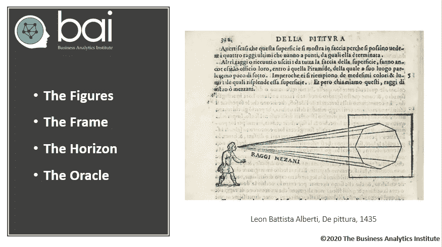
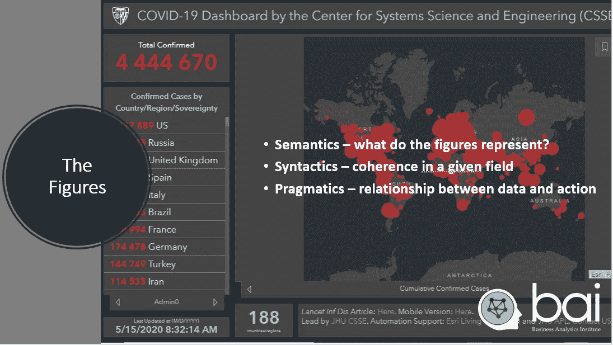
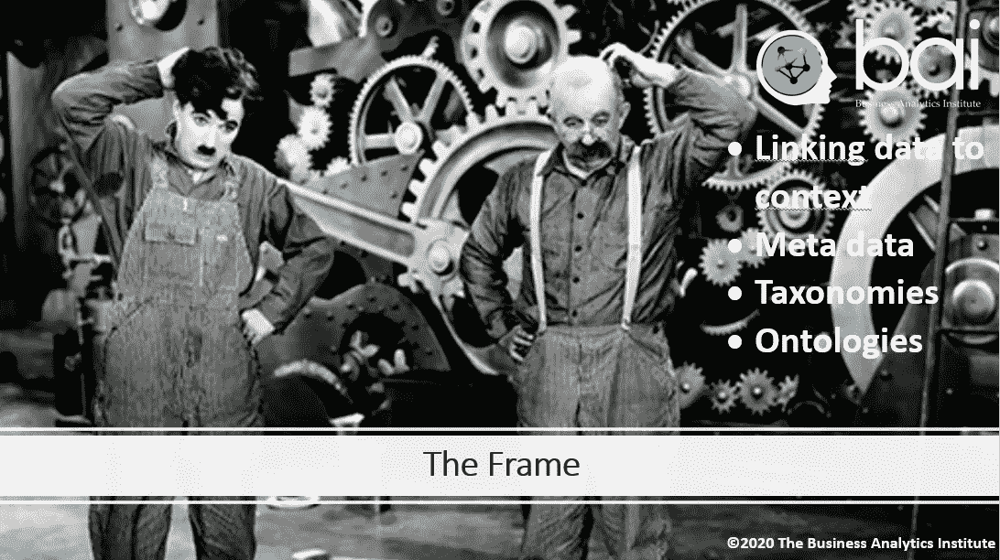
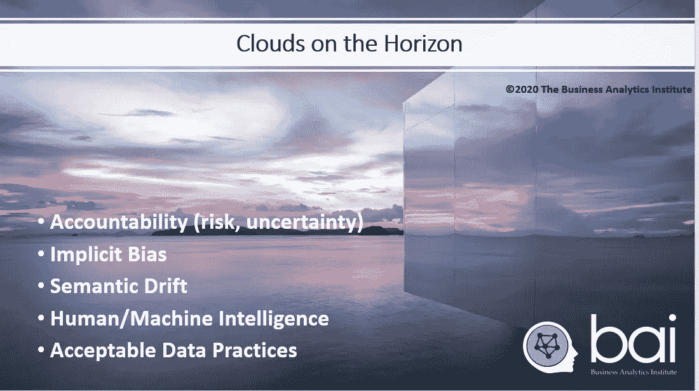
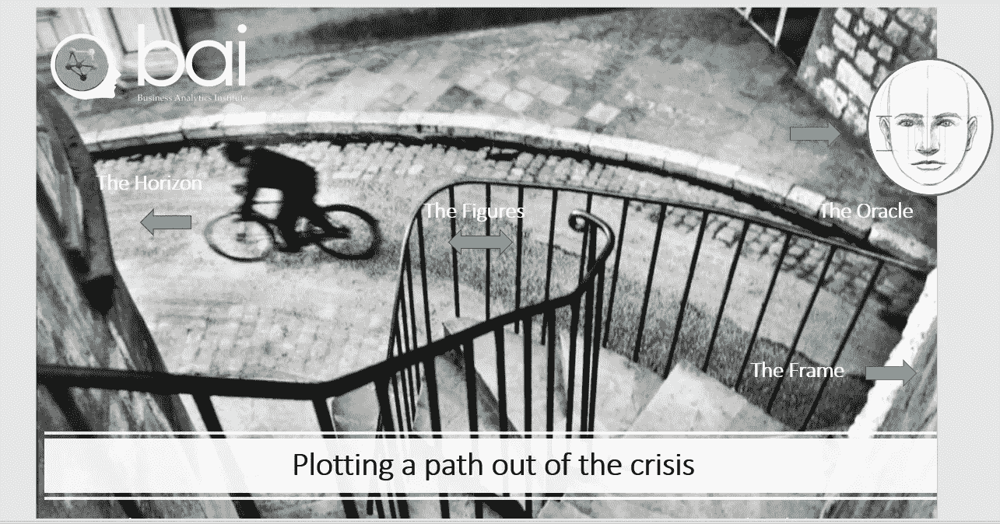

# 策划一条摆脱危机的道路

> 原文：<https://towardsdatascience.com/plotting-a-path-out-of-the-crisis-1630ab294e57?source=collection_archive---------67----------------------->

## 处理数字不足以将数据转化为行动

在上周我在网上举办的关于透视人工智能的 SwissCognitive 会议上，我研究了屏幕右侧几十名观众的脸。尽管在我的演讲中，他们的声音很小，但每个人都向我提供了他们过去经历的线索，对他们如何度过当前危机的见解，以及他们对未来的展望。

当前新冠肺炎疫情的社会和经济后果为我们提供了一个“决定性的时刻”，我们可以选择改变历史的进程。不确定时期的决策需要超越数字来理解数据是如何构建的，我们是如何定义视野的，以及在什么条件下人工智能可以增强人类的智能。

# 视角的重要性

> 人的视角是数据和行动之间缺失的一环

像许多过去几周呆在家里的人一样，我每天早上打开电脑，阅读当前疫情影响的统计数据。国际货币基金组织上周预测，欧元区的年增长率将下降 7.5%，而美国的年增长率将下降 5.9%。联合国贸易和发展机构得出结论，冠状病毒的爆发可能会给全球经济造成至少 1 万亿美元的损失。预计仅在未来三个月就将裁员近 2 亿全职员工。无论你选择哪一个数字，我们都需要问它们在多大程度上反映了现实，更重要的是，它们在多大程度上代表了行动的号召。

在接下来的几周里，我们将选择闭上眼睛，一切照旧，或者抓住机会改变我们看待周围世界的方式。鉴于当前危机带来的不确定性，我们如何做出更好的决策，以扩大我们对替代未来的展望？分析目前的病例、死亡人数或工作岗位最多只是一个开始。如果人工智能(机器学习，有限人工智能)预测未来的能力取决于过去经验的相关性，那么抓住决定性时刻取决于我们重新构建我们所见的能力。

为什么决策者需要超越数据，从更广阔的角度来看待替代未来？如果机器学习有助于我们识别当前危机中的模式，那么理解例外就取决于人类的睿智。在大约 700 年前的黑暗时代的危机中，莱昂·巴蒂斯塔·阿尔伯蒂在 *De pittura* 中认为，将数字纳入视角取决于我们的参考框架，我们如何绘制现在和未来之间的地平线，并推动我们的观众将数据转化为行动。让我们来探讨一下今天把数据放在一个角度来看意味着什么。

# 数据

*“数据的相关性取决于使用它的上下文”*

当前社会和经济危机的数字到底意味着什么？今天的数字是否为我们提供了预测未来的方法？数据本质上是现实的近似值；数据科学的目标不是提高数字，而是唤起个人和集体的行动。数字的精确性、粒度和准确性有助于我们分析过去、描述现在和预测未来的能力。在随机决策环境中，受众对数字的信任对于预测和影响未来都至关重要。

从这些数字中学习，首先要质疑它们在多大程度上代表了我们所面临的危机的性质。阿尔贝提从观察者的角度分析了前景——对于决策者来说，数字代表了什么，更重要的是，它们如何影响行为？今天，符号学家在三个不同的层面上研究数字的意义。语义指的是数字和它们应该代表的事件之间的关系的质量。Syntactics 分析每个职业、组织或市场中的人物之间的一致性。最后，语用学探索了数字与使用它们的消费者、经理或股东的行为和反应之间的关系。数据从来都不是客观的，事实是有后果的。

图片来源:CSSE，约翰·霍普斯金大学

2020 年 5 月中旬，全球有 440 万例新冠肺炎病例，欧洲 GDP 下降 7.5%，美国失业率接近 15%。然而，疫情最大的后果不在于数字本身，而在于在描绘走出危机的道路时围绕数字的风险、模糊性和不确定性。当查看统计数据时，我们需要问它们是如何计算的，它们的置信区间是多少，以及它们如何代表行动的号召。在匆忙赶新闻和报道周期的最后期限时，我们放大了数字，却没有审视已被证明不适应应对危机的更大的社会和经济进程。

# 框架

> *价值和价值观从来不是在数据本身中找到的，而是在数据是如何构建的*

当我们处理数据集时，我们处理的是为了特定目的而拼凑起来的数据。阿尔贝提认为，框架在人类的视角中起着重要的作用，它帮助我们关注框架内相对于框架外重要的东西。在分析中，框架用于将数据置于上下文中，建议记录之间的关系，并帮助理解如何在实践中利用数据集。元数据是描述捕获数据的基本条件、获取数据的方式、准确性和编译方法的信息框架。数据分类法或命名系统是语义框架，用于将数据分为反映贸易或业务逻辑的类别和子类别。本体是知识的模型，是用来识别概念和实体之间的属性和关系的框架。

在当前的危机中，发病率和福利、就业和失业以及作为和不作为之间的区别取决于我们如何构建数据。元数据、分类法和本体论不仅决定了我们如何构建这些概念，还决定了我们从每个数据集得出什么类型的结论。这些框架，而不是数据本身，帮助我们决定哪些模式、变量和属性与解决所研究的问题相关，哪些属于其他背景和经验。在人类和“自动化”决策中，框架在三个特定层面上起作用:作为数据是什么的思维模式，作为一套应该如何解决问题的信念，以及作为检测违反传统组织实践的离群值的基准。

图片来源:克里斯托弗·巴尔

世界范围内新冠肺炎病例数量、欧洲 GDP 下降和美国失业率的重要性取决于我们用来获取和限定数据的框架。尽管卫生条件、经济衰退和社会动荡有时会为变革提供动力，但它们总是产生变革的社会和经济体系的表征。变革管理的支持者认为，重塑我们对常态的认知，而不是处理数字，是帮助社区和经济发展的必要条件。这些“激进的框架”，或一系列可供选择的价值观和兴趣，允许决策者使用数据以不同的方式思考未来。我们对福祉、繁荣和就业的定义在今天是否仍然有意义，或者这场危机是否会促使我们重新思考如何在今天和可预见的未来利用数据来煽动集体行动？

# 地平线

> 因为世界不是平的，绘制从现在到未来的路线图需要的不仅仅是将点点滴滴连接起来

未来会怎样？在发展我们对我们的企业和我们的社区的观点时，我们固定了一个思维视野，将我们现在所看到的与我们视线之外的未来挑战区分开来。对阿尔贝提来说，视野相当于人类感知可以归纳或推断的界限。今天，我们通过使用试探法和算法定义地平线上的点来形成我们的观点。我们根据具体的决策环境，在感知、预测、评估和洞察力方面利用人类和/或机器智能。然而，我们对风险的认知、偏见和信念给我们的视野蒙上了一层阴影。超越地平线始于认识到阻碍我们观点的障碍。

*可惜，人生不是一条直线*。在现实世界中，我们在应对复杂多变的决策环境时面临着艰难的战斗。数据、算法和业务逻辑中隐含的偏见限制了我们对所见和所做的感知。语义漂移已经改变了构成我们使用的数据的福祉、生产力和价值的概念。对风险、不确定性和模糊性的认知阻碍了我们承担将数据转化为行动的责任。我们对人工智能投资的渴望让我们看不到开发人类智能其他维度(情感、人际甚至精神)的重要性。最后，我们关于可接受的数据实践的道德框架决定了我们如何使用数据来激励个人和集体行动。

图片来源:iStock

在我们今天所面临的系统性危机中，对疫情的卫生、经济和社会影响的理解让决策变得复杂。Covid 测试的相关性，社会追踪的适当性，以及个人自由和集体福祉之间的平衡的机会都是公开的问题。决策环境即使不是混乱的，也是复杂的——因为原因和解决方案都是未知的。我们对福祉、生产力和价值的构建受到围攻，受到我们生活环境的挑战。即使在深度学习的背景下，算法概率也只能证明与我们过去的经验一样相关。难怪我们许多人可能只是盯着数字，即使这意味着完全看不见地平线。

# 神谕的作用

> *人工智能本身解决不了问题，人来解决*

在实践中，机器学习产生了新的数据点，这些数据点可能会降低决策中的风险、不确定性和模糊性。可以利用数据来提高我们在以下三个方向做出更好决策的能力。*放大*是指在聚焦一组事件时，一个视角的澄清和应用。*沟通*涉及在解决一个问题时将两个或两个偶然但不相关的愿景联系在一起。*扩展*代表着努力扩大视角的边界，以包含更大社区的观点、兴趣或情感。然而，正如彼得·沃森(Peter Wason)关于确认偏差的工作令人信服地证明的那样，数据经常被解释为仅仅支持长期存在的信念。

AI 在什么条件下可以丰富人类的智力？推动、激励和激励决策者根据他们看到的数据采取行动的需求是一个由来已久的问题。在阿尔贝提研究的文艺复兴前绘画的例子中，经常有一只手、一只鸟或一个符号从画面中脱离出来，伸向观众。这些“神谕”象征着对行动的召唤，提供了一条超越框架的视觉线，邀请观众去看艺术家对未来的愿景。如今，数据和行动之间的这种联系在我们的数据集、电子表格和预测中明显缺失，这让许多个人和组织无法将数据应用到自己的组织环境和经验中。

图片来源:亨利·卡蒂埃·布列松-海耶斯

当前疫情面临的挑战不是拉平曲线，而是推动我们的社区走出危机。关于危机可能造成的社会和经济后果的数据本身并不说明问题，而是体现在我们围绕数据讲述的故事中，或者体现在那些负责产生结果的人的技能和能力中。回归、分类、聚类和异常检测中使用的算法可以提供新知识的来源，但开发人类智能需要使用这些结果来绘制不同于我们进入危机时的路径。激励个人和组织沿着这些道路果断行动将取决于发展人类的视角，将数据置于背景中，理解如何构建现在，关注未来，并重构未来。

# 提高人类智力

> *描绘一条走出危机的道路不会在网上完成，而是要积极果断地从我们今天所处的位置向我们明天想要达到的位置前进*

当我完成了关于人工智能在丰富人类智力方面的作用的在线讨论时，我最后看了一眼屏幕右侧观众的客串。从他们的眼神和问题中，我了解到他们过去经历的线索，了解到他们如何过现在的生活，以及他们如何准备危机后的生活。我知道，仅仅展示卫生、社会和经济危机的数据不足以揭示机器和人类智能能够抓住这一决定性时刻的条件。我的结论是，正如我们在关于人工智能的管理挑战的培训中所做的那样，绘制一条通向未来的道路需要掌握正确看待数据的技巧。

________

商业分析研究所(http://baieurope.com)提供高管培训、辅导和指导，以应对人工智能、数字伦理和“聪明公民”发展的管理挑战。

Lee Schlenker 是 BAI 的负责人，也是商业分析和社区管理教授。他在 LinkedIn 上的个人资料可以在查看