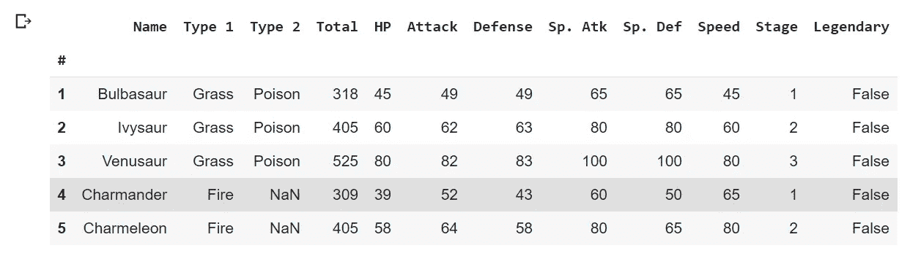
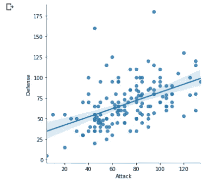
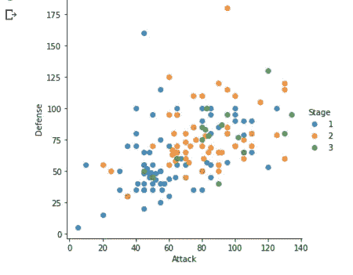
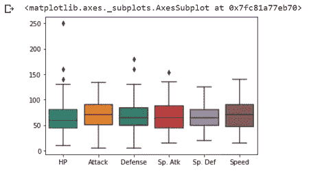
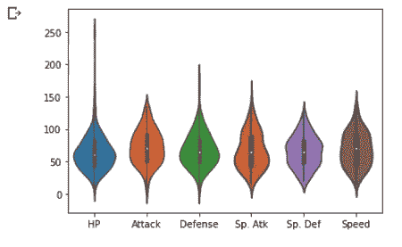
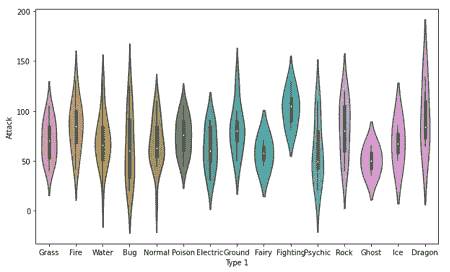
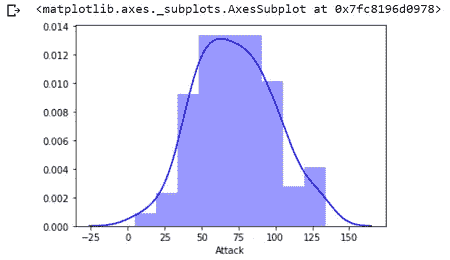
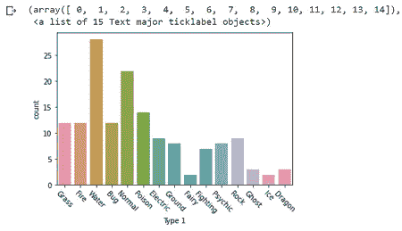
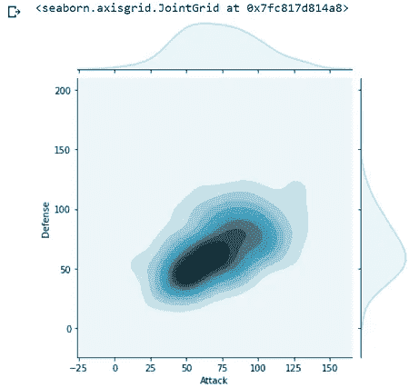

# 使用 Seaborn 绘制图表

> 原文：<https://towardsdatascience.com/plotting-charts-with-seaborn-e843c7de2287?source=collection_archive---------29----------------------->

## 使用 Python 库创建吸引人的图表。


照片由[像素](https://www.pexels.com/)上的 [Pixabay](https://www.pexels.com/@pixabay) 拍摄

[**Seaborn**](https://seaborn.pydata.org/) 是一个强大的 Python 库，旨在增强数据可视化。它为 Matplotlib 提供了大量的高级接口。Seaborn 可以很好地处理数据帧，而 Matplotlib 不行。它能让你以更简单的方式绘制出引人注目的图表。

为了更好地理解这篇文章，你需要了解熊猫和 matplotlib 的基础知识。如果没有，你可以参考以下关于同一的文章:

1.  [用于数据分析的熊猫](/pandas-for-data-analysis-142be71f63dc)
2.  【Matplotlib 可视化

确保您的系统中安装了必要的库:

使用 conda:

```
conda install pandas
conda install matplotlib
conda install seaborn
```

使用画中画:

```
pip install pandas
pip install matplotlib
pip install seaborn
```

让我们首先导入所需的 Python 库和数据集。

你可以在这里找到这个教程[的 CSV 文件。](https://github.com/jendcruz22/Medium-articles/tree/master/Plotting%20charts%20with%20Seaborn)

```
import pandas as pd
from matplotlib import pyplot as plt
import seaborn as snsdf = pd.read_csv('Pokemon.csv', index_col = 0, encoding='unicode-escape')
df.head()
```



作者图片

在上面的代码中，我们将 index_col 设置为 0，这表示我们将第一列视为索引。

使用 seaborn 和口袋妖怪数据集的属性，我们将创建一些非常有趣的可视化效果。我们首先要看的是散点图。

## 散点图

散点图使用点来表示不同数值变量的值。水平轴和垂直轴上每个点的位置表示单个数据点的值。它们用于观察变量之间的关系。使用“lmplot”函数在 seaborn 中制作散点图只需要一行代码。为此，我们将 dataframe 传递给 data 参数，然后传递 x 轴和 y 轴的列名。

默认情况下，散点图还会显示一条回归线，这是一条最符合数据的直线。

```
sns.lmplot(x=’Attack’, y=’Defense’, data=df)
plt.show()
```



作者图片

在这里，您可以看到我们的散点图，它显示了攻击得分与防御得分的对比。

回归线基本上向我们展示了两个轴之间的相关性。在这种情况下，它向上倾斜。这意味着当攻击得分变高时，防御得分也变高。要删除回归线，我们可以将' fitreg '参数设置为 false。

此外，我们可以设置色调参数，根据口袋妖怪的进化阶段给各个情节着色。这个色调参数非常有用，因为它允许您用颜色表达第三维信息。

```
sns.lmplot(x=’Attack’, y=’Defense’, data=df, fit_reg=False, hue=’Stage’)
plt.show()
```



作者图片

散点图看起来与之前的一样，只是现在它的中间没有回归线，而且每个点的颜色也不同。这些颜色只是显示了每个口袋妖怪的阶段。阶段只是我们之前看到的数据中的另一个属性。

看这个情节，我们可以得出结论，第一阶段的口袋妖怪或者蓝点通常比更高阶段的口袋妖怪得分低。

## 箱线图

箱线图是常用于显示数据分布的重要图之一。在 seaborn 中，使用 boxplot 函数显示一个 boxplot 只需要一行代码。在本例中，我们将使用整个数据帧，除了 total、stage 和 legendary 属性。

```
df_copy = df.drop([‘Total’, ‘Stage’, ‘Legendary’], axis=1)
sns.boxplot(data=df_copy)
```



作者图片

这里我们可以看到每个属性都有自己的箱线图。

箱线图基于 5 个数字的汇总，每个数字显示为不同的线条。中间的线是中间值，是数据集中的点。朝向箱线图末端的最下面和最上面的线是四分位数 1 和 4 的中间值，其基本上显示了分布的最小值和最大值。中间的另外两条线是四分位数 2 和 3 的中间值，显示了这些值与中间值的差异。超出此范围的单点表示数据中的任何异常值。

## 小提琴情节

小提琴图类似于箱线图。小提琴图是箱线图非常有用的替代品。他们显示了小提琴厚度的分布，而不仅仅是汇总统计数据。众所周知，Violin plots 在分析和可视化数据集中不同属性的分布时非常方便。

在本例中，我们将使用与上例相同的数据帧拷贝。

```
sns.violinplot(data=df_copy)
plt.show()
```



作者图片

我们可以观察口袋妖怪的每个属性的值的分布。小提琴较厚的区域意味着价值密度较高。小提琴图的中间通常较粗，这意味着那里有高密度的值。接下来，我们将可视化的攻击分数的分布比较口袋妖怪主要类型。要做到这一点，让我们使用相同的小提琴绘图方法。

```
plt.figure(figsize=(10,6))\sns.violinplot(x='Type 1', y='Attack', data=df)
plt.show()
```



作者图片

该图显示了每个口袋妖怪主要类型的攻击得分分布。正如你所看到的,“龙”型口袋妖怪有最高的攻击分数，但他们也有较高的方差，这意味着他们也有攻击分数很低。“重影”主要类型具有非常低的方差，这意味着它们的大部分数据值都集中在中心。

## 热图

热图帮助您可视化矩阵类型的数据。例如，我们可以将口袋妖怪的不同属性之间的所有相关性可视化。

让我们通过调用“corr”函数来计算数据帧的相关性，并使用“热图”函数绘制热图。

```
corr = df_copy.corr()
sns.heatmap(corr)
```


作者图片

上面的热图显示了我们的数据框架的相关性。

方框的颜色越浅，这两个属性之间的相关性越高。比如一个口袋妖怪的 HP 和整体速度的相关性很低。因此，黑色的盒子。血量和防御速度之间的相关性相当高，因此我们可以在热图中看到红色块。我们可以看到，当一个属性变得更高时，其他属性也变得更高，例如防守速度。

## 直方图

直方图允许您绘制数值的分布。如果我们使用 matplotlib 来创建直方图，与使用 seaborn 创建直方图相比，需要更多的工作。使用 seaborn，只需要一行代码就可以创建一个发行版。

例如，我们可以创建一个直方图来绘制攻击属性的分布值。

```
sns.distplot(df.Attack, color=’blue’)
```



作者图片

我们可以看到大多数口袋妖怪都在 50-100 的范围内。这里我们看到的攻击值大于 100 或者小于 50 的口袋妖怪少多了。

## 校准图

与条形图类似，calplots 可以让您直观地看到每个类别变量的分布。我们可以使用 calplot 来查看每个主要类型中有多少个口袋妖怪。

```
sns.countplot(x=’Type 1', data=df)
plt.xticks(rotation=-45)
```



作者图片

我们可以看到,“水”类的口袋妖怪最多，而“精灵”类和“冰”类的口袋妖怪最少。

## 密度图

密度图显示两个变量之间的分布。例如，我们可以使用密度图来比较口袋妖怪的两个属性:攻击值和防御值。我们将使用“jointplot”功能来完成这项工作。

```
sns.jointplot(df.Attack, df.Defense, kind=’kde’, color=’lightblue’)
```



作者图片

“kde”表示我们想要一个密度图。

如您所见，绘图区的黑暗程度取决于该区域中有多少个值。黑色区域代表着非常强烈的关系。从这个图中我们可以看到，当攻击值在 50 到 75 之间时，防御值在 50 左右。

这篇文章大概就是这样。我希望您喜欢使用 seaborn 可视化数据。

> 你可以在这里找到这篇文章的代码和数据集。

谢谢你阅读它！

## 参考

[1] Seaborn 文件:【https://seaborn.pydata.org/ 