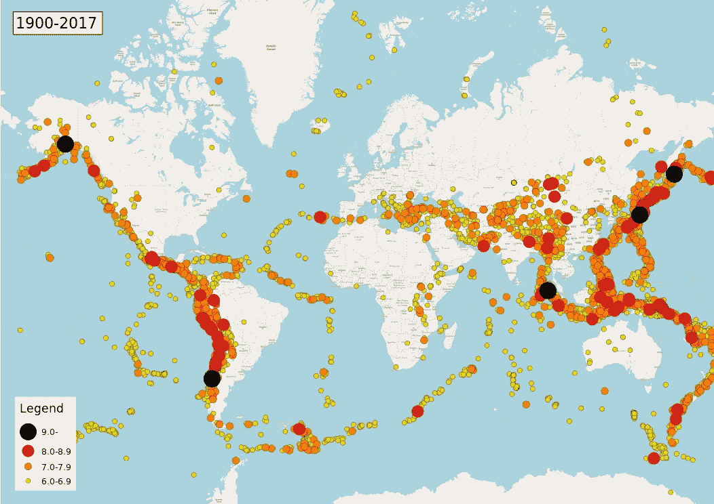
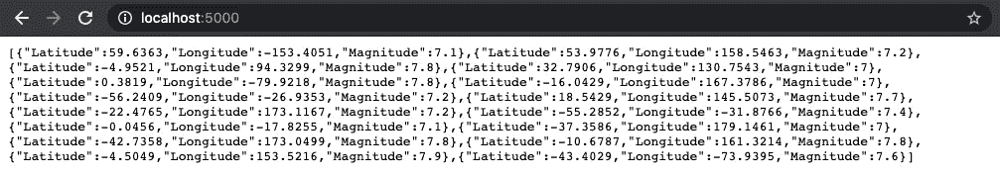
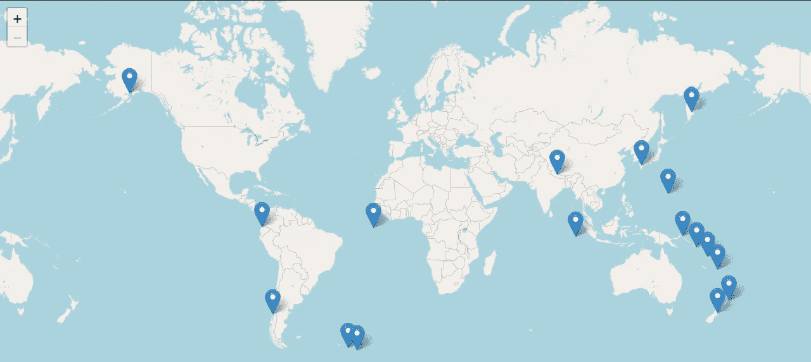
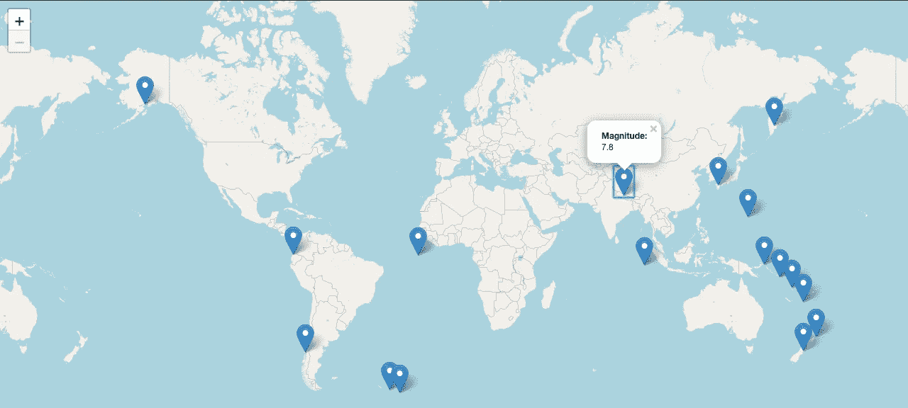

# 用 Folium 在 Python 中绘制 Google Sheets 数据

> 原文：<https://towardsdatascience.com/plotting-crowdsourced-data-with-google-sheets-and-folium-6c9edbef2bb8?source=collection_archive---------32----------------------->

## 使用 Flask 在 web 应用程序上实时绘制 Google 工作表数据

在这段代码中，我们将尝试模拟世界各地的志愿者通过 Google Sheet 报告地震的工作流程，数据将在 web 地图上实时更新。

将使用用于 **Python** 的 ***Flask*** web 框架创建 web 平台，并使用优秀的***leaf***库绘制数据，该库是用于**leaf JS 的 Python 包装器。**将使用***gspread****库从谷歌工作表中检索数据，该库是**谷歌工作表 API 的 python 包装器。***

**

*1900-2017 年世界地震地图(来源:维基共享资源)*

*这段代码应该可以在 Linux 和 macOS 系统上正常工作。对于使用 Windows 系统的用户，只需要修改终端中正在运行的命令。*

# *设置虚拟环境并安装必要的软件包*

*   *创建项目文件夹:`mkdir flask_webmap`*
*   *`cd`进入文件夹并设置虚拟环境*
*   *我们将使用 virtualenv 作为我们选择的虚拟环境工具。在项目目录中运行`virtualenv venv`，创建一个名为 venv 的环境*
*   *通过运行`source venv/bin/activate`激活环境*
*   *通过运行`python -m pip install -U Flask folium gspread`安装所需的模块*

# *向 Google 注册我们的应用程序以使用 Google Sheets API*

*要访问来自 Google sheets 的数据，我们需要向 Google Sheets API 注册我们的应用程序。为此，请遵循以下步骤*

*   *从网络浏览器打开这个[谷歌控制台链接](https://console.developers.google.com/)*
*   *在 Google 控制台仪表板中，单击顶部栏中的新项目链接*
*   *给你的项目命名，然后点击创建*
*   *点击**启用 API 和服务***
*   *在打开的列出各种可用 API 的新页面中，选择 Google Sheets API 并启用它*
*   *启用 API 后，单击出现的**创建凭证**警报*
*   *填写必要的细节:对于问题**选择 **Web 服务器**您将从哪里调用 API？***
*   *在下一部分中，输入**服务帐户**的任何名称。角色选项可以留空，但选择 **JSON** 作为您的密钥类型，然后单击继续*
*   *将下载一个包含您的凭证的新 JSON 文件*
*   *将 JSON 文件复制到项目目录中*

# *设置一个最小的烧瓶应用程序*

*   *通过运行`touch app.py`创建一个新的 Python 文件*
*   *在您选择的编辑器中打开 python 文件，并创建一个最小的 Flask 应用程序*

*   *在您的终端中，通过运行`export FLASK_APP=app`导出 Flask app 环境变量*
*   *默认环境设置为生产。通过运行`FLASK_ENV=development flask run`将此更改为开发*
*   *运行`flask run`启动应用程序*
*   *新的应用程序现在应该可以在 *localhost:5000/* 获得*
*   *该页面应该打印“Hello World”消息*

# *用种子数据创建 Google 表单*

*   *创建新的 google 工作表*
*   *为了这个练习的目的，USGS 的地震位置数据的一个子集被保存在一个表中。要查看原始数据，请访问此[链接](https://www.kaggle.com/usgs/earthquake-database#database.csv)。要下载谷歌表单，请点击此[链接](https://docs.google.com/spreadsheets/d/1x2bVUzH5cnzcDJXnleGteT5zCEytczDAghcRe0Z9WuU/edit?usp=sharing)*

# *访问 Google 工作表数据*

*使用 *gspread* 库访问这些数据*

*   *创建一个新的 python 文件:`touch read_sheet.py`*
*   *并复制以下代码*

## *理解代码*

1.  *首先，我们定义授权的全局变量。用从 Google API 控制台下载的 JSON 文件的名称替换“带凭证的 JSON 文件的名称”。*
2.  *然后，我们打开 google 工作表，使用它的 URL 存储数据*
3.  *接下来，我们使用索引位置获取存储数据的特定工作表。第一页索引为“0”*
4.  *最后，我们定义了一个新函数，该函数从特定的工作表中获取所有记录并将其返回*

# *测试 Google 工作表访问*

*   *重新打开 *app.py* 并用以下代码替换代码*

*   *`flask run`从您的终端*
*   *localhost:5000 现在应该返回数据的 JSON 表示*

**

# *绘制地图*

*现在我们已经验证了对 Google Sheets 数据的访问，让我们在地图上绘制数据。*

*   *`touch plot_map.py`从您的终端*
*   *打开 *plot_map.py* 文件，复制以下代码*

## *理解代码*

1.  *首先，我们定义了 basemap_layer 函数，它使用`folium.Map()`绘制了一个基本地图。除了设置为 2 的 **min_zoom** 属性外，地图设置为使用所有默认值*
2.  *接下来，我们使用`folium.Marker()`定义一个函数来绘制地震位置，并将其添加到上一步生成的父地图中*

# *从 Flask 应用程序渲染地图*

*打开`app.py`文件并复制以下代码*

## *理解代码*

1.  *从之前创建的 *plot_map.py* 文件中，我们导入了 **basemap_layer** 和**地震 _plot** 函数*
2.  *首先在 flask 应用程序视图中，我们通过调用`basemap_layer()`函数来创建地图*
3.  *对于步骤 2 中生成的地图，我们添加了通过调用`earthquake_plot()`函数生成的地震位置。步骤 2 中的地图和地震数据作为参数提供*
4.  *地图在*模板*文件夹中保存为*map.html**
5.  *最后，我们返回*index.html**

# *创建 index.html 文件*

*   *`mkdir templates`和`touch templates/index.html`*
*   *打开*index.html*并复制以下代码*

## *理解代码*

1.  *我们在*模板*文件夹中创建*index.html*文件*
2.  *在 HTML 样板文件的主体中，我们包含了使用 Jinja 模板引擎从 flask 视图生成的*map.html**

**

*Flask 应用程序生成的地图视图*

# *该地图如何帮助绘制众包数据？*

*此应用程序的有趣之处在于，由于映射函数是从 Flask 视图中调用的，因此每次在浏览器中刷新 web 地图时，都会对数据进行 API 调用。因此，任何添加到 Google sheet 的新记录都由应用程序在页面刷新时实时呈现。*

*所以让我们试试这个功能。我们都知道 2015 年的尼泊尔地震。让我们更新工作表中的数据。*

*要查找尼泊尔的坐标，请访问 latlong.net 并在搜索框中输入尼泊尔。将纬度和经度值复制到 Google 工作表中。*

*[维基百科](https://en.wikipedia.org/wiki/April_2015_Nepal_earthquake)也暗示这次地震的震级为 7.8 级。因此，用这个值填充**幅度**列。*

*现在返回地图视图并刷新页面。您会发现新位置的标记已添加到地图上。*

**

*添加新数据后刷新的地图视图*

*这段代码到此结束。如果你觉得这篇文章很有用，请留下你的赞赏或评论。*

**原载于 2020 年 4 月 18 日*[*https://www . sourav 90 . in*](https://www.sourav90.in/2020/04/18/plotting-crowdsourced-data-with-google-sheets-and-folium.html)*。**